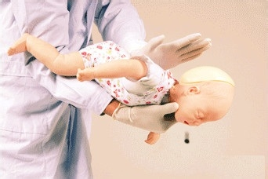

我以为被异物卡住气管离我们很远，直到今天发生在自己家人身上，使用了海姆立克急救法起到一定作用化解了危机。

后怕之余，to China 让大家一定知道这个方法能在危机时正确应对，也希望公司能经常组织急救相关的培训知识。

------------ 事件经过 -------- 

晚上 9 点左右，吃过饭和对象在楼下附近溜达，买了一袋花生，一边走一边吃。

我用手机 zoom 里参加一个会议，突然她在一边咳嗽，并拽我衣服，脸色青紫，无法发出声音。

我马上意识到不对，她非常困难的说自己被卡住了，我想马上去医院，但是来不及，想到之前在哪里有宣传海姆立克急救法，于是马上搜索应用。

采用措施如下：

应用于急救成人如果是成人，救护者站在受害者身后，从背后抱住其腹部，双臂围环其腰腹部，一手握拳，拳心向内按压于受害人的肚脐和肋骨之间的部位；另一手成掌捂按在拳头之上，双手急速用力向里向上挤压，反复实施，直至阻塞物吐出为止。

事后分析，其中一次起作用了，最终脱离危险。

如果是3岁以下孩子，应该马上把孩子抱起来，一只手捏住孩子颧骨两侧，手臂贴着孩子的前胸，另一只手托住孩子后颈部，让其脸朝下，趴在救护人膝盖上。在孩子背上拍1-5次，并观察孩子是否将异物吐出。：

## 参考资料 

- 百度经验 https://jingyan.baidu.com/article/f0062228d10ea9fbd3f0c8f0.html
