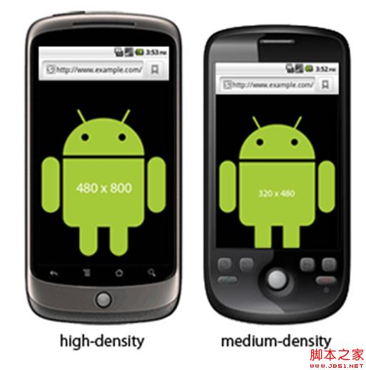

本文分为两个部分，第一部分讨论跨平台网站的可行性，第二部分讨论viewport是如何设置的

**开发跨平台网站？**

**靠标签的自适应宽高实现多尺寸通用！？**

标签宽高可以自适应没错，我们很早就可以这么做了。但是你会发现很多pc端的传统网站还是会把宽度固定。（淘宝采用1000px宽度，搜狐950px...）为什么我们不让网站自适应宽高呢？那是因为，如果我们听任标签宽度被浏览器任意拉伸，将导致极差的体验：你不会希望当浏览器被缩放到100px时，你的左边栏变成了面条；也不会希望当浏览器被过度拉伸时，你的网站看起来像小学生的横格本。所以，靠标签的自适应来实现跨平台，是**不现实**的，是以牺牲用户体验为代价的。很多时候我们必须固定宽高。

**依靠html5设备检测构建响应式网站！**

我们依靠html5的设备检测查看当前设备是手机还是平板，并依此去加载相对应的css。举个例子来说：如果检测到你的设备是平板，我可以横着显示三栏，如果是手机的话，我就只显示一栏。这个听起来不难，但实现起来非常复杂，我们不仅要针对不同设备开发多套模版，还要对图片的尺寸进行处理。对此，我们可以看看波士顿环球报是如何借助HTML5实现响应式设计的。

总的来说，实现跨平台网站对大多数网站来说成本过高，限制太多，是否可行要结合网站实际情况。

**viewport与网站尺寸**

手机浏览器是把页面放在一个虚拟的“窗口”（viewport）中，通常这个虚拟的“窗口”（viewport）比屏幕宽，这样就不用把每个网页挤到很小 的窗口中（这样会破坏没有针对手机浏览器优化的网页的布局），用户可以通过平移和缩放来看网页的不同部分。移动浏览器引进了 viewport 这个 meta tag，让网页开发者来控制 viewport 的大小和缩放。

**基本概念**

**（1） CSS pixels与device pixels**

CSS pixels： 浏览器使用的抽象单位， 主要用来在网页上绘制内容。

device pixels： 显示屏幕的的最小物理单位，每个dp包含自己的颜色、亮度。

等值的 CSS pixels在手机屏幕上占多大的位置，这不是固定的，这取决于很多属性。经过分析和总结，我们可以得出这么一条公式： 1 CSS pixels = （devicePixelRatio）^2 device pixels （^2是平方的意思，至于 devicePixelRatio是什么东西，后面会讲解） 。

**（2） PPI/DPI**

PPI，有时也叫DPI，所表示的是每英寸所拥有的像素（pixel）数目，数值越高，即代表显示屏能够以越高的密度显示图像。（注：这里的像素， 指的是device pixels。）搞清楚了PPI是什么意思，我们就能很容易理解PPI的计算方式了，我们需要首先算出手机屏幕的对角线等效像素，然后处以对角线（我们平 常所说的手机屏幕尺寸就是说的手机屏幕对角线的长度），就可以得到PPI了。准确的计算公示大家可以参照下图。比较有意思的是，根据公式计算出来的 iPhone 4的PPI为330，要比苹果官方公布的326要高一点点。

同理，以HTC G7为例，480*800的分辨率，3.7英寸，算出来就是252的PPI。

**（3） 密度决定比例**

我们计算PPI就是为了知道一部手机设备是属于哪个密度区间的，因为不同的密度区间，对应着不同的默认缩放比例，这是一个很重要的概念。

由上图可知，PPI在120-160之间的手机被归为低密度手机，160-240被归为中密度，240-320被归为高密度，320以上被归为超高密度（Apple给了它一个上流的名字——retina）。

这些密度对应着一个特定的缩放比例值，拿我们最熟悉的iphone4或4s来说，它们的PPI是326，属于超高密度的手机。当我们书写一个宽度为 320px的页面放到iphone中显示，你会发现，它竟然是满宽的。这是因为，页面被默认放大了两倍，也就是640px，而iphone4或4s的宽， 正是640px。

图中把高密度的一类圈起来，是因为这是android手机的统计数据，在国内安卓手机市场中，高密度的设备占了绝大多数的市场份额，这是很重要的一点，也是我们做安卓端webapp要注意的关键点。

**viewport的使用**

viewport总共有5个属性，分别如下：

复制代码

代码如下:

<meta name="viewport" content=" height = [ pixel_value |device-height] , width = [ pixel_value |device-width ] , initial-scale = float_value , minimum-scale = float_value , maximum-scale = float_value , user-scalable =[yes | no] , target- densitydpi = [ dpi_value | device-dpi| high-dpi | medium-dpi | low-dpi] " />

在这些属性里面，我们重点关注**target-densitydpi**，这个属性可以改变设备的默认缩放。 medium-dpi是target-densitydpi的默认值，如果我们定义target-densitydpi=device-dpi，那么 设备就会按照真实的dpi来渲染页面。打个比方说，一张320*480的图片，放在iphone4里面，默认是占满屏幕的，但如果定义了target- densitydpi=device-dpi，那么图片只占屏幕的四分之一（二分之一的平方），因为iphone4的分辨率是640*960。

 

**解决方案**

**（1） 简单粗暴**

如果我们按照320px宽的设计稿去制作页面，并且不做任何的设置，页面会默认自动缩放到跟手机屏幕相等的宽度（这是由于 medium-dpi是target-densitydpi的默认值，和不同密度对应不同缩放比例所决定的，这一切都是移动设备自动完成的 ）。所以这种解决方案，简单，粗暴，有效。但有一个致命的缺点，对于高密度和超高密度的手机设备，页面（特别是图片）会失真，而且密度越多，失真越厉害。

**（2） 极致完美**

在这种方案中，我们采用 target-densitydpi=device-dpi，这样一来，手机设备就会按照真实的像素数目来渲染，用专业的话来说，就是1 CSS pixels = 1 device pixels。比如对于 640*960的 iphone，我们就可以做出 640*960的页面，在iphone上显示也不会有滚动条。当然，对于其他设备，也需制作不同尺寸的页面，所以这种方案往往是使用媒体查询来做成响应式 的页面。这种方案可以在特定的分辨率下完美呈现，但是随着要兼容的不同分辨率越多，成本就越高，因为需要为每一种分辨率书写单独的代码。下面举个简单的例 子：

复制代码

代码如下:

<meta name="viewport"content="target- densitydpi =device-dpi, width=device-width " /> #header { background:url (medium-density-image.png); } @media screen and (- webkit -device-pixel-ratio:1.5) { /* CSS for high-density screens */ #header { background:url (high-density-image.png);} } @media screen and (- webkit -device-pixel-ratio:0.75) { /* CSS for low-density screens */ #header { background:url (low-density-image.png);}

 

 

**（3） 合理折中**

针对安卓设备绝大多数是高密度，部分是中密度的特点，我们可以采用一个折中的方案：我们对480px宽的设计稿进行还原，但是页面制却做成 320px宽（使用background-size来对图片进行缩小），然后，让页面自动按照比例缩放。这样一来，低密度的手机有滚动条（这种手机基本上 已经没有人在用了），中密度的手机会浪费一点点流量，高密度的手机完美呈现，超高密度的手机轻微失真（超高密度的安卓手机很少）。这种方案的优点非常明 显：只需要一套设计稿，一套代码（这里只是讨论安卓手机的情况）。
