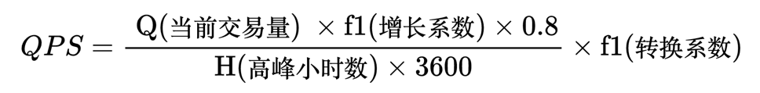

在做性能测试之前，往往我们需要一个可以参考的性能设计值，以此准备性能测试的方案和资源规划。

那么如何根据业务信息，估算出大致的性能基线呢？

## 01 基本概念

性能测试和并发相关的话题在网络上很火，但是相对来说一些概念也比较混乱，在开始话题之前，我们定义一下相关概念。

### 吞吐量（Throughput）

吞吐量通常是个抽象概念，吞吐量指单位时间内系统成功处理的请求数量，通常以每秒处理的请求数或事务数来衡量。它是衡量系统整体能力的指标。

也有根据网络流量分发量来定义吞吐量的。

### 并发（Concurrency）

并发是指在同一时间段内，系统同时处理的请求或用户的数量。

注意，并发是指能同时处理的请求或用户的数量，而不是处理完。 所以并发能力不能等于吞吐量。

通常来说，TPS 和 QPS上来后，并发也会更高。但如果使用异步 IO 模型，能提高并发能力，但不一定能提高 TPS和QPS。

极端的情况是，通过排队的策略让大量用户保持连接，即使每个请求耗时非常久，也能被当做高并发。

这和景区观光车类似，并发接待游客的能力和实际的吞吐量不一定完全相关。

### TPS （Transactions Per Second）

TPS 表示每秒钟可以处理的事务数量。在软件系统中，一个事务通常指的是一个完整的业务操作，从开始到结束可能涉及多个步骤或API调用。

在实践中，TPS 的 Transactions 在不同行业的含义是不同的。对于一个电商系统来说，T 是指用户从搜索商品到支付完成整个流程。

TPS 更能衡量业务价值。

### QPS（Queries Per Second）

QPS 表示每秒钟可以处理的查询请求数量。通常指的是系统能够在一秒钟内处理的请求或查询次数。

一个 Transaction 会有多个 Queries，虽然 TPS 更能衡量业务，但

### 用户数量

用户数量是一个非常重要的指标，可以通过用户数量来估算 TPS、QPS。在运营视角用户数量有：目标用户数、系统用户数、活跃用户数、在线用户数、并发用户数等。

从性能估算角度我们只考虑：系统用户数、活跃用户数、并发用户数（峰值）。

- 系统用户数：所有使用过系统的用户，如果不能允许匿名用户使用的系统，系统用户数可以直接在数据库表中统计得到。
- 日活用户数：一天内访问过系统的用户，可以在登录表中记录登录时间统计得到。
- 并发用户数（峰值）：统一时刻（可以是一秒内）访问过系统的用户数量，和在线用户的区别是，在线用户的统计时间更长，可能是5分钟。

## 02 估算模型

估算的目的是获得技术指标，并用来做性能测试。所以如果有历史运维数据，那也不用再估算就有非常精确的数据；否则只能通过运营数据估算，这取决于我们能采集到的数据是用户量还是历史交易数量（Transactions）

无论是用户量还是历史交易数量我们都能得到某个时间段内的交易数量，并根据**分布情况**来估算性能指标。

比如银行某些业务分布在工作日上午 10-12 点；而点餐系统的峰值往往出现在饭点，这些都是业务人员能直接感知到的信息，甚至统计。

PS：某些架构师使用二八原则估算性能指标，其实二八原则可以被视为一种幂律分布或对数正态分布，可以看做一种分布方式。

所以可以通过下面操作步骤来进行估算：

1. 收集业务需求，门店数量、用户量、业务增长情况，得到期望每天完成的交易量。这里用 Q 代表当前交易量，使用 f1 代表增长系数。 
2. 根据业务分布特性，例如营业时间和访问分布情况，估算出峰值分布情况。例如某银行业务 80% 的交易量发生在 10-12点，14-16点，以4个小时计算，这里使用 H 代表高峰时段的小时数。 
3. 走查全链路 API 调用情况。由于每个 API 被调用的次数是不同的，找出关键的一些 API，在整个事务中需要用到的次数，获得 TPS-QPS 转换系数。比如完成商品购买流程，可能商品详情页面会被反复浏览，需要一个系数 f2。
4. 根据公式计算出某个 API 的 QPS 指标。

公式如下：



```latex
QPS = \frac{\text{ Q(当前交易量) } \times \text{f1(增长系数)} \times 0.8 }{\text{H(高峰小时数)} \times 3600}\times \text{f2(转换系数)}
```

## 02 点餐系统案例

现在使用这个模型来估算点餐系统的性能指标。

场景为用户扫码自助点餐，1000 个商家接入，平均每天出 300 单，高峰时段发生在中午和晚上 3 个小时内，菜品查询接口在点餐过程中会使用 5 次。

- 当前交易量：1000*300 = 300000
- 增长系数：1.2 
- 高峰小时数：3
- 转换系数：5

进行计算：

> 300000 * 1.2 * 0.8/(3 * 3600) * 5 = 133.333 

和我们实际经验偏差不算特别大，服务 1000 个商家接入，确实需要达到上百的 QPS，而且这个量级也不算大。

## 03 电商系统案例

所以性能指标预测的关键还是在于**流量分布**，如果流量在一天中都是均匀的话，应对起来容易很多。

在不能满足上面分布情况下得到的结果不一定准确，所幸我们不需要像数学家一样建立一个数学模型来做精确的估算。

在日常中，C 端电商的大部分流量分布在晚上；秒杀的话流量会集中在几分钟内，这也是为什么秒杀对系统设计的要求高的原因。

假设某个垂直电商网站每天有 500000 笔订单，本次上线考虑1个月内的增长增长系数设置为 1.2。根据分布情况其中 60% 的流量出现在晚上 8-10 点，完成一次购买用户往往会点击商品详情页 10 次左右。

根据这个假设来计算预估的 QPS：

- 当前交易量：500000
- 增长系数：1.2
- 高峰小时数：2
- 转换系数：10

进行计算：

> 500000 * 1.2 * 0.6/(2 * 3600) * 10 = 500

TODO 
## 04 审批系统案例

## 05 参考资料

