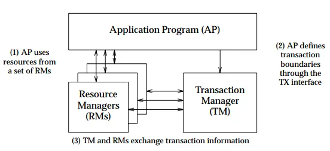
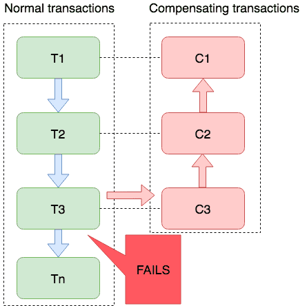
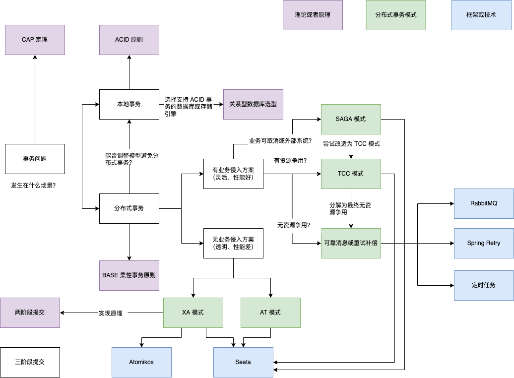

分布式事务一直是微服务设计的一个难点，是解决业务一致性问题的重要手段，一直很谨慎不敢写这部分内容，担心水平不够弄错误导大家。

但是如果在项目上出现了跨服务的业务一致性需求，在网络上搜索出来的材料往往是一些理论和具体的框架使用，对问题场景的分析不多。

在和多个公司的架构师讨论后，大家的共识是：分布式事务很难有一个通用的解决方案，需要在场景中获得比较好的平衡，往往是捏着鼻子选择最容易接受的方案。

本文从场景和问题出发，讨论分布式事务的实现思路，并对业界常见的概念进行了辨析，用于指导分布式事务方案选择。

## 有哪些常见的分布式事务场景？

常见的最终一致性常见有这些，由简单到复杂：

1. 服务之间的调用重试，需要保持一致性。例如，订单提交后需要发送通知。一般通知服务是单独的服务或者产品，因此需要通过一个机制来保证消息一定会被发出。 
2. 多个业务之间的一致性处理。比如用户在商城消费后，需要异步的完成积分、会员等级的更新等，这类一致性要求没那么严格。 
3. 账户余额管理。用户消费后需要扣减余额，而订单取消后需要再把余额修改回原来的状态。账户和订单往往在不同的服务，因此需要处理一致性问题。 
4. 库存一致性。库存一致性问题是供应链领域的核心问题，也是难度最高的分布式问题。和账户余额类似，当时其不同点在于，账户余额的扣减并发很低，没有竞争烈度。而在电商中，库存属于高烈度争用的资源。

这里只选择了一些具有代表性的业务一致性问题，但是我们能发现一些规律。 我们可以对有业务一致性要求的问题进行分类，可以大概分为两类：

1. 无资源争用的业务一致性场景。
2. 有资源争用的业务一致性场景。

大部分情况下，无资源争用的业务一致性很容易被解决，通过重试即可解决。而有资源争用的业务一致性场景却很麻烦，其实可以想办法**转换为无资源争用的业务一致性场景**，这是我们日常解决一致性问题的核心思想。

这就需要用到一些分布式理论的内容，我们主要聊聊有资源争用的场景如何处理。

## 分布式事务的理论基础和分析

一致性问题其实在生活中非常常见。

比如在中学，语文老师和数学老师都想要占用晚上的自习时间，于是打电话给家里说不回去吃饭后，让各自的课代表通知班上的同学，如果晚上的时间只够一节课，那么一致性问题就出现了。其中一位老师没有回去吃饭，却也不能上课。

当状态分区后，也就是决策者不在一起时，一致性问题必然会出现。

这个问题被描述为众所周知的 CAP 定理：一致性、可用性和分区容忍性只能三选二。

这三个特性的含义为：

- Consistency： 一致性，每个分区的状态保持一致。 
- Availability： 可用性，让作业能进行下去，不会因此阻塞。
- Partition tolerance：可以允许各个组件分开进行作业，在微服务系统或分库后，分区容忍一定存在。

所以实际上在微服务中，只有 CP 和 AP 可以选择。

不过，CAP 定理有一个隐喻和误解，三个特性只能选择两个的前提"同时"，如果取得一致性的时间足够短，也能看做"同时"。

这就是最终一致性的理论基础：**在分布式系统中，我们不一定要放弃一致性，只要在业务允许的时间范围内取得共识即可。** 甚至有些业务的时间要求是 T+1，也就是在晚上数据同步作业完成后。

所以 CAP 定理可以视为达成分布式系统共识定理的一种。

最终一致性就好比，一名程序员晚上决定加班，只需要在时间允许范围内给家里打电话不回来吃饭一样。对于无资源争用的情况，最终一致性都能解决。

但是对于有争用的情况来说，就没那么简单了。 我们经常会有这样的经验，组织了一场会议，通知参会人员后发现没有可用的会议室，又不得不取消会议。

对于会议室这种情况，自然的想法是通过预定占用资源，预定成功后再通知参会人员。

其实在软件工程上，几乎所有具有资源争用的情况也是这样处理的。

在扣减账户余额、库存时，如果存在争用的情况，我们往往会设计一个同步占用的请求。将资源占用后，如果后续的过程出错或者有任何问题再通过最终一致性释放回去即可。

可以见到，几乎大部分分布式事务协调方案都是这个思路：**临时占用，异步执行或者回退。** 其实这就是 TCC 模式。

说完了分布式事务背后的思路，下面盘点一下常见的技术方案和框架，例如 TCC。

## 业界常见概念和解决方案

关于分布式事务的话题业界有非常多时髦的词汇，这里做一些梳理。 

### ACID/BASE

ACID/BASE 是两种事务**原则**。

ACID 是指：原子性（Atomicity）、一致性（Consistency）、隔离性（Isolation）、持久性（Durability）。这几个特性是关系型数据库管理系统（DBMS）的基础。

BASE 是指：基本可用（Basically Available）、软状态（Soft state）和最终一致性（Eventually consistent）。

当分区发生时，无法做到 ACID，只能追求 BASE。 一般在分布式系统（微服务）实践中，在服务内部追求 ACID 事务，在服务间追求 BASE 事务。

### TCC

TCC 是 Try-Confirm-Cancel 的缩写，是业界一种常见解决分布式事务的思想。

通常来说，TCC 会侵入业务，工作在应用层，和我们前面的分析部分思路一致，是一种将资源争用转换为无资源争用的模式，用于切断长事务。

参与分布式事务的各个服务，需要实现和预留占用、执行、取消三类作业。

- Try: 往往是同步的，尝试锁定或占用资源，如果在 Try 阶段就失败自然可以整体失败。
- Confirm: 消费预先占用的资源，执行较长的业务逻辑，可以异步完成。
- Cancel: 取消执行业务，释放 Try 阶段的预占的业务资源。

在 Try 阶段一般会生成一个事务 ID 来作为幂等因子，用于后面两步的幂等操作。

值得注意的是，有些项目这三个动作甚至对业务可见，允许用户手动再次重试 Confirm 或者 Cancel 操作。因此，很多使用 TCC 模式解决了项目上分布式事务问题的团队甚至不知道这种模式有一个名字。

TCC 是一种被广泛使用的模式，在电商、支付、银行领域使用非常多，在这些行业经常会听到一些黑话，例如一盘货、多盘货、冲正、在途库存等词可以对应到 TCC 模式中的预占、取消概念上。

### JTA/XA

JTA 是 Java 事务编程接口（Java Transaction API）；XA 是 eXtended Architecture 协议。

连起来的意思是用支持实现了 JTA 的数据库驱动管理支持 XA 协议的数据源来实现**数据库**层面的分布式事务。

而这里的分布式事务其实也不是真的分布式，它依赖一个中心化的事务，导致业务中大量的中心化的状态和锁操作。

XA 需要数据库的支持(Mysql 仅有 InnoDB 引擎支持)，由事务协调器对数据库本地事务的提交和回滚实现事务。

JTA/XA 是数据库层面的事务，一般来说应用不会干预，可以做到业务无感知。由于这项技术依赖基础设施，且依然是中心化的架构，笔者仅在一个古老的银行项目看到过，现代项目几乎没有再见到。

如果需要了解细节可以参考 Mysql 文档中 XA 部分： https://dev.mysql.com/doc/refman/8.0/en/xa.html

### 二阶段、三阶段

在 XA 中，实现事务协调的机制为两阶段提交（2PC ）。二阶段、三阶段都是分布式协调器集中实现分布式事务的一种原理。

由于它基本不会被用于应用层，我们在日常项目也不太用到，是数据库实现全局事务的一种方式。

二阶段、三阶段提交算法的成立基于以下假设：

- 在需要实现一致性的分布式系统中，存在一个节点作为协调者（Coordinator），其他节点作为参与者（Participants）。
- 所有节点都采用预写式日志，这些日志是可靠的。
- 参与的节点数据是持久化的可靠数据，或者可以被恢复

关于二阶段、三阶段的内容维基百科上有清晰的描述，这里就不浪费篇幅详细说明。这里引用维基百科上一段非常容易理解的比喻：

> 举例来说，假设有一个决策小组由一个主持人负责与多位组员以电话联络方式协调是否通过一个提案，以两阶段提交来说，主持人收到一个提案请求，打电话跟每个组员询问是否通过并统计回复，然后将最后决定打电话通知各组员。要是主持人在跟第一位组员通完电话后失忆，而第一位组员在得知结果并执行后老人痴呆，那么即使重新选出主持人，也没人知道最后的提案决定是什么，也许是通过，也许是驳回，不管大家选择哪一种决定，都有可能与第一位组员已执行过的真实决定不一致，老板就会认为决策小组沟通有问题而解雇。三阶段提交即是引入了另一个步骤，主持人打电话跟组员通知请准备通过提案，以避免没人知道真实决定而造成决定不一致的失业危机。而三阶段提交为什么能够解决二阶段提交的问题呢？回到刚刚提到的状况，在主持人通知完第一位组员请准备通过后两人意外失忆，即使没人知道全体在第一阶段的决定为何，全体决策组员仍可以重新协调过程或直接否决，不会因出现不一致决定而失业。那么当主持人通知完全体组员请准备通过并得到大家的再次确定后进入第三阶段，当主持人通知第一位组员请通过提案后两人意外失忆，这时候其他组员再重新选出主持人后，仍可以知道目前至少是处于准备通过提案阶段，表示第一阶段大家都已经决定要通过了，此时便可以直接通过。

### SAGA 模式

Saga 是类似于 TCC 这样的分布式模式，和 TCC 的主要区别是没有预占和锁定。实现 Sata 有两个假设：

- 应用层所有的参与长事务的服务都具有可取消能力
- 应用层所有的参与长事务的服务具有本地事务

简单来说，Saga 模式中参与事务的服务优先提交事务，如果出现失败的情况下，再对前面已经提交的事务进行回滚补偿。

其理论基础来源于 Hector & Kenneth 的论文 《Sagas》，原理参考下图：

图片来源：http://seata.io/zh-cn/docs/user/saga.html

实际来说，使用 Saga 的场景不多。原因是无法应用于资源争用的场景，而无资源争用的场景又不需要 Saga 模式。

可能潜在的场景有多个系统之间的一致性处理，在某些场景下，第三方系统或者遗留系统不提供预占机制，但是提供了取消和回滚操作的 API，可以应用 Saga 模式。

在笔者的经验中，使用类似 Saga 模式处理 ERP、供应链、财务等系统集成，通过优先成功的模式处理业务，如果业务失败，通过一个本地消息或任务表对第三方系统补偿取消的业务。

### AT 模式

AT 模式没有查到相关资料，仅在 Seata 框架文档中提到了该模式，在外网环境下没有查到权威出处。

根据公开资料显示和 Seata Committer 的一篇文章：《Seata 分布式事务 XA 与 AT 全面解析》得知。

AT 模式是为了弥补 XA 模式的一些缺点产生的，AT 与 XA 之间的关系主要为工作的分层。
XA 模式工作在数据库实现层，依赖相关数据支持 XA 协议，而 AT 模式工作在事务协调器中，通过解析 SQL 获取数据的行进行加锁，牺牲对业务的无侵入性，优化性能。

该篇文章也提到："AT 可以看作时由 Seata 社区进行全方面优化，自研的 XA 模式，最大特点就是解决了 XA 模式的性能差的问题。" 查证了 AT 模式是 Seata 社区提供的 XA 改进模式。

不过，AT 模式假设大部分业务场景下，假定每个分支事务都能成功。所有分支事务将直接提交，无需等待事务协调器的指示，以提高速度。然而，这种模式下的全局事务实际上并非原子性的，在一定时间内会处于脏数据状态（在并发场景下，如果没有有效的治理措施，这种情况将更加严重）。

## 分布式事务实现的选择和要点

上面辨析了这么多分布式事务实现的概念和模式，那么对于开发者来说，现实问题是，我该怎么选择各种分布式事务模式进行设计呢？

建议充分分析应用场景、使用成本和需求能权衡的情况下做出选择。参考下面这张概念图：

一些关键的决策点如下：

- 一致性是否只存在数据库层面，是否存在业务执行上有需要一致性，例如通知发送
- 对业务的侵入性
- 是否需要引入协调性和基础设施
- 同一个事务是否有超过两处资源争用的情况

一般来说，在落地实现分布式事务中，如果采用了类似 TCC 方案，需要考虑好幂等性、重试和可靠信息的问题，这些更为细节的内容在以后的话题中讨论。

## 总结

分布式事务在业界是一个长期讨论的话题，本文仅仅是对常见概念做了辨析和分析，用于在遇到相关问题时做出合适的选择和权衡。

一般来说，在解决这类问题时，还是需要从业务场景出发，分析具体的权衡点，避免引入号称能一劳永逸解决分布式问题的方案或者框架，使用性价比合适的最终方案。

如果深入讨论分布式数据库，会有更多话题，例如全局时钟、原子性、读写冲突、并发控制、数据复制，在后面有机会和大家讨论并整理出来。

## 参考资料

- An Illustrated Proof of the CAP Theorem https://mwhittaker.github.io/blog/an_illustrated_proof_of_the_cap_theorem/
- http://lpd.epfl.ch/sgilbert/pubs/BrewersConjecture-SigAct.pdf
- https://docs.spring.io/spring-boot/docs/2.0.x/reference/html/boot-features-jta.html
- https://www.cnblogs.com/jajian/p/10014145.html
- https://seata.io/zh-cn/blog/tcc-mode-design-principle.html
- https://blog.csdn.net/qq_24313635/article/details/104044297
- 一款 TCC 实现框架 https://github.com/changmingxie/tcc-transaction
- https://www.atomikos.com/Documentation/WhenToUseJtaXa
- Understanding XA Transactions With Practical Examples in Go https://betterprogramming.pub/understanding-xa-transactions-with-practical-examples-in-go-67e99fd333db
- https://blog.csdn.net/crazymakercircle/article/details/113666155
- https://dev.mysql.com/doc/refman/8.0/en/xa.html
- https://en.wikipedia.org/wiki/Two-phase_commit_protocol
- https://en.wikipedia.org/wiki/Three-phase_commit_protocol
- https://seata.io/zh-cn/docs/user/saga.html
- Seata 分布式事务 XA 与 AT 全面解析 https://developer.aliyun.com/article/919377
- Saga Paper https://www.cs.cornell.edu/andru/cs711/2002fa/reading/sagas.pdf

