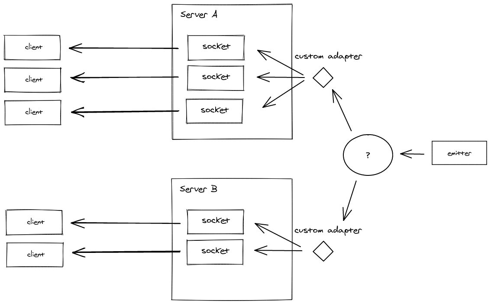

互联网时代越来越多的实时协同软件出现，例如在线点餐、文档编辑、在线绘图。

今天来聊聊这些场景一般如何实现的。

## 场景和问题

实时协同软件一般用于多个人同时操作（也包括一个人多个会话）。例如 Google Doc 可以支持同时编辑文档，并将多人编辑的结果合并到一起展示，而且能相互看到其它人的操作。

这种场景越来越普遍。

但是，在实现过程中会有非常多的技术问题和业务逻辑问题：

1. Web 平台如何建立长连接？
2. 如何进行一致性处理，让多人编辑的结果尽量不冲突？
3. 如何支持离线操作？
4. 如何扩容？
5. 有那些框架？

## Web 平台如何建立长连接？

建立长连接的技术从远古互联网技术发展开始就有很多方案，有些方案现在很多人都不会再听到了。

建立 Web 长连接我们一般可以： 

1. 定时重试：比如每隔 60秒发起一次 HTTP 请求，这是最差的一种方案。
2. HTTP 长连接（Comet）：前端发起一个 HTTP，后端挂起，在没有信息回填之前挂起请求，前端如果超时，自动重连再发送一个 HTTP 请求。
3. WebSocket：通过 HTTP 握手，然后建立（Upgrade 过程）一个 TCP 连接。代表框架 Socket.IO，可以支持使用 WebSocket 和 Comet 建立连接。
4. MQTT 协议：或者其他物联网推送的封装，提供一些持久化，QoS（根据服务质量，选择重传的策略） 的支持。其它的极光 PUSH API（XMPP 的协议），这些协议往往也是建立在 WebSocket 上的。
5. Flash、Silverlight 等浏览器富应用运行平台。这也是古老的互联网技术，这两个平台目前都已经宣布停止维护，优先推荐使用 H5 相关技术。
6. 浏览器插件。某些厂商对于专业应用有更高的要求，所以会实现自己的协议，根据原生 Socket 进行连接，并通过插件的方式和浏览器集成，为 Web 提供更基础的 API。

当前主流的方案一般是 WebSocket。

## 如何进行一致性处理？

相比网络连接的问题来说，让多人编辑的结果尽量不冲突这个问题更难。

不同的场景、数据类型可以采用的策略并不同，下面以文章开头的几个场景例子说明如何实现一致性。

点餐的场景下如何处理一致性？一般将业务操作原子化+幂等，把数据更新修改为加、减操作，使用最终一次性让服务器决策结果（发生冲突时，一般是先到先做策略，后到丢弃），并将事件分发到参与方。

在线绘图场景如何实现一致性？抽象图的数据结构，使用节点和边对图进行结构化处理，以节点和边为原子单位，利用数据库的能力高速更新。发生冲突时，可以使用后到覆盖的策略，后到的更新会覆盖前一次的更新。可以使用一些非关系型数据库的 upset 能力，将插入和更新合并处理。

> PS：对于图数据库的选择，可以使用 Orientdb、MongoDB、Neo4J 等数据库来实现。

在线文档编辑场景如何实现一致性？可以使用 OT 算法（另外一种算法叫做 CRDT，CRDT 可以看做 OT 算法的拓展），OT 算法使用偏移量作为更新依据，可以快速合并协同者的数据内容。

某种程度上来说，文档结构和图的结构非常类似，因此可以使用非关系型数据库的特点尽可能地提高性能。

不管什么一致性策略，时间久了都会不一致，在游戏场景和一些协作算法中会使用一个叫影子跟随的策略定期抹掉各个客户端的差异。其原理是定期或者网络连接中断后，重新和服务器对齐版本，把服务器的最新版本往客户端拉取。

## 如何支持离线操作？

离线操作在实时协作系统是一个非常费力不讨好的特性，因为总是会导致用户数据丢失，而且非常难以探查问题。

以 MQTT over Socket 的例子，如果要实现实时协作，可以考虑如下方案。

1. 先把把离线过程中的变化记录下，网络连接后发送到后端，并广播出去。这个方案会记录很多过时的操作数据，比如上周协作了一次，中间其他成员协作，今天线上会播放整周的数据，而且还会存在服务器上，会产生大量的冲突。
2. 本地操作不记录变化，网络连接后只发送一个快照版本，服务器根据某种策略接收这个快照版本的数据或者部分数据。

一般优先推荐使用方案 2，这样在版本比较时更可控，甚至可以允许用户确认两个版本的差异，并根据某种策略合并。

另外需要注意，离线后重新上线需要使用类似影子跟随的方式，获取服务器最新的版本。（因为服务器总是要保存一份最新版本数据）。

## 如何扩容？

实时协作系统不具备天然的水平扩容能力，需要设计相关机制进行扩容。

扩容方式一般有两种：

1. 将用户隔离到小规模范围内的协作范围中。
2. 将用户放到一个大池子，对事件交换机制进行扩容。

可以使用我把他们叫做集中式扩容和分散式扩容。

集中式扩容有点像吃大锅饭，对用户群不区分，而是对事件分发的服务器进行水平扩容。

下面是 SocketIO 提供的解决方案： 

反过来看分散式扩容，如果我们根据一些业务策略将用户 stick 到具体的服务器上，让这些用户在服务内部完成事件交换，即使这些服务器在一定程度上是有状态的。

分散式扩容更像是游戏服务器模式，避免将消息广播到太大范围，因为我们在业务上总是能找到消息广播的主题，让广播的范围尽可能小，这样系统崩溃时影响的用户范围比较小。

## 有那些框架可以帮助简化实时协作的工作？

从零开始实现一套实时协作系统比较困难，而且需要长期探索一些技术选型的问题。

这里分享一些常见的技术方案和框架作为参考。

- Convergence：Convergence 是一款专门为实时应用设计的框架，主要技术选型有： Scala、Akka、OrientDB、Google Protocol Buffers、Orient DB。从技术选型上可以看出，实时应用需要高并发、响应式编程、图数据库等特性的能力。
- Socket.IO: Socket.IO 是一个基于 WebSocket 和事件的网络库，用于实现消息推送等需求。
- MQTT： MQTT 是一款非常热门的物联网连接协议，它具有无连接、异步消息、QoS 保证等特点。常见的实现有Emqx、HiveMQ 等。

从需求匹配性上来说，Convergence 就是为了实时应用设计的，它有很多 Demo，包括在线协同编程、文档协同编辑、协同绘图等。通过 Akka 的分布式能力，Convergence 也支持水平拓展的集群部署。

Convergence 的缺点是它是一个完整的应用，而不是一个库，且是 Scala 编写的，需要学习相关的语言特性。 

而 Socket.IO 做的事情就少很多，Socket.IO 只提供网络连接、事件分发等任务，默认情况通过 Websocket  进行通信，在浏览器版本过低时也支持 HTTP 长连接，也就是 COMET 技术。

Socket.IO 提供了 Java、Nodejs 等平台和语言的实现，所以更容易集成到自己的应用中来。

默认情况下 Socket.IO 在内存中实现消息转发，也可以接入集中的数据源或者事件 Adapter 来完成消息广播的能力。

常用的有： 

- Redis Streams adapter
- MongoDB adapter
- AMQP (例如 RabbitMQ)

图片来源：https://socket.io/docs/v4/adapter/

## 实时协作应用设计上的注意事项

有一些实践上的坑不得不提一下。

**用户数据丢失几乎是必然的。** 

这一点主要还是 CAP 定理约束，在 [系统设计 | 分布式事务场景、概念和方案整理（含概念图）](http://shaogefenhao.com/posts/architecture/distributed-transaction.html) 中我们讨论过这个话题，而在实时协同应用中这种问题变得尤为突出。

用户离线后即使开启高的 QoS 保证消息最终发送到用户，但是当用户最终收到消息后，现场已经发生变化，甚至带来一些副作用。

**不要过于依赖历史消息。** 

为了保证用户的数据安全，我们可能会开启 QoS 保证，很多通信框架都会通过确认的方式保证送达事件。

高的 QoS 不仅影响性能而且对一致性帮助不大，因为和上面提到的类似，历史消息对最终结果有时候意义不大。

**本地实现Undo、Redo 操作**

我们有时候会设置 Undo、Redo 操作来实现撤回和重做，但是一定不要将这两个事件广播出去，而是应该在本地完成后，作为新的操作事件再发送出去。

例如 Undo 在本地表现为删除一段文本，那么发送到服务器的消息应该是删除一段文本。

**合理设置心跳检测机制**

通信框架都会使用心跳来检测离线，默认情况下部分框架的心跳设置非常长，可能不能满足某些场景需要，可以设置更短的心跳。

但是，心跳一般是网络协议的职责，尽量不要在应用中再实现一次。

**随处可见的非阻塞式编程。**

实时协作往往需要非常高的并发处理能力，一旦在代码中需要异步处理的地方出现阻塞，整个系统的性能就会急剧下降，而且比较难以排查。

我们可以采用一些非阻塞的框架或者库提高响应式编程的体验，例如 RxJava、RxJS 等。

**编程语言和平台影响很大**

有一些语言的并发能力天生就很强，比如 elixir、Erlang/OTP、Scala、Nodejs 等。这些编程语言或者平台往往都是非阻塞式的，而 Java 一般来说主要应用于业务系统，对于需要高并发的场景来说，有能力的话尝试其它语言可以收获非常多（我曾经将 MQTT 服务器切换为 EMQX 后获得性能上的飞跃提升，不过其构建在 Erlang/OTP 之上，非常遗憾的是，完全没有能力对其源码进行拓展）。

## 参考资料

[1] The free and open source engine for real-time collaboration https://convergence.io/

[2] Socket.IO 文档 https://socket.io/docs/v4/adapter/

[3] Building Real-time Applications with Phoenix & Elixir https://www.educative.io/courses/building-real-time-applications-phoenix-elixir

[4] Building real-time collaboration applications: OT vs CRDT https://www.tiny.cloud/blog/real-time-collaboration-ot-vs-crdt/

[5] Comet (programming) https://en.wikipedia.org/wiki/Comet_(programming)
