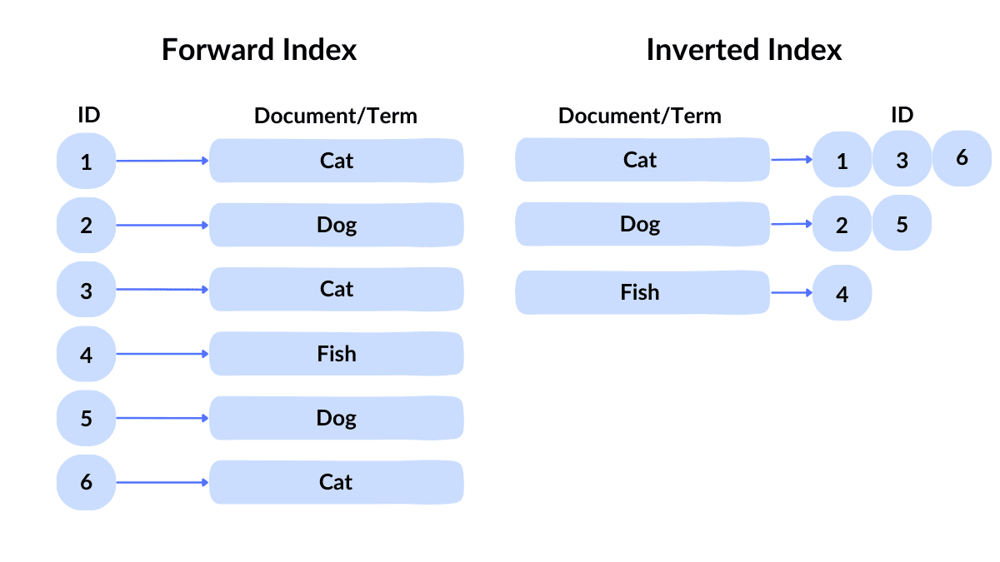
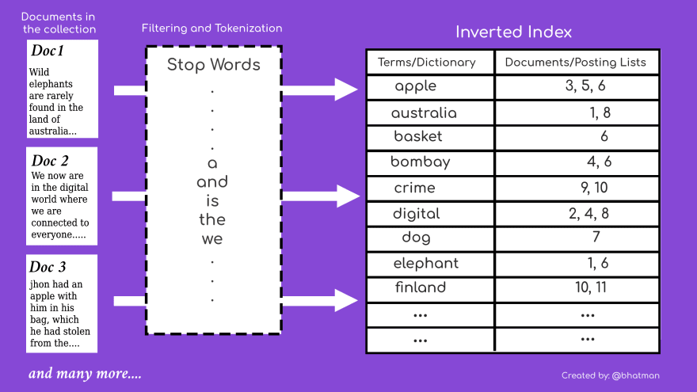

当前产品搜索能力不能满足业务需要时，如何设计搜索引擎方案，支持复杂搜索？

## 00 典型业务场景

假设你在实现一个电商平台，随着业务的发展，有一些搜索商品的功能越来越复杂，数据库的搜索能力开始无法满足需求，或者需要很大代价才能满足。

常见的需求这些:

- 需要实现模糊搜索：用户搜索“成都火锅”，需要自动匹配 “成都”，“火锅”这两个关键词的搜索内容。
- 自动纠错：例如输入 “hotpt”，当没有结果或者结果较少时，提示搜索 “hotpot”。
- 自动填充：用户输入 “火”，根据平台的特点提示 “火锅”
- 近义词和同义词搜索：例如输入“hotpot”，返回中文语境下的“火锅”
- 基于地理位置搜索：例如城市、商圈、距离。
- 根据各种条件过滤：
  - 数量区间
  - 人工干预过滤，例如忽略非法内容
- 排序：根据热度、地理位置、新鲜度、相关性、权重等高级排序
- 根据物品标签搜索：除了关键词搜索外，可以根据当前浏览的文章或者商品推荐出相关的内容。
- 更高级的特性：
  - 聚合搜索：将不同主题的数据合并到一个搜索结果列表中。
  - 个性化搜索：根据用户画像或者浏览记录搜索出相关性更强的内容。
- 其它需求

这些搜索需求在互联网产品中会变得非常常见，例如知乎的内容搜索、美团的聚合搜索等。在大多数场景下，我们需要讨论的更多是垂直应用的搜索，例如电商、UCG(用户内容创作)平台。

假设你是一名架构师或者技术经理，有哪些搜索引擎知识需要了解？

## 01 搜索领域行话

### 爬虫（Crawler/Spider）

爬虫是一套自动化程序，用于获取被搜索资料，继而被用于索引和搜索引擎更新。

不过在垂直应用的搜索领域，一般用不着爬虫，基本通过业务数据导入被搜索的内容，例如商品、帖子、订单、商家之类的信息。

### 索引（Index）和倒排索引（Inverted Index）

讨论搜索引擎必然需要讨论的两个词。

索引：建立一个列表，方便查找到对应的目录和条目，例如书的目录就是索引。数据库大量依赖索引，通常使用二叉树类的有序索引，方便快速查询数据。
倒排索引：从文档中提取关键词，建立这些关键词映射到对应文档的 ID 上，看起来映射关系是反的，所以叫做倒排索引。

下面是这两种索引的差异：



当然倒排索引的建立过程非常复杂，下面这张图是倒排索引的创建过程：



### 查询（Query）：

有了索引后，开发者需要编写查询语句，基于数据库开发的应用需要使用 SQL，那么基于搜索引擎的应用需要编写一些查询语句，通常是一些 DSL。

Solr Query 例子如下：

```shell
http://localhost:8983/solr/my_collection/select?q=content:"search engine"&facet=true&facet.field=category
```

Elasticsearch 例子如下：

```json
GET /my_index/_search
{
  "query": {
    "match_phrase": {
      "content": "search engine"
    }
  },
  "aggs": {
    "by_category": {
      "terms": {
        "field": "category.keyword"
      }
    }
  }
}
```

## 分词算法（Tokenization Algorithm）

分词是指将内容文本提取成关键词的过程，用于将文本分割成一个个单独的词或标记（tokens）。

需要建立索引的前提是对词汇进行分词，而分词能力和语言的特点相关性非常大。比如英语就非常好实现分词。

常见的策略有： 

- 使用空白分词：适用于语言词语之间有明确空格分隔的场景，如英语。
- 标点分词：适用于需要将标点符号作为独立标记的场景。
- 字典分词：适用于语言词语长度不固定、词语边界模糊的场景，如中文、日文。
- 统计分词：基于统计模型，通过学习大规模语料库中的词频和词序关系来进行分词，适用于需要处理大量未标注数据的场景。
- 机器学习分词： 利用机器学习算法（如条件随机场、LSTM等）进行分词，用于复杂语言和需要高精度分词的场景。
- BERT 算法： 基于 BERT 模型的 WordPiece 分词，将词语拆分为更小的子词单元，提高处理未见词的能力，例如 unaffordable 识别为 ["un", "##affordable"]。

更多细节的属于就不在这里单独说明了，在后面内容穿插说明。

## 02 搜索引擎原理

### 地理位置搜索如何实现？

### 推荐是如何实现的？

### 纠错、同义词、近义词如何实现？

### 自动填充如何实现？


## 03 常用开源方案

## 04 应用集成架构

## 05 思维导图


