在多年软件开发的经验中，我看过各种各样的架构图和技术方案。其中不乏看到非常精美架构图，以及非常详细的技术方案。

非常遗憾的是，目前没有流传开的标准来规范架构图的绘制，不同公司架构文档风格也五花八门。如果说有 UML 这类图例标准，也非常古老了，大部分人也不怎么使用 UML 来设计架构图。

这会让很多架构师非常困惑，不知道如何上手，参考哪些材料来完成这类工作。

本文，整理了一些架构图以及技术方案的设计经验，力求兼具维护成本、表达效果、美观等目标，作为架构和方案设计工作的参考。

## 基本逻辑：设计即模型

有时候我们会把架构图绘制和技术方案编写当做 Paper Work，视为一件非常无聊的事。 如果站在 PM 的角度看起来可能是这样，但是如果我们站在架构师或者 TL 的角度，绝不应该这样看。

绘制架构图和技术方案的第一个原则是：

> 架构图和技术方案中每一个部分都应该是有用的。

有用可以理解为：作为一种信息索引存在，是信息的高度概括，可以用于汇报；作为一种模型，可以给团队成员讲明白架构中的**元素和关系**。 除此之外的装饰不应该添油加醋的放到架构产物上。

根据这个逻辑，我们应该把架构图看做一种程序实现之前的**模型**。软件开发过程就是不断用更形式化的方式将设计表达清楚，最终的代码也可以视为一种形式化的模型。

下面是一个简略的示意图，描述了软件工程，从问题到解决方案，是如何从非形式化的模型走向形式化的模型的。

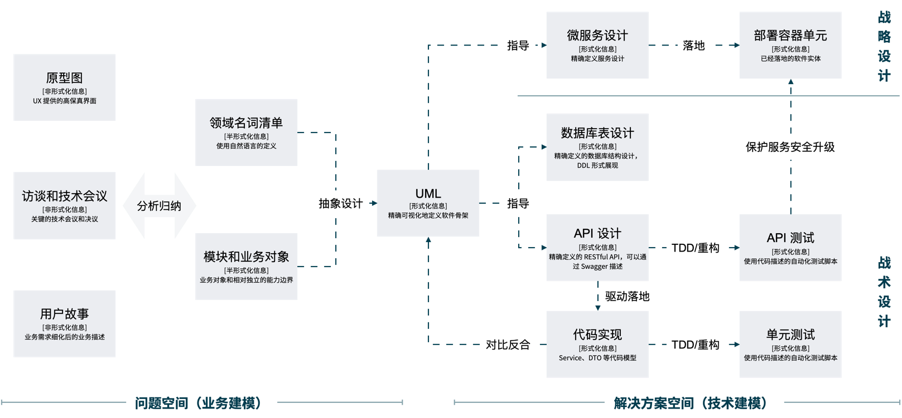

对于敏捷项目，往往规划阶段不会做详细设计，因此我们需要将架构和技术方案具体拆分一下。

- 规划阶段：更像平常说的架构规划，更关注宏观、战略信息，做出全局和关键决策。
- 交付阶段：每个迭代前进行详细设计，产出可以进行开发的信息。

根据这个逻辑，在规划阶段，一套架构产出物需要包括的内容和解决的问题为：

- 非功能性需求：描述系统的设计指标，有那些通用需求，决定了技术选型和后续的架构决策。
- 技术选型：描述系统使用了哪些关键的框架、平台、技术、库和开发工具
- 领域模型：可以使用 UML 的类图来实现，它描述了基于业务抽象后的概念体系和对象关系。
- 模块（服务）设计：描述了系统中有哪些部分，每部分提供的能力是什么，以及这些部分之间的关系。通常来说，狭义的架构都是说的这部分。当我们描述这部分信息时，最好按照颗粒度的粗细逐层打开。
- 部署架构：描述模块或者服务如何实际被运行或者部署。
- 一些技术专题：需要提前设计的技术架构专项方案，例如分库分表等。
- 其他内容：
  - 决策记录：将关键的技术决策评审后，记录下来，用于后期架构溯源
  - 威胁建模：从安全角度分析架构上的薄弱点，并制定相应措施
  - 技术规范：团队在落地交付时需要遵守的规约
  - 测试策略：如何进行测试，开发和 QA 如何协作

额外的，应用程序接口（API） 可以描述系统内外部如何通信，通信的契约是什么；数据库设计（DDL）描述领域模型如何在持久化上表达。由于规划阶段缺乏准确的业务输入，这两项可以在规划阶段可以先不加考虑。

架构设计阶段推荐尽可能使用 PPT 或者 Keynote 来完成绘图工作，方便携带和汇报，以及生成 PDF 作为后期存档以及传播材料。

## 非功能性需求

一般来说软件需求是由具有业务明确目标的功能需求和非功能需求构成的。有时候，非功能性需求又叫做跨功能性需求，这些需求往往是隐藏的。

每个项目的非功能性需求可能不同，而且需要为每个需求制定具体的指标，可以参考附录 1 的非功能性清单。

当非功能性需求被决定下来后，需要将其分级，可以量化的可以明确设计指标，例如性能则可以使用 TPS、QPS 来描述。

绘图方式参考如下：

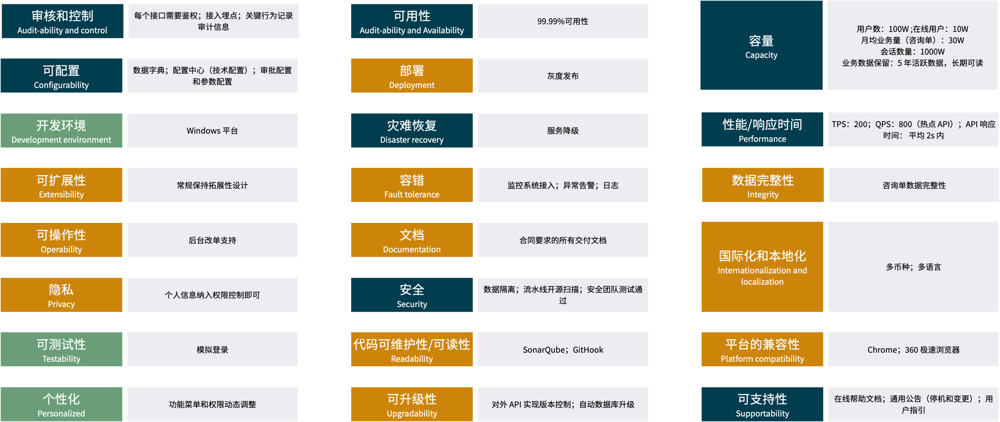

## 技术选型

技术选型有很多种分类方法，有时候要做到 MECE（相互独立，完全穷尽）挺不容易。我考虑了一种 "菜单式" 的选型方法，将同类可用的选项陈列出来，对比后选择。

绘图方式参考如下：

## 领域模型

领域模型描述的是对象在内存中的结构，指导 API 和数据库设计，是模块（微服务）划分重要的输入。

建立领域模型的方法多种多样，但是建议作为专业架构产出物，我们可以将领域模型视为应用中的 Class。因此，可以通过类图进行表达即可。

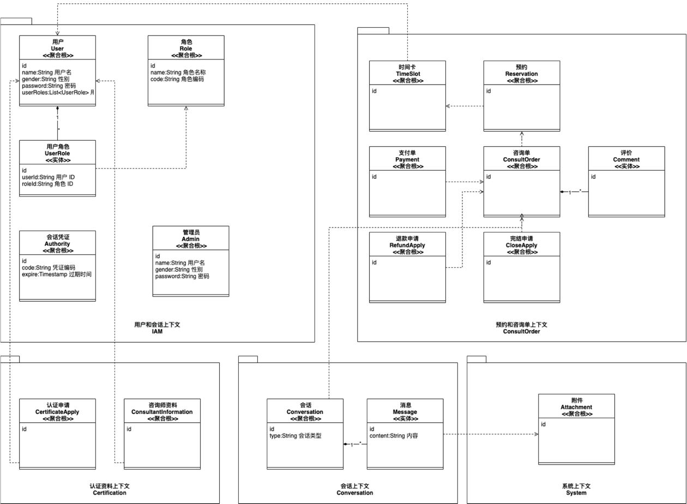

这里有一些绘制领域模型的一些经验：

- 绘图工具参考本文的附录 2
- 使用**组合**表达 Eric DDD 中聚合的概念
- 使用**衍型（Stereotype）** 表达领域模型的类型
- 使用依赖或者引用表达模型的关联关系
- 仔细斟酌用词，尽可能补充完整的英文名称，便于在后续使用
- 使用包（Package）作为上下文模块划分，如果是单体服务落地时作为模块，如果是微服务项目，可以映射为微服务
- 不用将所有的字段信息放到领域模型中，而是使用一个单独的字段表来表达领域模型细节，字段表的更新维护成本更低，而模型图用来表达模型的关联关系

除此之外，很多架构师还喜欢用非标准图例表达事件风暴的过程，以及上下文划分。

个人认为过程材料可以在附录中表达出来，不必作为技术架构的产出物。

事件风暴和上下文划分参考如下：

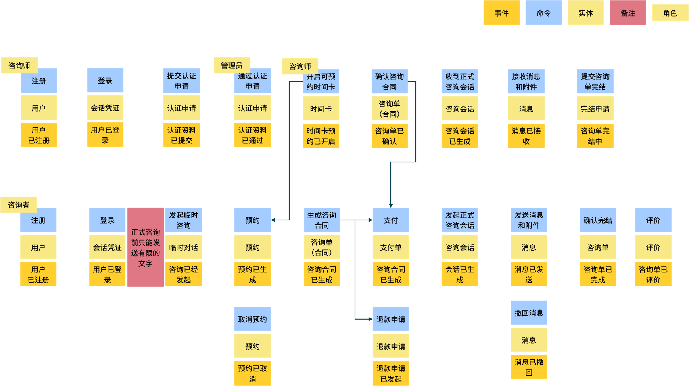

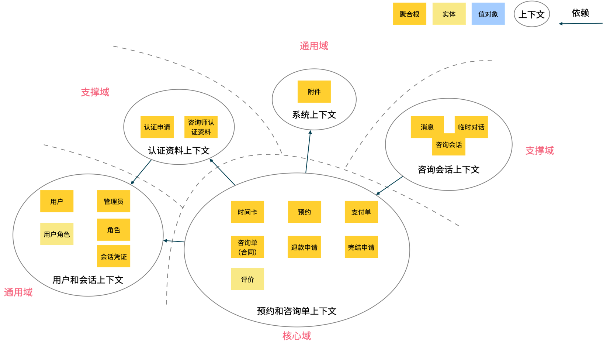

## 模块（服务）设计

模块（服务）设计是狭义上常常说的架构设计。

架构是系统中元素和元素关系的定义，其主要目的是满足相关干系人提出的需求，并能在后续的交互过程中有效分割复杂性，并由可能由多个团队承担其相应职责。

要在一张图中表达所有的细节不现实，一般我们可以先展示一张包含：用户、服务、基础设施、技术栈、上下游系统等内容的架构全景图，然后再有具体的视图来表达各个方面的细节。

要组织不同图形可以参考 4+1 视角模型，它将架构图的组织形式为逻辑视图、开发视图、处理视图、物理视图、场景。

从实践上来说，这个模型在微服务系统之前使用还不错，但是在微服务兴起后。需要描述战略、战术不同的缩放粒度，更加推荐使用 C4 模型。

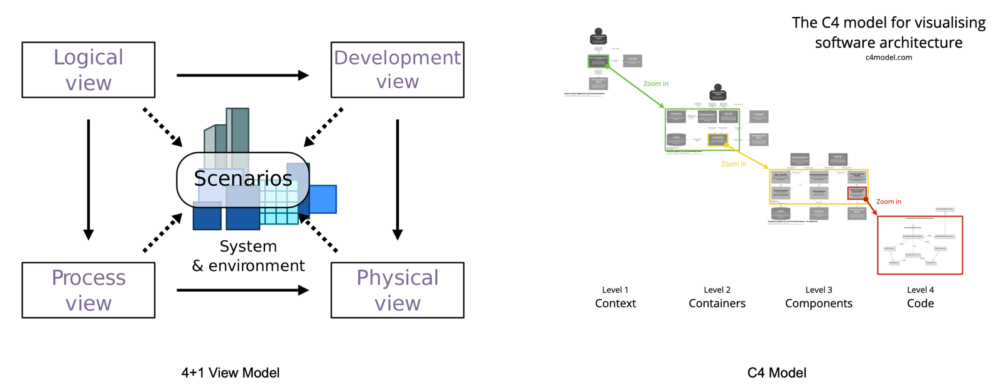

这里使用了 C4 模型的思想：**自顶向下，颗粒度一致。** 所以包含下面几张核心视图：

- 架构全景图（C4 Landscape）：包含用户、服务、基础设施、技术栈、上下游系统，可以无连线，使用 PPT 的方块即可，将所有的架构信息精炼的表达到一张图上。
- 集成架构图（C4 Context）：表达和**外部系统**的集成关系、集成方式，图中的基本元素为**系统**。
- 容器图（C4 Container）：表达**本系统**微服务之间的依赖、调用关系，有连线，对应领域建模中的上下文映射图，有时候我们也把它称作为进程间架构，图中的基本元素为**服务**。
- 组件图（C4 Component）：表达**某个容器内部**代码的分层结构和关系，图中基本元素为**包（Package）**，有时候我们也把它称作为进程内架构。
- 代码和类图（C4 Code）：表达**组件图内部**代码级别的元素和关系，往往最重要的是领域模型，这里我们可以把领域模型图就看做类图，对应 C4 模型中 Code 这一层。虽然 C4 模型中 Code 不仅仅表达为领域模型，但是领域模型为比较重要的图示，图中的基本元素为**类**。

C4 架构全景图参考如下：

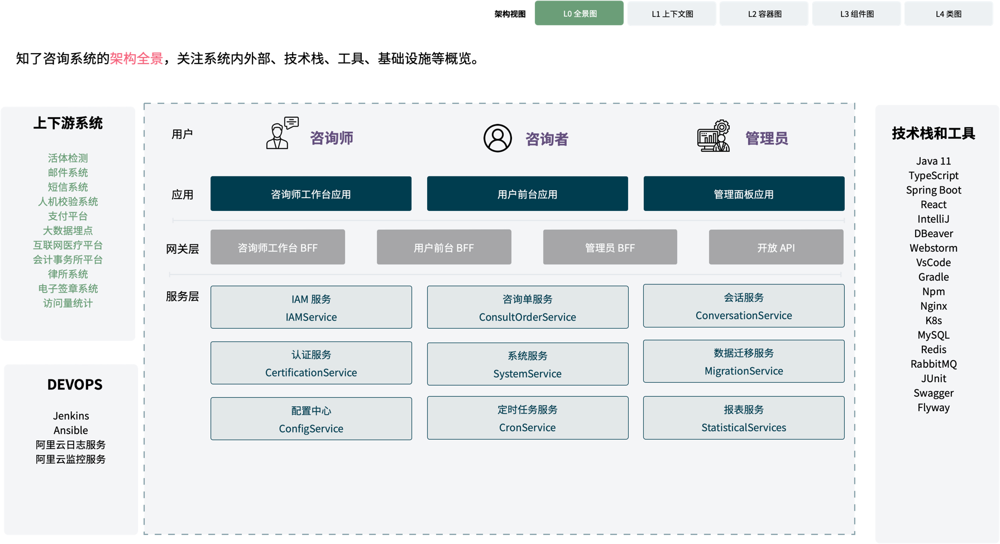

C4 上下文图参考如下：

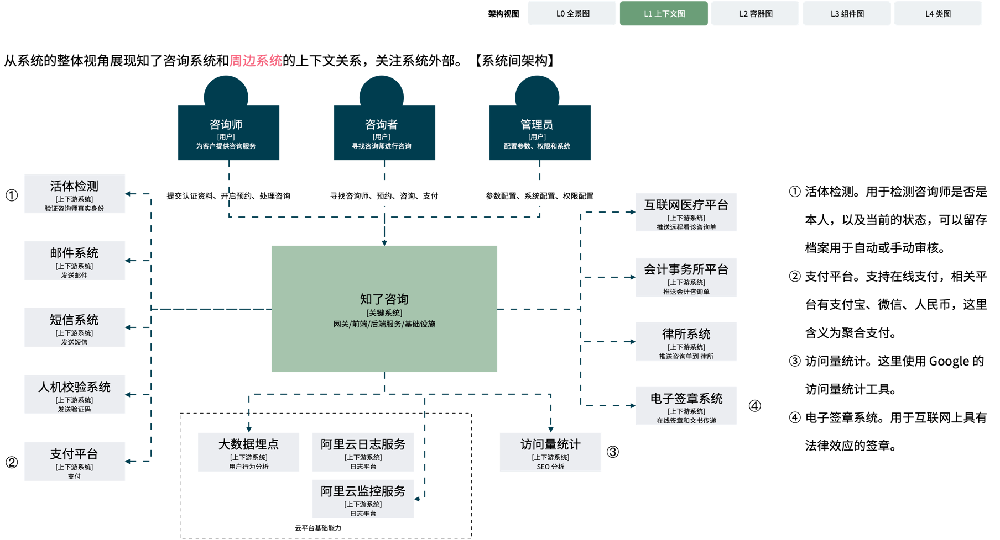

C4 容器图参考如下：

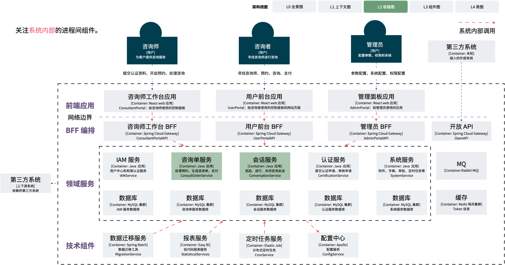

C4 组件图参考如下：

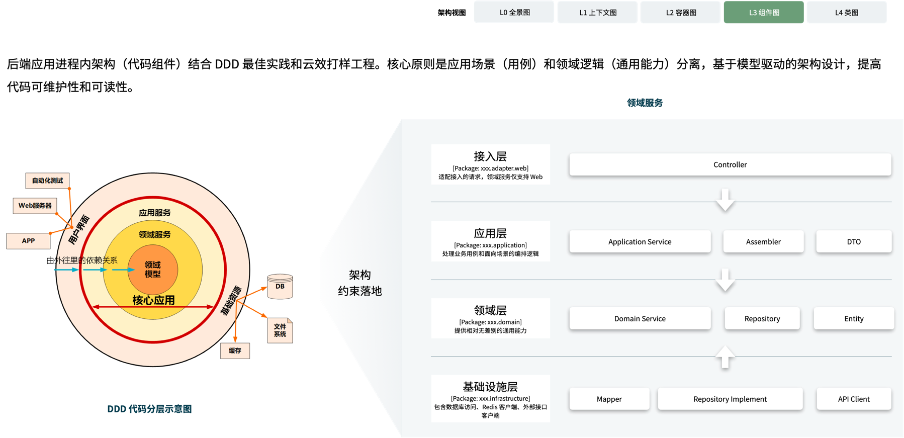

我尝试过各种各样的画图工具来绘制架构图，最终返璞归真的选择了 PPT。其原因有几个：

- 携带方便，导出 PDF 后方便传播和管理
- 尺寸固定，元素缩放程度一致
- 布局自由

如果你希望尝试更多的工具可以参考附录 2 中的工具清单。

## 部署架构

在云原生环境下，对于应用系统开发来说，部署架构这个话题聊胜于无。 复杂的部署环境已经被容器和云隔离了，对应用服务来说就是一些简单的部署单元而已。 不在需要考虑 AZ、DMZ 等纯粹的技术问题。

考虑到部署架构被简化，我把流水线相关内容加入到了部署架构的范畴，用来表达，对应用开发团队可见的部署工作。

部署架构参考如下：

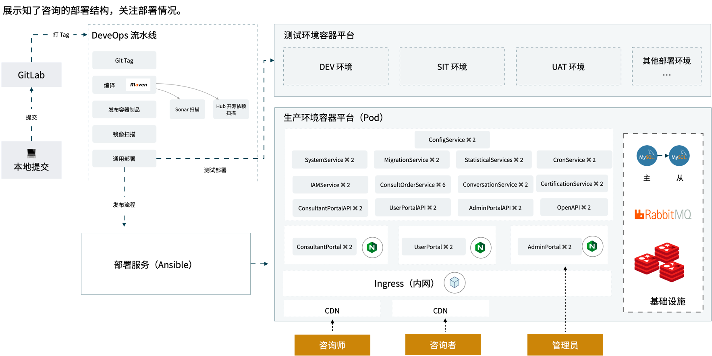

## 其他内容

主要的架构方案除了上述内容外，有时候还会引入一些补充的材料。

比如，可以引入架构决策记录（ADR），来表达关键的技术决策。在某种程度上来说，架构就是关键决策之和。架构并不难，难在如何做出大量合适的技术决策，并最终形成了合理的架构方案。

如果对安全要求比较高，可以提前做一些威胁建模，分析威胁的来源，考虑一些安全措施，例如网络隔离、鉴权、端口管控等。

在架构方案中也可以补充一些技术规范，不过大多数情况下可以留到交付阶段。

最后一点是测试策略，提前定义开发工作的输出质量，避免返工。

测试策略的参考如下：

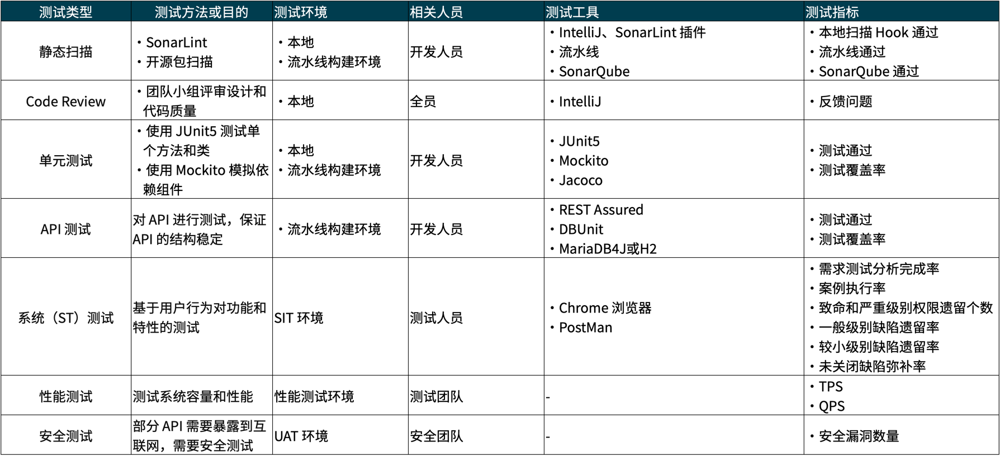

## 附录 1 非功能性需求清单

| NFR                                                  | 描述                                                         | 可能产生的工作                 |
| :--------------------------------------------------- | :----------------------------------------------------------- | :----------------------------- |
| 可访问性 Accessibility                               | 支持残疾人或其他设备                                         | 适配工作                       |
| 审核和控制 Auditability and control                  | 用户身份、权限控制、行为记录                                 | 鉴权设计                       |
| 可用性 Availability                                  | 年停机时间、MTTR                                             | 高可用和冗余设计               |
| 容量 Capacity                                        | 用户、数据容量                                               | 负载测试                       |
| 合规 Compliance                                      | 政策接入要求                                                 | 适配工作                       |
| 可配置 Configurability                               | 业务配置、系统管理配置                                       | 配置中心设计、数据字典设计     |
| 数据完整性 Integrity                                 | 事务机制保证数据原子性                                       | 强一致事务设计、最终一致性设计 |
| 部署 Deployment                                      | 适配部署环境要求                                             | 部署脚本                       |
| 开发环境 Development environment                     | 本地开发环境要求                                             | 技术选型约束                   |
| 灾难恢复 Disaster recovery                           | 熔断等技术需求                                               | 服务治理设计                   |
| 文档 Documentation                                   | 文档管理、更新、评审需求                                     | 文档管理                       |
| 弹性 Elasticity                                      | 弹性需求，自动资源释放                                       | 弹性设计、弹性脚本开发         |
| 可扩展性 Extensibility                               | 拓展点设计、插件化、钩子                                     | 设计时考虑                     |
| 容错 Fault tolerance                                 | 监控系统、异常告警、日志、自动重启                           | 基础设施适配和接入             |
| 国际化和本地化 Internationalization and localization | 多语言、多时区、多币种、本地化数据接口、国际化部署、数据本地化隔离 | 设计时考虑                     |
| 可操作性 Operability                                 | 运维面板、业务异常处理                                       | 额外的开发工作                 |
| 性能/响应时间 Performance                            | TPS、QPS、并发用户数量、API 最大响应时间、页面最大响应时间   | 性能优化                       |
| 平台的兼容性 Platform compatibility                  | 浏览器兼容性、JDK版本、操作系统和版本                        | 适配和测试                     |
| 隐私 Privacy                                         | 敏感信息加密                                                 | 适配工作                       |
| 移植性 Portability                                   | 潜在平台支持                                                 | 架构设计考虑                   |
| 安全 Security                                        | 防越权、XSS、CRSF、SQL 注入、DDOS 等攻击                     | 架构设计考虑                   |
| 可支持性 Supportability                              | 用户留言入口、停机公告                                       | 额外的开发工作                 |
| 可测试性 Testability                                 | 为自动化测试在页面上预留 ID 选择器等                         | 额外的开发工作                 |
| 代码可维护性/可读性 Readability                      | 代码和开发规范                                               | -                              |
| 可升级性 Upgradability                               | 客户端基座预留自动升级机制、API 版本化、Flyway 数据库脚本    | 架构设计考虑                   |
| 归档 Archive                                         | 定期处理历史数据、查询归档数据                               | 额外的开发工作                 |
| 个性化 Personalized                                  | 用户首页自定义、AI 内容推荐                                  | 额外的开发工作                 |

## 附录 2 绘图工具

- 直接使用演示软件 Keynote、PowerPoint 
- 通用在线绘图工具  https://www.draw.io
- 手绘风格的绘图工具 https://excalidraw.com/
- 在 IntelliJ 中绘图可以使用 draw.io 的插件
- 可以使用 PlantUML 用代码表达模型 https://plantuml.com
- 使用代码表达 C4 模型，支持进入下一级 https://github.com/structurizr/dsl
- 在线协作软件 Mura https://www.mural.co/
- 在线协作软件 Miro https://miro.com

## 参考资料

- Non-functional requirement https://en.wikipedia.org/wiki/Non-functional_requirement
- https://github.com/structurizr/dsl/tree/master/docs/cookbook
- 建模方法元模型http://shaogefenhao.com/posts/modeling/modeling-method-meta.html
- DDD 建模工作坊指南 http://domain-driven-design.org/zh/ddd-design-workshop-guide.html
- 4+1 architectural view model https://en.wikipedia.org/wiki/4%2B1_architectural_view_model
- c4model https://c4model.com/
- 微服务划分 http://shaogefenhao.com/column/ddd/09.ddd-micro-service-authorize-issue.html
- DDD 基础 http://shaogefenhao.com/column/ddd/01.ddd-foundamental.html
- 程序员的认知心得 https://renzhi.shaogefenhao.com/
- 怎么呈现架构方案在线研讨会笔记 http://shaogefenhao.com/libs/webinar-notes/java-solution-webinar-13.html
