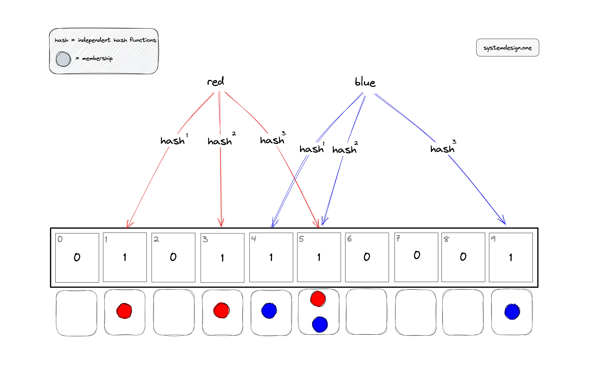
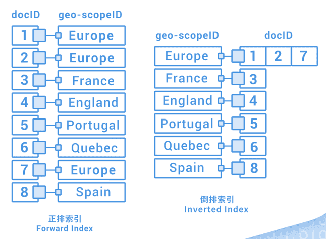
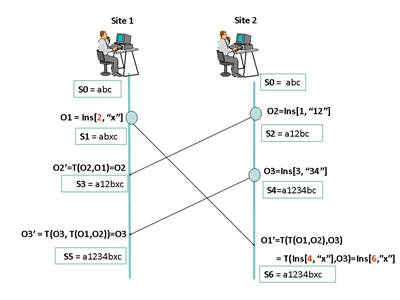
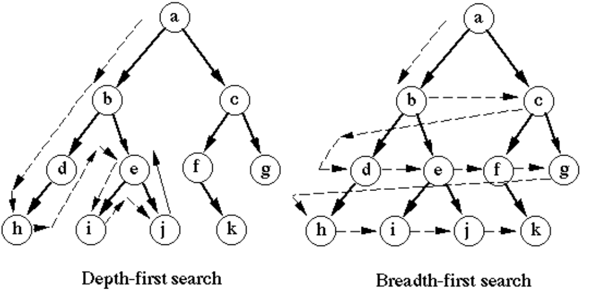

我们总说算法知识用不到，即使作为 CRUD Boy 也有很多算法需要了解，下面盘点了应用开发工作中常见的算法知识。

## 合理选择数据结构

见过一个项目所有的集合操作全部用 ArrayList 实现，完全不用其它的数据结构，合理选择数据结构可以极大的提升性能。

### ArrayList 和 LinkedList

ArrayList 和 LinkedList 是 Java 中常用的两种列表数据结构，ArrayList 是基于数组实现的，LinkedList 是基于链表实现的。

ArrayList 的查询性能是 O(1)，插入和删除性能是 O(n)，LinkedList 的查询性能是 O(n)，插入和删除性能是 O(1)。 

### 使用 HashMap 优化查询性能

这是一个性能优化的场景，有程序员在代码中使用 ArrayList 列表反复查询，导致性能低下，修改成 HashMap 性能极大的提升。

### 使用 HashSet 和 TreeMap 提高有序查询

例如在系统中存在一些基本数据反复查询，例如产品分类等，可以通过有序的集合来提高查询性能。


## 无限分类：组织树构建

在应用开发中，经常需要处理无限分类的数据，比如组织架构、菜单等树形结构。下面是一个使用 JavaScript 构建组织树的示例：

```javascript

// 定义树节点结构
class TreeNode {
    constructor(id, name) {
        this.id = id;
        this.name = name;
        this.children = [];
    }
}

// 构建组织树的类
class OrganizationTree {
    // 从扁平数据构建树
    buildTree(orgList) {
        // 找到根节点
        const root = orgList.find(org => !org.parentId);
        if (!root) {
            throw new Error('找不到根节点');
        }
        
        return this.buildNode(root.id, orgList);
    }
    
    // 递归构建节点
    buildNode(parentId, orgList) {
        // 找到当前要处理的组织
        const current = orgList.find(org => org.id === parentId);
        if (!current) {
            throw new Error('找不到对应组织');
        }
        
        // 创建当前节点
        const node = new TreeNode(current.id, current.name);
        
        // 递归构建子节点
        const children = orgList.filter(org => org.parentId === parentId);
        children.forEach(child => {
            const childNode = this.buildNode(child.id, orgList);
            node.children.push(childNode);
        });
        
        return node;
    }
}

// 使用示例
const orgList = [
    { id: '1', parentId: null, name: '总公司' },
    { id: '2', parentId: '1', name: '研发部' },
    { id: '3', parentId: '1', name: '销售部' },
    { id: '4', parentId: '2', name: '前端组' },
    { id: '5', parentId: '2', name: '后端组' }
];

const tree = new OrganizationTree();
const orgTree = tree.buildTree(orgList);
console.log(JSON.stringify(orgTree, null, 2));

```

## 延迟回调：斐波那锲数列

支付回调一般都会重试，重试的次数一般会根据斐波那锲数列来计算。

```javascript
// 生成斐波那契数列
function fibonacci(n) {
    if (n <= 1) return n;
    return fibonacci(n - 1) + fibonacci(n - 2);
}

// 基于斐波那契数列的重试函数
async function retryWithFibonacci(fn, maxAttempts = 5) {
    let attempt = 0;
    
    while (attempt < maxAttempts) {
        try {
            return await fn();
        } catch (error) {
            attempt++;
            if (attempt === maxAttempts) {
                throw error; // 达到最大重试次数时抛出错误
            }
            
            // 计算等待时间(毫秒)，基于斐波那契数列
            const waitTime = fibonacci(attempt) * 1000;
            console.log(`第${attempt}次重试失败，${waitTime/1000}秒后重试`);
            
            // 等待对应的时间
            await new Promise(resolve => setTimeout(resolve, waitTime));
        }
    }
}

// 使用示例
async function mockPaymentCallback() {
    // 模拟一个可能失败的支付回调
    const random = Math.random();
    if (random < 0.7) { // 70%的概率失败
        throw new Error('支付回调失败');
    }
    return '支付成功';
}

// 使用方式
retryWithFibonacci(mockPaymentCallback)
    .then(result => console.log('最终结果:', result))
    .catch(error => console.error('重试全部失败:', error.message));
```

## 通配符 URL 匹配算法：Ant Matcher

Url 匹配非常常用，比如前端路由、nginx 配置、权限管理等。

```javascript
// Ant 风格的路径匹配器
function antMatcher(pattern, path) {
    // 特殊情况处理
    if (pattern === path) return true;
    if (!pattern || !path) return false;

    // 将模式和路径分割成段
    const patternParts = pattern.split('/');
    const pathParts = path.split('/');
    
    let patternIdx = 0;
    let pathIdx = 0;

    while (patternIdx < patternParts.length && pathIdx < pathParts.length) {
        const patternPart = patternParts[patternIdx];
        const pathPart = pathParts[pathIdx];

        // 处理 ** 匹配
        if (patternPart === '**') {
            // 如果是模式的最后一部分，匹配所有剩余路径
            if (patternIdx === patternParts.length - 1) {
                return true;
            }
            
            // 尝试匹配剩余模式
            for (let i = pathIdx; i < pathParts.length; i++) {
                if (antMatcher(
                    patternParts.slice(patternIdx + 1).join('/'),
                    pathParts.slice(i).join('/')
                )) {
                    return true;
                }
            }
            return false;
        }
        
        // 处理 * 匹配
        else if (patternPart === '*') {
            patternIdx++;
            pathIdx++;
        }
        
        // 处理精确匹配
        else if (patternPart === pathPart) {
            patternIdx++;
            pathIdx++;
        }
        
        // 不匹配
        else {
            return false;
        }
    }

    // 检查是否都匹配完成
    return patternIdx === patternParts.length && pathIdx === pathParts.length;
}

// 使用示例
console.log(antMatcher('/api/**', '/api/users/123'));        // true
console.log(antMatcher('/api/*', '/api/users'));            // true
console.log(antMatcher('/api/*', '/api/users/123'));        // false
console.log(antMatcher('/api/*/edit', '/api/users/edit'));  // true
console.log(antMatcher('/api/**/*.js', '/api/src/test.js')); // true

```

## 队列：叫号机

队列在应用开发中也非常常用。

```javascript

// 叫号机队列实现
class NumberingMachine {
    constructor() {
        this.queue = [];
        this.currentNumber = 0;
    }

    // 取号
    takeNumber() {
        this.currentNumber++;
        this.queue.push(this.currentNumber);
        return this.currentNumber;
    }

    // 叫号
    callNumber() {
        if (this.queue.length === 0) {
            return null;
        }
        return this.queue.shift();
    }

    // 查看当前队列
    getQueue() {
        return [...this.queue];
    }

    // 查看等待人数
    getWaitingCount() {
        return this.queue.length;
    }
}

// 使用示例
const machine = new NumberingMachine();

// 客户取号
console.log(machine.takeNumber());  // 1
console.log(machine.takeNumber());  // 2
console.log(machine.takeNumber());  // 3

// 查看当前队列
console.log(machine.getQueue());    // [1, 2, 3]
console.log(machine.getWaitingCount()); // 3

// 叫号
console.log(machine.callNumber());  // 1
console.log(machine.callNumber());  // 2

// 再次查看队列
console.log(machine.getQueue());    // [3]
console.log(machine.getWaitingCount()); // 1

```


## 用位图快速存取有限集

在处理有限范围的整数集合时，位图(Bitmap)是一种非常高效的数据结构。它使用二进制位(bit)来标记某个数是否存在,每个bit对应一个数。这样可以大大节省存储空间,因为一个字节(8位)就可以标记8个数的存在与否。


位图适合处理有限集合的是否存在问题，比如权限管理，IP 地址黑名单。


```javascript
// IP地址黑名单类
class IpBlacklist {
    constructor() {
        // 使用位图存储所有IP地址段
        // 每个段需要256位(32字节)来存储
        this.segments = new Array(4).fill(null).map(() => new Uint8Array(32));
    }

    // 添加IP到黑名单
    addIp(ip) {
        const parts = ip.split('.').map(p => parseInt(p, 10));
        parts.forEach((num, index) => {
            const byteIndex = Math.floor(num / 8);
            const bitPosition = num % 8;
            this.segments[index][byteIndex] |= (1 << bitPosition);
        });
    }

    // 检查IP是否在黑名单中
    isBlocked(ip) {
        const parts = ip.split('.').map(p => parseInt(p, 10));
        return parts.every((num, index) => {
            const byteIndex = Math.floor(num / 8);
            const bitPosition = num % 8;
            return (this.segments[index][byteIndex] & (1 << bitPosition)) !== 0;
        });
    }

    // 从黑名单中移除IP
    removeIp(ip) {
        const parts = ip.split('.').map(p => parseInt(p, 10));
        parts.forEach((num, index) => {
            const byteIndex = Math.floor(num / 8);
            const bitPosition = num % 8;
            this.segments[index][byteIndex] &= ~(1 << bitPosition);
        });
    }
}

// 使用示例
const blacklist = new IpBlacklist();

// 添加IP到黑名单
blacklist.addIp('192.168.1.1');
blacklist.addIp('192.168.1.100');
blacklist.addIp('10.0.0.1');

// 检查IP是否被封禁
console.log(blacklist.isBlocked('192.168.1.1'));     // true
console.log(blacklist.isBlocked('192.168.1.2'));     // false
console.log(blacklist.isBlocked('192.168.1.100'));   // true
console.log(blacklist.isBlocked('10.0.0.1'));        // true
console.log(blacklist.isBlocked('10.0.0.2'));        // false

// 解封IP
blacklist.removeIp('192.168.1.1');
console.log(blacklist.isBlocked('192.168.1.1'));     // false

```


## 用位运算做配置

适合单个值存储多个状态，并快速做运算，比如在权限系统中，每一位都是一个角色。

只需要通过快速与或运算，就可以快速判断一个用户是否拥有某个角色。

缺点是不好维护，比如需要新增一个状态，需要修改配置，现在基本没人这么干了。

## 缓存 LRU 算法

LRU (Least Recently Used) 是一种缓存淘汰算法，它会淘汰最近最少使用的数据。在实际应用中，比如浏览器缓存、数据库缓存等场景都会用到 LRU 算法。

```javascript

class LRUCache {
    constructor(capacity) {
        this.capacity = capacity;
        this.cache = new Map();
    }

    // 获取缓存中的值
    get(key) {
        if (!this.cache.has(key)) {
            return -1;
        }
        
        // 将访问的元素移到最前面（最近使用）
        const value = this.cache.get(key);
        this.cache.delete(key);
        this.cache.set(key, value);
        return value;
    }

    // 放入缓存
    put(key, value) {
        // 如果已存在，先删除旧值
        if (this.cache.has(key)) {
            this.cache.delete(key);
        }
        
        // 如果缓存已满，删除最久未使用的元素（第一个元素）
        if (this.cache.size >= this.capacity) {
            const firstKey = this.cache.keys().next().value;
            this.cache.delete(firstKey);
        }
        
        // 将新元素放到最后（最近使用）
        this.cache.set(key, value);
    }
}

// 使用示例
const cache = new LRUCache(2); // 设置缓存容量为2

cache.put(1, 1);              // 缓存是 {1=1}
cache.put(2, 2);              // 缓存是 {1=1, 2=2}
console.log(cache.get(1));    // 返回 1
cache.put(3, 3);              // 删除 2，缓存是 {1=1, 3=3}
console.log(cache.get(2));    // 返回 -1 (未找到)
cache.put(4, 4);              // 删除 1，缓存是 {3=3, 4=4}
console.log(cache.get(1));    // 返回 -1 (未找到)
console.log(cache.get(3));    // 返回 3
console.log(cache.get(4));    // 返回 4


```

## Copy On Write 的应用

COW 在应用开发中也非常常用，比如在多线程编程中，使用 COW 可以避免锁竞争，提高并发性能，尤其适用于需要频繁读取、偶尔写入的场景。

逻辑是：

1. 写操作时，先复制一份副本，在副本上进行操作。
2. 读操作时，直接读取副本。
3. 写操作完成后，将副本替换为原来的数据。

处理过程不会阻塞，写入完成后，读取操作会立即返回新数据，在应用开发中避免对多个数据修改时产生超长的事务。

比如组织树，在并发场景下，多个线程同时读取和写入，使用 COW 可以避免锁竞争，提高并发性能。（当然这里冲突处理规则需要自己定义，比如乐观锁）

避免开启一个事务然后多次写入，中间有一些处理逻辑，最后提交事务。而应该一次读取足够的数据，然后处理完成后，一次性写入。

例如，在数据批量的过程中，如果数据量很大，创建一个临时表，在临时表中加工数据，然后一次性写入或者替换。

## 实用的 HASH 算法：数据签名、负载均衡、缓存、分库分表

- 数据签名：HMAC 算法，先对数据进行哈希，然后对哈希值进行签名。
- 负载均衡：一致性哈希算法，用于将请求均匀分布到多个服务器，比如 Nginx 的负载均衡。
- 缓存：用于缓存数据，比如 Redis 的缓存。
- 分库分表：用于将数据分散到多个数据库，比如 MySQL 的分库分表。

Hash 的本质是映射，将大的数据集合映射到有限的数据集合。

## 表达式求值和逆波兰表达式

在应用开发中，经常需要处理表达式求值的场景，比如计算器、公式计算等。下面是一个简单的四则运算求值实现：

```javascript
// 运算符优先级
const precedence = {
    '+': 1,
    '-': 1,
    '*': 2,
    '/': 2
};

// 中缀表达式转后缀表达式(逆波兰表达式)
function infixToPostfix(expression) {
    const stack = [];
    const output = [];
    const tokens = expression.match(/\d+|\+|\-|\*|\/|\(|\)/g);

    for (const token of tokens) {
        // 如果是数字，直接输出
        if (!isNaN(token)) {
            output.push(Number(token));
            continue;
        }
        
        // 处理运算符
        if (token in precedence) {
            while (
                stack.length > 0 && 
                stack[stack.length - 1] in precedence &&
                precedence[stack[stack.length - 1]] >= precedence[token]
            ) {
                output.push(stack.pop());
            }
            stack.push(token);
        }
        
        // 处理左括号
        else if (token === '(') {
            stack.push(token);
        }
        
        // 处理右括号
        else if (token === ')') {
            while (stack.length > 0 && stack[stack.length - 1] !== '(') {
                output.push(stack.pop());
            }
            stack.pop(); // 弹出左括号
        }
    }

    // 将栈中剩余运算符加入输出
    while (stack.length > 0) {
        output.push(stack.pop());
    }

    return output;
}

// 计算后缀表达式
function evaluatePostfix(postfix) {
    const stack = [];

    for (const token of postfix) {
        // 如果是数字，压入栈
        if (typeof token === 'number') {
            stack.push(token);
            continue;
        }
        
        // 如果是运算符，弹出两个操作数进行计算
        const b = stack.pop();
        const a = stack.pop();
        
        switch (token) {
            case '+':
                stack.push(a + b);
                break;
            case '-':
                stack.push(a - b);
                break;
            case '*':
                stack.push(a * b);
                break;
            case '/':
                if (b === 0) throw new Error('除数不能为0');
                stack.push(a / b);
                break;
        }
    }

    return stack[0];
}

// 表达式求值的主函数
function evaluate(expression) {
    const postfix = infixToPostfix(expression);
    return evaluatePostfix(postfix);
}

// 使用示例
console.log(evaluate('2+3*4'));     // 14
console.log(evaluate('(2+3)*4'));   // 20
console.log(evaluate('10-5*2+3'));  // 3

```

## 规模化计算：归并算法

面试必问，如何处理超过内存的数据量，比如大数据处理。

Spark Streaming 本质就是基于归并算法，将数据流分解后合并处理，只不过构建了分布式能力。

归并算法是分布式数据库的基石，比如 ClickHouse Merge Tree 引擎，就是基于归并算法。

如果在业务开发中，最常见的场景就是批量处理，比如批量导入数据、批量更新数据。

## 节流：布隆过滤器

布隆过滤器是一种概率型数据结构，用于判断一个元素是否在集合中。布隆过滤器通过牺牲一定的准确性（假阳性）换取极高的空间效率和查询速度，在大规模数据处理和高性能系统中非常实用。

布隆过滤器适合处理大规模数据集的查询问题，比如黑名单、白名单、缓存穿透等。

```javascript

// 布隆过滤器实现
class BloomFilter {
    constructor(size = 1000, hashFunctions = 3) {
        this.size = size;
        this.hashFunctions = hashFunctions;
        this.bitArray = new Array(size).fill(0);
    }

    // 添加元素
    add(element) {
        const hashValues = this.getHashValues(element);
        hashValues.forEach(index => {
            this.bitArray[index] = 1;
        });
    }

    // 检查元素是否可能存在
    contains(element) {
        const hashValues = this.getHashValues(element);
        return hashValues.every(index => this.bitArray[index] === 1);
    }

    // 计算多个哈希值
    getHashValues(element) {
        const hashValues = [];
        const str = String(element);
        
        for (let i = 0; i < this.hashFunctions; i++) {
            // 使用不同的质数作为种子生成不同的哈希值
            let hash = this.hash(str + i.toString());
            hashValues.push(hash % this.size);
        }
        
        return hashValues;
    }

    // 简单的哈希函数
    hash(str) {
        let hash = 0;
        for (let i = 0; i < str.length; i++) {
            hash = ((hash << 5) - hash) + str.charCodeAt(i);
            hash = hash & hash; // Convert to 32-bit integer
        }
        return Math.abs(hash);
    }
}

// 使用示例
const filter = new BloomFilter(1000, 3);

// 添加一些元素
filter.add("apple");
filter.add("banana");
filter.add("orange");

// 检查元素是否存在
console.log(filter.contains("apple"));     // true
console.log(filter.contains("banana"));    // true
console.log(filter.contains("grape"));     // false (可能有误报)

// 添加更多元素来测试误报率
for (let i = 0; i < 100; i++) {
    filter.add(`element${i}`);
}

// 测试不存在的元素
let falsePositives = 0;
for (let i = 1000; i < 2000; i++) {
    if (filter.contains(`test${i}`)) {
        falsePositives++;
    }
}
console.log(`误报率: ${falsePositives / 1000}`);

```



总结：多个数据共享存储位来判断是否存在，通过多个哈希函数来降低误报率，随着数据量增加，误报率会逐渐增加。

日常应用中可以用来优化缓存穿透，比如黑名单、白名单、缓存穿透等。

## 搜索：全文索引和倒排索引



## 在线协作 OT 算法



## 关系数据库原理：B Tree 家族、LSM-Tree、Merge Tree

B-Tree 是一种平衡查找树，包括 B-Tree、B+Tree 和 B*Tree 等，主要是关系型数据库使用，适合读多写少。

核心思想：

- B-Tree： 所有叶子节点的深度相同，保证平衡性;节点中按顺序存储键，方便范围查询。
- B+Tree： 所有叶子节点通过指针连接，方便范围查询;非叶子节点只存储键，不存储数据，减少空间占用。
- B*Tree： 在 B+Tree 基础上，增加了非叶子节点的空间利用率，通过增加子节点数量来减少树的高度，优化了写性能。

MySQL 的 InnoDB 引擎使用的是 B+Tree 索引。

LSM-Tree 是一种写优化的索引数据结构，专为处理高写入吞吐量的场景而设计，比如 HBase、Cassandra 等，适合写多读少。

核心思想:

- 顺序写入：将所有写操作先写入内存中的数据结构（如 MemTable），以实现高效的顺序写。
- 批量合并：当内存数据达到阈值后，将数据批量刷写到磁盘上的有序文件（SSTable），避免随机写。
- 延迟删除和更新：删除和更新通过标记（如 Tombstone）实现，真正的操作在后续合并时完成。

Merge Tree 是一种基于磁盘的存储引擎，用于处理大规模数据集的存储和查询。

核心思想：

- 数据按主键（Primary Key）排序存储，每次插入数据会生成一个小的有序文件段（Part）。
- 数据被分成多个有序段（Parts），每个段是独立的文件集合，包括主键索引、数据列文件、稀疏索引。
- 定期对多个小段进行合并，生成更大的有序段，同时清理无效数据，合并过程中可能对数据进行去重、聚合或其他操作。

关键在于定期数据合并处理，天然数据可以按指定规则分区（如按时间分区），可以按指定规则合并。

## DAG 算法有向无环图

DAG (Directed Acyclic Graph) 是一种特殊的图结构，由若干顶点（节点）和有向边组成，并且其中不存在任何有向循环。换句话说，从任意一个节点出发沿着有向边，无法回到这个节点。

这个特点非常适合用来表示任务依赖关系，比如任务调度、工作流、数据流处理等。

比如，一个任务依赖于多个前置任务，这些前置任务完成后再执行当前任务，都可以存储位 DAG 结构。

所以 DAG 是一个非常实用的图结构，例如使用流程引擎可以配置 DAG 作为任务依赖关系，使用 DAG 描述微服务调用跟踪，CI/CD 的构建过程也是一个 DAG 结构，在大数据开发中数据流水线（Data pipline）也是一个 DAG 结构。

拓扑排序是 DAG 的一种常见应用，用于确定任务的执行顺序。

比如 A 依赖于 B，B 依赖于 C，那么 A 的执行顺序就是 C -> B -> A，当这种依赖关系非常复杂时，可以通过依赖关系生成拓扑排序。

```javascript
// DAG 图的节点类
class Node {
    constructor(id) {
        this.id = id;
        this.inDegree = 0; // 入度
        this.outNodes = []; // 出边指向的节点
    }
}

// 基于 Kahn 算法的 DAG 拓扑排序
class DAG {
    constructor() {
        this.nodes = new Map(); // 存储所有节点
    }

    // 添加节点
    addNode(id) {
        if (!this.nodes.has(id)) {
            this.nodes.set(id, new Node(id));
        }
        return this.nodes.get(id);
    }

    // 添加边 (from 依赖 to)
    addEdge(fromId, toId) {
        const fromNode = this.addNode(fromId);
        const toNode = this.addNode(toId);
        
        fromNode.outNodes.push(toNode);
        toNode.inDegree++;
    }

    // 使用 Kahn 算法进行拓扑排序
    topologicalSort() {
        const result = [];
        const queue = [];
        
        // 找到所有入度为0的节点
        for (const [id, node] of this.nodes) {
            if (node.inDegree === 0) {
                queue.push(node);
            }
        }
        
        // 当队列不为空时
        while (queue.length > 0) {
            const node = queue.shift();
            result.push(node.id);
            
            // 将所有相邻节点的入度减1
            for (const neighbor of node.outNodes) {
                neighbor.inDegree--;
                // 如果入度变为0，加入队列
                if (neighbor.inDegree === 0) {
                    queue.push(neighbor);
                }
            }
        }
        
        // 检查是否存在环
        if (result.length !== this.nodes.size) {
            throw new Error('图中存在环，无法进行拓扑排序');
        }
        
        return result;
    }
}

// 使用示例
const dag = new DAG();

// 添加依赖关系
dag.addEdge('编译代码', '运行测试');
dag.addEdge('运行测试', '部署到测试环境');
dag.addEdge('部署到测试环境', '验收测试');
dag.addEdge('验收测试', '部署到生产环境');
dag.addEdge('编译代码', '代码检查');
dag.addEdge('代码检查', '运行测试');

// 获取拓扑排序结果
try {
    const order = dag.topologicalSort();
    console.log('任务执行顺序:', order);
    // 输出: ['编译代码', '代码检查', '运行测试', '部署到测试环境', '验收测试', '部署到生产环境']
} catch (error) {
    console.error(error.message);
}

```

## 图和树遍历：深度和广度优先

DFS：深度优先搜索，从起点开始，沿着一条路径一直走到底，然后回溯，再沿着另一条路径一直走到底，直到所有路径都走完。

BFS：广度优先搜索，从起点开始，沿着一条路径一直走到底，然后回溯，再沿着另一条路径一直走到底，直到所有路径都走完。 




在处理图的时候，需要加上访问标记，防止重复访问，这样就把图转换成了树。

应用：

- 处理 DAG 的拓扑排序问题需要遍历
- 抽象语法树（AST）大量使用，写生成器可以用上
- JSQLParser 解析 SQL 语句，生成抽象语法树（AST），分析 SQL 语句，控制 SQL 白名单

## 分布式系统核心算法：Raft 和 Paxos

参考 Conanical 的分享。

## 理解压缩的原理：哈夫曼树和编码

