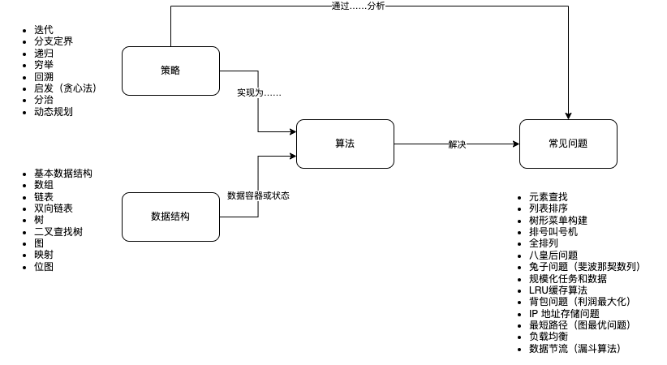
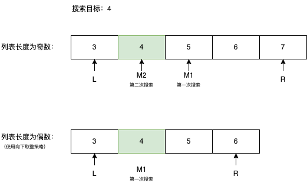

在几次求职找工的时候看过很多次算法方面的内容，但是都没有整理成系统性的材料。为了更加深度的理解计算机科学中的算法部分，我把常用或者面试常见的算法整理出来，贯穿这些算法解决的问题、策略、以及用途。

这样一来，可以用较低的认知负担理解核心的算法逻辑。（其实是看了很多类似的书，总要自己整理一遍才是自己的。）

## 算法地图

下图就是算法和策略之间的关系，只有我们通过问题，把这些策略想清楚了，再选择合适的数据结构，就能举一反三掌握更多的算法，解决更多的问题，这就建立了编程思想。



## 从问题出发

阅读了很多关于算法的书籍，主要是聚焦在代码上，但是理解起来比较困难，我这里把代码放到最后一步，先梳理问题和解决问题的策略，再看如何编写代码，这里的代码使用 Java 表达（最常用）。

先从问题出发然后分析解决问题的策略，寻找合适的数据结构，这样更能真正的掌握算法。

## 基于策略的算法梳理

### 迭代和分支定界 - 元素查找

我们先从最简单问题开始（其实也会在面试中被问到）。 比如在一个列表中（或者数组），从元素中找到需要的元素。 

根据经验，我们会想到两种查找方式：

1. 顺序查找。逐个遍历整个过程，直到找到符合要求的元素（这几乎不能叫算法，没有人不知道这种过程）。
2. 折半查找（Binary search algorithm）。对于有序的列表来说，很容易通过元素的总数获取中间值，然后前后定位。

顺序查找就是一种迭代的策略，一次找不到就找下一个，直到找出来为止。而折半查找就是一种分支定界的策略，通过分析现有数据特征进行减少迭代的次数。

下面是顺序查找的 Java 示例：

```java
    private static int sequentialSearch(int[] sourceList, int targetValue) {
        for (int i = 0; i < sourceList.length; i++) {
            if (sourceList[i] == targetValue) {
                return i;
            }
        }
        throw new RuntimeException("Can't find elements");
    }
```

顺序查找很简单，马上就能写出来，但是折半查找这么简单的算法，我居然立马写不出来。于是赶紧在图（纸上）推演了一下，把策略分析好，然后再写出来。



二分查找的策略其实非常简单，对于有序的列表来说。我们只需要找到中间的数字，然后判断大于、小于、还是等于，然后不断缩小边界，最终找到目标元素。

在写代码前先整理思路和进行任务分解：

1. 为了定位到中间元素，首先需要获取列表的长度。对于数组来说，可以用 length 属性，定义并赋值给 length 变量。
2. 如果第一次迭代没有命中，需要做第二次定界，那么就需要变量存储上界 right 和下界 left 变量、middle 变量。
3. 每次迭代，需要把 middle 变量赋值给 right 或者 left 变量。如果目标值定位到了左边就需要重新设置上界，如果目标值定位到了由边就需要重新设置下界，如果目标值准确定位到了就返回。
4. 需要思考停止循环的条件：left > right 则未找到目标需要抛出异常，这个条件可以同时处理升序和降序的列表，通用性更好。

所以算法实现如下：

```java
    private static int binarySearch(int[] sourceList, int targetValue) {
        int left = 0;
        int right = sourceList.length - 1;
        while (left <= right) {
            int middle = (int) Math.floor((left + right) / 2);
            if (sourceList[middle] < targetValue) {
                // 如果目标值定位到了左边就需要重新设置上界
                left = middle;
            } else if (sourceList[middle] > targetValue) {
                // 如果目标值定位到了由边就需要重新设置下界
                right = middle;
            } else {
                // 如果目标值准确定位到了就返回
                return middle;
            }
        }
        // 如果没有匹配，抛出异常
        throw new RuntimeException("Can't find elements");
    }
```

在实际使用中，这里的异常也可以按照惯例修改成返回 -1，来表示未找到需要搜索的元素。

当然，二分查找还有一些拓展问题。比如，如果列表中出现重复的元素，如何找到最左或右侧的元素呢？如何计算排名，即比目标元素小或者大的数有多少?

实际上，基于二分查找可以得到一些变种算法。比如我们能根据列表的数据分布情况，选择合适的位置开始搜索会比取中值更快，这是另外一种定界策略，又叫做插值搜索。

排序和查找是数据库非常基本的操作。

### 递归 

常用来处理具有自相似性的问题，即问题可以分解为规模较小的同类问题，通俗来说就是自己调用自己。

自相似性是递归的本质，比如斐波那契数列，就是典型的自相似性问题。

树型结构是一个典型使用递归的场景，在应用开发中，构建组织树就可以使用递归。

下面是一个使用递归构建组织树的示例代码：

```java
public class TreeNode {
    private String id;
    private String name; 
    private List<TreeNode> children;

    public TreeNode(String id, String name) {
        this.id = id;
        this.name = name;
        this.children = new ArrayList<>();
    }
}

public class OrganizationTree {
    // 从扁平的组织数据构建树
    public TreeNode buildTree(List<Organization> orgList) {
        // 找到根节点
        Organization root = orgList.stream()
            .filter(org -> org.getParentId() == null)
            .findFirst()
            .orElseThrow(() -> new RuntimeException("找不到根节点"));
            
        return buildNode(root.getId(), orgList);
    }
    
    // 递归构建节点
    private TreeNode buildNode(String parentId, List<Organization> orgList) {
        // 找到当前要处理的组织
        Organization current = orgList.stream()
            .filter(org -> org.getId().equals(parentId))
            .findFirst()
            .orElseThrow(() -> new RuntimeException("找不到对应组织"));
            
        // 创建当前节点    
        TreeNode node = new TreeNode(current.getId(), current.getName());
        
        // 递归构建子节点
        orgList.stream()
            .filter(org -> parentId.equals(org.getParentId()))
            .forEach(org -> {
                TreeNode child = buildNode(org.getId(), orgList);
                node.getChildren().add(child);
            });
            
        return node;
    }
}

// 组织实体类
class Organization {
    private String id;
    private String parentId;
    private String name;
    
    // getter/setter 略
}

```

## 动态规划

把递归进行记忆化避免重复计算，这就是动态规划。


## 回溯


## 参考资料

- 《一只青蛙跳出来的分治法、回溯法与动态规划》 https://zhuanlan.zhihu.com/p/95525781