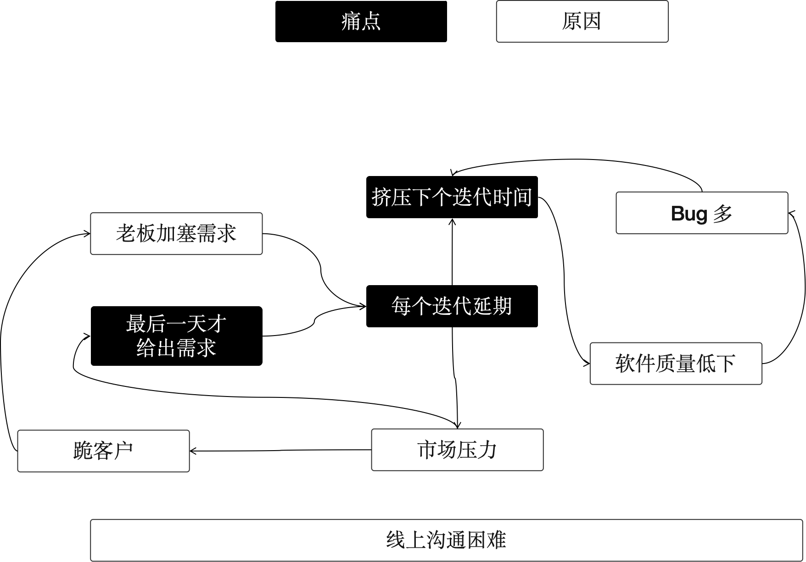
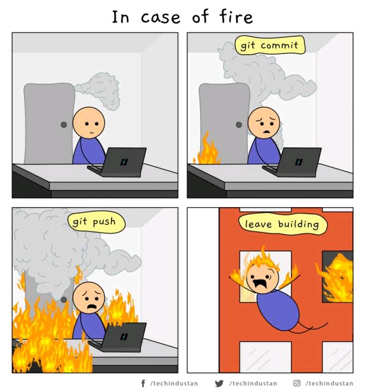

在开始文章之前，借这篇文章的机会重新申明这个专栏的定位和追求。我从事技术管理工作的过程并不是那么顺利，好在经历且正在经历“生活的毒打”，想把经历过的、听到的、领悟到的有用的内容整理下，分享、反馈、深化。

所以我希望这个系列的文章是：

1. 直面问题的，致力于解决管理工作尤其是基层管理工作的困难问题。例如，冲突管理就是一个非常令人头疼的问题。
2. 真实且具有操作性，没有套话和空话，直接能让管理者在工作中使用和应验的东西。例如建立核心团队，就是一个常见的管理策略。
3. 深入问题本质，即使问题背后的结论触及人性冰冷的一面，这也需要管理者去直面。

这也是为什么我没有像“穿西装的人”那样使用一个真名，因为我希望在网络上发表更真实、更有价值的内容，甚至有时候可能会揭有些管理者的老底，使用网名则非常方便和 cool。使用网名的另外一个意图是人们无法把这个奇怪网名的人和真实一面联系起来，因此更能给文章做出更加真实的评价，不因为工作身份而带来的刻板印象。

上面啰嗦这么多。

那么今天讨论的问题是：**为什么需要有纪律的团队，且如何构建有纪律的团队？**

## 无组织和无纪律

在这里，我虚拟了一个疫情期间的远程团队，并自封为 TechLead，我把这个虚构团队叫做 Punctuation（标点符号团队），从事知了咨询平台（我在系统规划的文章中的案例名称）的开发。

因为某些原因，前面的 TechLead 跑路了，虽然原因很多，但是估摸着跟这个团队的工作方式有很大关系，接手这个团队听起来有点烫手。

我开始参与每天的站会，并尝试作为一名开发人员去体验整个开发过程。

得到了一些有意思的发现：

1. 团队使用敏捷开发，开发人员抱怨产品经理会把他觉得紧急的任务**塞到迭代**中。
2. 产品经理抱怨团队总是开发人员总是导致**每个迭代延期**，所以不知道是估算不够准确还是他们在家划水，所以并不信任他们的估算。这样如果想要完成 10 个功能，那么最好安排 12 个功能，这样他们实际完成 10 个功能也算不错了。
3. 同时开发人员也在抱怨，产品经理往往在迭代的**最后一天才给出需求**，他们来不及整体设计，所以导致方案经常变化，这是延期的主要原因。
4. 测试人员也抱怨 Bug 太多，而且**大家经常找不到**。
5. 老板也在抱怨，落后市场太多，给客户承诺的交付时间经常延期，需要去**跪客户**。
6. ……

当然，经常上班的朋友都知道，抱怨属于正常现象，不抱怨反而不正常。前面的抱怨还没写完，比如前端抱怨后端没有及时给出 API 无法联调，后端开发抱怨 UX 给出的字段信息和产品给出的不一样，等等。

但是抱怨开始产生内部矛盾，并让大家有离开的心理时就不正常了。我识别了一些这些抱怨中的关键字，尝试分析抱怨背后的问题和归因：

- 产品人员无法准时交付合格的需求分析产物，即使延期也好像没有引起管理者重视。
- 开发人员无法提前开始方案设计，导致迭代启动后无法并行工作，并及时集成。
- 因为延期和市场上线要求，导致质量可能被放水。

这些问题会造成恶性循环，愈演愈烈。 团队就像一套发动机引擎，齿轮之间的公差太大，导致齿轮无法精确咬合。

我们发现团队现在缺乏协同机制，也就是没有组织，没有组织其实就是没有纪律导致的，这就是我们老师经常说的 “无组织无纪律”。

只有通过重整朝纲（划掉，重整纪律），才能打破循环，把崩溃边缘的团队拉回来。

## 纪律的本质

我这里想说真正的纪律是什么?不是什么？

**纪律是承诺（Commitment）。** 在每个岗位上的人需要对工作进行承诺，什么时候能交付，在何时预警，何时呼叫队友的支援。这里并不是说生病了要做手术也得完成任务，而是说在无法达成承诺时，需要及时预警，获取团队的支援。

是在项目管理中，需要有承诺的假设，并预留一些弹性，团队工作才会健康。

**纪律是秩序的基础** 没有纪律无法完成秩序的建立，虽然秩序的是一个大的话题，但纪律仍然是其重要的基础。

秩序描述的是，谁应该在什么时候做什么事，做到什么合格。如果团队每个人都能明白自己要做什么，在什么时候做到合格，秩序就建立了。

**纪律是克制** 克制的意思是，当我们建立了一个秩序就必须遵守。例如，在敏捷项目中，迭代开启的前需要需求和方案需要通过评审，才能进入开发。

需求提出者就需要克制，不在锁定的需求上做变更，如果需要变更也需要放到下个迭代中。而很多管理者没有意识到这点，他拥有权力，然后肆意修改需求，并导致秩序崩塌。

**纪律不是考勤打卡。** 因为即使我们在家工作，无需考勤，只要能满足 Commitment 也能被团队接受。往往很多管理者意识到纪律的重要性，就开始“整风运动”，开始折腾团队，例如对考勤进行十分苛刻的惩罚。

考勤是一种手段，而非目的，如果考勤会打击团队的积极性，那么即使所有人准时到岗也没有意义。

如何把握这个度？

以秩序是否被破坏为度。例如，很多公司鼓励弹性工作时间，但会把会议迟到作为严重的纪律破坏行为，因为远程工作很难约到合适的时间，会议机会丢失了，再约人又是非常麻烦的事情。

**纪律不是个人英雄主义。** 有一些公司存在一些“自由的大神”，这些人往往按照自己喜好努力做一些额外的工作。

比如，悄悄的在晚上用工作之外的时间重构掉一个微服务，但没有和 TechLead 以及团队报告。

大多数情况下，不会造成太大的影响，但有时候没有理解系统的设计意图，随意修改会导致致命的问题。

PS：以前某个团队以这种行为为荣，但后面造成失控的影响。

**纪律不是政治正确。** 团队纪律无关道德，不应对团队成员工作之外的生活做出评价，纹身、复杂的感情史，这都与工作纪律无关。

例如，把下班之前修复未通过的流水线，这是一条敏捷工作纪律。但强制大家 TDD 就可能是政治正确的纪律了。

**纪律不是法律** 不应该对违反纪律的团队成员进行攻击。纪律是服务团队秩序的，让团队能够丝滑的运行，如果某些场景下有一些特殊原因造成违反纪律也无可厚非。

比如，必须通过流水线才能部署制品，但是某天流水线崩溃了，但又必须上线，那么通过其它途径解决问题，也并不算破坏纪律，只不过在某些公司需要特殊审批。

因为地震没有 PUSH 也算违反纪律的话，我也不知道说什么好了。

## 把团队训练成特种兵

我承认在我的职业生涯中，组建特种兵式的团队的机会并不多，大部分场景下都是草台班子。

老实说，大多数情况下开发团队都是非常给力的，前提是 TechLead 不瞎折腾。

### 把成功和纪律挂钩

其中一个重要的经验是，把成功的结果和纪律挂钩。比如，前面的 Punctuation 团队每次上线都很难一次成功，往往都需要搞一两个通宵新版本才稳定下来。

这是一个还没有养成纪律习惯团队通常的样子，因为一开始没有上线清单！！！

人们太聪明了，每次上线的任务都在执行的人脑子中。

“没事，这点问题很简单” 然后就是是个小的配置错误折腾一宿。

后来我们开始要求以一次上线为例，把上线做到位，整理了上线清单，事无巨细的记录下来，在 UAT 环境上演练了好几次。我当时如临大敌，希望把上线这件事做成功一次，给团队建立纪律的重要意义。

幸好不出所望，这次上线虽然也有一些问题，但比之前好多了。上线后，我们赶紧复盘了一次，这次出的问题在哪里，希望下一次一步到位。

无论如何，团队开始相信纪律的重要意义，以至于在后续的迭代中，大家主动就把上线清单提前整理出来了。

### 领导的带头作用

另外一个重要因素还是 TechLead 的习惯。

很多团队的团队文化，某种程度上来说，就是TechLead（在有些团队是 PM）人格在团队上的投影。

如果 TechLead/PM 每天准时到达公司，从不迟到，基本上这个团队慢慢的都准时上班了。

团队纪律最大的问题就是领导者自己的问题，因为领导者拥有权力，如果无法自律，就无法律他。

### 训练团队的习惯

前面说的两个是潜移默化的方式，也有较为明显的方式，也是普遍采用的方式：奖惩机制。

这个问题上，就不得不参考古人的智慧了，孙武将宫女训练成战士是一个非常好的学习案例。

> 孙武将宫女训练成战士的故事发生在春秋时期，当时吴王阖闾听闻孙武的军事才能，邀请他展示其军事才能。孙武提出以宫女为士兵进行演练，吴王同意并派出一百八十名宫女给孙武。起初，这些宫女不愿配合，嘻笑不止。孙武将其分为两队，任命吴王最宠爱的妃子为队长，并严格按照军法训练。当宫女们再次嘻笑时，孙武严厉处罚了两位队长，以示军纪。随后，宫女们开始认真对待训练，迅速掌握了军事技能。这一举动不仅证明了孙武的军事才能，也展示了纪律和规则在军队中的重要性，深得吴王信任，孙武随后被任命为大将，辅佐吴王四处征战。

总体来说，奖比惩好，惩比不惩好。

就像我以前的文章说过，所有的制度和管理机制都应该满足一个原则：

> 放大人性的闪光点，约束人性的弱点。

前面两种方式，无论是用成就感激励还是领导者的表率，都是在放大人性的闪光点，但如果不约束人性的弱点，就会导致劣币驱逐良币。如果不遵守纪律的人可以更早休息、工作的更少，那么长期下来遵守纪律的人就会内心不平衡。

即使短期内可以通过职业素养做到这些，但长期很容易滑坡。我们不鼓励使用惩罚措施对待不遵守纪律和团队约定的人，但这根尺子一定需要存在。

## 参考资料

- https://www.jianshu.com/p/bf5ac72fe1b0
