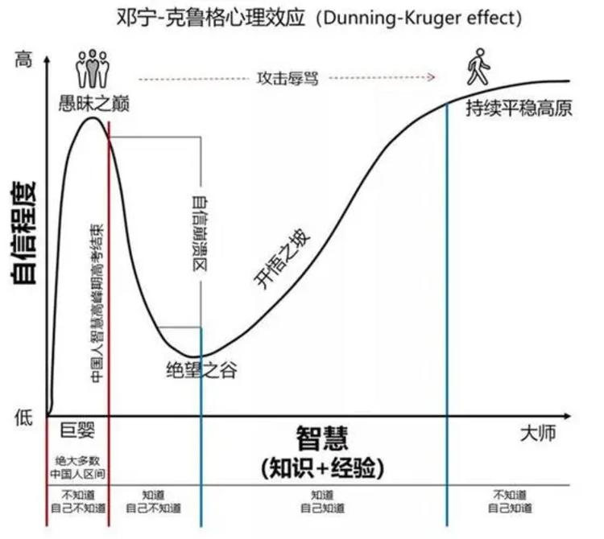

# 作业总结 | 达克效应的局限性练习

## 作业回顾

提升认知很好的方法是“局限性练习”，我会定期发送一些“有道理”的思维模型，来一起寻找这个模型的局限性，作为认知提升的作业和练习。 比如达克效对很多人有启发，如果这张图对你有启发，请不要止步于此。 在作业中请说明达克效应的局限性是什么？



## 已经提交的作业

共有两人提交作业：

```
有两点局限， 第一点，人的认知是局限，在这个领域能够成为大师，在其他领域可能是小白； 第二点，知识是动态发展的，当知识的发展速度比人的认知增长快时，大师的自信也会退化； -- 我家的猫
```

```
这张图和《跨越鸿沟》非常类似，只是描述的对象不一样，作为个体我认为“达克效应”过于静置，没有动态得看问题，一个人的认知随着环境的变化本身就在不断迭代，甚至到了中间阶段还可能出行“冒牌货心态”，因为知道自己不知道的部分越来越多了，如果能够突破认识到这一点，自信心不一定会跌落谷底。 --吕立青: 🐣
```

## 总结

这个作业的目的是唤醒我们内心中关于质疑的能力。由于从古代到今天，基础教育因为社会稳定和秩序方面的目的，在潜移默化地培养一个人“听话”的能力（这是为什么有一些人读书不好，却在社会中能力很强的原因）。

这种“听话”的能力，让我们的认知局限在权威当中。这些权威包括：父母、老师、领导、书籍、电视节目、科学家、社会名流。

在大多数情况下，他们是符合世俗意义上的“对”，少部分不是。

我们在学到一个知识时，实际上是用这个知识作为模型来描述世界。

我们什么时候会相信这个“模型”有用呢：

1. 当这个模型来自于权威渠道
2. 能验证部分现象

这些模型自然的被当做了一种“程序”放到了大脑中，每一次认知刷新都是用新的模型代替旧的模型。认知陷阱往往也出现在这里，当旧的模型被当做真理，即使这个模型能验证部分现象，但是也禁锢了新的模型被放进来。

甚至有哲学家认为哲学始于质疑（其实科学也是）。因为模型具有适用条件和历史背景，当超出使用条件和历史背景时，它就有可能失效。亚里士多德说：“吾爱吾师吾更爱真理”，整个哲学史的历史就是质疑的过程。当条件变化后，我们需要否定之前的模型，如果条件再一次变化，我们可能需要对之前的否定再次进行否定，这就是否定之否定。

回到这个作业上，达克效应模型可以描述一个人心智的变化。当我们初看这个模型时，会非常有道理。接下来我们就来否定它：

1. 即使是同一个问题，开悟也不是一次完成的。你是否在追求那种突然突破认知后，就像开悟一样，无所不能？实际上，在一个人一生中，会发生多次开悟时刻，但是过一段时间又会陷入纠结。达克效应会被局限在时间中。
2. 对于不同问题，可能需要不同的开悟时刻。达克效应会被局限在空间中。

这两点否定，达克效应会被局限在时间维度上，也会被局限在空间维度上，基本上和两位朋友的答案类似。当我们将达克效应限定在同一个人（同一个主体上）一段时间、一些事情，这时，在没有新的模型出现前，我们可以否定前面的否定，肯定达克效应的价值。

