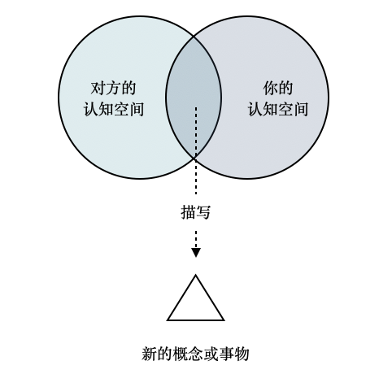

如果沟通的双方在目标和利益上是一致的，沟通会很简单。但是依然存在沟通问题，很大一部分沟通障碍的原因是概念和认知没对齐。

俗话就是：城门楼子和胯骨肘子的问题。

通过不断对齐对某件事情的认知来获得良好的沟通，避免概念不一致。

比如有一天老板让我写个自动化测试，并集成到流水线中。

我默认理解为自动化测试都是单元测试，但是我的老板前几天去听了技术讲座，它觉得自动化测试应该是 E2E的。这样他就对我这几天做的东西非常不满意，我也觉得不满意。

虽然我并没有想让他不满意的主观意愿，只是我们认知没对齐。

“我们来对齐一下”，经常在工作中发生，但是很多时候对齐的只是事情，认知没有对齐。

那么怎么对齐认知呢？

很多人以为盲人的世界是完全黑色的，但是科学家在调查很多非先天失明的盲人时，发现他们的世界并不一样。

对于盲人来说，要对齐颜色这类认知几乎不可能。这就是每个人的背景知识、认知能力带来的对同一个概念做出完全不同甚至相反的理解。

要想沟通清楚，就必须通过大家都能通过大家都能感知到的渠道和背景知识来叙事。对齐认知可以使用一个技巧，就是描写，其实就是义务教育阶段的语文教育。语文教育，不应该去解读作者不存在的“思想感情”，而是应该着手在“表达力”，“理解力”上面。

对沟通的启示：

1. 没有意识到需要做认知对齐，自己以为对方和自己的理解一样。
2. 我们使用了不在对方认知范围内的概念、方法了描述新的内容。
3. 很难知道对方的认知范围，所以倾听就很重要。

用图来表达就像这样：

