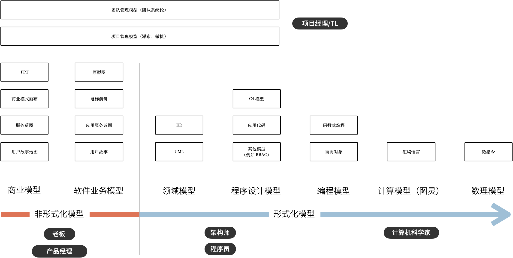

我整理了一个图表，说明了一款软件从商业探索开始到编译成可交付的软件整个过程中可能会用到的模型。

我将模型分为形式化和非形式化两种。形式化的模型是精确描述的模型，例如表达领域模型的 UML、ER 图，而非形式化的模型是一些非精确描述的模型，主要用来做商业、业务探索。

对于应用开发的架构师、程序员来说，核心的问题并非如何编写代码，而是如何将非形式化的业务输入（模型）进行合理抽象、设计，并转换为形式化的过程。

某种程度上来说，通过高级语言编写的代码也是一种模型。在多年以前，计算机科学家们，认为编写 Java 代码的人不算程序员，应该的由业务人员来负责。由于软件工程中非形式化和形式化之间存在一个巨大的鸿沟，编程就是模型的形式化过程，从这个角度看能深刻分析业务并获得良好抽象结果的程序员具有竞争力，并不会被 AI 编程所代替。

在非形式化模型这一步，实际上又存在两种模型。一种是描述软件背后的生意，即使不使用计算机系统参与到业务中，该如何完成交易，并让企业获得理论，我把它叫做商业模型。另一种是描述软件的操作和交互的模型，关注参与的用户、流程和业务规则，我把它叫做软件业务模型。

优秀的产品经理往往深刻的理解商业模型，然后才设计出合适的软件业务模型，避免了空想的业务规则，以及铺天盖地无用的功能。优秀的架构师应该也能理解商业模型，并从软件业务模型中提取合适的概念，构建软件的骨架，而不是让软件建立在的毫无地基之上，然后修修补补。

在软件实施过程中，需要思考项目管理、团队的问题，项目经理或者 Tech Lead 也可以有自己的模型理解和认识项目、团队管理，项目管理的模型就是我们熟悉的瀑布、敏捷。团队管理的模型比较少，我会介绍一种系统化的模型来看待团队，通过将团队中的个体分为 Dispatcher、Worker 来实现高效的运转。

除此之外，还有一些模型并不需要过多了解，这就是和计算机工作原理相关的模型，这是计算机科学家的工作，对于普通开发者来说可以加深对计算机的理解。例如，符合人类的认知的编程语言（面向对象、函数式）背后的模型，面向对象可以看做一种模型，还有一些计算机科学基础的模型：冯诺依曼结构、图灵模型、布尔逻辑（数理模型）。

将这些模型串起来，能够提高对软件工程的理解，以及每个部分背后的逻辑，明白这些模型背后的目标后可以更加从容的应对各种问题。