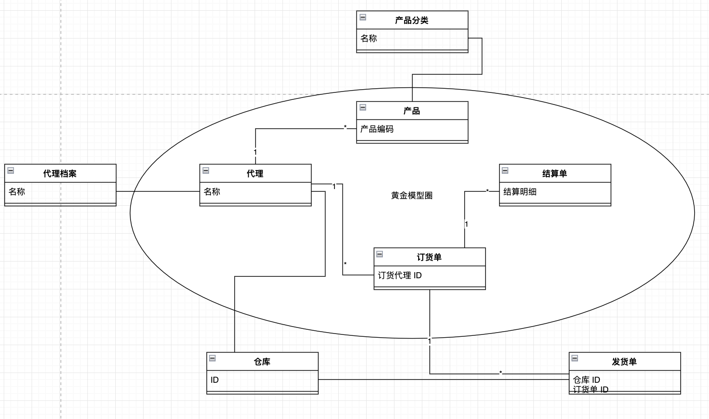

如果一个系统巨大无比，有几百个表，每个表几十个字段，就会是几千个字段。

如何理解这个系统并做上下文划分，就是一个非常重要的事情了。

如何将其拆分到不同的服务中，但是又要能将主体逻辑连接起来？

根据黄金圈思维模型，将其应用到大规模领域模型设计/数据库中，是不是可以找出最核心的模型，构建一个核心模型圈。

通过核心模型打通系统主要流程，并通过它们作为划分上下文的依据，再将剩余的其他模型关联在黄金圈之外。

