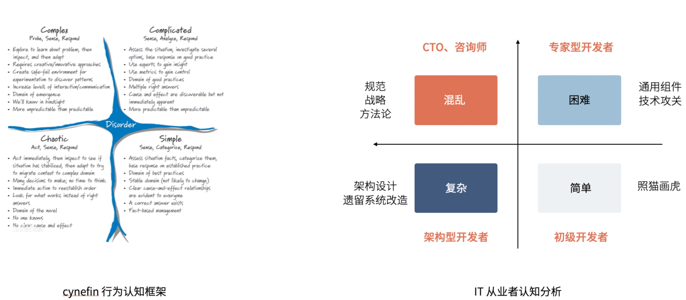

人们往往热衷于思考如何思考，学习如何学习，关于思考和学习的理论更是百家争鸣。不过都非常“大”和“深”，用了很多高级的词汇和概念，网上采用的例子也往往是战略、军事、营销相关。似乎深入思考和我们普通人非常遥远，尤其是像我这种比较愚笨的人。

报名听过很多培训和演讲，也有幸作为讲师参与一些培训和演讲，在这些演讲中中有一些非常好的思维工具和模式来帮助思考。例如被用到极致的 4 象限法、2/8定律、金字塔原理等，这些思维工具有时候让人眼前一亮和醍醐灌顶。我把培训、演讲以及平常生活中用到的一些常用的思维工具和理论整理到了后面，也许大家在日常分析问题、制作演讲材料时能用上。如

当然，这些思维工具都是前人总结出来的模式，有时候听起来很有道理的话，但是否有用完全取决于人的因素。所以最厉害的人是无意识的就富有洞见；有些人刻意使用一些思维工具帮助思考；另外一些人没有洞见也不借助思维工具。不应该迷信任何工具和理论。

最重要的是，现在这些思维模型和方法论实在太多了，记下来或者收藏其实没有用，需要用自己的语言表述一遍，彻底的吃掉它。把这些模型改造成自己的。虽然这样会引来“原教旨”主义者的批评，但是完全没有必要在意。

我改造了 cynefin 行为认知框架，获得了 IT  从业者的认知能力划分。我被批评了不知道多少次（有种亵渎神灵的味道了），但是右边这张图又给其他人带来过一些启示，说明这样做是有用的。

就像一些人热衷于收集思维导图，一些人绘制思维导图。不得不说，思维导图是一个非常有用的工具。但是如果没有自己亲手绘制一次，基本上用处不大。

将知识使用自己的语言表述出来就是我现在做的事情，每天花费大概 30mins 内的时间，整理自己的想法和学到的内容，然后在星球中分享出来。

让我将散落在各个地方的洞见，用自己的话表述了一遍，加深对一些模型的理解。

这种方法可以总结为费曼学习法，物理奖获得者理查德·费曼（Richard Feynman），运用费曼学习法可以获得在知识的深入理解。

费曼学习法可以简化为：

- Concept （概念）
- Teach （教给别人）
- Review （回顾）
- Simplify （简化）

使用模型对复杂知识的简化，然后通过自我表述（教会别人）来让它变得更为深刻。

附录，常见思维模型清单：

1. 问题分析类

2. 1. 七问分析法 - 让问题分析的更有深度
   2. 6项思考帽 - 让问题分析的更为全面
   3. 思维导图 - 沉淀头脑风暴的
   4. 奥卡姆剃刀法则 - 排除干扰信息
   5. 鱼骨图 - 事物的因果分析
   6. 影响图 - 事物的影响关系分析
   7. 概念图 - 让概念的逻辑更为清晰
   8. 冲突理论 - 寻找问题的关键点
   9. 矛盾论 - 从问题到解的终极辩证方法
   10. MECE - 相互独立，完全穷尽

3. 战略思考类

4. 1. SWOT
   2. 马太效应
   3. 边际效应
   4. 长尾理论
   5. D5 模型 Discovery、Define、Determine、Design、Delivery
   6. 波特五力模型
   7. 矛盾三角 （项目管理三角）
   8. 成熟度模型 - 评价“做得好”的工具
   9. 海恩法则 祸患常积于忽微

5. 表达呈现类

6. 1. 电梯演讲
   2. 焦点呈现法ORID
   3. 三段式陈述法
   4. 3法则
   5. 金字塔原理
   6. 四象限法
   7. 分类学
   8. 魔鬼代言人
   9. 2/8 定律
   10. 韦恩图
   11. PREP - 陈述和回答问题的套路
   12. STAR 法则

7. 行动和决策类

8. 1. 7p 会议框架
   2. 决策树
   3. 笛卡尔方法论 - 复杂问题解决之道
   4. 矩阵分析 + MECE
   5. 看板方法 - 直观项目管理方法
   6. SMART - 制定可行的目标
   7. PDCA - 让目标执行起来
   8. OKR - 从个人目标汇聚到组织目标
   9. 番茄工作法 - 提高注意力的有效方法

9. 学习成长类

10. 1. 模仿 - 最朴素有效的的学习方法
    2. 守破离 - 从熟练到精进的方法
    3. 刻意练习 - Practice makes you perfect
    4. 奖励机制 - 建立正反馈循环的机制
    5. Retrospective - 从总结中学习
    6. AAR - 从期望的落差中学习
    7. 筷子定理

11. 思维陷阱

- 1. 沉默成本
  2. 光环效应
  3. 冷读术
  4. 相关性和因果性
  5. 破窗效应
  6. 心锚 - 仪式感的来源
  7. 稀缺性原理
  8. 沉锚效应
  9. 厌恶损失
  10. 幸存者偏差

