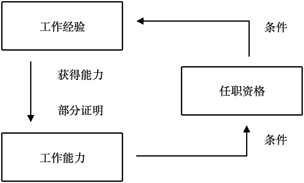
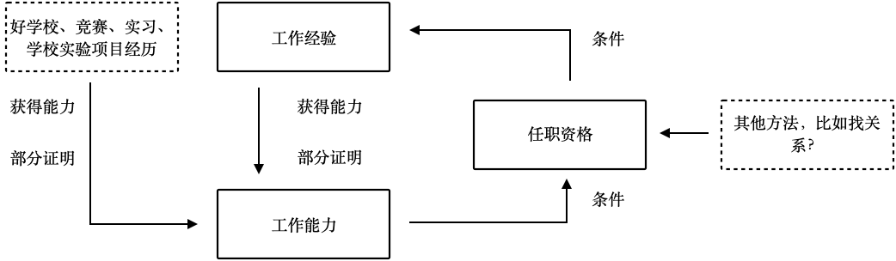

如果你是一名毕业生，用人方要求工作经验，但是你又没有，就找不到工作。

找不到工作就不能得到工作经验，那也就不能用工作经验来找工作。

这就形成了一个死循环。

这个悖论看起来无法破解，因为就是这样一个互锁的局面。

实际上这里面有几个误解：

1. 工作经验是找到工作的必要条件。
2. 能力和职责是等同的。

形成这个局面的原因是误解了：工作经验 = 任职资格 = 任职能力获得。

如果是企业这样要求的话，说明是一切以实践为中心，不相信理论学习能获得任职资格。

如果是求职者也是这样理解的话，说明陷入了工作经验是获得任职资格必要条件的认知局限。

企业对的求职者要求工作经验的原因是，在一般途径下没有其他有效的证明任职资格的手段，只能通过工作经验来判定。

这样做成本、风险都比较低，但是局限性也是放弃了一大批无工作经验的优秀人才。

这也是为什么越大的公司越能接受毕业生的原因，但是我们会发现接受毕业生的大公司要的是优秀大学的毕业生。因为在没有工作经验作为任职资格的情况下，还可通过其他途径证明相应的能力。

所以最惨的是：既没有好的大学背书，又没有工作经验的毕业生。

而有一些不是好大学的人，反而早早的通过社会实践，想办法获得了一些额外的工作经验点证明自己。

对于求职者来说，破解这个怪圈的方法是，获取除了工作经验外其他能证明自己的能力的证据，以至于让企业认为符合任职条件。

所以可以用图表来拆解一下这个过程：

下面是处于循环的状态：

下面是处于突破循环后的状态：

从这个图也能说另外一个学习的问题。

我们总以为学习一定要在项目上，不参与某个项目就无法学习。一样混淆了一个逻辑，项目实践是学习的一种有效方式，但不是唯一方式。
