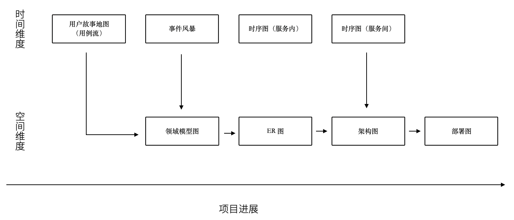

软件工程中太多的模型了，有时候多到不知道用哪个。

有属于 UML 规范中的时序图、类图、ER 图，有现代更潮流的用户故事地图、业务蓝图，有随意画画的 Freestyle。

我以前也整理过一个项目上需要用到的模型清单，比如用 C4 架构图 + 时序图+领域模型图（UML）+ ER 图基本上能满足大部分业务需要，能充分的描述软件现状。

当我慢慢把虚拟的软件世界和现实世界映射时，发现可以用一个思维来组织那些模型是我们需要的。

我们用“宇宙”这个词来描述现实世界，在中文的词源中“宇宙”是两个词组成的，宇指代空间，宙指代时间。更有意思的是，“宇宙”这个词汇出自庄子。《庄子·齐物论》曰：“旁日月，挟宇宙，为其吻合。”。

那么我们可以从时间和空间两个方面来寻找一些模型描述软件，并且做到正交，就能清晰的认识到相关模型在软件建模体系中的，这样也能让模型保持干净。

先从空间上来看。

领域模型图是在描述软件概念骨架，描述业务概念或数据在软件中是如何组织的。设计领域模型就好比，我们是不是需要将手机和电池分开设计。需要清晰地定义手机、电池，以及电池的关系。

所以在建立领域模型图时，需要保持干净，体现实体、实体关系就行了，用 DDD 的风格，表达出聚合、上下文就完全满足开发需要。

进一步来说，领域模型图、数据库实体关系图、架构图、部署图都是在空间上描述软件，只不过这是不同的态。

在空间上来说，可以类比建筑行业的图纸，但是软件是动态的，需要响应用户交互，于是需要从时间上来看。

从时间上来看，依然可以用不同的态来看待这些模型。时间维护上的模型，体现的是流程、事件。从最朴素的流程图到用户故事旅程、服务蓝图，再到事件风暴、时序图、状态图都算描述时间过程上的模型。

流程图由于粒度不确定的问题，可以用于草稿用，实际上用的不多。

用户故事旅程、服务蓝图，描述现实中业务主体为了达成业务目标中间所经历的过程，可以用在商业探索早期。将用户故事地图带入用例的视角，就可以解决颗粒度的问题。以用例为单位，用例的流动就是参与业务主体的契约在不断变化。

事件风暴则通过系统核心状态变化为线索寻找背后的实体，有点像电影的关键帧，通过状态的变化可以提取出描述软件空间结构的领域模型。

时序图则用于软件编写中，描述操作实体的服务（主体）之间的交互，时序图也可以有不同的层次关系，比如子系统（微服务）之间，服务之间（Controller、Service）。

那么通过时间和空间的思维，可以帮团队裁剪一套软件设计过程中的模型，如下图：

