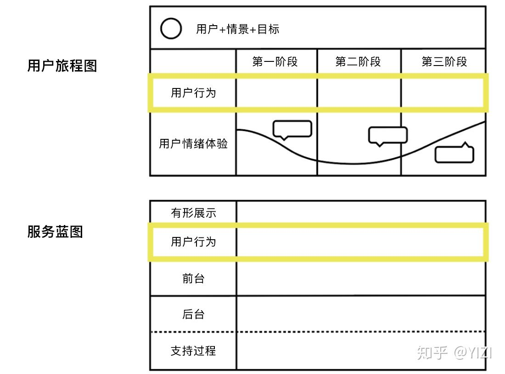
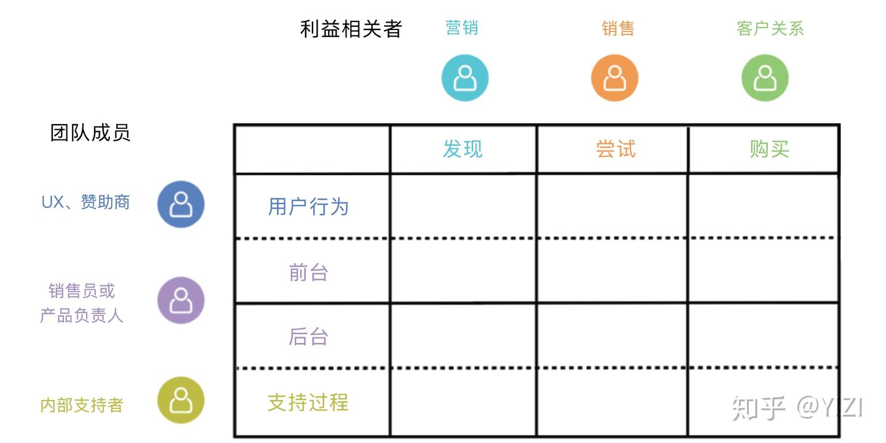

服务蓝图是详细描画服务系统与服务流程的图片或地图，使用服务蓝图可以分析业务流转过程，以及关键经手人。

它和用户旅程的最大区别是服务蓝图是跨职能或叫业务主体的，用户故事更多的是用来分析某类用户在使用过程中的体验（心情曲线）。

用户故事地图可以用来给业务分析人员使用，关注用户体验。

服务蓝图业务分析人员、架构师都可以使用，关注权责关系的流转。

典型的蓝图如附件：

图片来源于网络。

将服务蓝图的角色标上会清楚一些：

这样我们可以看到左侧就是业务主体，当 IT 系统不存在时，一般叫做业务服务蓝图，将 IT 系统加进去就变成了应用服务蓝图。在 IT 信息系统参与的业务中，IT 信息系统可以看做一个机器人参与到业务中。

服务蓝图看不到客体，因此需要经验或者其他建模方法将其挖掘出来，进一步抽象加工也能设计出一致、清晰的模型。

