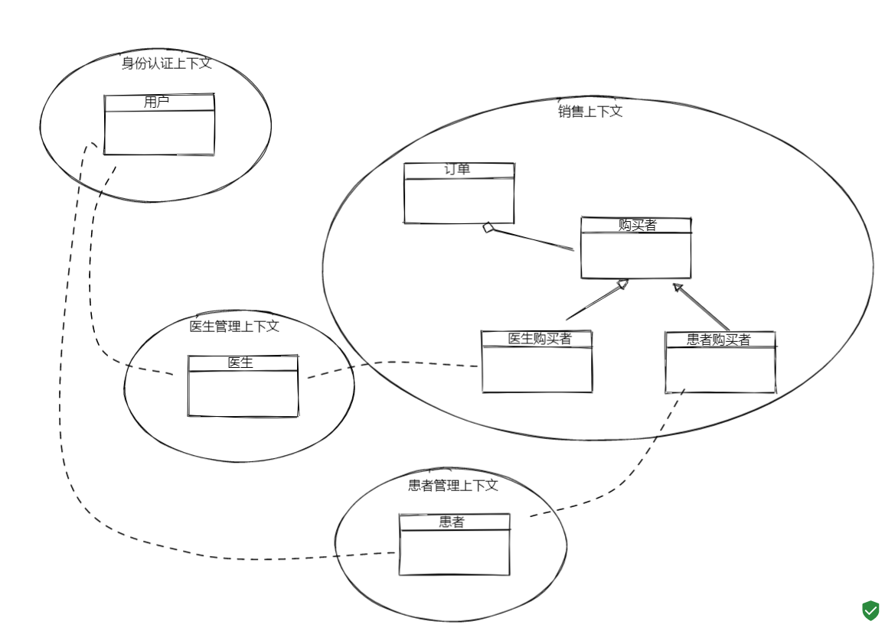

## 01 问题

```
有个问题：
一个系统为不同用户群体提供服务，并区分了不同的端。
例如：
1 在线课堂系统分老师用户，学生用户，对应了老师端，学生端。
2 医疗系统分医生用户，患者用户，对应了医生端，患者端。

如果这类系统有且只有一个用户中心，提供用户信息。一个用户可以登陆不同的端。
比如一个医生既可以以医生的身份登录医生端，也可以以患者的身份登录患者端。
在具体业务中保存用户id的时候该如何存储呢。如果只存一个简单的用户id，如何区分这个数据归属谁呢。
比如有一个订单服务，医生可以在医生端下单买一些医用辅助用品，患者可以买药品。buyer字段如果是用户id，就无法区分同一个用户在不同身份下的订单。如果想做同一个用户不同身份数据的逻辑隔离一般怎么处理的？
```

## 02 分析

该问题的矛盾:

>  系统追求统一的数据复用（用户）和用户身份差异难以被统一之间的矛盾。

使用应用和服务分离的思路进行处理：

1. 将用户和身份分离，用户指能在系统中登录的凭证，由用户上下文提供；不同的身份在不同的上下文中出现（医患、师生）
2. 这种场景非常多间，常见一些大的企业有多种业务线希望统一用户中心，那么只需要提供通用的用户中心，然后将各个场景设计为应用即可

恰当的比喻就是一个人有身份证，作为国家公民，有公安系统统一维护，关键的属性很少，只有身份证号码、姓名、性别等有限的信息。当该公民需要使用身份证去上学、就医时，会通过身份证绑定学生证、就医卡等应用信息。

## 03 方案

参考的方案如下（由于背景信息有限仅供参考，由阎华老师提供）：



