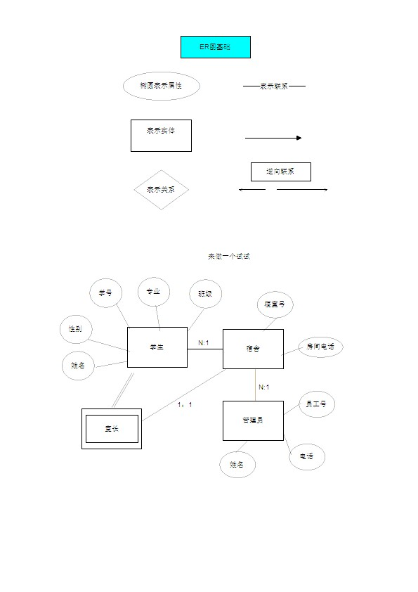

实体-联系图(Entity-Relation Diagram)用来建立数据模型,在数据库系统概论中属于概念设计阶段，形成一个独立于机器，独立于DBMS的ER图模型。 通常将它简称为ER图，相应地可把用ER图描绘的数据模型称为ER模型。ER图提供了表示实体（即数据对象）、属性和联系的方法，用来描述现实世界的概念模型。

　　矩形框：表示实体，在框中记入实体名。

　　菱形框：表示联系，在框中记入联系名。

　　椭圆形框：表示实体或联系的属性，将属性名记入框中。对于主属性名，则在其名称下划一下划线。

　　连线：实体与属性之间；实体与联系之间；联系与属性之间用直线相连，并在直线上标注联系的类型。（对于一对一联系，要在两个实体连线方向各写1； 对于一对多联系，要在一的一方写1，多的一方写N；对于多对多关系，则要在两个实体连线方向各写N,M。)
