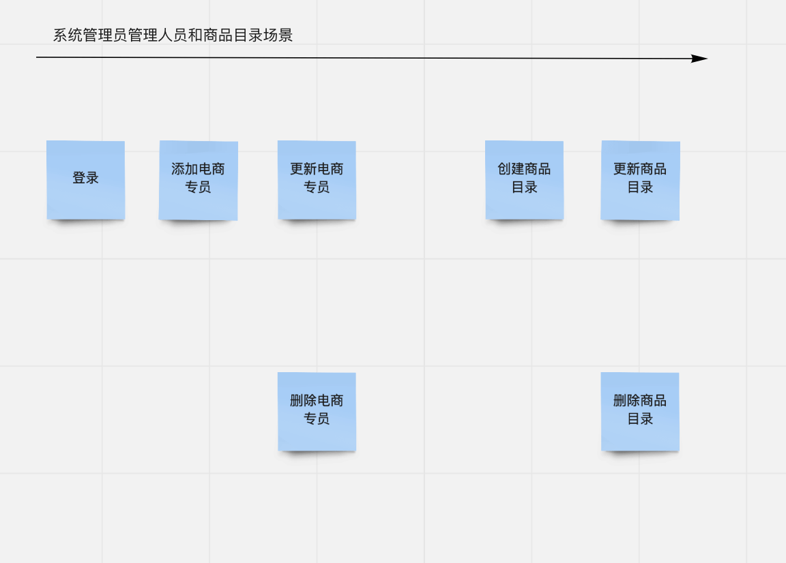
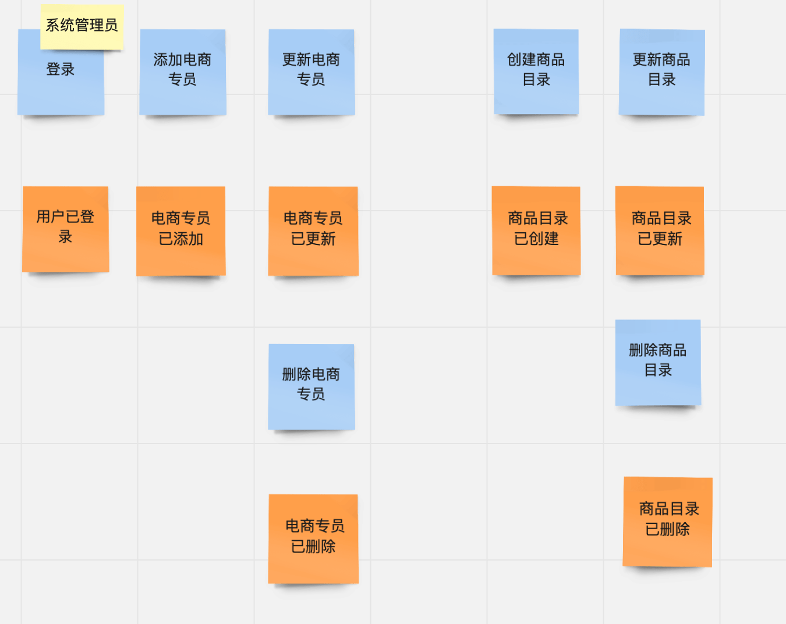
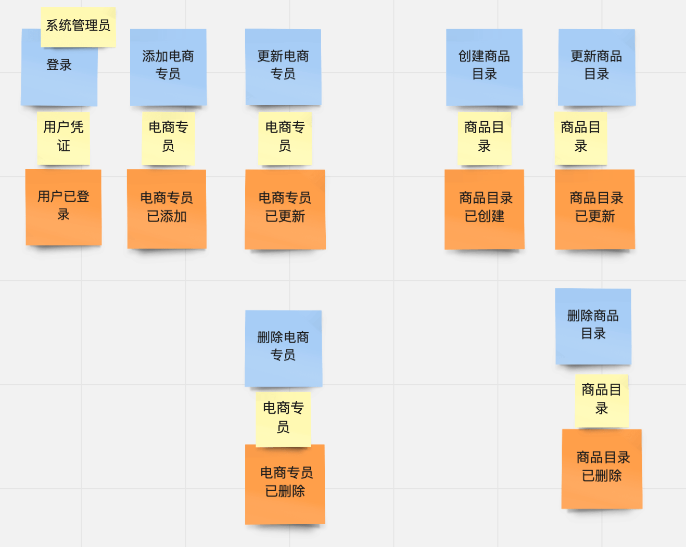
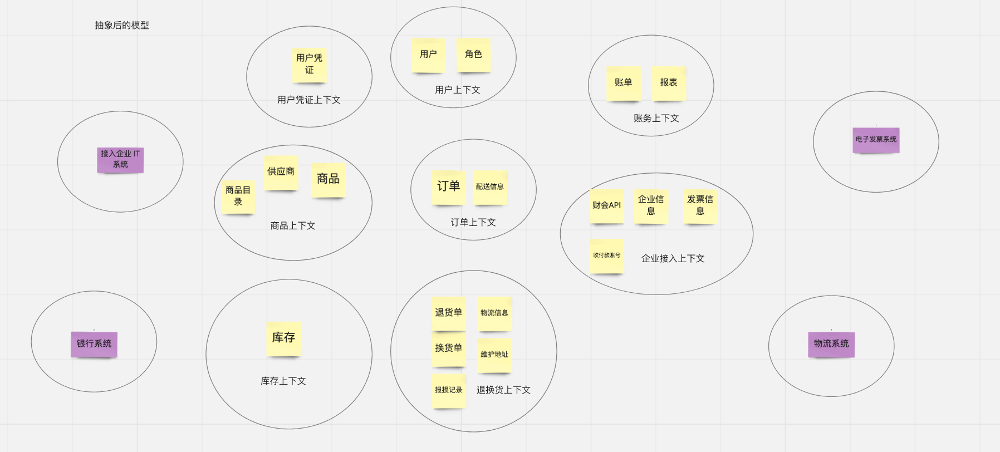
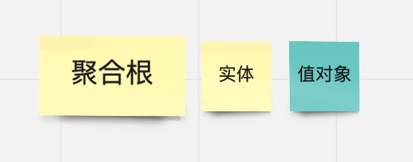
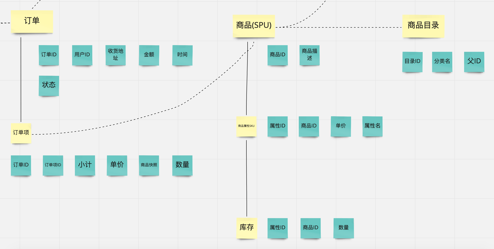

## 0 写在前面

说明 DDD 工作坊的做法，目的是建模，当前的版本是事件风暴。

- 四色建模
- 名词动词
- 用例驱动

## 1 事件风暴介绍

事件风暴的发明人是 Alberto Brandolini ，它来源于 Gamestorming，通过工作坊的方式将领域专家和技术专家拉到一起，进行建模。

事件风暴是一种捕获行为需求的方法，类似传统软件的开发用例分析。所有人员 (领域专家和技术专家) 对业务行为进行一次发散，并最终收敛达到业务的统一。

所以事件风暴是 DDD  建模工作坊的一种重要的方式。使用事件风暴工作坊建模的逻辑闭环是：

1. 产品愿景，识别软件价值和定位
2. 场景梳理，对业务的领域划分，以便能聚焦核心域
3. 事件风暴，察业务系统变化的关键帧，找出系统状态的变化规律
4. 命令风暴，找出系统状态的触发者和行为
5. 模型识别，获得领域模型，了解系统的骨相
6. 限界上下文划分，分解问题，战略规划整个系统
7. 模型展开，设计聚合和属性，战术落地具体实现
8. 可视化输出，输出为可以继续使用的 UML 图例

## 2 准备工作

事件风暴工作坊的开展需要做一些准备工作，便于有序开展。

### 2.1 物料场地

工作坊通俗来说就是相关人员在一起开会，通过一些互动的讨论的方式让每人个人都参与其中。工作坊可以有线下或线上两种形式。

如果是线下，需要准备一个大的会议室，能容纳足够多的人.并需要准备下列材料：

1. 全开大白纸。用于在不平整的墙面上粘贴报事贴，如果是白板墙可以省略。
2. 3M 报事贴。需要有超过 6 种颜色，用于标识不同的内容。
3. 马克笔。用于书写和记录。
4. 蓝丁胶。用于张贴大白纸，或补充报事贴的张贴能力。
5. 美工刀。必要时，用于切割报事贴。

如果是在线上进行，需要准备必要的会议和协作软件：

1. zoom。用于视频会议，也可以使用腾讯会议等软件。
2. miro。用于白板协作，也可以使用 mura、BeeAr等软件。

### 2.2 人员培训

事件风暴工作坊是一个软件架构和建模工作坊，需要合适的人员参与，这些人员需要接受过 DDD 或业务培训。

1. 组织者。需要了解事件风暴的整个流程，能推动事件风暴工作坊的进行。
2. 领域专家。领域专家是指熟悉业务规则的人，在工作坊中一般是能敲定业务规则的人。
3. 技术专家。技术专家是指熟悉技术方案和实现方式的人，能给出可行的技术方案和了解基础设计的限制条件。
4. 开发团队成员。参与后续开发的团队成员代表，不限制角色，开发、测试、业务分析师都可以参与。

这些参与人员需要对 DDD 的基本概念有了解和认识，如果没有，需要参加 DDD 基础培训。这些概念包括但不限于如下：

1. 领域，以及子域的划分方式。
2. 模型，尤其是计算机科学中模型的含义。
3. 事件、命令和执行者。
4. 实体、值对象、聚合、以及聚合根。
5. 限界上下文。
6. 依赖。

### 2.3 业务输入

工作坊开始前需要对齐业务输入，比如 PRD 文档、原型图、业务流程等资料，如果没有需要领域专家能做一次业务导入。

一些业务承载物参考：

1. 业务原型图。原型图是最理想的业务表达方式，能够直观的看到交互逻辑。好的原型图需要有基本的交互能力，细化到具体的字段，用例，以及为每一个角色的界面单独出具原型图。
2. PRD 文档。有一些产品经理喜欢出具详细的 PRD 文档，也可以作为业务承载物。
3. 业务流程。一些简单的流程图也可以作为业务承载物，不过需要注意粒度统一，建议以用例来为维度设计流程图。
4. 用例图。极其少的产品经理会绘制用例图，用例图是 UML 建模中极其重要的一种图形，如果有用例图非常有帮助。

### 2.4 任务目标

明确本次的工作坊的任务目标，工作坊个常见目标有：

1. 现有业务梳理，和模型优化。所有的业务输入以业务现状为准，有时候称为 As Is。
2. 会对业务改进，以未来的业务为准，梳理出支持未来业务的模型，有时候称为 To Be。

需要对齐工作坊的范围，明确工作坊的输出，例如：

1. 限界上下文映射图。
2. 每个限界上下文的领域模型 UML 图。
3. 系统架构图。

## 3 识别产品愿景

### 3.1 操作方法

产品愿景是企业对其主要的产品的定位，需要表达清楚产品的价值、服务群体、竞争竞争力和主要的竞争对手。通俗来说就是弄清楚产品背后的生意，然后通过软件来支持和实现。

无论是否是软件或者互联网公司，产品愿景都是头等大事，否则做出来的软件找不到背后的生意，往往无法落地或不赚钱。电梯演讲是一种思维工具，它提供了一套模板，用一句话把要做的产品说明白。其来源于著名咨询公司麦肯锡，在乘电梯的 30s 需要内清晰明白的向目标客户讲解清楚方案。

电梯演讲的格式并不重要，其结果业务对错之说，一套简单的形式如下:

>  **对于**：我们的目标客户/用户
>  **他们想**：目标客户的痛点或者诉求
>  **这个**：产品名称
>  **是一个**：什么样的产品类型（软件、网站、工具或平台）
>  **它可以**：通过什么样的能力，为用户解决什么问题
>  **不同于**：市场上的竞品及其特点
>  **它的优势是**：我们产品聚焦的价值和竞争力
>  **愿景**：概括产品定位

在工作坊中，让领域专家处于核心位置，获取准确的定位，让其他角色做补充。实际操作中，可以在一个大白纸中使用便利贴书写，如果遇到错误可以方便的拿掉。

### 3.2 示例

这里我虚拟了一个业务背景作为这份指南的一个案例。我们在设计一个垂直的电商产品，这个电商产品的目标市场是企业办公物资采购，谐音企采，我们起名为七彩商城，其主要优势是通过签约实现1 对 1 服务和月度结算。

下面是我们的电梯演讲：

>  **对于**：需要采购办公用品和设施的企业
>  **他们想**：让采购环节更透明，成本更低
>  **这个**：七彩商城
>  **是一个**：企业采购平台
>  **它可以**：提供专员1对1服务，比价、供应商分析、财会对接
>  **不同于**：某宝、某东、某多多
>  **它的优势是**：让企业办公物资采购更可靠，更省心
>  **愿景**：做专业的企业管家

## 4 领域划分

### 4.1操作方法

使用电梯演讲，得到产品的愿景和定位，这对业务非常重要。接下来我们需要分析出业务，业务场景是我们需要在软件设计时候满足的功能。场景，可以说是领域的划分，类比于数学中的概念，它问题空间。根据这些场景，从最关键的业务出发，来做事件风暴，弄清楚场景中发出了什么，然后在进行业务建模，以便做出的软件模型，能很好的支持这些场景。

比如，七彩商城在建设时候，主要的使用者是企业商户的采购经理和采购员，除此之外还需要提供给系统管理员、电商专员操作入口。核心场景是电商专员对采购员的维系，比如采购经理入驻、采购、结算。

现实中，实际业务会比上面的描述复杂很多，比如还有企业核验、发票开具、简单进销存、维护工单等场景，我们可以把这些场景划分为：核心域、支撑域和通用域。目的是结合产品定位，对业务做出重点分析。但是，**实际上对领域的划分是一个模糊的概念**，领域很难有边界，因此，领域需要重点找出核心域即可。为后面的事件风暴提供输入。

七彩商城的领域划分为：

1. 核心域。企采域，包含采购经理入驻、采购、结算三个主要场景。
2. 支撑域。
   1. 系统基础管理领域。
   2. 产商品管理域，包含供应商管理、产品管理场景。
   3. 人员管理领域，包含采购专员管理、采购经理注册、对采购员管理场景。
3. 通用域。企业核验、发票开具、简单进销存、维护工单等领域。

// 包括的方法：用户故事地图、闲聊、已经有的材料

// 输出是什么？领域划分图

// 需要一个例子，子域把场景包住

// TODO 对场景，领域划分是对场景的切割

### 4.2 示例

我们可以按照场景，分阶段的寻求用户业务流程中的关键领域事件。我们根据场景的前后依赖关系，梳理出场景地图：

1. 系统管理员管理人员和商品场景
2. 企业经理入驻场景
3. 电商专员供应商和商品录入场景
4. 商户采购员采购场景
5. 电商专员
6. 更新供应商和商品场景
7. 退、换货、维护单场景

## 5 识别事件

### 5.1 概念解释

事件是系统状态发生的某种客观现象，领域事件是和领域有关的事件。

领域事件(Domain Event)，是在业务上真实发生的客观事实，这些事实对系统会产生关键影响，是观察业务系统变化的关键帧。领域事件一般是领域专家关心的。

事件的评价方式是系统状态是否发生变化。系统状态变化意味着领域模型被业务规则操作，这是观察系统业务的好方法。

识别领域事件的线索有：

1. 是否产生了某种数据

2. 系统状态是否发生变化，无论这种状态存放到数据库还是内存

3. 是否对外发送了某些消息

   

### 5.2 操作方法

选定一个业务场景为单位，确定一个开始事件和一个结束事件，事件格式参考 “XXX已YYY”，比如 ”用户已登录“。使用便利贴在物理墙面上张贴，或在电子白板中操作。

需要注意：

2. 建议参考图例选定便利贴颜色，并把图例标识在白板中。
3. 确定起始事件和结束事件，事件以“XXX已YYY”的形式进行命名;
4. 按照时间线的先后顺序和并行组织事件。
5. 使用“规则”便利贴处理分支流程，将 “规则” 放到事件前面，也可以使用线条来处理。

便利贴参考图例：

### 5.3 示例

系统管理员管理人员和商品目录场景中的事件如下：

## 6 识别命令

### 6.1 概念解释

**命令是执行者发起的操作，构成要件是执行者和行为。**

命令可以类比于 UML 分析中的业务用例，是某个场景中领域事件的触发动作，在技术实现的时候，对应应用层中的一个方法。

**执行者是指使用系统的主体，是导致系统状态变化的触发源。**

执行者有点像 UML 的涉众，不过区别是执行者不仅是用户，还包括外部系统和本系统。 在事件风暴中，执行者可以是：用户、外部系统、本系统、定时器。

1. **用户。**用户是指使用软件或服务的人。用户可以有不同的角色，通常我们会把不同角色的相似行为作为不同的命令来处理，有可能得到同样的事件。比如系统出现了商品已添加的事件，有可能有多个触发的场景： 1. 系统管理员在后台中添加 2. 商户在自己的管理平台中添加 3. 导入任务在特定时间添加。
2. **外部系统。**开放 API 的调用发起者。
3. **本系统**。指系统本身，事件的触发可以由用户、外部系统、定时器触发，也可以由上一个事件触发，因此这里的触发者（主体）就是系统本身。
   4. **定时器。**通常是定时任务，定时器可以作为执行者，不过需要区别于本系统这个触发源。定时器可以看待为外部一个时间信号源，类似于计算机中主机中的振荡器。

### 6.2 操作方法

1. 针对每一个领域事件，从业务视角上，寻找产生该事件直接相关的动作，识别为命令。
2. 每一个领域事件都需要有一个命令对应。
3. 命令尽可能使用有意义的业务术语， 避免将事件倒过来写作为命令。因为，一个命令可以对应多个事件。比如用户被添加，可以是管理员 “添加用户”命令实现，也可能是用户 “注册”的命令实现。
4. 每一个命令需要注明执行者。“执行者” - “命令” - “事件”构成一个逻辑合理的句子。
5. 如果命令由上一个命令触发，可以使用箭头标注，可以省略命令。

需要注意：

1. 在操作时，在命令和事件之间保留一个便利贴的位置，为后面的流程腾出位置。

### 6.3 示例

## 7 领域名词

### 7.1 概念解释

**通常，模型是对对象、人或系统的信息表示。它通过较为简单的信息结构来代表我们需要理解的复杂事物或系统。**

**领域模型（Model）是业务概念在程序中的一种表达方式。**

模型是用来设计和理解整个软件结构，切记不要事无巨细的模型。在模型思维中，模型是简单的，能反应业务概念即可。在事件风暴过程中，由于事件是关键帧，可以体现出关键的业务模型所体现的业务逻辑变化。

他们的逻辑关系是：

- 执行者是业务的主体，是业务行为的发起方。
- 命令是业务描述的行为，通常可以作为软件的一个功能。
- 事件是业务现象，是业务行为发生的结果。
- 领域模型是业务的客体。在软件设计中为被操作方，和状态承载方。

用自然语言来概括就是：【执行者】发起了【命令】，产生了【事件】，导致【领域模型】的状态变化了。

客体的待选词：

1. 实体
2. 聚合
3. 领域对象
4. 领域名词 ****
5. 模型
6. 业务概念

### 7.2 操作方法

1. 尽可能的连接已经完成的场景，覆盖的场景越多对模型的识别越有利。
2. 在每一对命令和事件之间，识别出业务相关的业务概念，并使用**名词**形式贴出。
3. 对名词做出比较准确的定义，明确概念的内涵、外延，注意区分集合类、个体类词汇。
4. 注意名词的二义性，使用不同的名词标注。比如商品和订单的商品，订单的商品和在售的商品有二义性，需要重命名为“订单项”。

### 7.3 示例

## 8 限界上下文划分

### 8.1 概念解释

**限界上下文是一个显式边界（边界：通常是一个子系统或者一个特定团队的工作），领域模型存在于边界之内。建立模型过程中形成了通用语言，通用语言在特定上下文中才有明确的意义。**

限界上下文强调概念的一致性。DDD不追求全局的一致性，而是将系统拆成多块，在相同的上下文中实现概念一致性。识别上下文可以从概念的二义性着手，比如商品的概念在物流、交易、支付含义完全不一样，但具有不同内涵和外延，实际上他们处在不同上下文。

限界上下文划分是应用 DDD 的一个难点，其本质就是对同类模型的划分，可以借助下列线索：

1. **模型的二义性。**二义性往往标志着模型在概念上不同，比如系统地址、用户添加的地址、订单中的地址，有不同的含义，意味着有不同的上下文。
2. **模型状态变化的相关性。**状态不相干的模型即使没有二义性，他们也属于不同的上下文。比如商品和用户，商品的状态变化和用户的状态变化关系不大，考虑不同的上下文。
3. **编码实现的成本。**比如业务上有强一致事务需求、频繁联表查询需求等潜在成本。这个是为了避免限界上下文过于微小，可以把同类的上下文合并。比如配置管理相关的一些模型，虽然各自比较独立，相关性不大，也可以考虑放到一个限界上下文。

### 8.2  操作方法

1. 将全部模型提取到一个单独的白板中，进行去重处理。
2. 对模型根据相关性分类，**当一个名词可以出现在不同的分类时**，考虑二义性的出现。
3. 补充未覆盖的领域模型，使之逻辑完整。
4. 根据上面的线索设计上下文。
5. 补充上下文的依赖关系。依赖的意思是信息的流动，比如订单上下文依赖商品上下文，意味着订单上下文需要知道商品上下文的信息，反之不需要。

### 8.3 示例

## 9 领域建模

### 9.1 概念解释

对上下文划分后，为了更好的编写代码还需要对生命周期以及业务规则强一致的模型做出区分。其现实意义之一就是避免在设计数据库时变成一张网，而应该退化成一棵树。因此需要设计聚合。

**聚合 （Aggregate）是一组生命周期以及业务规则强一致的实体和值对象的集合，表达统一的业务意义。**聚合的意义在于让业务统一、一致，在面向对象中有非常重要价值。聚合是在相同的上下文中，不能跨上下文。

**实体（Entity）是在相同上下文中具有唯一标识的领域模型，可变化，通过标识判断同一性。**领域模型可以是一个广义的概念，建模的结果和中间过程其实都可以看做模型。

**值对象 （Value Ojbect）是一种特殊的领域模型，值对象是以内容判断，不可变，同一性。**实体可以使用 ID 标识，但是值对象是用属性标识，任何属性的变化都视为新的对象。比如一个银行账户，可以由 ID 唯一标识，币种和余额可以被修改但是还是同一个账户；交易单中的金额由币种和数值组成，无论修改哪一个属性，金额都不再是原来的金额。

**聚合根（ Aggregate Root）是聚合中最核心的实体，其他的实体和值对象都从属于这个实体。**要管理聚合必须使用一个聚合根，然后使用聚合根来实现发现、持久化聚合的作用，完成统一的业务意义。一个聚合中有且只有一个聚合根，聚合也可以只有一个单独的实体。

待选：

1. 领域建模
2. 设计聚合
3. 模型展开

### 9.2 操作方法

选择一个上下文，设计聚合，并定义出所有的属性。

1. 抽取上个步骤中某一上下文中的模型，到新的白板。
2. 用不同的便利贴代表聚合根、普通实体、值对象
3. 聚合根和实体、值对象的引用关系使用实线相连
4. 聚合内可以引用其他聚合根，使用虚线相连
5. 使用单独的便利贴为每个模型写出属性

参考图例：

注意事项：

1. 聚合不易过大，否则在持久化和实现上比较麻烦。
2. 警惕多对多关系，多对多关系往往意味着丢失了中间模型，应该转换为两个聚合，其中一个聚合为一对多关系。

### 9.3 示例

## 10 可视化输出

### 10.1 概念解释

工作坊做完后，需要对白板的数据做整理，通常来说 UML 是一种比较好的模型表达工具。如果考虑代码化的 UML 的工具，可以使用 PlantUML。

PlantUML 可以通过简单直观的语言来定义模型图，为了使用 UML 表达 DDD 中的概念，采用如下约定：

1. 使用 namespace 表达限界上下文
2. 使用 package 表示一个聚合
3. 使用类表示领域模型
4. 使用组合表达模型的关系

### 10.2 操作方法

参考官网 https://plantuml.com/zh/class-diagram  或在 Intellij IDEA 中安装 plantuml 插件。

### 10.3 示例

TODO

## 参考资料

- https://blog.csdn.net/xiaofeng10330111/article/details/105358094 《如何使用事件风暴构建领域模型》
- https://zhuanlan.zhihu.com/p/95001438 【领域驱动设计】事件风暴小体验
- http://www.360doc.com/content/19/0802/20/366082_852637712.shtml 《使用事件风暴探索业务全景》
- http://www.woshipm.com/pmd/3548368.html 如何用“电梯演讲”表述你的产品愿景?

