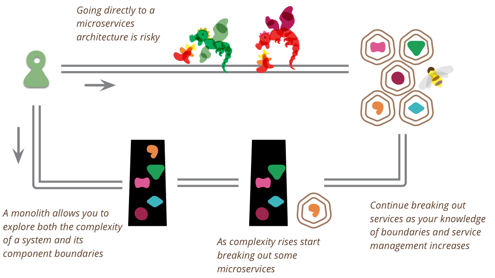

> 本来打算写一篇类似的文章，不过看到有同事有转发马丁·福勒的一篇博客，结合自己的项目经历，感同身受，就直接把这篇文章翻译过来了。

当我听说有团队在使用微服务架构时候，我注意到了一些规律：

1. 几乎所有成功应用微服务的系统都来自于一个过大单体项目拆分而来。
2. 几乎所有我听到过一开始就选择使用微服务架构的系统，并从 0 构建，最终的结果都有一系列严重的麻烦。

这些规律在我同事中产生了长期的讨论：**你不应该你在一个新的项目一开始就采用微服务架构，即使你确认你的应用在未来因为业务演进变得无比巨大。**

微服务是一种有用的架构，但是即使这种架构的拥趸也不得不承认，使用这种架构需要付出额外的成本，这意味者只有更复杂的系统值得使用这种架构。这种代价本质是管理这些服务所带来的基本开销。所以这就是单体优先架构策略的依据，架构师应该在构建新的系统时候先使用单体做整体设计，即使你认为后期可能使用微服务更有价值。

第一个原因是经典的 Yagni 原则 (译者注："You Aren't Gonna Need It" 的缩写，意在避免过度设计)。当你开始一个新的应用程序时，您如何确定这个应用的特性是用户有价值的？一个成功的软件可能背后的设计很糟糕，很难拓展，但是总比一个设计卓越但是没有价值的系统好。正如我们现在所认识到的，通常判断一个软件和想法是否有用的最好方法是构建一个简单的版本，看看它的跑起来效果如何。在第一个阶段，您需要优先考虑速度(以及反馈的周期时间)，因此微服务的成本是一个累赘，应该被避免。

从微服务开始的第二个问题是，它们只有在服务之间建立良好、稳定的边界时才能正常工作——这本质上是厘清正确的边界上下文的任务。因为任何服务之间的功能重构都比在一个庞然大物的单体中要困难得多。不幸的是，即使是在熟悉的领域工作的经验丰富的架构师也很难在一开始就确定边界。通过先构建一个单体应用，你可以在微服务设计刷上一层糖浆之前(译者注：比喻微服务的一些额外设施)，找出正确的边界是什么。它还为你提供了缓冲时间来开发细粒度服务所需的基础设施。

据我所知，践行单一优先策略有不同的方式。比如，仔细的从逻辑上设计为一个类似单体系统的整体，注意内部的模块化设计，包括 API 边界和数据的存储方式。做好这一点，再来开发微服务的系统。然而，如果我听过很多这样的成功案例，我会觉得这种方法更合适，实际很难做到。

一种更常见的方法是从一个庞然大物开始，然后逐渐从边缘剥离微服务。这种方法可能会在微服务体系结构的核心留下一块巨大的庞然大物，但是大多数新开发都是在微服务中进行的，只是这一块庞然大物是相对不变的。

另一种常见的方法是先开发一个单体系统，再用一套新的微服务系统完全替换单体结构。很少会有人认同这种办法，然而建造作为献祭架构的单体系统是有好处的（译者注：一种设计方法，先做简单的原型系统，再用新的系统代替，其实就是重写）。不要害怕建造一个你会丢弃的庞然大物，特别是如果一个庞然大物可以让你很快地进入市场。

还有，我遇到的其他方法是从几个粗粒度的服务开始，这些服务要比你预期的要大。使用这些粗粒度的服务来习惯处理多个服务，同时享受这样一个事实：粗粒度减少了你必须不得已进行服务间重构的数量。然后，随着边界稳定下来，就会分解为更细粒度的服务。

虽然我接触的大多数人倾向于“单体优先”的策略，但这不是绝对的。相反的观点认为，从微服务开始构建新的系统可以让你适应在微服务环境中开发的节奏。要以足够模块化的方式构建单体系统，以便将其轻松分解为微服务，需要花费很多甚至太多的编程规则。从微服务开始，你可以让每个人从一开始就习惯在独立的小团队中进行开发，并且在需要的时候，通过服务边界将团队分开可以更容易地扩大开发工作。对于那些更有可能尽早获得足够稳定边界的系统来说，这尤其可行。尽管证据不多，但我觉得你不应该从微服务开始，除非你有在团队中构建微服务系统的大量经验。

我觉得我还没有足够的例子来明确如何决定是否使用“单体优先”策略。毕竟，这是微服务的早期阶段(译者注：这篇文章发布在2015)，可供学习的业界案例相对较少。因此，任何人在这些问题上的建议都需要保持开放性，无论观点的提出者如何信誓旦旦。

## 文章来源

- Martin Fowler [MonolithFirst](https://martinfowler.com/bliki/MonolithFirst.html)

