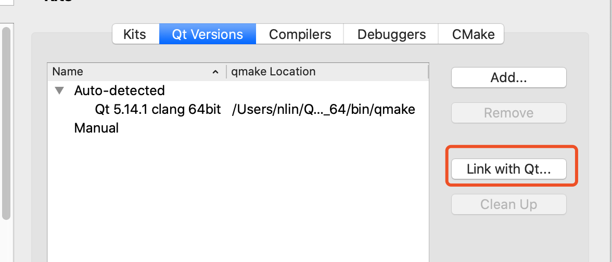
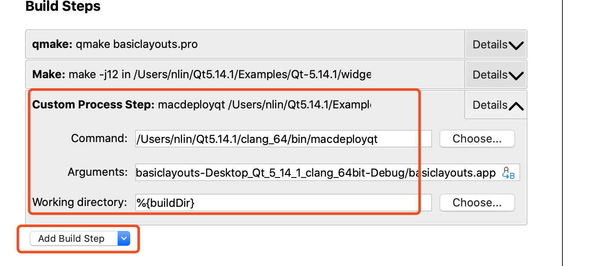

## 相关概念

- QT：QT 是一个开源的 C++ 库，包括了图形界面、网络、数据库等全功能组件。
- QT Creator：QC 是一个基于 QT 库的 C++ 开发 IDE，提供了编译、发布、布局设计等非常完备的能力。QT Creator的使用需要依赖 QT 库。

##  安装

MacOS 中安装需要提前安装 XCode，这部分内容需要在 Apple 开发者官网下载。

QT 的下载地址：http://download.qt.io/official_releases/qt/ 

QT Creator 的下载地址： http://download.qt.io/official_releases/qtcreator/4.13/，推荐先安装 QT 后安装 Creator，但是我发现在 QT 的安装包中已经存在 QT Creator了。

## 配置

安装完成后启动 Creator 可能无法创建项目，会提示 kits not found，这个时候需要将 Creator 关联到 QT 上。

在 QT Creator 的首选项中选中 Link with QT 即可。

## 静态发布

按照 QT 默认 release 出来的包，只能在安装过 QT  的机器上运行，这显然不现实。可以使用 QT 提供的工具 (macdeployqt)，将链接库静态打包进入。

> ~/Qt5.14.1/5.14.1/clang_64/bin/macdeployqt your.app

该命令的参数即为构建出来的的 App，也可以添加到构建的 step 中。

