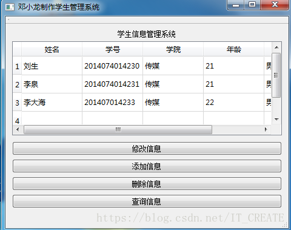

源码资源

https://download.csdn.net/download/it_create/10625713

或[学生信息管理系统](https://gitee.com/dxl96/qt_resource/blob/master/学生信息管理系统.zip)

**以下是效果图**

****

管理系统

- https://github.com/yvettemuki/BookManage
