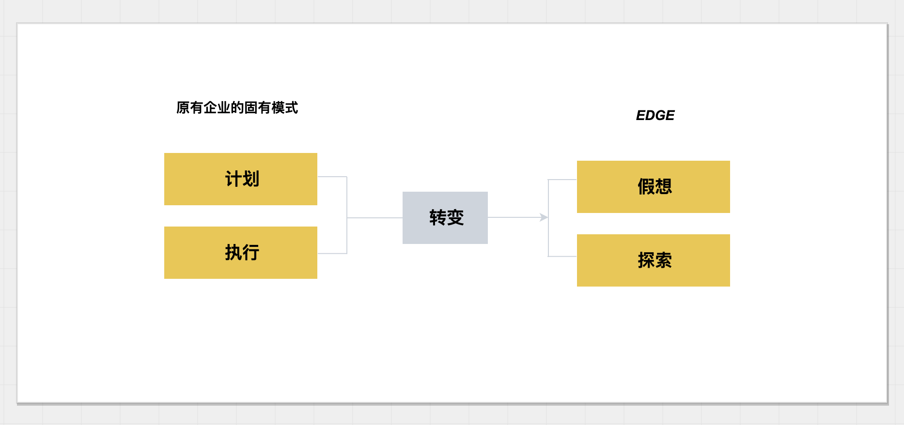
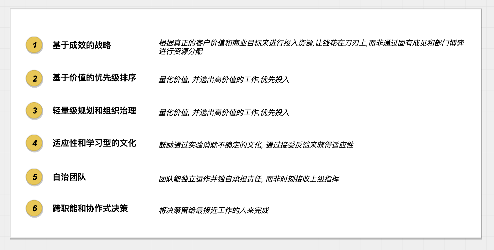
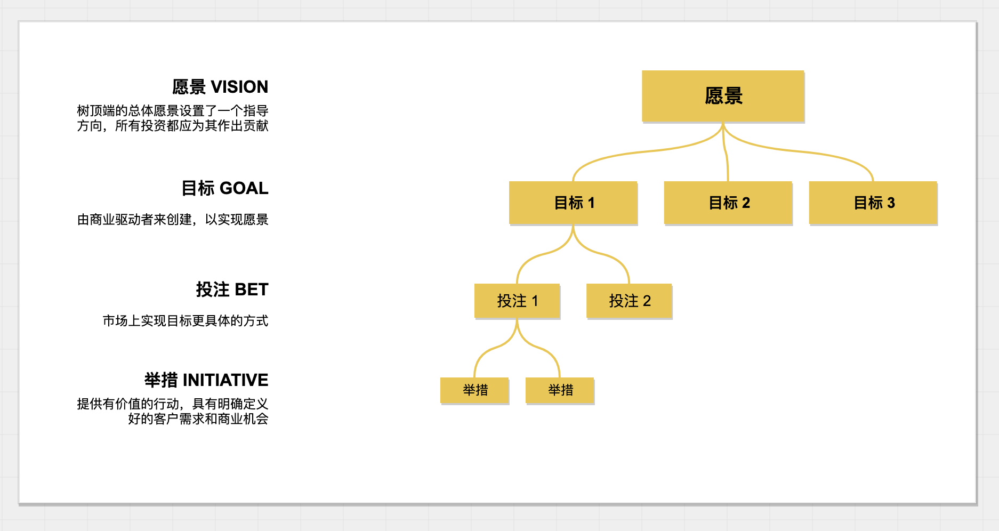
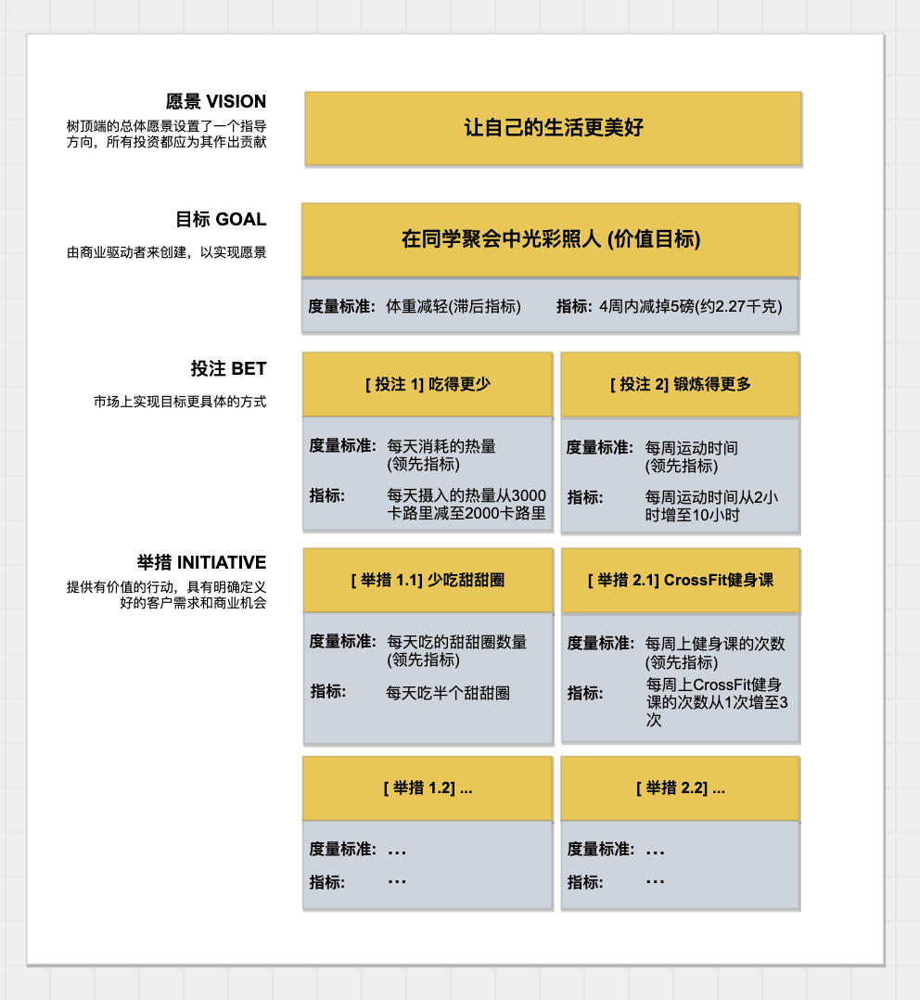
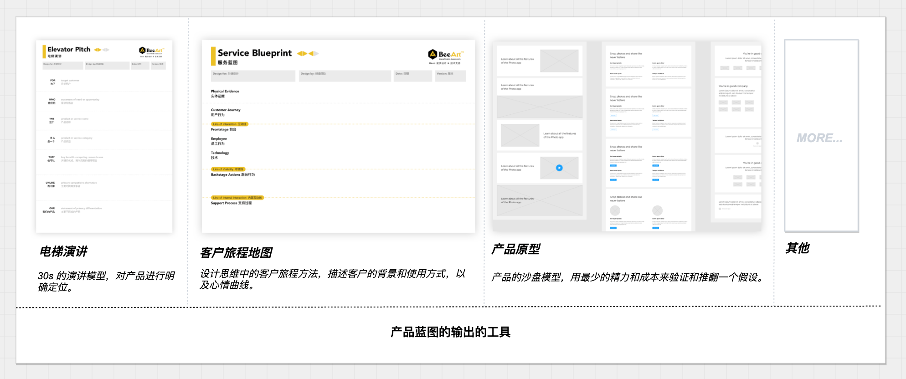
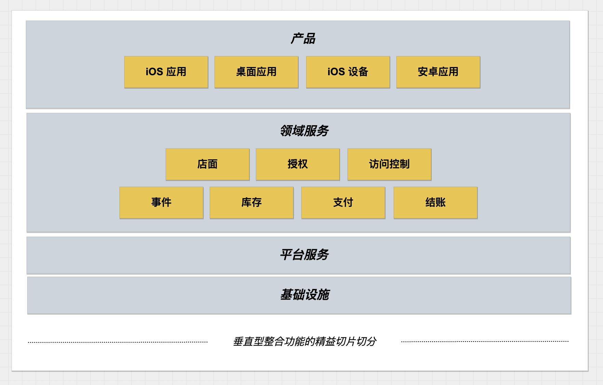
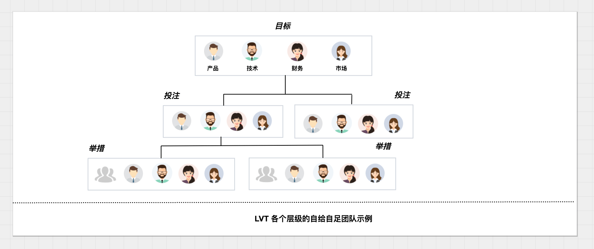

<!--
主题：EDGE 读书笔记
看点：EDGE 到底在讲什么
解决问题：EDGE 中有价值的几个点
-->

《EDGE: 价值驱动的数字化转型》是 ThoughtWorks 的数字化转型的理论框架，通俗来说就是写给各个企业的高层，指导他们如何进行数字时代的变革，更加科学的进行企业宏观业务规划和战略投资的。

在 Beeart 发布会薅到了一本，抽空读了一下。这本书读起来稍显晦涩，不多对企业高管和创业者很有帮助。如果以后有幸参与一个企业的创建（当然只是如果），或许能用上。所以整理了下该书的脉络，希望对《EDGE》这本书或方法论有兴趣的朋友有帮助。

## 原则：适者生存

冰河时期的到来让强大的恐龙、猛犸象身陷囹圄继而灭绝，但是相对弱小的多的水母、小型爬行动物却生存了下来。

> ”不是强者生存,也不是智者生存,而是适者生存“ —— 查尔斯·罗伯特·达尔文

对绝大多数企业而言，要紧的事不是情怀和改变世界，而是活下去。时代的趋势，不因某个高管的意志而转移，无论这个企业多么强大。贝尔实验室、洛基亚、柯达这些行业巨头都没能逃过这个规律，无论曾经多么强大。

当下处于信息化变革如日中天的时代和第四次工业革命前夜，机会和挑战并存，同时也带来混乱。在复杂性理论中，有一个叫做 ”混沌边缘“的概念。这个概念表述了一种随机性和结构性的模糊地带，充满不确定性，刚好可以用来描述暗流涌动的当下。

《EDGE》描绘了如何在”混乱的边缘“中提高企业的适应性，从而应对这场变革。把原来企业的固有模式 **计划 - 执行** 调整到 **假想 - 探索**，从而实现企业的敏捷转型。

根据外部反馈构建适应性企业，适者生存，就是原则。

适应性企业原则有如下表述:

- 基于成效的战略。根据真正的客户价值和商业目标来进行投入资源，让钱花在刀刃上，而非通过固有成见和部门博弈进行资源分配。
- 基于价值的优先级排序。量化价值，并选出高价值的工作，优先投入。
- 轻量级规划和组织治理。将决策权力下放到自治团队，而非事无巨细的规划。
- 适应性和学习型的文化。鼓励通过试验消除不确定性的文化，通过接受反馈来获得适应性。
- 自治团队。团队能独立运作并独自承担责任，而非时刻接收上级指挥。
- 跨职能和协作式决策。将决策留给最接近工作的人来完成。

##  方向：企业如何规划和投资？

传统企业的资源分配往往是企业中部门博弈的结果，当下赚钱的部门往往是既得利益者，但不一定是未来最应该投资的方向。这种分配造成企业的资源分配固化，边缘而有前景的部门得不到重视。即使是数字化企业先锋 Google 公司也存在此类问题，广告业务是其最赚钱的业务，每年分走大量的利润，但是持续投资却无法获得增长。最赚钱的业务，已经成为很多公司的达摩克利斯之剑。

适应性企业的第一个挑战就是如何合理的规划业务和投资？并最大程度的匹配到企业的发展方向上，从而实现愿景。

精益价值树（LVT）是一项用来厘清投资问题的有效方法，用来直观的表达投资战略意图。它用”树“型结构描述投资组合之间的关系，并分为多层结构。

- 愿景 （VISION）。树顶端的愿景为企业的指导方向，所有投资都应为其作出贡献，是一个 LVT 的焦点。
- 目标 （GOAL）。目标是对高层商业战略的相对稳定的观点。
- 投注 （BET）。投注包括了一个投注的组合，投注这个词代表了适应性，对其能否最终如何实现持有”推测“态度。
- 举措 （INITIATIVE）。对投注的具体实现，往往由一些试验性活动构成，可以由自治团队来负责。

使用 LVT，下一级的所有实践，都以上一级节点为中心，保持最大的灵活性。另外 LVT 并不是一成不变的，LVT 本身也应该随着时间进行演进，而获得适应性。

## 聚焦：如何找出高价值的工作？

尽管可以使用 LVT 划分投资得到一个宏观的投资视图，但是还需要解决另外一个问题。

如何度量这些投资的成效并对其排序？

如果没有一些明确的成效指标，就只能通过华而不实的论述和对于成败的武断结论，因此需要制定适当的成功度量标准（MoS）。成功度量标准作为 LVT 重要元素，是推动 LVT 落地实施的关键措施。

人生也需要经营和打理，用 LVT 来规划一个 “美少女” 的个人目标，不失为一个生动的例子。

另外，价值并不只是来自市场的认可，企业内部也有大量有价值的工作，也需要得到认可和投资。因此在 EDGE 中将价值划分内部价值和外部价值。

- 内部价值：由团队内部认可的有价值的工作，例如流程改进，技术债的清理或者工艺升级。内部价值往往在短期内看不到明显的收益，但是如果是团队内部认可能提高工作效率的事情就应该去做。
- 外部价值：来自市场或者外部反馈的价值，例如产品中的新的特性，市场上期待的新产品，或者市场占有率的提高。

在价值评估时，需要在两种价值观中取得一个微妙的平衡，否则不同部门的之间会互相倾轧。

度量标准往往没那么好进行量化分析，可以使用当前的状态作为标的。比如以当前市场占有率为标准，用增量的方式制定成功度量标准则可以表述为，3 个月内市场占有率提高 5%；

## 布局：如何整理产品蓝图？

从 LVT 中可以得到企业的投资分布，到具体的落地则需要通过产品思维落地到实施中。产品可以作为 LVT 的输出件，从 LVT 中输出出来。

产品可以是 LVT 中的一个投注，产品中的某个特性可以是 LVT 中的一个举措，但并不是一一对应的，可以视当前的软件形态和规模来匹配这个粒度。

一个精心设计的投注可以激发出许多产品创意，而在启动一个产品时候可以开展一次探索研讨会，对新产品的启动非常有帮助。

当定义了一个产品时，根据 LVT 的投资组合可以作为产品蓝图的输入，比较好的做法是将产品蓝图和 LVT 中的组织目标保持一致。需要注意，产品蓝图**不是**一个详细的计划、敏捷产品的代办列表或者产品路线图。而是一个沙盘或者交流工具，用于随时和组织内部就未来的发展方向达成一致。

产品蓝图的输出的工具有：

- 电梯演讲。30s 的演讲模型，对产品进行明确定位。
- 客户旅程。设计思维中的客户旅程方法，描述客户的背景和使用方式，以及心情曲线。
- 产品原型。产品的沙盘模型，用最少的精力和成本来验证和推翻一个假设。
- 其他工具。

## 落地：如何从产品规划切入敏捷迭代？

产品蓝图被定义出来后，根据产品蓝图输出用户故事，进入迭代交付。但是交付团队往往要做的事情，并不只是实现用户故事。还有很多的事情要做：

- 修复软件缺陷
- 响应生产环境的事故和问题
- 清理技术债
- 技术能力预研
- 已有特性的少量增强

将产品蓝图切入到敏捷迭代需要需要合并这些不同的代办列表，并根据不同的比例排入迭代进行交付，保证产品的持续运行。

另外蓝图描绘了整个产品的设计全景，在架构上系统性的包含一个完整的产品设想。对于一个包含数据库、后台服务、web、APP等组件的产品，我们不可能先做其中某一部分，而是先做一个”五脏俱全“的最小可用系统出来。

最小可用系统就是 MVP，要构建最小 MVP 就需要横跨架构的需求裁剪，这就是精益切片。从架构上对产品进行垂直切片，快速地验证技术上的假设和方法，通过精益切片，深入研究整个架构层。

## 人：如何建立自治团队？

管理大师稻盛和夫说所有管理问题，最终都是人的问题。EDGE 中团队被期望成为一个一个自治的团队，而非只接收命令的团队。自治团队具备独立交付单位价值的能力，从而解决跨多个团队工作带来的挑战。

自治团队有下列特征：

- 减少依赖。
- 减少吞吐量。
- 简化估算。
- 提高透明度。
- 愿景一致。
- 胆识远见。
- 降低风险。

建立自治团队的方法是通过 LVT 导出，LVT 中不同层级代表着不同的关注点，他们的职责都处于不同的层级。

- 目标团队。自给自足的领导者团队，以目标为服务对象，由技术、产品和市场等多个领域的领导者组成，对目标成效负责。
- 投注团队。某一项投注的领导团队，以投注为服务对象，由具体一级的技术、产品和市场的多个领域的领导者组成，对投注负责。
- 举措团队。自给自足的交付团队，由开发人员、设计、产品人员、技术专家和测试人员等构成，也称为交付团队和产品团队。

委派、赋权和自治，作为管理的三个重要要素，在不同层级的要求不同，举措团队对业务和产品的实现负责，投注团队和目标团队则对战略决策负责。

形成自治团队不是一蹴而就的，需要经历一个过程，一个典型的团队发展模型是：

- 组建期（forming）
- 激荡期（storming）
- 规范期（norming）
- 执行期（performing）

自治团队的形成过程犹如破茧成蝶，在组建初期往往很脆弱，包含着大量冲突，认识到自治团队的形成过程，可以避免对其建立初期过高的期望。

如何建立自治团队的背后问题实际上是解决组织架构和业务架构适配的问题，而 LVT 就是被这样设计而来的，只有推动组织架构的更新，才能让信息透明流动、产生合理决策以及风险及时上报。

最终，才能响应数字化时代的变化，抓住瞬息万变的机遇。
