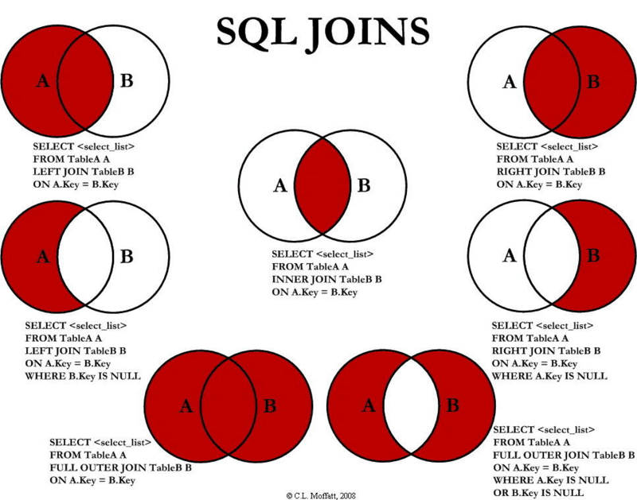

## 测试数据

```
SELECT * FROM `spring-boot-boilerplate`.user,department where department.id = user.department_id;CREATE TABLE `department` (
  `id` bigint(20) NOT NULL AUTO_INCREMENT COMMENT 'ID',
  `name` varchar(255) NOT NULL,
  `pid` bigint(20) NOT NULL COMMENT 'parent department',
  `enabled` bit(1) NOT NULL,
  `createAt` datetime DEFAULT NULL,
  `updateAt` datetime DEFAULT NULL,
  PRIMARY KEY (`id`) USING BTREE
) ENGINE=InnoDB AUTO_INCREMENT=9 DEFAULT CHARSET=utf8 ROW_FORMAT=COMPACT;

CREATE TABLE `user` (
  `id` bigint(20) NOT NULL AUTO_INCREMENT COMMENT 'ID',
  `avatar_id` bigint(20) DEFAULT NULL COMMENT '头像资源',
  `email` varchar(255) DEFAULT NULL COMMENT '邮箱',
  `enabled` bit(1) DEFAULT NULL COMMENT '状态',
  `password` varchar(255) DEFAULT NULL COMMENT '密码',
  `username` varchar(255) DEFAULT NULL COMMENT '用户名',
  `department_id` bigint(20) DEFAULT NULL,
  `phone` varchar(255) DEFAULT NULL,
  `createAt` datetime DEFAULT NULL,
  `updateAt` datetime DEFAULT NULL,
  PRIMARY KEY (`id`) USING BTREE,
  UNIQUE KEY `unique_email` (`email`) USING BTREE,
  UNIQUE KEY `unique_username` (`username`) USING BTREE
) ENGINE=InnoDB AUTO_INCREMENT=7 DEFAULT CHARSET=utf8 ROW_FORMAT=COMPACT;

```

## inner join  和自然连接


```
SELECT * FROM `spring-boot-boilerplate`.user,department where department.id = user.department_id;

```

这种是自然连接，和 join、inner join 效果一样。需要两张表都有数据，结果是两张表的集。

## left join


## right join




