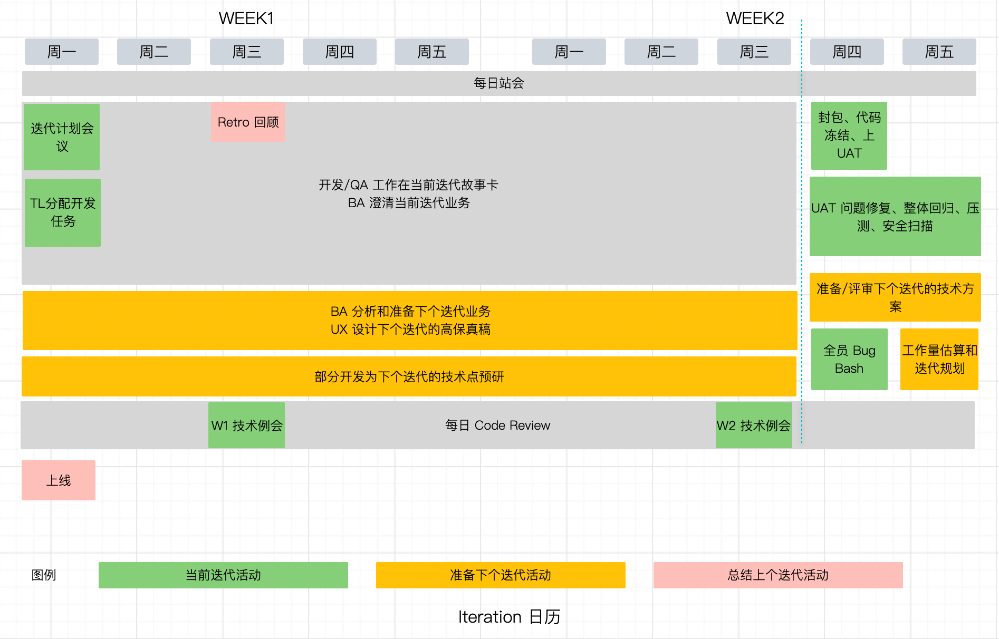

你可能疑惑我为什么写这样一篇文章，其实我就是想为 Bees 团队再找一些富有热情的开发者。

这篇文章写在去客户现场的路上，时间仓促，只为给你介绍一个有意思的团队。

如果你打算在下次的乘风计划中寻找一个中意的目标的话，不妨一看。

以下都是发生在我进入 Bees 团队后，工作在 BeeArt 项目中的真实体验。

## 关于技术

如果你想在下一个团队中尝试微服务的话，BeeArt 这个产品可能不适合你，因为我们已经把微服务基本拆了。

这听起来是不是不太像 ThoughtWorks 的主流技术方案，而几乎每个人都在聊微服务？

我们确实参考了 ThoughtWorks 的这种技术实践，并坚持技术卓越，不过后来我们意识到微服务并不适合 BeeArt 当前的业务（至少目前是）。BeeArt 还不够大，团队人数也不多，虽然疫情期间我们的人数规模巨大。但她确实是一个小项目，前后端分离就足以应付，而不必付出微服务的开销。

在团队专注于 BeeArt 之前我们有几个产品 —— BeeAuth、BeeMaster、BeeArt 等，随着业务的聚焦，BeeArt 从这些产品中剥离开来，目的是快速的迭代和演进，我们意识到我们不是大厂。

我从 Bees 学到的第一个知识就是：何时该使用微服务？如何把一个微服务系统合并为单体？

合并为单体的过程并不容易，服务的拆分造成代码风格的分化，合并并不比拆服务容易，最终我们花了一个迭代的时间完成了主体合并，又花了一些时间处理了其他服务。

这样说来，BeeArt 没啥技术含量，听起来没啥意思呢。

其实，BeeArt 是个技术挑战比较多的项目：

**实时协作系统。**BeeArt 的业务需要做到多人实时协作，我们在这个上面做了很多探索了，如何保证协作的可靠性和速度，这些需要一些对计算机网络有一定了解。我也是在这里重温了大学中学到的网络协议等相关知识，有时候也需要深入源码解决一些问题。比如往往大多的服务器底层库使用的 netty，这是一个非常重要的网络库。

**浏览器中的图形编辑。** BeeArt 要做到在浏览器中实现画图，制作类似 UML 的图形。即使我们使用了开源的图形库，也需要对图形学、动画有一些了解。作为服务器开发者，我对这部分了解不多，不过参与了一点图形编辑的开发。有时候复杂的逻辑需要用到一些算法和数学，十分有趣，在开发体验上和交付类的工作不太一样。

对了，忘了说，我们也使用 k8s、CDN、https、对象存储等主流的技术方案，以及主流的 deveops 实践。

## 关于团队合作

和团队共同学习到了如何在**产品型的团队实施敏捷。**

这是可以复制到其他的产品团队甚至带到下一份工作中的宝贵经验。

**迭代日历。** 敏捷团队需要拥抱变化，产品型的团队的变化来得更为剧烈。我们坚持 ThoughtWorks 的敏捷方式，但又不拘泥于此，团队摸索出了一套自己的敏捷方式。

我们坚持每个迭代发布一次，我们也在坚持在固定的时间进入 UAT。尽可能的完成迭代目标的同时，尽量不在迭代内加入额外的工作。我们把我们的敏捷活动梳理如下，可能有一些实践会遭到敏捷 “专家” 的反对，不过这些经验都是从实践中来。

**版本管理。** 我们坚持使用语义化的版本管理方式（semver version）。标准的版本号采用 X.Y.Z 的格式，其中 X、Y 和 Z 为非负的整数，且禁止在数字前方补零。X 是主版本号、Y 是次版本号、而 Z 为修订号。

我们坚持使用这种版本管理方式，截止这封邮件，目前已经发布了 2.11.0，2.12.0 已经在 UAT 测试中，2.13 的准备工作已经就绪。值得感谢的是团队为每一次的发布编写了 change log。

**研发策略。** 不同于交付，Bees 的工作更应该叫做“研发”而不是软件开发。画布每上一个新的特性都有很大的不确定性，如果使用敏捷的迭代交付方式，有可能在迭代中途才能发现这个特性有可能无法实现。

我们学习到了如何控制这类需求 —— 不确定性极强的业务。我们的产品同事提前 1 - 2 个迭代发出可能的需求，我们会尝试提前预研(spike)，预研完成需求会排入后续的迭代中交付。

就像中国航天工业做的那样：预研一代、细化一代和交付一代。

## 关于认知成长

除了技术和团队的经验外，还有一些 “软经验” 值得一提。

**客观精神。** 左也不对，右也不对，做产品需要的认知是客观精神。我们在这上面吃了一些亏，但学到了很多，尤其是一项技术决策。说实话，软件团队在客观技术选择上面吃的亏不少，即使大厂也不是在建了中台又拆中台么？

我们学到的经验是，选择实用的、低成本的技术，看待一项技术令人激动的优势时，也要逆向思维，分析它的劣势和成本。

**面对失败和挫折。**做产品和使用不确定的技术必然有失败的风险，这是客观存在的。无论是技术、产品和其他方面，BeeArt 在发展的过程都走了一些弯路。

尝试更换用于画布底层的数据结构，因为没有考虑到的因素在产品环境开启失败（设计了开关）；水平扩容方案在客户的环境下遇到了多活，不得不重新寻找扩容方案；需要使用 MongoDB 但客户因合规的原因不再提供等等。

认识到失败只是一种反馈，告诉我们这样做不可行，仅此而已。

**技术思维局限。**技术思维和产品思维不太一样，做技术的人容易限于技术的局限，我也一样，在做 BeeArt 的过程中，改变了一些。技术思维容易让人陷入误区，做出很酷但是没什么用的东西，也没有人愿意花钱买它。既然是做一个软件产品，客户是第一的，我说的客户是愿意花钱的人。

打破技术思维是在 Bees 团队中最大的认知成长，作为开发者又能保持对业务的开放心态，应该能学到更多有意义的东西。

## 写在最后

我用了最大诚意把我们遇到的问题和经验写出来，如果你对这些技术有兴趣并有热情让产品做得更好，欢迎和我们聊聊。

