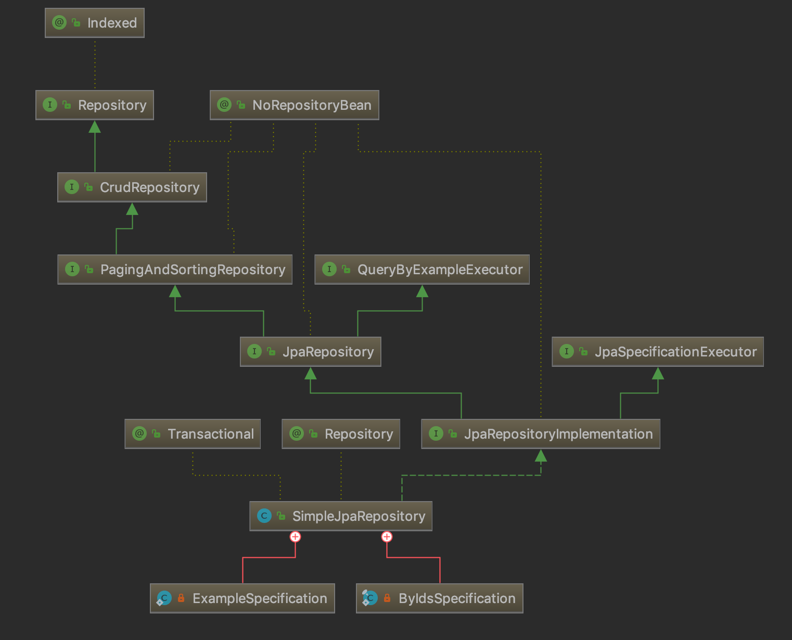

## Spring、Spring data 和 Spring data JPA 的关系

Spring data JPA 是 Java 服务器开发中最容易混淆的一堆概念。

- Spring，众所周知是一个轻量级的 IOC 容器，用来处理对象实例（Bean）之间的关系。
- Spring data，是 Spring Framework 生态下用来访问数据的一个模块。
- JPA，是 Java persistence API 的缩写，Java 用来抽象访问数据库的规范，主要实现有 Hibernate、TopLink 等 ORM 库。
- Spirng data JPA，是 Spring data 项目的一个主要模块，用来封装 JPA 实现，并增加了一些便利的方法。如果直接使用 Hibernate 还是需要编写类似于 SQL 的 JPQL 的查询语言。但使用 Spring data JPA 可以实现类似 `findById()` 一类基本操作的方法。

Spring Data 的一些属于版本火车的子项目：

- Spring Data Commons
- Spring Data JPA
- Spring Data KeyValue
- Spring Data LDAP
- Spring Data MongoDB
- Spring Data Redis
- Spring Data REST
- Spring Data for Apache Cassandra
- Spring Data for Apache Geode
- Spring Data for Apache Solr
- Spring Data for Pivotal GemFire
- Spring Data Couchbase (community module)
- Spring Data Elasticsearch (community module)
- Spring Data Neo4j (community module)
  
版本火车指的是，不同的独立子项目会保持同步的发布节奏，如果使用 Spring boot，也会随着 parent pom 变化，避免版本不一致导致的问题。

## Spring Data JPA 主要特性

- 辅助查询 `findByxx`
- 支持使用 Querydsl 复杂统一的查询方法
- 分页、排序
- 启动时检查 `@Query` 有效性

## Spring Data JPA 的主要类

从 SimpleJpaRepository 的实现开，使用 idea 分析出类图。




- EntityManagerFactory EntityManager 的工厂类
- EntityManager 一个接口，管理持久化操作的对象
- Entity 实体是持久性对象，对应存储在数据库中的记录
- EntityTransaction 和 EntityManager 是一对一关系，提供事务支持
- Persistence 包含静态方法，获取 EntityManagerFactory 实例
- Query 该接口由每个 JPA 供应商提供，用于数据查询

## 快速入门教程

https://spring.io/guides/gs/accessing-data-jpa/

## 常见的查询方法

查询方法策略就是Spring Data如何从 repository 中找到合适的查询方法。有一下几种

- CREATE 尝试从查询方法名称构造特定于仓库的查询。例如 findByName，根据约定有以下几种查询方式：
    -  find…By
    -  read…By
    -  query…By
    -  count…By
    -  get…By
- USE_DECLARED_QUERY 会从 repository 中定义的方法中寻找合适的查询方式
- CREATE_IF_NOT_FOUND 这是 JPA 默认的策略，组合CREATE和USE_DECLARED_QUERY


CREATE 策略的几个例子：

```
interface PersonRepository extends Repository<User, Long> {

  List<Person> findByEmailAddressAndLastname(EmailAddress emailAddress, String lastname);

  // Enables the distinct flag for the query
  List<Person> findDistinctPeopleByLastnameOrFirstname(String lastname, String firstname);
  List<Person> findPeopleDistinctByLastnameOrFirstname(String lastname, String firstname);

  // Enabling ignoring case for an individual property
  List<Person> findByLastnameIgnoreCase(String lastname);
  // Enabling ignoring case for all suitable properties
  List<Person> findByLastnameAndFirstnameAllIgnoreCase(String lastname, String firstname);

  // Enabling static ORDER BY for a query
  List<Person> findByLastnameOrderByFirstnameAsc(String lastname);
  List<Person> findByLastnameOrderByFirstnameDesc(String lastname);
}
```

- 表达式通常是属性遍历和可以连接的运算符。您可以使用组合属性表达式AND和OR。您还可以得到这样的运营商为支撑Between，LessThan，GreaterThan，和Like该属性的表达式。受支持的操作员可能因数据存储而异，因此请参阅相应部分的参考文档。

- 方法解析器支持IgnoreCase为单个属性（例如，findByLastnameIgnoreCase(…)）或支持忽略大小写的类型的所有属性（通常为String实例 - 例如findByLastnameAndFirstnameAllIgnoreCase(…)）设置标志。支持忽略情况的方式可能因商店而异，因此请参阅参考文档中的相关部分以获取特定于商店的查询方法。

- 您可以通过OrderBy向引用属性的查询方法附加子句并提供排序方向（Asc或Desc）来应用静态排序。

分页的情况
```
Page<User> findByLastname(String lastname, Pageable pageable);

Slice<User> findByLastname(String lastname, Pageable pageable);

List<User> findByLastname(String lastname, Sort sort);

List<User> findByLastname(String lastname, Pageable pageable);

```

## 一对多级联存储

一对多的级联存储时，需要配置好关联关系，然后将自增ID置空即可。

```
 Feature ageFeature = new Feature();
        ageFeature.setName("年龄");
        ageFeature.setStep(2);

        ageFeature.setFeatureValues(Arrays.asList(
                new FeatureValue(null, "10-20", ageFeature),
                new FeatureValue(null, "20-30", ageFeature)
        ));
        return ageFeature;
```


## UUID 生成策略

```
    @Id
    @GeneratedValue(generator = "UUID")
    @GenericGenerator(name = "UUID", strategy = "org.hibernate.id.UUIDGenerator")
    private String id;

```

## @Entity 实例里面常用注解


### @Entity

javax.persistence 包中提供，设置该对象会被 JPA 管理，并映射到指定的数据库表。

这个类可以给一个名字。

### @Table

指定数据库表名


```
// 表名，可以使用命名策略设置约定的名字
String name() default "";
// 数据库抽象概念,用于处理table 的命名冲突
String catalog() default "";
// 一般来说，是指数据库名
String schema() default "";
// 唯一约束，如果不使用 JPA 自动建表不用管
UniqueConstraint[] uniqueConstraints() default {};
// 索引，建表时候使用，一般来说不需要
Index[] indexes() default {};
```

### @ID

指定为实体的主键，JPA 兼容遗留系统，使用复合主键。@IdClass 

不过推荐不使用。


### @GeneratedValue

主键生成策略 GenerationType 中定义了四种主键生成策略

- TABLE 通过表序列生成，框架模拟表增长
- SEQUENCE 采用数据库序列增长，MySQL 不支持这种方式
- IDENTITY 使用表主键的自动增长
- AUTO 自动选择，默认设置选项，但不推荐使用

### @Basic 

属性到数据库字段的映射，如果实体属性上没有任何注解，默认为@Basic

使用 @Basic 提供了额外懒加载的特性，对大字段非常有用

### @Transient 

设置为忽略，表明该字段不会被持久化。使用上和 @Basic 相反，JPA 映射数据库的时候选择忽略它。


### @Column 

定义实体属性和数据库字段的列名，这个注解的参数比较多。

```
// 列名
String name() default "";
// 是否唯一
boolean unique() default false;
// 是否允许为空，用于建表时使用
boolean nullable() default true;
// 是否插入数据库
boolean insertable() default true;
// 是否运行更新数据库
boolean updatable() default true;
// 表名，用的比较少
String table() default "";
// 下面三个用于创建表的属性设定
int length() default 255;
int precision() default 0;
int scale() default 0;
```

### @Temporal 

Temporal 用于设置 Date 类型的属性到对应精度的字段。

- TemporalType.DATE 映射为日期
- TemporalType.TIME 映射为时间
- TemporalType.TIMESTAMP 映射为时间戳

### Enumerated 

```
    @Enumerated(STRING)
    private AccountRoles role;
```

可以将字符串类型变成枚举类型，如果不使用这种方式，枚举会被自动转换为数字。如果将来发生变化，就无法映射回到正确的枚举值。需要注意的是，定义枚举时，如没有任何 valueOf的方法，在序列化和反序列化时对大小写敏感。

### @Lob

建表时候映射为大字段

- 如果是字符串类型会映射为 Clob 类型
- 如果是字节类型，会映射为 Blob

### @JoinColumn

配合 @OneToOne、@OneToMany、ManyToOne 使用，单独使用没有意义。

@JoinColumn 多个字段的关联关系，很少用

### @OneToOne

```
// 默认当前字段的类型
Class targetEntity() default void.class;
// 级联操作类型
CascadeType[] cascade() default {};

1. CascadeType.ALL
2. CascadeType.PERSIST
3. CascadeType.MERGE
4. CascadeType.REMOVE
5. CascadeType.REFRESH
6. CascadeType.DETACH

// 是否懒加载

FetchType fetch() default EAGER;

// 是否为空
 boolean optional() default true;

// 配置对方拥有关系
String mappedBy() default "";

// 是否允许级联删除
boolean orphanRemoval() default false;

```

@OneToOne 需要和 @JoinColumn(name = "solution_id") 配合使用。

例如一个用户对应有一个头像

```
    @OneToOne(cascade = CascadeType.ALL)
    @JoinColumn(name = "avatar_id")
    private UserAvatar userAvatar;
```

### @OneToMany 和 @ManyToOne

这两个参数和 @OneToOne 差不多，也需要和 @JoinColumn 配合使用

```

    @OneToMany(fetch = FetchType.EAGER, cascade = CascadeType.ALL)
    @JoinColumn(name = "feature_id")
    private List<FeatureValue> featureValues;
```

@OneToMany 需要额外配合使用的注解是 @OrderBy

在 @OneToMany 中，使用 @OrderBy 控制列表的顺序

```
    @OneToMany(fetch = FetchType.EAGER, cascade = CascadeType.ALL)
    @JoinColumn(name = "feature_id")
    @OrderBy("order DESC")
    private List<FeatureValue> featureValues;
```

## @ManyToMany 

多对多一般发生在聚合根之间，其中有一个隐藏的关联表。

```
    @ManyToMany
    @JoinTable(name = "product_feature_value",
            joinColumns = {@JoinColumn(name = "product_id", referencedColumnName = "id")},
            inverseJoinColumns = {@JoinColumn(name = "feature_value_id", referencedColumnName = "id")}
    )
    private List<FeatureValue> featureValues;
```

一个 Product 有多个 FeatureValue，使用多对多需要引入 product_feature_value 中间表。

## @EntityGraph 解决 N+1 条 SQL 的问题

使用一对多，多对多关联的时，会产生 N+1 条SQL，我们可以通过使用 Join 来避免这种情况。

使用 join 有三种方法

- @EntityGraph 在实体关联阶段解决
- @Query JPQL
- Criteria API 编写 JOIN 子句


使用 @EntityGraph

现在实体上定义

```
@Table(name = "user")
@NamedEntityGraph(name="userReadModel.department",attributeNodes={@NamedAttributeNode("department")})
public class UserReadModel {

    @ManyToOne
    @JoinColumn(name = "department_id")
    private Department department;

```

在查询的方法上使用即可

```
@Repository
public interface UserReadModelRepository extends JpaRepository<UserReadModel, Long>,
        JpaSpecificationExecutor<UserReadModel> {

    @EntityGraph(value = "userReadModel.department" , type= EntityGraph.EntityGraphType.FETCH)
    List<UserReadModel> findAll(@Nullable Specification<UserReadModel> spec);
}
```

## 一些坑

1. @ManyToOne 如果 one 这一方不存在，会报错，即使设置了 Optional
2. 应该使用 DDD 思想去设计关联，减少不必要的关联，聚合根之间不要关联。查询使用 join 完成
3. @OneToMany 关系默认懒加载会报错，应该设置为 Eager，或者使用 @Transactional 但是会带来性能开销
4. @OneToOne 本质上是实体和值对象的关系，统一使用实体的ID
5. @ManyToMany 默认会删除关联表
6. @Save  时候如果外键在对应表中，找不到目标记录会丢出错误,例如用户属于某个部门,拥有多个 Role

```

{
  username:"",
  department:{
    id: 1
  },
  roles:[
    {
      id:1
    }
  ]
}

```
当 role 的 ID 在数据库中不存在时，会报错，需要处理异常。

7. 当数据库插入异常，会报错，例如违反主键规则
8. 更新、插入，只要不报错都会返回成功，无需再检查返回值

## JPA 和建表规范

- 根据 DDD 原则建表
  - 例如 user user_avatar user_role

## 性能优化

1. 不要有一些无意义的关联
2. 使用 NamedEntityGraph 帮我们一次抓取数据，可以明显减少 SQL 数量

## 在 Spring data 中使用 entityManager 直接操作数据


```
  @Autowired
  EntityManager entityManager;

  Role role = entityManager.find(Role.class, savedRole.getId());
  assertEquals("remark", role.getRemark());

```

## 参考资料

-  示例项目 https://github.com/spring-projects/spring-data-examples/tree/master/jpa
-  Spring data  中文版本 https://blog.csdn.net/yongboyhood/article/details/81226553
-  JPA 教程 https://www.yiibai.com/jpa/jpa-introduction.html

