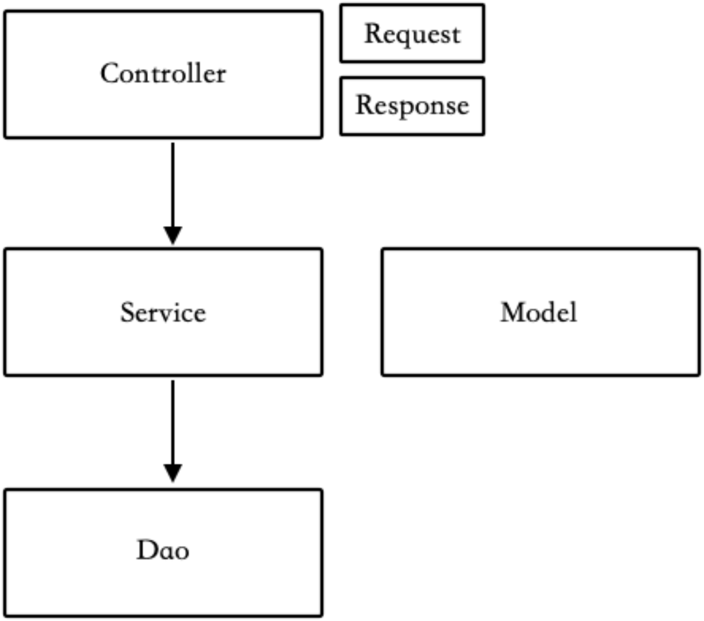
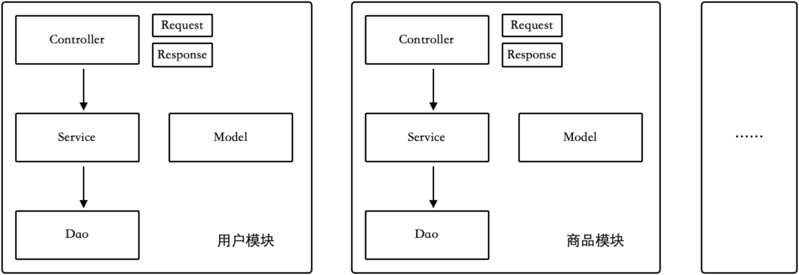
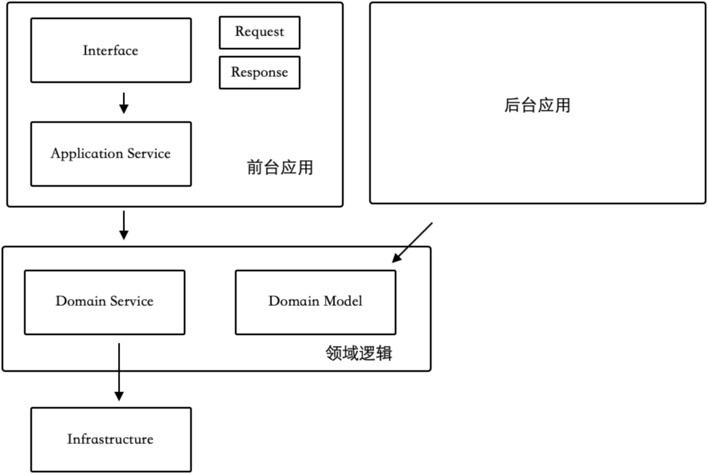
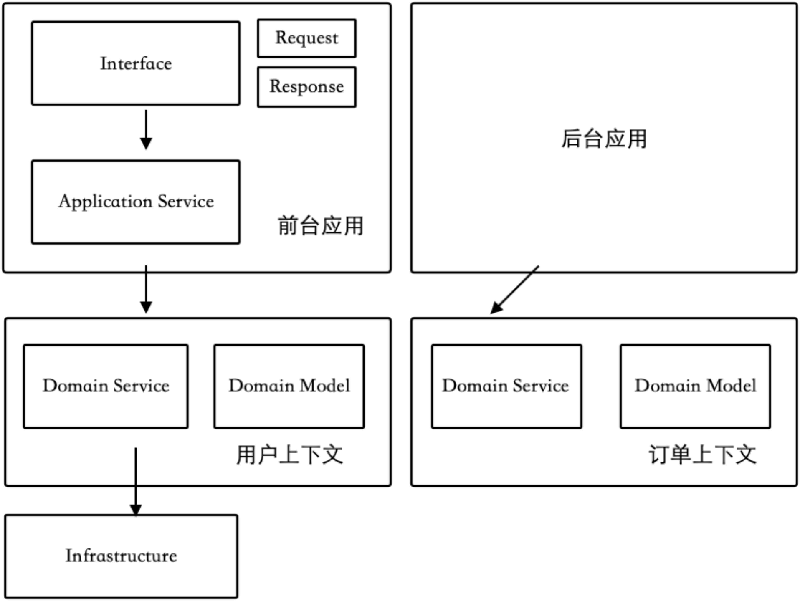
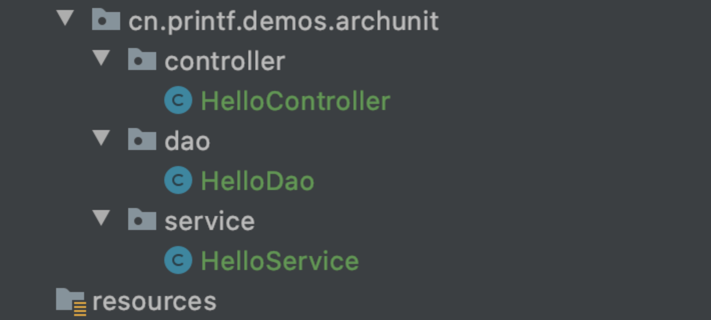
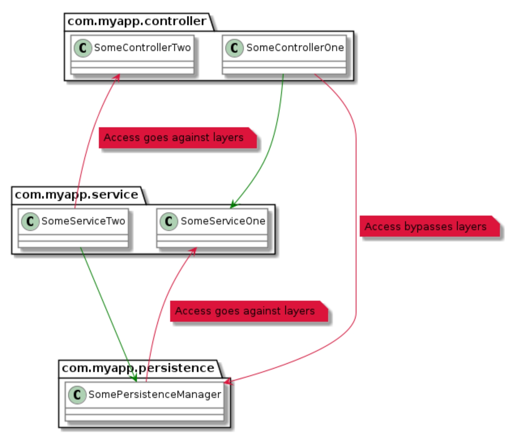

有过大量经验的开发者都知道的一个事实，软件项目和架构极其容易腐化。在没有很好地管控下，无论采用 MVC 三层架构还是 DDD 的四层架构，代码的结构会在几个月内变得混乱不堪。

我曾经接手过一个项目，它的依赖关系非常混乱。在这个项目中，开发者常常将用于 API 接口参数的 Request/Response 等对象用于数据库、Redis 存储，为了偷懒，明显让架构的下层依赖了上层结构。我花费了大量的时间和精力进行了重构，并在每日 Code view 时强调包结构的重要性。另外，随着不熟悉项目的新人加入，也会造成一些代码的随意放置。

可以让包结构检查作为自动化检查的一部分，从而节省团队技术经理的管理精力。ArchUnit 是一个小型、简单、可扩展的开源 Java 测试库，用于验证预定义的应用程序体系结构和约束。

在使用 ArchUnit 之前，我们需要讨论下一些常见的代码分包方式。鉴于微服务和单体下组织代码的背景不同，不同项目的分包策略也不同，这里按照单体系统下的结构说明。

#### 1. 常见 Java 工程的包结构

Java 应用项目中一般有两种组织代码的方式。一种是按照 “大平层” 的风格，即将同一类代码放到一个包中，比如 Service、DAO；还有一种是按照业务模块划分，每个模块下有自己的 “大平层”。

另外，还有层次划分的方式。一种是 MVC 风格的三层结构，分为 Controller、Service、DAO；另外一种是 DDD 的四层结构，分为 Interface、Application、Domain、Infrastructure。

通过这两个维度会有 4 种包组织的方式，下面一一说明。

**MVC 大平层分包**

这是一种最简单的分包方式，按照最开始 MVC 模式的逻辑，业务应该写在 Controller 中。但是着前后端分离的发展，View 层消失了，在 Spring Boot 等框架中 Controller 通过 RESTful 的注解代替了 View 层的逻辑，主流的做法是将业务逻辑写在 Service 中。

 

为了保持架构整洁，这种分包结构下需要有如下简单规则：

- 相同类型的文件放到相同的包中。
- 上层对象可以依赖下层对象，禁止反向依赖。
- Request 对象只能在 Controller 中使用，为了保持 Service 层的复用性，不允许在 Service 中引用 Controller 层的任何类。
- 不建议将 Model 直接用于接口的数据输出，而应该转换为特定的 Response 类。
- 所有文件需要使用包名作为结尾，例如 UserController、UserService、UserModel、UserDao。

这是一种最简单、清晰的包结构划分，这里还没有涉及枚举、远程调用、工厂、远程调用等更为细节的包结构设计，可以继续按照需要拓展，把握大方向即可。

**MVC 按照模块分包**

大平层的分包在大多数项目已经够用，能做到已经非常不多，很多项目甚至没有做到这种简单的包结构维护。

但是对于一些复杂的项目，这种包结构会受到团队质疑。当业务很复杂时，每一个目录下的文件会非常多，因此需要根据业务进行划分模块，每个模块下，又有单独的大平层结构。

 

按照这种方式分包可以将各个业务模块分开，从而简化单个模块的开发复杂度，但是会让系统整体变得复杂。享受这种分包好处的同时，需要额外的注意它带来的问题。

例如用户模块的 Controller 可以访问商品模块的 Service，商品模块的 Service 又可以回过头来访问用户模块的 DAO，随着时间的流逝，虽然看起来各个模块的文件都是分开的，但是业务依然会混乱。

为了解决这个问题，使用这种分包方式，除了需要遵守上面的规则，还需要额外增加几个规则：

- 跨模块访问时，不允许直接访问 DAO，而是访问对方的 Service。
- 模块之间应该通过 Service 互相访问，而不是通过表关联。
- 模块之间尽量不允许循环依赖，如果产生循环依赖，应该重新设计。

按照模块分包，对较大、复杂的应用有非常好的作用，可以将单个开发者的心智负担降低。

**DDD 大平层分包**

MVC 分包的方式对大部分的情况都能很好的满足，但是对于越来越复杂的互联网应用来说，也有一定的局限性。

举个例子来说，当我们的应用需要支持多个角色的操作时， MVC 会带来一些混乱。这里的角色不是指管理员和超级管理员那种仅仅是权限不同的角色，而是管理员、用户、代理商等完全不同的操作逻辑和交互，为了避免概念上的冲突，一些公司也把这种用于不同的场景的模块叫做 “面”。

这种思想和领域驱动设计的分层思想不谋而合。

DDD 四层结构使用了不同的概念：

- Interface 层：用于隔离不同接口差异，比如 XML、WebSocket、JSON 等。
- Application 层：用于隔离应用差异，将为用户的操作和管理员的操作隔离开。
- Domain 层：用于将复用业务逻辑。
- Infrastructure：一些基础设施，例如数据库、Redis、远程访问。

 

使用 DDD 分包带来的包结构划分和 MVC 区别不算特别大，主要是将应用层分开，使用的规则比较类似。类似的，DDD 的大平层分包将应用层隔离，领域层的同类型代码放到一起。

**DDD 按照模块分包**

使用 DDD 风格的分包也可以按照模块划分，它的模块划分只是针对于领域对象和领域服务，并且有一个专门的术语——上下文。

 

需要注意的是 DDD 按照模块分包并不是一股脑的将所有的 Controller、Service 纳入某个模块，这种做法会造成业务的进一步混乱。首先是将应用和领域分开，再各自按照不同的逻辑进行拆分。

DDD 风格的模块分包，也需要遵守一些额外的规则：

- 应用依赖领域，领域不允许依赖应用。
- 上下文之间不允许循环依赖。
- 下下文之间的访问都需要通过 Domain Service 完成，不能直接调用对方的数据层。

实际工作中，以上四种分包的方式都遇到过，虽然不会完全一样，但是相差不多。选择分包的方式应该根据自己的业务情况来，如果业务简单还使用较为复杂的包结构，会带来非常多的样板代码，降低开发效率。

分层的本质是为了隔离差异，如果在已经能预知的时间内，没有差异的出现可以先不考虑的分层，这种分层除了人为增加复杂度之外往往没有用。

当然，还有洋葱架构、六边形架构等其他架构方式，但是相对比较小众，这里暂且不做分析。

考虑好分包方式后，我们可以配置 ArchUnit 检查条件和约束规则。我们以 “MVC 大平层分包” 方式为例，说明如何使用 ArchUnit 对包结构进行检查。当然不使用 ArchUnit 我们也可以通过团队契约、多模块的项目设计，对团队开发做出一些约束。

#### 2. ArchUnit 的原理

ArchUnit 利用反射和字节码技术获取所有的包、类、字段等信息，并通过特定的分析来确定对象之间的访问关系。ArchUnit 使用 ASM 作为字节码分析的工具，代价是 ArchUnit 的很多规则的定义不是类型安全的。

ArchUnit 支持的检查特性有：

- 包依赖检查。
- 类依赖检查。
- 类和包的位置约定检查。
- 继承检查。
- 分层依赖检查。
- 循环依赖检查（Spring 支持双向依赖往往会导致这个现象）。

ArchUnit 本身也是按照分层架构设计的，其 API 分为 三层：

- Core：核心层，处理一些基本的类、字节码等操作，用于 import 一组类进行断言。
- Lang：处理各种规则的语法和架构逻辑，以及一些基本的检查器。
- Library：定义了一些更为复杂的预定义规则。

#### 3. ArchUnit 使用入门

ArchUnit 使用比较简单，可以通过 JUnit 的 Runner 运行，也可以通过 Maven、Gradle 等构建工具来运行。下面我们使用 JUnit 作为示例，演示如何使用 ArchUnit。

ArchUnit 支持不同的测试框架，这里使用 JUnit 4。ArchUnit 更像是代码规范的检查而不是测试，虽然它使用了 JUnit 平台，其实大家更愿意把它划分到代码静态检查中进行讨论。

```
<dependency>
	<groupId>junit</groupId>
	<artifactId>junit</artifactId>
	<version>4.13</version>
	<scope>test</scope>
</dependency>
<dependency>
	<groupId>com.tngtech.archunit</groupId>
	<artifactId>archunit</artifactId>
	<version>0.14.1</version>
	<scope>test</scope>
</dependency
```

我准备了一个 Demo 应用，有三个包和三个主要的类。

 

分别应用于下面的规则：

- Controller 中的类不允许被 Service、DAO 访问。
- 所有的类名必须使用当前的包名结尾。

然后在对应的测试目录下，编写一个测试类 ArchUnitTest。编写一个测试用于限制类名，所有的 Controller 文件必须以 Controller 结束：
```java
@Test
public void file_name_should_end_with_package_name() {
    JavaClasses importedClasses = new ClassFileImporter().importPackages(this.getClass().getPackage().getName());

    classes().that().resideInAPackage("..controller")
            .should().haveSimpleNameEndingWith("Controller")
            .check(importedClasses);
    classes().that().resideInAPackage("..service")
            .should().haveSimpleNameEndingWith("Service")
            .check(importedClasses);
    classes().that().resideInAPackage("..dao")
            .should().haveSimpleNameEndingWith("Dao")
            .check(importedClasses);
}
```

importedClasses 为被覆盖的范围，ArchUnit 可以通过 ClassFileImporter、JavaTypeImporter 等方式加载需要被验证的类。

```
classes().that().resideInAPackage("..controller")
            .should().haveSimpleNameEndingWith("Controller")
            .check(importedClasses);
```

上面的一段代码就是一个典型的规则，使用 ArchUnit 只需要编写这些规则即可。这是一个典型链式风格的 API，其中 that() 方法后面代表哪些符合规则的类会被筛选到。ArchUnit 提供了大量的筛选器，比如类型、是否使用了某种注解。should() 方法接断言规则，比如类名规则、依赖规则等。

classes() 方法是 ArchUnit lang 层的工具方法，用于声明基本的规则，大部分基本规则都可以使用 classes() 方法来初始化声明。

接下来我们来实现 MVC 分层架构的依赖检查，可以用到 library 包中的预定义规则方法 layeredArchitecture()。


```java
@Test
public void should_obey_MVC_architecture_rule() {
    layeredArchitecture()
            .layer("Controller").definedBy("..controller..")
            .layer("Service").definedBy("..service..")
            .layer("Dao").definedBy("..dao..")

            .whereLayer("Controller").mayNotBeAccessedByAnyLayer()
            .whereLayer("Service").mayOnlyBeAccessedByLayers("Controller")
            .whereLayer("Dao").mayOnlyBeAccessedByLayers("Service");
}
```

在 IDEA 编辑器边缘会出现绿色的运行按钮，可以作为单元测试运行，关于更多 JUnit 的内容在下一章会展开说明。

使用 layeredArchitecture() 将 controller/service/dao 三个包中的类分别定义为 Controller/Service/Dao 层，并声明其约束关系。如果出现错误的依赖关系，测试就不会通过。

 

注：图片来源于 https://www.archunit.org/

官网使用了一张图来说明三层架构下的依赖关系，下层类只允许被上层调用，从而守护代码的架构。
