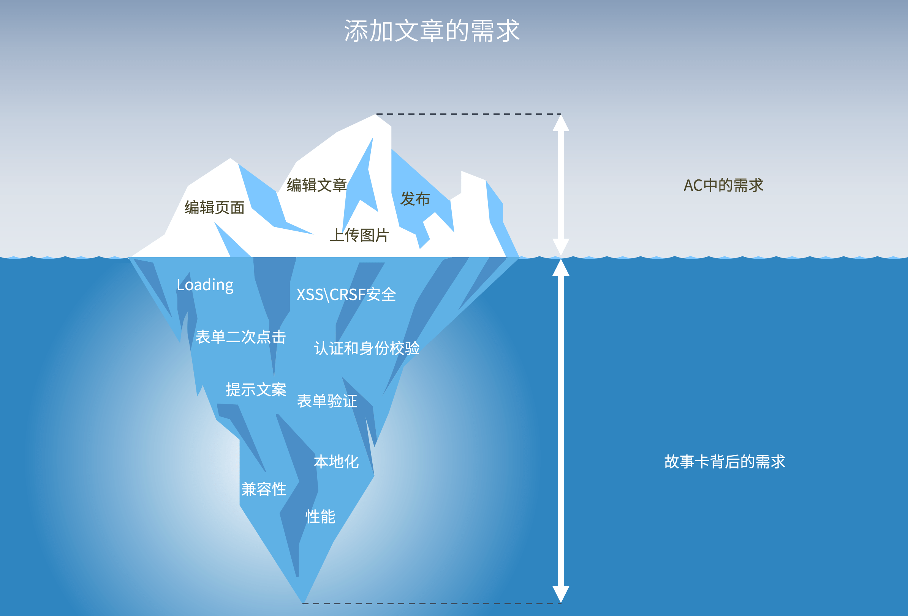

工作这么几年来，见得最多的场景是QA小伙伴追着开发满办公室报bug，不过有时候开发却不乐意了，当时可没说要XXX，要做XXX。

好像QA小伙伴永远比开发多一点心眼，即使单元测试覆盖率达到80%，QA还是变着法都能找出问题。

这其中很大一部分原因都是因为“需求背后的需求”造成的，BA、QA小伙伴以为你考虑到了，或者默认开发需要考虑的。
比如CMS系统中一个新建文章的需求，不太可能写出需要防止表单二次提交的AC，然而如果没人提出来谁会知道呢？
s

最终QA或者线上的用户会通过报bug告诉我们。

我们把这些隐藏到功能需求背后或BA默认认为开发需要考虑的需求称为为非功能性需求，有时候又叫跨功能需求。

下面就来说说在工作中常见的非功能性需求和怎么应对。

## 交互体验相关

**Loading** 加载状态是最容易被忽略的一个需求，尤其是现在富客户端开发的模式下，数据的获取都是异步加载的。如果忘了考虑这条需求，在在网络条件较好时会出现闪烁的情况，而在网络情况差的条件下又看起来会卡顿和没有响应。实现统一的Loading可以在前端的网络请求库中增加拦截器，不过需要注意使用计数器让多次网络请求中途的Loading图标不会间断，否则会有闪烁的问题。

**表单的二次提交** 有一些QA会使用极端的测试方法，例如快速点击按钮多次，如果页面没有进行处理，会触发表单多次提交的问题。即使后端API增加限制则可能同时出现成功和失败的提示，会让用户感到更加迷惑。处理这个问题有几种途径：

- 使用蒙层的Loading 就会自带阻塞用户的操作的效果。
- 点击后禁用表单事件或在程序中增加请求中的状态。
- 依赖后端配置一次性表单令牌（通常用来防CRSF）

**输出格式化** 需求中一般会告诉开发怎么展示数据，但是往往忘记如何格式化数据。例如我们想让数字使用千分位分隔或其他显示方式让数字阅读不那么困难；字符串溢出的处理截取方式；时间的格式化方法，有一些项目会使用“1小时前”，“一天前”或者具体日期等更为人性化的显示方式；图片的输出需要宽度进行缩放，如果是封面图需要非拉伸截取等。

**请求用户确认和提示** 这两项专业BA一般都会考虑到，也会通知UX设计对应样式。不过这里面的细节还是值得讨论。

- 如果在一系列操作的中途提示用户确认，需要明确用户点击取消后，应该回退到用户的哪一步操作状态。有很多的APP在用户编辑好数据后，点击提交然后系统提示是否继续，如果用户点击取消，页面上的数据会被清除。开发需要和BA确认好具体的交互以及提示文案。
- 成功和错误的提示除了文案之外，和BA需要确认的还有：是独立的提示页还是返回到来源页面？提示需要自动关闭还是等待页面刷新后关闭？用户可以主动点击关闭吗？

交互体验这部分还有一个需求噩耗就是，保持统一！！！我想这个是交互体验上最为致命又不会写在需求中，但是QA往往能从中找到bug。

## 安全相关

**身份校验和权限** URL上资源可以被枚举和请求的资源没有验证用户权限，这属于致命而低级的安全问题，当然BA会默认开发要去做这些。不过现实就是在一些遗留项目中这种例子太多了，例如通过修改URL上的资源ID甚至userID此类参数进而修改其他用户的数据。几年前，可以发现很多此类漏洞，甚至在我学生时期用某电信运营商的权限漏洞得手了不少付费游戏。如果系统设计了权限管理模块，在开启新功能时也应该和BA确认是否纳入权限管理。

**表单验证** 用户输入的数据如何验证这部分也是经常在需求上忘记体现出来的地方，而且这部分QA特别容易给出Bug，数据验证充满了大量的条件边界。还有一个老生常谈的问题，表单验证应该服务器端还是前端做？ 这很显然，后端为了安全必做，前端为了体验选做。

**SQL注入和XSS攻击** SQL注入这两年随着成熟的ORM框架普遍使用几乎没有了，但是XSS可以说还是有很多。处理SQL注入和XSS攻击的共同点是不要相信任何用户的输入、任何来源。在浏览器中用户输入不仅有表单还有URL，而往往URL输入参数很容易被数据校验忽略。

**文件上传** 文件上传背后的需求有上传文件的类型、大小限制；需要和BA确认是否能批量上传，上传前是否需要预览；上传后如何命名，是否需要在上传过程中对图片或视频进行压缩。这里的安全需求是，不应该上传可执行文件；需要获取文件真实后类型信息而非后缀名。文件上传的一个陷阱就是使用了客户端来源的文件名作为文件存储的文件名，这是极为不可靠的，在上传后的文件系统中需要使用内建的唯一命名，并通过数据库来记录用户上传的文件名。

## 性能相关

**响应时间** 说实话，没见过那张卡上有明确的指标那些功能需要在多久之内完成响应。但是如果不在分析业务需求的阶段提出来，响应时间过长肯定通不过QA测试。在需求分析阶段的响应时间包含了3个注意点：

- 系统性能设计要求。对一般需求而言，技术上应该达到基本的性能指标，当然实现的方式不尽相同，例如优化SQL、优化静态资源等。
- 该功能是否适合同步操作。然而有一些部分的需求是根本不适合使用同步的操作，例如数据导入这类耗时很长的操作，服务器应该接受用户请求然后不断返回任务处理的状态，而不是让用户端等待完成。实现上可以使用一些消息系统，例如JMS等。
- 第三方系统集成。如果和第三方系统集成，需要和资源提供方沟通是否需要增加批量的数据操作，避免循环获取数据。例如json API标准中提供了include方法聚合多个资源到一次请求中。另外调用方可以注意使用一些非阻塞的网络请求方法，如RxJava或AsyncRestTemplate。

**实时消息通知** 我们在做一些类似站内信、系统消息的功能时，有时候BA、QA容易默认消息的状态和数量（小红点）应该实时的显示在页面上，并及时更新。但开发小伙伴可能认为web上的一些信息需要用户刷新后可见，这个很容易达成理解不一致。如果实时刷新作为需求确实需要的话，从技术上需要做一些调整才能实现，比如使用轮询、HTTP长连接、websock等方法才能实现，这会带来额外的工作量。

**游离数据管理** 从事服务器开发的小伙伴可能有这种体会，有一些数据一旦创建了，用户或者管理员就没法找到或者跟踪了。比较明显的例子有两处：

- 新建资源处，异步上传的图片或者其他资源。比如在用户操作新建文章页面，这个时候文章表可能还没有写入数据，但是需要允许用户上传一些封面或者其他图片。如果用户体完成了整个操作，图片会和文章关联，但是假如用户放弃了操作，图片就会变成游离状态无法继续管理，造成大量垃圾数据占用系统资源。
- 删除操作，没有删除一些关联数据。例如商品表和商品属性表关联，如果删除操作不是事务性的一起删除，就会造成数据空间浪费，且可能影响后续的统计功能。

对于新建资源的图片上传，可以和BA沟通使用草稿的方式在用户进入创建页就完成数据插入操作，也可以设计一个图片空间来提醒用户使用已经上传的图片；对于删除操作，系统不复杂可以设计为数据库表标记删除，而不是真的删除，也可以设计回收站功能统一移动到备份表。

**分布式系统延迟** 由于现在稍大的系统都是用了分布式或微服务设计，系统之间存在系统存在同步延迟，比如数据库主从同步，静态资源服务器同步等。在一些对文案要求比较严格的项目中一个隐藏的需求是，需要提醒当前的信息可能存在延迟，请稍后再试。或者前端增加定时刷新页面的或者资源的回退策略，在我经历的一个项目中，上传图片成功返回图片URL后，前端可能会延迟2s左右才能从正常打开图片，因此需要增加onload、onerror进行重试或后续操作。

## 其他非功能性需求

**兼容性** 浏览器兼容性是前端开发中头疼的事情，从IE6到微信webview，无论技术发展到哪个时代都逃不掉。那么那些事情是需要和BA确认的呢？

- 各种浏览器内核具体的型号，而不是讨论搜狗、360这类壳浏览器。如果是APP内部的webview，这就需要收集相关安卓或IOS的版本号。
- 是否允许一定程度上的降级策略？比如在老式的安卓手机中大量的CSS3特性不支持，可能会造成动画失效，是否我们可以不在老式的手机中要求过渡动画等。

**升级策略** 前端有兼容性问题，那么服务器端就没有了么？不幸的是如果APP不是同步发布的话，API的修改需要照顾老的客户端。即使是同步发布的APP很难强制用户升级。在服务器端开发的时候保持一定兼容性的同时，更重要的是需要和BA一起设计出合理的升级方案。我的经验是设计API时，需要在URI路径中预留版本号，例如V1/your-api/{id}。同时也需要增加契约测试来保证API的修改不会破坏原来的逻辑。

**本地化和国际化** 在一些国际化的项目中，这一点尤为重要，不过有时候容易被忽略。多语言和时区问题需要在项目之初就和BA确认，统一增加国际化方案。而其他本地化则需要在每个功能上注意，例如日期、货币、单位、标点符号的输出方式。

**用户行为分析埋点** 越来越多的项目开始使用用户的行为分析工具了，例如Google的Gtag和更加专业的dynatrace，使用这些工具会对系统造成一定的侵入性，需要对用户的操作进行埋点。如果项目有类似的需求，针对特定的功能很多用户行为分析的系统会提前定义一些标签，那么在开始一个新功能时需要确认用户行为分析的一些规则。

## 最后

写作本篇的目的是分享在工作中开发在做一张卡背后需要考虑多少注意事项。细节想的越多，让业务逻辑变得更完整，可以让开发工作变得更为顺畅。

在参加公司某次培训时，恰好也有很好的非功能性需求的课程，非常详细，以至于长达数页，但遗憾的是没有非常详细的解释和应对方法。因此决定根据自己在工作中遇到过的场景作为例子，给大家分享出来。

在敏捷团队中一个痛点是我们很少有一个大而全的需求文档，如果在开卡的时候有一些需求没有被想到或者没有在AC中体现出来，就需要反复找BA、UX反复确认。开发和BA沟通调整需求、交互的时候可能忘记知会QA或者UX，或者没有更新故事卡内容，就又会造成沟通的麻烦。

经验之谈，多提意见，谢谢！
