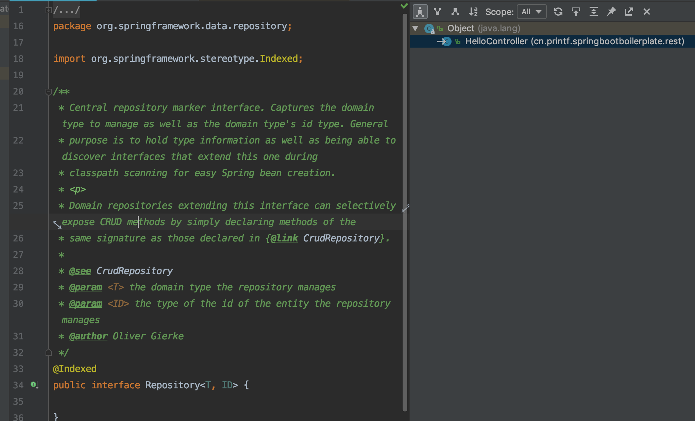
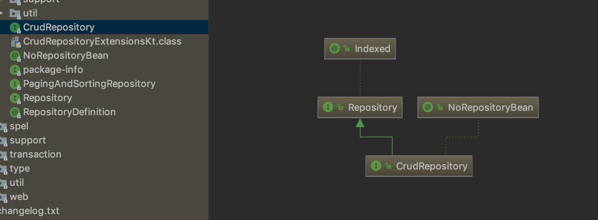

## 使用 Hierarchy 分析类的关系

我们用工具 IntelliJ IDEA， 打开任意类，单击 Navigate → Type Hierarchy。然后我们会得到下面视图。

使用 Hierarchy 对我们分析源码有非常大的帮助。

## 使用 Diagrams 查看类图

使用工具 Intellij IDEA，打开任意类（有复杂继承关系的类或者接口），在文件上右击，选择 show diagrams，可以看到类的关系层次。这里以 CurdRepository 为例，显示类图如下。

## 查看子类（实现类）类图

