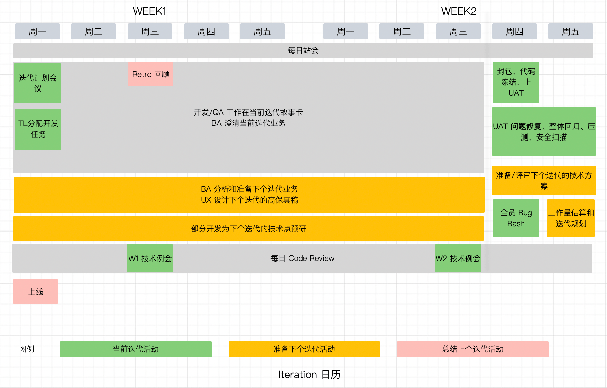

敏捷团队使用迭代方式演进，一般是两周一个迭代一次。也就是说两周就要规划、发布一次，那么如何规划这种团队的各种活动呢？

参考当前团队的运作方式，我整理了一个日历，包含了当前迭代的活动、为下个迭代的准备工作和回顾上个迭代的活动。

这些活动来自于一些经典的敏捷实践（scrum），但对于时间的选择，来自于我们团队根据大量实践，仔细斟酌，在下文中也会说明这样安排的原因。

如果团队能坚持使用固定的敏捷日历，团队养成规律和取得默契后，团队协作会得到较好的提高。

## 1. 敏捷日历

## 2. 活动解释

活动分为了三类：

- 当前迭代活动
- 准备下个迭代活动
- 总结上个迭代活动

**每日站会：**15 - 30分钟。用于团队同步每个人的工作，需要更新前日的工作、遇到的问题和当日的计划。

**迭代计划会议**：一般叫做 IPM，用于和团队规划这个迭代的工作事项，需要全员参与。PM 或者 BA 发起或者组织，时间一般在迭代的第一天站会后，是迭代中最重要的会议之一。

**TL 分配开发任务：**计划会议后，团队知晓当前迭代的任务和目标。TL 需要总览任务，引导相关性强的工作有某一个人领取，达到效率最大化，并同步整体的技术方案，避免工作冲突。

**上线**：安排在周一晚的目的是，前一个迭代的末尾有足够的时间测试和修复问题，避免在周五发布是为了周末出现问题，人员已经离岗，需要加班才能处理。

**每日 Code Review：**30 -  60 分钟，团队一起查看代码，用于发现问题、同步一些技术上下文。

**Retro 回顾：** 可以安排在迭代后的任何时间，计划在周三是因为周三已经进入迭代状态，会议较少。

**第一周技术例会**：占用 Codere View 时间，进行技术例会，需要梳理技术债、工作规范和注意事项、一些技术问题。

**第二周技术例会**：占用 Codere View 时间，需要讨论 UAT 注意事项、梳理迭代中的 bug、配置清单、版本号、上线负责人等事项。

**上 UAT**：上线负责人需要拉取分支、创建 git tag、发布版本到 UAT等工作。周四、周五留给 QA 回归和 bug 修复，未完成的业务特性需要剥离出版本。

**下个迭代的技术方案**：没有 bug 需要修复的人员开始设计下个迭代的技术方案，比如 API、数据库设计等，并和团队确认。

**全员 Bug Bash：**QA 组织团队以用户视角回归测试，发现问题。

**工作量估算：** BA 需要确认下个迭代的工作量，由于这个时候需求和技术方案比较明确，比较容易得到工作量的估算值。BA 和 PM 需要根据估算结果，排入合适的业务工作和技术工作。

