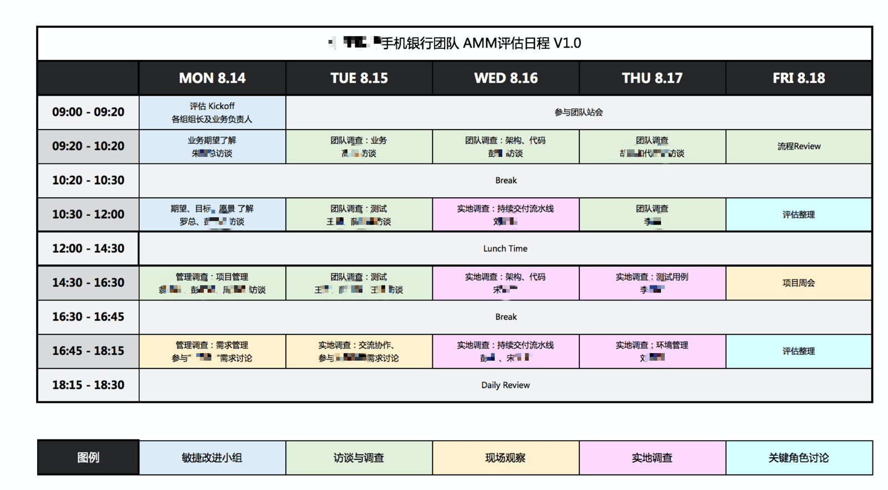

作为管理咨询师需要做的工作。

## 确定访谈目标、模型和维度

需要为整体的访谈设立目标，另外为每个访谈对象设立目标，并围绕这些目标设计问题。

访谈的目的是收集问题，发现现有团队管理中的问题，调查现有敏捷实施的状态。以便以后进行改进、优化。

需要提前好设定模型，例如访谈的维度，必要时提前准备好输出件，并设计输出件的框架。

## 预约访谈日历

和客户约定访谈计划后，确定访谈日历和时间，确定每一个角色的访谈目标。对被访谈的职级有不同的诉求。

我们将被访谈的目标分为:以 CTO/CIO 为代表的高层领导；以大部门经理为代表的中层领导；以小组或者团队 lead 为代表的基层领导。

- 高层

  - 介绍基本概念，对齐转型目标与期望，从高层能收集到的是产品价值、组织架构、团队文化。
  - 收集进一步访问的中层信息（职位、背景和联系方式）

- 中层

  - 了解其职责，诉求、痛点、挑战等。从中层能收集到工作方式、研发过程、效能分析。在访谈时，中层会关注那些实践是否被采用，并不经意中被美化。

- 团队

  - 了解其工作内容、分工、边界、遇到的问题。从基层能收集到的是落地实践、开发过程中的痛点，尤其是 tech lead。

访谈日历的设计需要根据成熟度模型的内容制定，下面是一个一周的访谈日历模板。

## 设计访谈问题

- 根据访谈的目标人群设计问题，可以收集更多信息。

### 面向高层的问题设计

侧重于战略、愿景等方向性的问题。

1. 组织架构是怎么样的？
   1. 有多少团队？
   2. 每个团队有多少人？
   3. 每个团队有哪些角色，职责是什么？
2. 有哪些产品线，产品线之间的关系是什么？
3. 未来的发展方向是什么？
4. 交付团队外有哪些角色，职责是什么？
5. 对宏观的管理的期望是什么？

### 面向中层的问题

侧重于过程、方法和策略等问题。

1. 需求提出到需求验收的过程是什么？
   1. 是否会使用迭代？
   2. 是否有迭代会议？
2. 有没有面对面工作?
3. 需求管理？
   1. 是否有清晰的用户故事，并有明确的验收标准，并且和测试衔接？
   2. 是否有电子工具维护
4. 迭代周期是多久？
5. hotfix 的情况如何？
6. 发布上线有哪些流程？
7. 流水线有哪些阶段？
8. 流水线构有多久？
9. 团队的 product backlog 的内容可以支撑产品/活动的愿景、目标。内容颗粒度渐进明细
10. 需求是否会被评审？
11. 测试人员的比例
12. 自动化测试的比例
13. 单元测试的覆盖率
14. 代码 review 的情况
15. 有无测试用例输出？
16. 有自动化的 API 测试？
17. 是否有自动化的 E2E 测试？
18. 是否有性能测试？
19. 生产环境 BUG 有无测试用例覆盖？

### 面向基层和团队的问题

侧重于感受、实践和落地等问题。

1. 做一个需求的流畅性如何？

## 访谈注意事项

### 统一语言

定义和拉通访谈和沟通过程中使用的专用术语，定义这些术语的内涵和外延，避免歧义。一些术语在各个地方由于上下文极其容易缠上上下文，不利于调研结果的产生。

例如：

- 业务需求方可能是市场人员、不具备业务分析能力的业务人员，和我们提的 BA、产品经理概念不一样。
- devops 的定义和范围

### 过程沉淀

过程需要按照每个访谈对象编写访谈记录。
收集会议中被访谈人出示的资料。
每天进行汇总，将当天的访谈记录汇总到输出件中。

## 结果输出

### 提炼访谈内容

问题分析是从当前访谈内容中分析、提取有效信息的一些思维方法。

1. 使用影响图。使用影响图构建各个元素之间的关系。例如业务无法消化会造成技术债务堆积，反过来又会造成效率降低，形成正反馈。
2. 反馈环。使用陷入困境的项目往往是因为不合理的正反馈循环，需要找到关键点消除正反馈。
3. 矛盾论。使用毛泽东思想的矛盾论进行问题的分析，找出现有系统中不同的矛盾，根据重要性进行排序。
4. 实践论。根据这些矛盾如何给出实践方法。

### 输出件注意事项

1. 访谈日志应该包含为整理的原始信息
2. 每个维度打分表的事项需要在原始信息中有事实依据找到
3. 维度打分表中，未采集到的信息不应该靠猜测，没有足够的信息支持可以留白
4. 调研报告的输出
   1. 组织架构图
   2. 被访谈人物和日志
   3. 访谈数据统计
   4. 每个维护的现状分析
