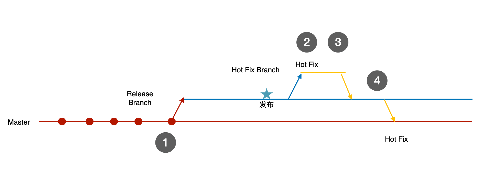
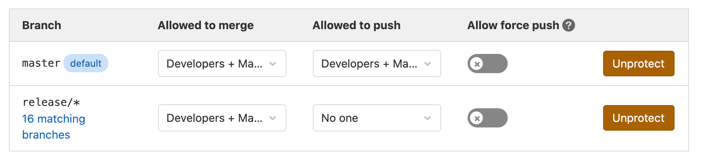

## 1. 代码评审的场景

我们可以在一定程度上使用代码静态分析保证代码质量，但代码静态分析无法解决所有问题，也不能完全依赖他。因此在一些场景中我们需要团队一起来做代码评审。

在日常的团队开发工作中，代码评审有几个场景。


1. **每日代码评审**。我们一般在会在每天下午下班前拿出 1 个小时对当天的代码做 review，如果一个团队 8 个人的话，相当于浪费了一个人天。有一些项目经理特别不理解，为什么需要花时间做这个事情。实际上，每日代码评审的意义非常重要。每日做代码评审让需要评审的代码量被分摊了，随着每天评审可以让团队编码风格日趋统一，需要指出的错误也越来越少。而且每日代码评审也是团队做技术交流的一个契机，熟悉团队其他人在做什么。
2. **发布前代码评审。**发布前代码评审的目的是为了避免明显不合适的代码进入产品环境的分支。有时候一些不明显的错误测试人员往往没有覆盖住，而通过发布前代码评审能快速识别。如果团队的版本管理策略是在 release 分支上发布，可以通过和上一次的版本分支进行对比，也就是看和当前生产环境的代码差异。发布前代码评审工作量比较大，一些创业团队不会做，这是可以理解的，对于成熟的公司来说，如果有大量的用户的产品则需要认真对待。
3. **Hotfix 代码评审。**一个新版本发布后，往往会有一些问题需要及时修复，我们叫这种临时修复叫做 Hotfix。Hotfix 往往不会改动太多地方，测试人员也无力全部回归测试，所以 Hotfix 代码一般需要通过Pull Request 来完成让有经验的技术 leader 来把关合入的代码是否会有明显问题。


这是三种主要的代码评审的场景，一般来说发生在团队内部。还有其他的一些场景需要代码评审，比如安全团队的评审等，这些特殊情况不再赘述。

另外，每日代码评审和上线前代码评审往往让团队一起参加，可以使用一个大屏配合 IDE 在本地完成，Hotfix 代码评审可以由团队或者技术 leader 通过 Pull Request 来完成。


## 2. 代码评审的工具


做代码评审可以用一些工具，可以提高效率。一般来说有如下几类:

1. 代码版本管理工具。一般有 Git、SVN、Mercurial，不过目前已经是主流使用 Git 了。Git 的分布式特性出色，工具链也完善，没有别的限制因素，可以默认使用 Git。
2. 代码托管平台。Gitlab、Github以及国内的 Gitee 都是不错的代码托管平台，如果在企业内部使用可以选择自己搭建私有的 Gitlab，不过 Gitlab 比较复杂，可以使用 Gogos 通过 Docker 容器快速启动一套 Git 代码托管平台。
3. 代码对比工具。代码托管平台一般提供了内置的代码对比工具，不过访问比较慢。还有专业的代码对比工具软件，比如 Beyond Compare。以及集成到 IDE Git 客户端中的代码对比工具，比如 Intellij IDEA 就完全够用，而且在多人参与的代码评审活动中效率也比较高。
4. 专用的代码评审工具。这类工具就是专门为代码评审设计的，比如 Gerrit。Gerrit 可以在网页中做类似于 Gitlab、Github 的工作，不过还有一些额外的工作流管理的能力。

一般来说，对于非开源项目 Gitlab +  Intellij IDEA  是一套比较好的工具链，配置和使用简单维护成本也比较低。

## 3. 代码评审的注意事项 

一般我们讨论得比较多的是每日代码评审，因为需要全员参与，时间又比较有限，需要对主持人有较强的组织能力。为了高效的进行代码评审，团队需要一些契约。

1. **小步提交。**团队成员需要保持好的代码提交习惯，小步提交代码，每完成一次小阶段的开发、重构工作都需要提交一次代码，避免丢失更改的同时也为了更好地评审代码打下基础。每一次提交都需要使用有意义、相同语言的文本描述。也需要遵守一些规则，比如使用看板卡片管理任务的团队会按照 “#[卡号] [描述]” 的模式提交代码。
2. **描述具体。**在代码评审时候避免使用一些诸如：”这个地方的实现不优雅“ 这类似是而非的用语，应该使用更为具体的方式。比如 "使用了太多个 if 语句，是否可以使用策略模式等一些设计模式改进设计"。同样的的也需要避免带有个人的习惯的意见，例如："应该使用 switch 语句而非多个 if 语句组成等"。
3. **及时修改。**当天的代码评审中提出的问题，需要代码作者自行记录，并尽可能在当天就完成修复和处理。一些零碎的小事放到以后做都是不现实的。
4. **专注参与**。如果是在线下参与，最好使用大屏或专门的会议室，避免使用工具或一边做其他事情。需要全程专注参与。如果是远程工作，对于视频会议这种情况，需要打开摄像头。主持人可以使用一些主持技巧，比如不定时对部分参与人点名，唤起大家注意力。
5. **聚焦当下。** 最糟糕的代码评审就是突然被岔开话题，然后进行技术方案、业务方案的讨论，从而浪费大家的时间。这种岔开是一个无底洞，就像《爱丽丝梦游仙境》中 rabbit hole。代码评审应该专注于当下的代码问题，避免陷入技术和业务细节，如果遇到这种问题可以在专门的技术会议中讨论。
6. **时间控制。**  代码评审中最难的就是时间控制，一般一个正常的开发团队每天每人的工作量至少需要 10分钟才能描述清楚。需要给每个人设定一个时间窗口，避免超时。一般来说我会根据人数设定时间，如果时间超过了，就立马停止，第二天继续，这样会越来越快。
7. **分组评审。**如果团队规模过大，无论如何也无法在 1 个小时内完成，就需要选择分组。为了让所有的开发者都能了解全局，以及保持知识传递，可以让分组每周、每个迭代重新排列。
8. **知识整理。** 重复出现的问题不应该被重复提出，对于一些常见的问题，团队可以整理一份评审清单。评审清单可以用于新人参与到项目中来更快的适应团队风格，也可以降低发现问题的成本和偶然性，同时开发者在提交代码时候可以参考清单自己先评审一遍。

发布前代码评审可以不用全员参与，可以由技术 leader 挑选几个关键人员参加即可，如果遇到无法理解的部分，可以通过查看提交人来进一步澄清。

Hotfix 代码评审比较简单，一般在代码托管平台中对 Pull Request 做出设定，必须多少人的的通过才允许合并，通过 Pull Request 也可以追溯 Hotfix 的变更记录。

## 4. Java 代码评审清单

这里整理了一份基本的评审清单用于 Java 开发者使用，清单中的条目已经考虑到了 checkstyle 和 FindBugs、Arch Unit 能检测出来的问题，没有将其加入其中。下面这些内容一般是无法被代码静态分析的内容，避免清单冗长。

1. 有没有 IDEA 的黄色警告。一般往往意味着代码可以被优化或者潜在的问题。
2. 数据输入是否都做了验证，比如类型、长度、格式、范围。
3. 提供的 API 是否做了鉴权，尤其是数据的鉴权。
4. 是否硬编码，需要使用常量和配置文件。
5. 注释和方法命名是否和代码语义一致和容易理解。
6. 是否使用足够便宜的解决方案，比如库函数提供了的逻辑不需要自己再写一遍。
7. 使用适当的数据结构，比如合理选择 HashMap、ArrayList 等。
8. 是否做了合理的异常处理。
9. API 设计是否符合规范和语义。
10. 是否有足够合理的测试。


## 5.  Git 工作流

在团队协作中，代码评审的方式和代码版本管理有一定关系，所以这里说一说代码版本管理。代码版本管理的工作流和分支策略是一个讨论比较多的话题。有很多流派，比如 Git Flow、GitHub Flow、GitLab Flow。

- Git Flow:  项目存在两个长期分支，一个主干分支，一个开发分支，开发者一起工作在开发分支中，发布时合并到主干分支中。还有一些短期存在的分支，比如特性分支、预发分支等。
- GitHub Flow: 项目存在一个主干分支作为长期分支，每个开发者在自己的开发分支中工作，然后通过 Pull Request 合并到主干分支。
- GitLab Flow： 项目遵守上游优先原则，只存在一个主分支作为长期分支。开发者在主干分支开发，当测试稳定后，使用发布分支发布。后续的 Hotfix 都需要合并到发布分支和主分支。

这三种分支策略我在不同的项目中都遇到过，从实用和经济的情况来说，比较推荐 GitLab Flow，当然应该视团队情况而定。比如团队人数、是否需要和其他团队联调（这个是比较重要的因素，实用分支开发会比较麻烦）。

对于大多数使用敏捷工作方式的团队，比较好的分支策略可以用一句话概括：**主干开发，分支发布。**这种方式尤其适合一个迭代一个版本这种开发节奏，如果使用持续发布，没有固定的版本周期这种方式未必合适。



这种分支策略有几个规则需要团队遵守。

1. 团队使用 Git rebase 命令拉取代码，不允许使用 merge 操作拉取代码，避免提交日志混乱。
2. 团队在 master 开发，每个迭代结束前 2 天创建 release  分支，每一次 release 使用一个新的分支，使用语义化版本号来命名，但不使用修订版本号，比如 v2.1 分支。创建 release  分支时可以同步创建 tag，以便早期发布的 release  分支可以被删除。
3. 使用 release  分支可以部署到到预发环境，master 分支只能部署到开发和测试环境。
4. 使用 release  分支发布到产品环境，发布前和上一次的 release  分支做发布前代码评审。
5. 如果预发环境出现问题需要修复，使用 release  分支为基线创建 Hotfix 分支，并提交 Pull Request，团队批准后可以部署到预发环境，然后部署到产品环境。
6. 部署到产品环境后需要将 release  分支的变更同步到 master，避免下次上线丢失更新。

## 6. Git Hooks 和分支保护

代码静态分析和代码评审需要结合代码的分支控制才能起到好的效果，如果 checkstyle 等检查没有通过，代码不应被推送到服务器。

Git Hooks 是一些 shell 脚本，用于 git 提交某个生命周期中执行，可以在 .git/hooks/ 中被找到。用于控制 git 工作的流程，分为客户端钩子和服务器钩子。

客户端钩子：

- pre-commit

- prepare-commit-msg

- commit-msg

- post-commit

服务器端钩子：

- pre-receive

- post-receive

- update

一般我们会通过配置`pre-commit` 到项目中，约束团队成员提交代码时候进行一些检查，例如：

- 运行单元测试
- 运行代码检查，例如 checkstyle
- 提交的 commit 信息检查

如果有 git 服务器配置权限，也可以通过配置 `pre-receive` 在服务器端运行检查。下面是 Java Gradle 的一个 pre-commit 脚本示例：

```shell
#!/bin/sh
# From gist at https://gist.github.com/chadmaughan/5889802
set -x

# run the tests with the gradle wrapper
./gradlew clean build

# store the last exit code in a variable
RESULT=$?

# return the './gradlew build' exit code
exit $RESULTs
```

在项目的根目录中添加 `pre-commit` 文件，通过配置 `gradle` 脚本在项目初始化时，会自动安装该 `hook`。

```groovy
task installGitHooks(type: Copy) {
    from new File(rootProject.rootDir, 'pre-commit')
    into {
        new File(rootProject.rootDir, '.git/hooks')
    }
    fileMode 0755
}

build.dependsOn installGitHooks
```


另外，在没有 Pull Request 和代码评审的情况下，也不应该把代码直接推送到 Release  分支。Git 代码托管平台都会有分支保护功能，基于前面的分支策略，可以设定几个简单的规则。

1. 受保护的分支均不可删除、强制 push，避免代码库受损。
2. release  分支不接受直接 push，必须使用  Pull Request，并需要团队 2 人以上的批准才能合并。
3. 合并到 release  分支的临时分支如果条件允许，可以自动删除。




