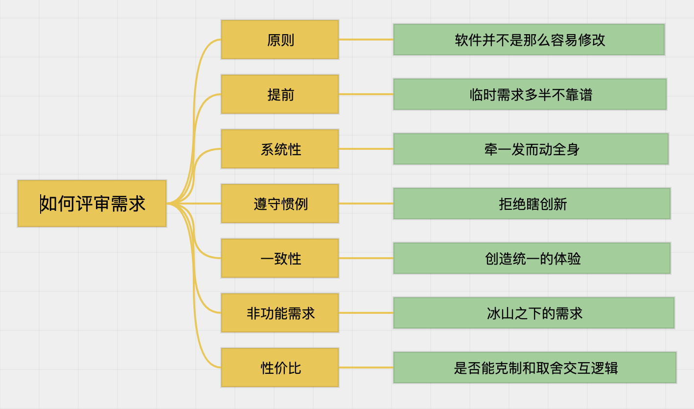
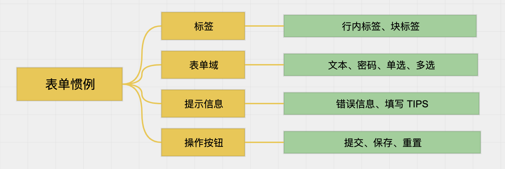
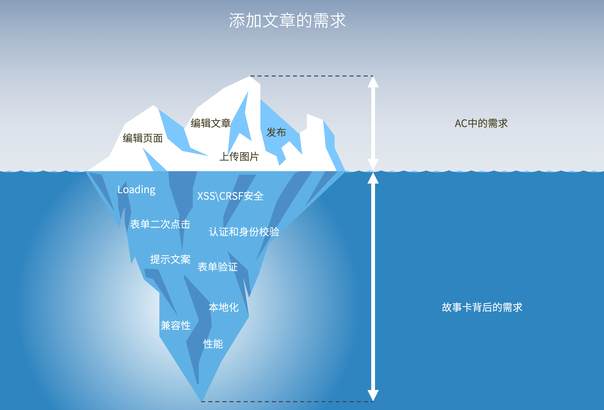

Bug 对于软件来说是显而易见的，程序员犯了一丝毫的错误就会带来 Bug。

需求则不同，不适当的需求往往并不是那么明显，而且暴露的很晚。错误的需求往往不会责备需求的提出方，因为互联网时代需要快速 ”试错“，而纠正需求所产生的工作却落到了工程师头上。

显然，这似乎不太公平。错误的需求难以被质疑，这也带来了需求的肆意膨胀，是软件设计不加以克制的原因。

下面是一个检查清单，用于软件工程师在接受需求时来评审需求是否合理。

## 原则

屁股决定脑袋，产品经理和软件开发者之间的立场不同，则关注点不同，这是需求产品经理和开发之间的矛盾的主要原因。好的产品经理思考的是软件的市场和背后的生意而不是用户交互；好的软件工程师思考的是软件模型和整体设计，而不是某项技术的偏好。

如果软件开发和建筑行业一样，产品经理就是设计院，设计院输出的图纸，如果在施工方无法实施时，设计院会承担巨大的责任。

互联网时代，软件和建筑一样随处可见。

软件给人一种容易修改的错觉。产品经理随意调整需求被质疑后感到无辜，不就是改一点代码的事情吗，为啥说的那么难，这人肯定是技术不行。

简单的软件确实容易修改，同理，在农村搭一个窝棚也是，但复杂的软件和摩天大厦不在此列。

复杂的软件因为承载了大量的业务模型，以及各种存量的用户数据，修改运行中的软件，数据迁移的工作往往比预想要大很多，同时还要考虑已经发布出去的软件兼容性。

需求变更应该是一个严肃和慎重的事情，这是原则。

## 提前

《一本小小的红色写作书》是我最喜欢的一本关于写作的入门书籍，作者布兰登·罗伊尔给新手提供了一个写作建议：当你想到一个绝妙的主题，完成写作并发布出去等待人们的赞美时，不妨先放一放。当一个好点子蹦出来时，人们往往把所有的美好都寄托在这个点子上，而丝毫看不到不合理之处，其实需要时间让人冷静下来。

产品经理往往会蹦出一些”绝妙“ idea，自我美妙的 ”上头“。实际上在落地时，会遇到各种问题。

提前准备需求就显得非常重要，提前三五个星期设计好的需求，随着时间的推移，实际上每周都能有优化的点，到开始实施时也想的八九不离十了。

软件工程师应该建议产品经理提前准备需求，如果是 2-3 天内的需求，就需要警觉起来。

虽然互联网时代变化很快，但不是慌张的理由。

## 系统性

刚入行的人，多少可能对”系统“这个词感到奇怪，我们明明只是做了一个软件、网站或者小程序，但是为什么会被称作为系统。

我们之所以称这些软件为系统，是因为现代软件不像单机桌面软件，它们有很多组成部分。Web、APP、管理后台、开放 API、定时任务等各种组件构成。

系统性，带来的就是牵一发而动全身。

一次产品经理提出需要收集用户的公司信息，因此在注册表单增加了一个字段，但是在管理后台创建用户时，并没有相应的字段，造成数据的混乱。

当产品经理提出一个 web 端的需求时，参考检查项：

- 对应的后台是否有相应管理功能？
- APP、小程序等其他端是否有类似需求？
- 开放出去的 API 是否受到影响？
- 已有数据是否需要迁移？
- 是否和其他功能冲突造成逻辑矛盾？

产品经理或 BA 需要知道当前系统的运行状态，一个将软件系统视为黑盒的产品经理，不太能提出严密的需求来，只能用创新作为托词。

## 遵守惯例

不遵守业界操作惯例的软件使用起来让人非常难受，索尼微单的软件操作方式比主流相机显得怪异，即使很多人认可它的拍摄性能，也不愿意买单。

不遵守业界操作惯例，而美其名曰创新的需求，往往都会经历来回改的结果。

按照惯例，信息系统的列表页都会有分页、搜索、筛选、排序等组成部分。如果设计上列表页没有分页，在可以预见的情况之下，性能会非常差。

对于表单控件来说，每一种控件元素都有它背后的交互逻辑，刻意改变用途，不仅不能带来创意效果，反而会让用户感到困惑。表单有四种基本元素，缺少了说明需求不合理，需要调整：

- 标签
- 表单域
- 提示信息
- 操作按钮

另外表单设计还需要考虑数据回填视图，这种视图下可能交互和 UI 有所不同。

## 一致性

需求的一致性体现一个软件是否专业，影响用户的主观感受。

一致性有几个维度：

- 操作逻辑上的一致性
- 组件 UI 一致性
- 文案的一致性

同类的交互使用同一个控件，避免出现多种组件。比如上传文件的逻辑，文件大小、交互方式、允许的文件类型，都应该保持一致。

在之前一个产品中，领导要求 UI 的设计稿还原接近 100%，我们采用将设计稿叠加在浏览器中实现的。然而，中途设计师离职，新的设计师无法做到和原来的设计师保持完全一样的设计尺寸、颜色。

这种情况继续坚持 100% 的还原度，后果是前端代码中所有的页面都有自己的样式文件，组件几乎无法复用。

大的团队往往有自己的设计规范、设计系统等，这样也减少了高保真的输出，使用设计系统，不必输出高保真。开发人员使用原型图 + 设计系统中的组件即可做出统一美观的软件界面来。

使用原型图表达整个系统的交互逻辑，不用关系 UI 细节，UI 细节交给设计系统来完成。

文案的一致性，要求系统所有的地方使用同样的名词概念、表述方式，避免给用户带来困惑。

## 非功能性需求

评审需求时，非功能需求是最容易遗漏的需求，也是需求的冰山。下图是一个添加文章的需求，背后有交互、性能、UI等多方面的非功能性需求。

有大量的文章叙述非功能需求，这里简单给出一个清单：

- 交互体验相关
	- Loading
	- 表单的二次提交
	- 输出格式化
	- 请求用户确认和提示 
- 安全相关
	- 身份校验和权限
	- 表单验证
- 性能相关
	- 响应时间
	- 生效时间（比如，权限相关允许重新登录生效）
- 可用性相关
	- 兼容性
	- 特殊设备适用性
	- 本地化和国际化
	- 升级策略

## 性价比

最后一项是性价比。

有一些需求不符合当前的软件模型，改动成本极其高昂。但是如果产品经理做出一些取舍，根据当前的技术模型和架构进行调整，可以维持现在技术模型的一致性，降低开发成本。

比如，用户的会员信息是存放在 session 中，这样每一次请求的权限检查可以非常高效的完成。但是，代价是用户的会员过期后，需要重新登录才会生效，大多数系统都这样处理，因为会员过期是一个极其低频的事件。

如果产品经理要求，会员过期及时的告诉用户，并进行续费，而不是在重新登录时触发这个行为。即使在技术上能完成，但是付出的代价非常大，也应该在评审时对此类需求进行质疑。
