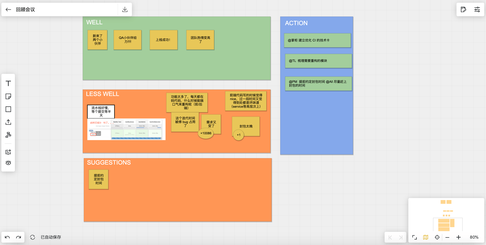

对于敏捷团队来说，不断成长的关键是反馈，而反馈的最大信息来源是回顾。

回顾，不是敏捷的专利。

美国陆军的 AAR，我党的 ”批评与自我批评“，中国航天在每一次发射事故后都会做的 ”归零行动“，这些都是回顾。

Retro 是敏捷软件开发方法中的回顾，Retro 这个单词的全称是 Retrospective。Retro 有很多种形式，可以根据团队所处的上下文来选择，这里以某次培训后的回顾会为例，简单说明 Retro 的一般方法。

这次 Retro 的目标是发现培训中的问题进行改进，做的好的实践，以便于继续坚持，或者挖掘团队中的金点子和建议。所以在会议中，要求全员积极参与，一般来说聚焦于3个问题：

举例来说，在一个培训项目完成后的 Retro 会议可能会收集到如下的清单：

于是，根据 Less well 中的条目，制定改进行动：

1. 在课程计划中添加每日总结的内容
2. 使用Parking Lot（停车场，一张大白纸放置学生疑问的便利贴）收集没有及时回复的问题，在其余时间回复
3. 设计作业和批改作业

因此只要坚持使用 Retro 这种会议形式，随着项目的进行，就会有足够多的培训经验被积累下来。这就是 Retro 的魅力， Retro 本身只是一种形式，但是提供了一种持续改进的方法。

当然，Retro 也不一定限于这三个方面，也有一些其他的 Retro 形式。例如从项目的风险角度出发，这里有另外一种有趣的 Retro 形式 ——《Anchors and Engine》。它使用一个有趣的比喻：团队像在大海中航行的帆船，目的地是我们团队的愿景和目标，风是我们前进的动力，而水面下的礁石则是潜在的风险。

通过这种模型，Retro 时需要关注下面几点：

1. 团队的目标和愿景是什么?
2. 团队前进的动力是什么？
3. 团队的风险是什么？
4. 有哪些事情可以帮助到团队?
5. 团队聚焦在哪里？

对于更多的 Retro 模型，你可以在 [funretrospectives.com](http://www.funretrospectives.com/anchors-and-engine/) 的网站上找到类似更多的Retro形式。不过需要注意的是，Retro 的形式是一种套路，而非 Retro 本身。

常用的 Retro 具体的操作方法有两种，一种是面对面的方式，主持人白板上画出制定区域，参与者通过报事贴发布自己的想法；另一种是通过一些在线工具让参与者更为方便的参与 Retro。

## 面对面 Retro

这里给出便利贴的操作方法，在线工具的方法大同小异，并使用最基本的回顾模型（Well、Less well、Puzzle）。一般 Retro 的时间在30-60分钟，需要相关的人员全部都参与，其中需要一个主持者全程引导。

下面是具体的操作步骤：

1. 主持人在白板上书写 Well、Less well、Puzzle 三列。
2. 主持人回顾上次 Retro 的行动执行情况。
3. 所有参与者在5分钟内书写报事贴，并贴到白板上，每个报事贴只书写一项内容。
4. 主持人对所有报事贴分类，把相同和类似的内容贴到一起。
5. 所有人员需要讨论 Less well 的内容，得出行动，但限于时间原因主持人决定讨论的数量，一般 3 - 5项。
6. 所有人员使用“正”字计数法，对分组后的内容进行投票。
7. 团队逐个讨论 Less well，找到可以采取的行动。例如在某次教学活动中，物料准备不够充分，我们可以采取的行动应该是，每一次教学应该有专人根据物料清单检查物料情况。
8. 得出的行动应该指派到专人负责，否则没有意义。

面对面的 Retro 最好找一个大一点的会议室，为了让会议更加高效，可以偷偷的把椅子藏起来，或者约定大家都站立参与。

## 在线 Retro

如果不能面对面 Retro，通过会议的方式进行效果会差很多。不过可以通过一些在线白板工具来帮助，解决这个问题。

### ideaboardz 

ideaboardz 是一个在线协作的白板工具，用来进行 Retro、头脑风暴和协作创新。访问网址是： https://ideaboardz.com/ 。

我们有较长使用 ideaboardz 的经验，尤其是疫情期间，远程工作给团队带来一些潜在的问题和不便，包括 Retro 都没有那么方便的开展。

ideaboardz  让远程加入的同事能快速开启协作，再配合视频会议的工具下，完成了大量的头脑风暴、Retro。

### Beeart

Beeart 也是一种白板协作工具，它比 ideaboardz 更加灵活。通过在线绘图的方式来呈现会议事项会方便一些，另外也方便的导出会议结论，便于发到微信群。

上面是一次使用 Beeart 做 Retro 的截图，我们只使用了最简单的 Retro 模型，不过令人惊喜的是，Beeart 后来发布了其他的一些思维工具和协作的模板，让画图更加方便了。

## 让 Retro 更有效

Retro 只是一种会议形式，其成效取决于会议的主持人和参与者，有一些注意事项给到大家，避免 Retro 流于形式。

### ”打开“团队

在 Retro 开始前，如果是新组建的团队，有可能有团队成员处于某些原因，不放心说出自己真实感受和问题，可以进行安全度检查。具体操作方法是进行匿名投票，使用便利贴书写 “安全” “不安全” 然后由主持人统计查看。如果团队中存在感受到不安全的成员出现，让参与者中职级最高的参与者离开，然后再次投票，直到安全为止。

如果有参与者认为团队环境不安全，无法畅所欲言，不去解决不安全因素而直接开始，Retro 的效果会只能是形式化的，对项目的推动没有意义。

当团队成员之间充满矛盾时，无论怎么推动大家都不愿意畅所欲言，这种 Retro 已经不再有意义。对于这种情况，可能最有帮助的事情就是吃个饭、喝个酒，在没有防备的时候让大家吐露心声。

### 坚持

Retro 很重要的一个点是持续坚持，如果只做一次 Retro 实际上意义不大。如果一个团队定期都会举行 Retro，那么团队成员就会时刻准备下一次 Retro 可以讨论的问题。

Retro 中产出的行动需要有专人负责，即使有些行动是针对团队所有人，但需要有专人负责提醒、检查。

### 行动

每一次 Retro 如果有改进项，都需要制定行动，并有专人负责。一个合适的行动包括了：执行人、截止时间、验收标准。对于一些复杂的事情，行动只是负责把这件事情合理的创建任务卡，便于跟踪管理。

Retro 过程中，有些行动往往不能完美的解决问题，会被质疑。这种情况下，需要说服团队，不能因为没有完美的方案就不做，因为不做可能会带来更大的问题。

### ”归零“ 心态

航天事业中，当出现了一项航天事故后，航天人会将所有的发射计划推到，并从零开始重新设计发射计划，并验证有无问题。

软件开发过程中，当出现严重质量问题时，修复局部往往不能真的解决问题，”归零“ 心态就是从整体性、从零开始，论证整个系统、方案和流程的问题。

Retro 提出的问题、建议，不应该只是当前迭代、表面的问题，也可以从更为深刻的角度出发。
