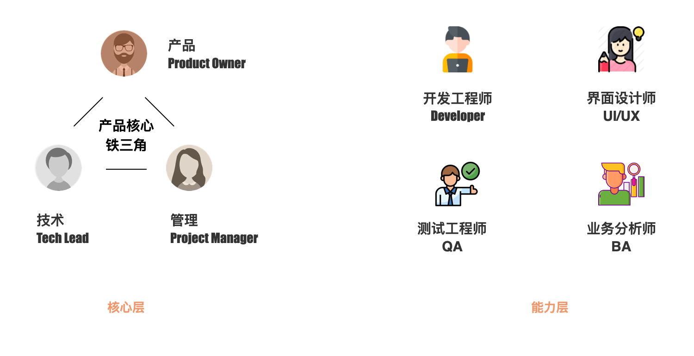
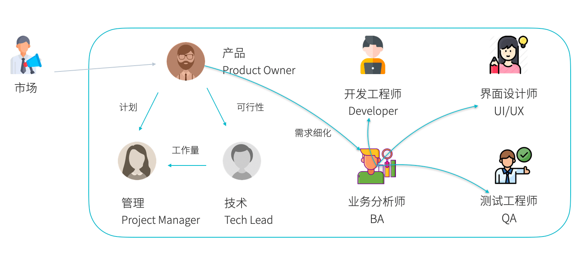
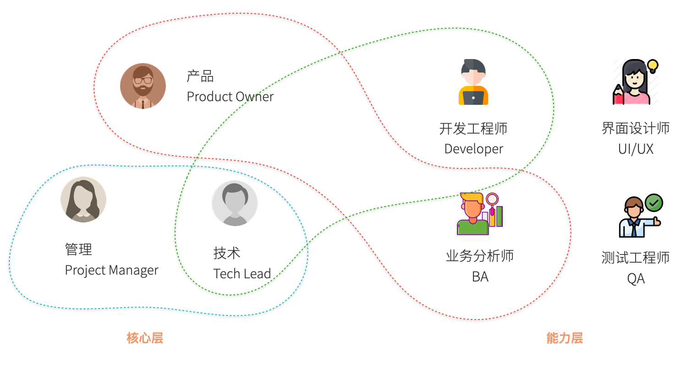
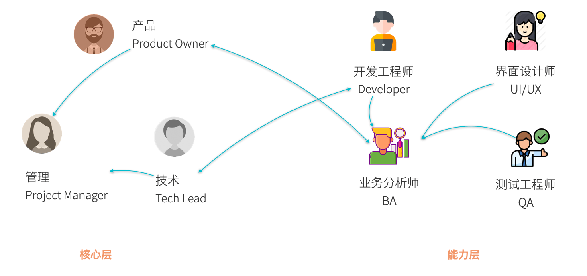

一个敏捷团队的关键角色可以分为核心层和能力层两层，拆分成两个层的原因是对他们的评价、考核目标不一样，期望也是不一样的。

两层的简介如下：

1. 核心层决定了团队的结构稳定，应该由固定的人员构成，包括 PO (Product Owner)、PM(Project Manager)、TL(Tech Lead) 构成，核心层表述了团队的责任划分，以及发展的方向。

2. 能力层由各个BA、开发、测试、设计等角色组成。能力层表述了团队成员在某一项专业能力的方面的职责。

能力层和核心层可能存在相互交叉，但是相关人员需要意识自身的多个角色。

## 1. 核心角色

PO、PM、TL 相关的定位和职责。

### PO Product Owner

PO 的定位是响应来源于用户产品的各种需求，这些需求是零散、无序的。PO 需要决定那些需求是真实需求，并评估价值。PO 需要清楚的知道那些需求能落入开发的软件产品，并且 PO 有权利拒绝给产品带来伤害的需求，并甄别出高价值的需求。

PO 职责：

- 负责产品的规划和体验改进
- 支持产品运营，以价值驱动产品演进
- 统筹团队的所有需求，进行优先级排序，计划迭代
- 跨产品团队进行业务方案与设计的协调与决策

PO 拥有选择需求的权利，也应该承担相应的责任。PO 需要对市场负责，并梳理来自市场的需求。一些公司把类似的角色叫做 Product Manager，但是缩写也是 PM，会和 Project Manager 冲突，为了区分开来，叫做 PO，一些公司又叫做产品经理。

### PM Project Manager

在敏捷项目中，按照项目或者迭代的方式计划任务。PM 的职责非常明确，就是项目管理。在敏捷项目中，一般按照迭代进行，一般以迭代为单位进行项目管理，因此有时候又叫 Iteration Manager。

PM 职责：

- 负责和外部团队沟通

- 制定团队计划，规划里程碑等工作

- 负责促成各种活动/会议按时、高效的召开

- 保护团队免受干扰和威胁

- 保障流程，裁定团队协作规则

- 识别和消除团队的障碍，保证团队运作流畅

PM 是一个服务型的管理者，负责将 PO 的需求装入迭代，并指导团队按照一定的方式运行。

### TL Tech Lead

在软件开发团队中，技术人员的统筹工作也需要有人完成，例如负责技术选型、架构设计等工作。一般由一位技术经验丰富的开发人员担任。

TL 的职责：

- 负责团队技术架构设计和技术选型
- 开发团队内部基础运维工作，例如 CI/CD 的维护
- 协调和支持各团队内技术负责人的迭代设计工作
- 推动团队的技术能力提升，质量内建，持续改进
- 制定代码风格、技术规范等一系列技术实践的规则
- 负责代码评审、团队技术能力建设、安全评估、风险控制、线上问题响应等技术管理工作
- 技术债务的识别、优先级排序、解决
- 和 PM、PO 对接

TL 是软件开发团队中最难以被取代的角色，需要对技术决策有一定预判力的人员担任。除此之外 TL 往往还需要扮演管理者、技术专家、培训师相关的角色，任务拆解、解决疑难问题、带新人等相应职责都需要承担。

## 2. 能力层角色

能力层角色，是敏捷团队中能在专业领域持续、专注输出的角色。例如开发工程师、业务分析师、测试工程师和界面设计师等人员。

### 开发工程师 Developer

开发工程师职责：

- 负责用户故事的需求澄清、设计、开发
- 单元测试编写、业务自测
- 修复各个环境出现的问题
- 编写技术文档
- 编写上线脚本、数据迁移脚本
- 技术方案的调研

对于开发工程师来说，高效率、高质量完成用户故事的设计和开发工作，是其主要任务。除此之外，编写文档、单元测试也是非常重要的任务。

### 业务分析师 BA

业务分析师的职责为对 PO 的需求进一步细化，编写出清晰、容易理解、满足系统一致性和完整性的用户故事。

业务分析师的职责：

- 同 PO、UX 和 开发对齐业务需求，细化用户故事
- 整理用户故事中的业务逻辑
- 输出原型图，和 UI/UX 对齐软件界面和业务逻辑的关系
- 分析非功能性需求，如用户的边界输入、性能、提示、多语言等
- 和测试对齐业务验收规则

业务分析师需要了解技术，包括系统架构、技术选型，对系统的整体性认识要足够。能确定某些需求是否能在特定的技术和逻辑背景下能否被完成。

### 测试工程师 QA

敏捷开发团队对测试工程师的能力的要求一般超出了传统测试人员的范围，通常要求测试具备自动化测试的能力。

测试工程师的职责：

- 对用户故事进行功能测试
- 制定测试策略，包括但不限于功能测试、回归测试、冒烟测试、性能测试、安全测试、验收测试
- 编写自动化测试
- 搭建测试环境和准备测试数据
- 维护测试用例
- 度量团队质量指标，例如缺陷密度
- 分析和重现收到的缺陷

保证产品的质量才是测试工程师的主要职责，功能测试只是其中非常小的一部分职责。

### 界面设计师 UI/UX

界面设计师的相关职责相对较少，但互联网产品注重用户体验，界面设计师的要求被提高了。

界面设计师的职责：

- 输出软件产品的用户界面
- 持续以优化软件产品的交互设计
- 统一软件产品的风格，输出 VI 系统
- 维护设计系统，对常用组件进行规范化
- 对可用性进行分析，例如响应式布局下各种屏幕尺寸的设计

界面设计师的核心能力是设计系统的输出，对统一软件产品的交互和 UI 逻辑有非常大的必要。

## 3. 团队信息流

团队内部和外部的信息流动分析。

信息在团队内部和外部流动，团队有很多实践，不同的活动信息的流动不一致，例如需求澄清、计划会议等。

- 响应需求。往往是市场发起需求意向，流动到 PO，然后到 PM 和 TL，如何合理继续流动到业务。
- 需求细化。往往是 PO 发起给 BA，然后流动到团队再达成一致。
- 迭代技术。往往是 PM 发起计划到整个团队。
- 技术实践。一些 codereview、技术架构讨论等活动，往往是 TL 发起到团队。

另外还有一个反馈路径，团队分别就管理、技术和产品，反馈给 TL、PO、PM。

## 4. 角色交叉

一个团队往往不会这么理想备齐这些角色，各个角色相互兼任。例如 PO 可能和 BA 会是同一个人担任。PM 和 TL 可能是一个人来担任。

下图每一个虚线表示可以由同一个人担任，解决的是人员不足时如何由一人分饰多角色的问题。

当测试人员不足时，开发人员也可以补充一部分测试能力。

- TL 往往也会参与开发工作，属于开发工程师能力。
- PO 往往可以从事业务分析师 BA 的工作。
- PO、TL 往往也都可以进行 PM 的相关工作。

## 5. 梯队建设

敏捷团队人数一般控制在点两个披萨就能吃饱的范围内。因此核心人员都是单个作战，这就需要必要时能力层角色能作为梯度能力存在，当 PO 或者 Tech Lead 离职、请假的情况下能及时替补相应的职责。

因此团队在运行时，就需要可以考虑培养能力层中优秀者作为核心层的替补。

下图描述的是人员缺失时，如何替补的问题。

## 6. 总结

- 敏捷团队往往是按照领域划分，因此一个团队往往具备各种角色
- 团队角色、人数应该由业务类型决定进行裁剪
- 团队应该由明确的信息流动方向，例如站会、codereview、需求澄清谁来发起
- 团队需要考虑梯队建设，当人员变动时，团队能快速恢复到平衡状态
