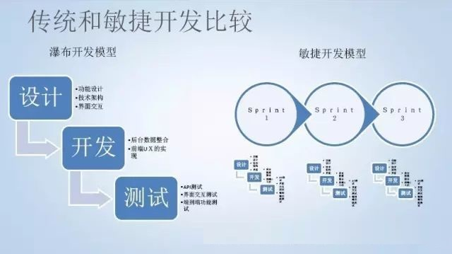
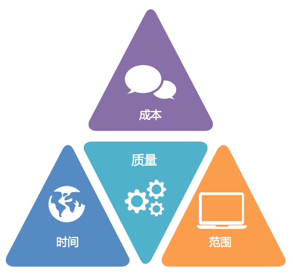
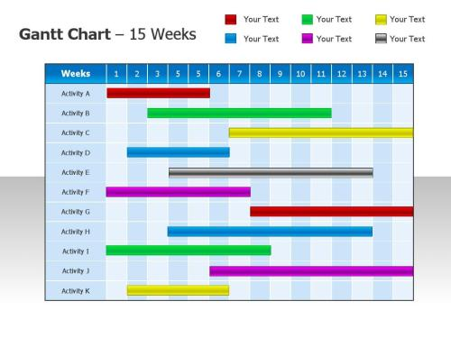
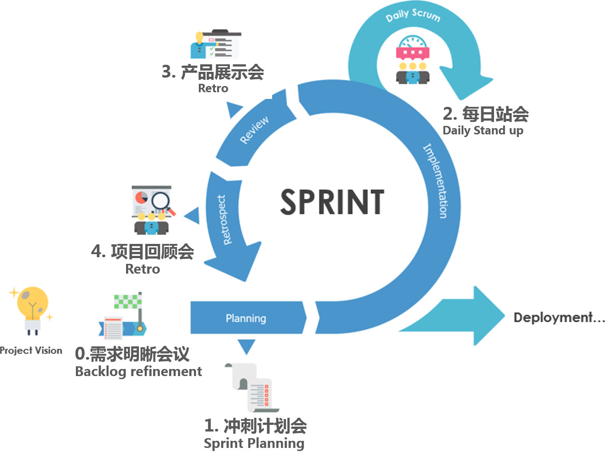

在一次敏捷课程上，学员问了我大量关于敏捷的问题，例如 “通过敏捷会让项目开发进度更快吗？”。其中一些也是几年前我想问的，并带着这些问题加入 ThoughtWorks。终于经过各种海内外敏捷项目，在一线开发有了对敏捷更为深刻的认识，现在回过头来聊一聊这些问题。

## 为什么要敏捷？

敏捷作为一种软件开发方法，或者项目管理方法，很容易被说的玄乎。软件开发一定要敏捷才行吗？实际上很多项目是可以不采用敏捷开发方法的。

在很多年前的典型、银行领域，银行的软件主要是给行内内部使用的。那个时候的软件开发采用瀑布模型，把软件开发过程划分为需求、分析、设计、开发、测试等不同阶段。这种开发方式同样也能完成所有的任务，甚至这种开发方式延续至今。瀑布模型从出现到持续到现在已经有很长时间，包括目前大学的软件工程专业的课程内容也主要采用这种方式。

另外一种开发方式被大家所忽略，就是一些创业公司或者小团队的开发模式是 “伪敏捷” 的开发方式。实际上，这种状况是既不 “敏捷” 又不“瀑布”，是一种混乱或者无序的开发模式。用CMMI成熟度来描述可能还存在于 “初始级”，其软件开发过程是无序的，对过程没有定义，成功取决于个人努力或偶然。

几十年前，随着软件复杂性日益增高，无序的这种开发方式不能满足需要，于是有了瀑布模型；但是到了今天随着互联网发展，软件的需求来源变得越来越不稳定，原来的瀑布模型的一个过程太长了，于是敏捷开发方式出现了。

敏捷开发方式和瀑布都有过程上的定义和管理，并不是说“响应变化”就瞎变化。而是通过迭代将瀑布模型分隔成更小的周期，从而实现迭代。

在敏捷开发过程中，每一次迭代时间可能是2周。每个迭代都能都有交付的工件，如果交付物不能满足市场或客户需求。可以在下一个迭代再一次进行分析、调整和开发，从而响应变化。

## 敏捷会让项目更快吗？

答案是又不是。

先说不是的情况。项目更快不是那种开发方式来决定的，项目进展快的另外一个意思是时间用的更少。项目管理有一个共识，就是项目的成本（投入资源的数量）、时间、范围和质量，构成了一个矛盾的三角。

在相同的资源投入下，项目进度由范围、质量影响。通俗的来说，当一个项目人力资源匮乏时，一个人被当做两人使的时候，敏捷解决不了任何问题。

甚至更糟糕的是，由于把一个长周期的开发过程，分割成了多个迭代，敏捷这种开发方法还要付出额外的开销。本来只需要整个周期开一次的会议，变成了每个迭代都需要开一次；迭代与迭代之间的融合也有额外的开销。如果适应了瀑布方法的团队，切换到敏捷工作方式后，开会的习惯还是和原来一样冗长就会是一个灾难。因为瀑布模型是一个从一而终的方法，所以必须要有完善的文档和详细的设计防止返工。但是敏捷团队按照同样的方式做的话，就变成了 “白天搞敏捷，晚上修 bug”，敏捷不仅不能让项目进展更快，而让拖慢项目，甚至导致项目失败。

再来说是的情况，敏捷这种开发方法确实能加快项目进度。其中一个重要的原因是加快了团队互动的频率和资源调度。怎么讲呢，在瀑布模型下，进度的安排会依赖一种叫做甘特图的工具。使用甘特图来排期，有两个问题：一个是某个人效率低下或请假会较大的影响整体进度，另外一个是下游工作等待时间长。

在一个非常长的周期内，瀑布这种模型会产生严重的资源闲置和浪费。比如按照计划1个月完成开发工作，然后1周完成测试工作。那么测试团队需要一个月后才能接手测试工作，有很长的空窗期。敏捷方法把周期缩短了，那么测试团队就可以在迭代内相应的缩短空窗期，另外这个空窗期也可以拿来做一些准备工作（比如测试用例的编写）。

## 敏捷会让项目提高效率吗？

在资源投入不变的情况下其实上面的问题已经反映了效率。另外在补充一点敏捷方法关于效率的讨论，根据上面的聊到的，敏捷实际上不能平白无故的让效率变高，也不能让一个人干出两个人的活儿。

在实际工作中我们发现，敏捷方法实际上是在看不见的地方提高了效率。最大的地方就是避免返工。

几年前在一个比较大的上市传统企业研发中心待过，我们尝试过把一些工作进行外包。实际上效果并不好，因为管理外包带来的成本有时候还不如自己做。其中一次，我们把前端页面外包给一个团队，我们负责出图，他们负责写出HTML+CSS。这个团队隔一周就会给我们反馈进度，一切都很正常。但是最终交付的时候我们拿到代码傻眼了，这份代码全是用Table布局的，对我们来说根本没用，于是只能返工。

对于较大型的软件项目来说可能更糟糕，一个大的瀑布模型，即使做了充分的设计、讨论，最终返工的概率非常大。因为瀑布模型是从传统行业，例如建筑业吸收而来，建筑行业的变化并不大、并且是一个可重复过程的行业，同时并不具备重构和修改的能力。但是软件行业完全不同，或者说以前的软件行业可以按照这种方式做，但现在互联网化的产品便不再适应了。

敏捷软件开发的核心逻辑是快速迭代，同时也具备了快速试错。那么敏捷能避免返工吗？

当然还是不能，但让返工的影响降低到最低，就已经是巨大的成功了。

## 创业公司适合敏捷吗？

先说结论，创业公司更适合敏捷开发。

创业团队最大的优势是什么？船小好调头，人少好沟通。那么创业团队的弱势是什么呢？缺少战略基础，大部分时间在打游击战。因此创业公司适合一个灵活、轻量级的软件开发方法。

敏捷是一种轻量级的开发方法和理念，轻文档重合作，适合规模不大的团队，充分利用沟通成本低的优势 。通过迭代开发响应变化，每一个迭代能快速上线 验证产品设计是否合理。

## 所有项目都适合敏捷吗？

不是所有的项目都适合使用敏捷开发，但趋势是越来越多的项目适合使用敏捷，甚至不得不敏捷。

《大教堂与集市》中谈到，我们以为软件行业是制造业，实际上是服务业。和软件行业中很像的行业有两类，一种是能被重复的、不容易改变的、过程可控的，例如建筑行业。另一种是不能被重复的、可以改变的、过程 不可控的，例如医药研发。

我们把这两种行业概括为预定义过程控制和经验性过程控制。而过去我们认识的软件可以适合，预定义过程控制，也就是说，立项的第一天就能规划到项目结束，例如ERP系统、薪资系统等成熟的行业方案。而另外一些软件例如微信、京东等互联网产品，毫无疑问是需要随着经验不断调整的，这种是经验性过程控制。

显而易见，互联网产品大多无法采用预定义过程控制，更加适合经验性过程控制。敏捷开发方法是基于经验性过程控制的，因此更加适合变化性强的，过程不可控的软件开发项目。

软件行业是一个新行业吗？如果是的话，我们可以把行业划分为金融业、电信业、软件业。然而现在不是这样的，软件业充当了所有行业信息化的角色，也就是说，未来所有的公司都是软件公司。5年以前的银行可能一个项目需要10名工程师花费1年的时间，然后5名测试人员花费2个月的时间测试，然后等待领导审批最终交付给运维上线。然而目前这种情况变得不能接受，所以越来越多的项目还是转向到敏捷开发上来。

## 敏捷开发有什么缺点和不足吗？

敏捷开发方法一点问题和缺点都没有吗？《两个凡是》的教训告诉我们，任何优秀的的思想和理论都不能迷信。实践是检验真理的唯一标准，敏捷这种方法在实际软件开发过程中也会暴露一些问题，但是可以想办法优化流程，尽量降低这些问题的影响。

敏捷软件开发的特征是增量的，因此每个迭代都会有新的业务分析，新的开发工作在进行。这带来的一个问题是，不会有一个统一的 PRD 文档出现，最后在项目结束时候，交付物中没有好的文档。所以敏捷往往强调可交付的软件更为重要，在代码质量上下功夫，做到代码即文档。

敏捷中参与人员都是根据团队划分的，例如独立的PM、BA、DEV，不再存在管理部分、研发部门。带来的矛盾是对个体的要求变高了，有时候往往一个团队中只有一个BA或者UI，对新人挑战较大。

上面提到的敏捷是根据团队来划分的，其组织架构和传统的公司部门形式提出了挑战。如果企业的组织架构没有改变，敏捷团队的存在可能会出现组织架构上的矛盾。

## 敏捷实践中这么多会议怎么办？

对敏捷这种方法论最大的质疑就是会变多了，整体效率被拉低了。所以网友调侃 “白天搞敏捷，晚上写代码”。

会议变多的主要原因在前文已经分析过了，迭代变多，原来只需要开一次的会议，现在每个迭代都需要开一次。我待过得一些敏捷团队中，确实有一些会议花费的时间比较，敏捷开发中常见的会议有：每日站会、迭代计划、项目回顾会议、产品展示会议等。

需要特别说明的是，看似这些会比较多，实际上我们使用瀑布的时候，项目初期甚至拿了全天的时间来开会。因此在敏捷中，我们每个迭代的会议是不是也要像迭代一样被摊薄呢。

如果我们设定一个迭代的时间是两周，那么迭代计划开了一整天就没有时间进行开发和干活了。

因此各个会议的推荐时间是：

- 站会应该在15分钟内完成
- 迭代计划会议不超过2小时
- 回顾会议不应该超过1小时
- 产品展示会议不应该超过30分钟

如何做到把会议开到如此高效呢？这个就是对会议主持人的要求了，一些要点如下：

- 站会的目的是更新进度和暴露开发中遇到的问题，不应该讨论具体的问题。
- 在开迭代计划会议之前应该准备好所有的需求分析，如果遇到需求不合理应该及时跳过，不应该在会议中寻求解决方案。
- 回顾会议应该把重点放到上一次行动是否明确执行以及需要改进点上。可以通过投票讨论优先级高的改进点。
- 参会人员应该准时到达。对迟到的容忍就是对准时到的人惩罚。
- 每个会议必须有主持人、会议目标、会议准备，否则会议是冗长而无效的。

## 有了看板、站会、回顾会议就敏捷吗？

敏捷是一种理念和价值观，具体的软件开发方法主要是 Scrum，那么采用了 Scrum 中的实践就敏捷了吗？

第一个问题中谈到，敏捷的关键是迭代和响应变化。那么我们把瀑布模型，拆分成多个迭代进行，是不是也是一种敏捷方式了。这种“朴素”的敏捷方式可以没有看板、站会、回顾。只有需求、分析、开发、测试这些过程，那么不能说不算敏捷吧。

如果我们没了迭代，再看看我们的看板、站会、回顾会议还是什么：

- 看板，最早是出现于工业企业中。是一种在工业企业的工序管理中，以卡片为凭证，定时定点交货的管理制度。在没有迭代的情况下，看板只是一种过程可视化工具，对工作过程并没有任何变化。
- 站会，大多数公司都有晨会的概念，用于向团队内部同步前一天和当天的信息。至于是否是站着开，并不重要。站着开只是为了让会议更快结束。
- 回顾会议（Retro），回顾会议在英文中又叫 Retro，作用就是在一个工作阶段后进行反思和回顾的会议。这种回顾会议很多公司都会进行，比较著名的形式有从美国陆军流传而来的 ARR （After Action Review）。

敏捷的实践很重要，是团队重要的活动，但并不意味着采纳了一些敏捷实践，团队就是按照敏捷的方式运作。
