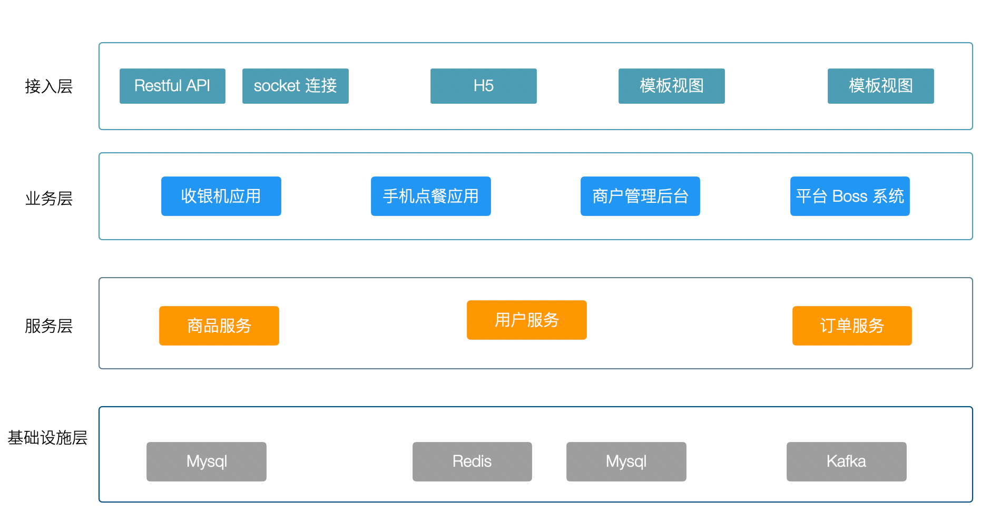
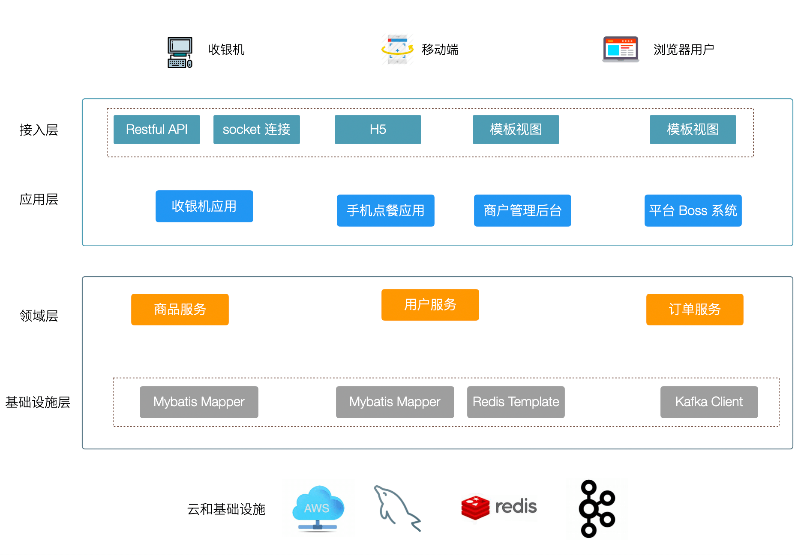
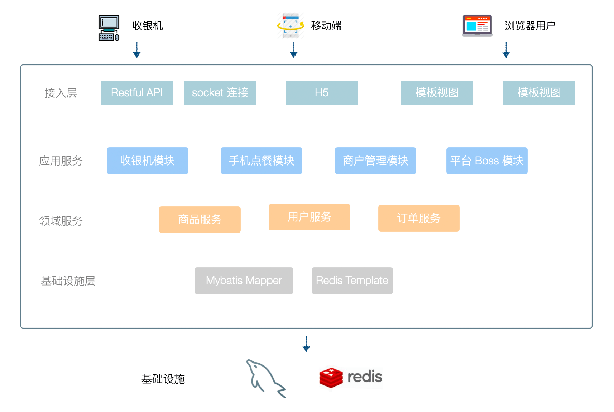
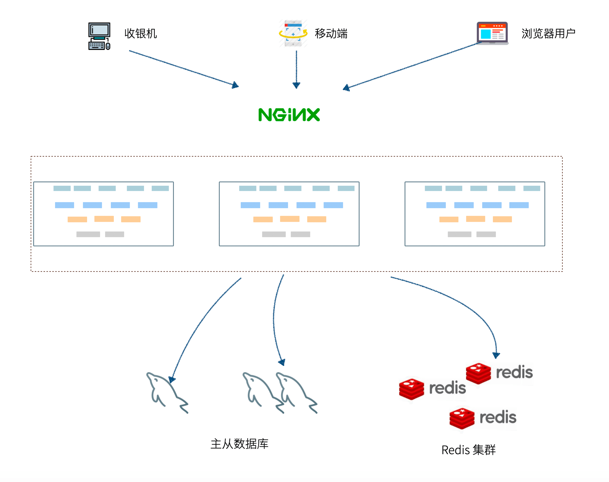
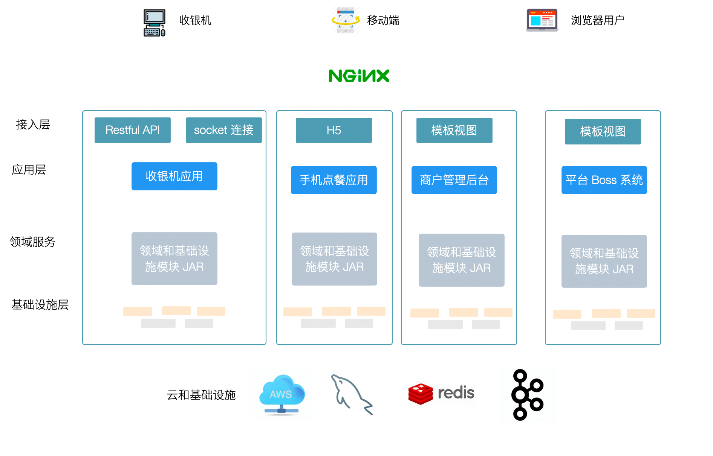
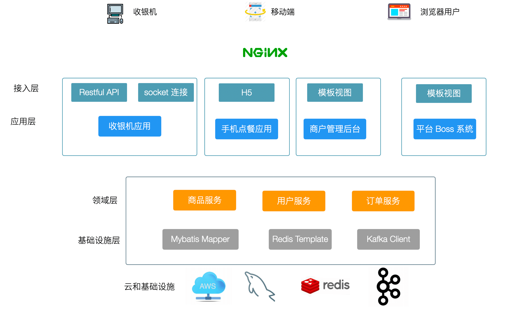
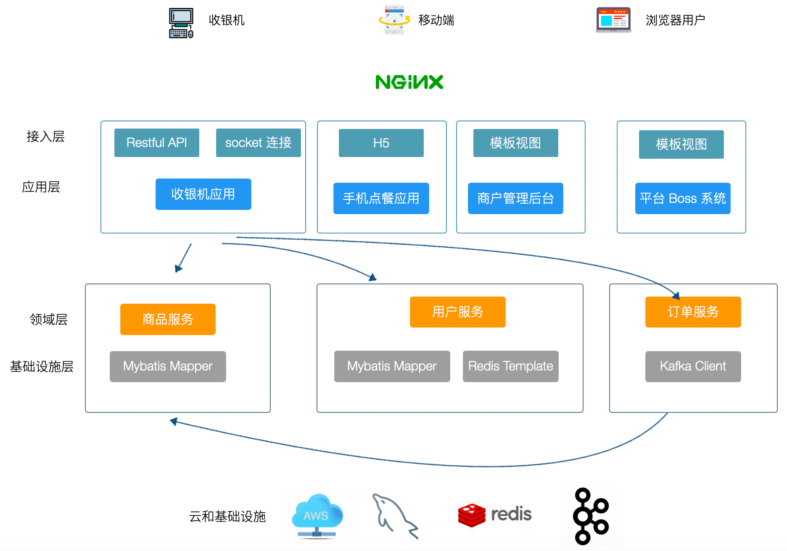
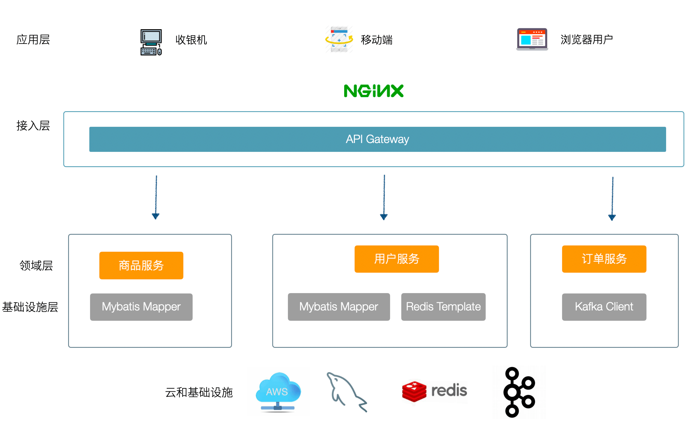
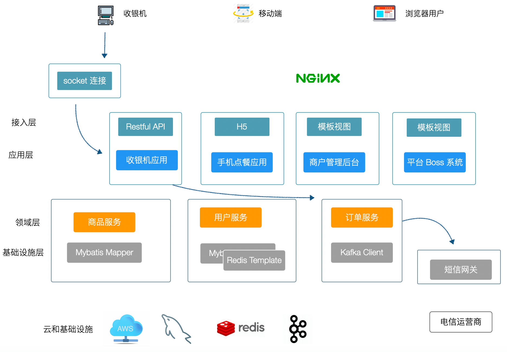

在使用 DDD 的思想时，最让人迷惑的就是如何组织代码，也就是通常所说的系统架构的问题。在前面提到 DDD 可以很好地指导代码组织，其中举了两个例子，单体和微服务架构下 DDD 如何指导代码的组织方式。令人沮丧的是，大部分应用系统既不是完全的单体系统，也不是纯粹的微服务架构，而是出于某种中间状态。

无论我们使用单体、SOA、微服务、中台或者其他架构，都需要解决如何组织代码这个问题，DDD 并不是一个技术，而是指导我们组织代码的一种思想，这种思想也并不是凭空出现的。

就代码组织这个问题，看起来没有什么技术含量，但实际上非常重要，软件工程发展过程中出现过三次危机，软件危机泛指在计算机软件的开发和维护过程中所遇到的一系列严重问题，代码的组织和大规模协作是其重要的组成部分。

1. **结构化程序设计解决了第一次软件危机。**60年代~70年代计算机刚刚投入商业使用，主要的编程方式还是汇编语言在特定的机器上编写程序。当软件规模较小，基本上处于计算机科学家个人编码设计、使用的方式。随着软件规模扩大，复杂度增加，依赖特定机器、无结构化的编程方式无法应对软件的发展，带来了第一次软件危机。为了克服这个问题，业界提出了”软件工程“的概念，1972 年 C 语言的出现，解决了代码结构化、抽象性、可移植的问题。
2. **面向对象解决了第二次软件危机**。随着软件在商业中大规模使用，软件变得原来越复杂，即使结构化的 C 语言也无法满足业界对可维护性、可拓展性的需求。标志性的事件是 IBM 公司开发的 OS/360 系统失败，该系统有 4000 多个模块，约 100 万条指令，以及大量的 bug。面向对象的编程语言，Java、C#、C++ 出现，面向对象带来了更自然地代码组织方式，软件开发变得越像建筑业。
3. **第三次软件危机**。第三次软件危机还没有一个明确定义，通常来说就是互联网行业兴起，软件变得越来越复杂，需求越来越多变。软件开发从建筑业变成了服务业，需要随时响应变化，在软件行业表现为瀑布开发越来越不可行，敏捷开发越来越重要。从技术上表现为单机开发越来越不可行，分布式系统是必然的趋势。

每一次危机的解决，都是建立在前一次的基础之上的。面向对象是建立在结构化程序设计之上的，敏捷也是建立在瀑布之上的，而不是推翻前者。DDD 还停留在面向对象这个阶段，可以用来指导分布式系统设计，应对越来越复杂的应用系统，DDD 也不是面向对象思想的替代者。

DDD 的代码组织形式众说纷纭，并没有一个标准的代码架构。为什么会这样呢？实践中我们发现，不同公司、项目的业务背景不一致，架构不一致，架构的演化层次不一样（查看另外一篇文章《架构的演进》），标准的代码架构并不适合每一个公司。

当我们的系统架构从单体往 SOA、微服务、中台演变，无论名称如何变化，实际上都是分布式系统，只不过分布式的程度不一致而已。所以我们需要将问题拓展到分布式系统这个更大的概念上，再来谈 DDD 的代码组织形式才有意义。

我们看一下分布式系统下一个定义：

> 分布式系统是一组电脑，透过网络相互连接传递消息与通信后并协调它们的行为而形成的系统。——维基百科

从广义的分布式系统定义上来看，现在的互联网应用基本上没有不是分布式的了。分布式系统不是软件工程师主动选择的结构，而是业务逼得这样选择。阿里巴巴带动的去 IOE （去掉IBM的小型机、Oracle数据库、EMC存储设备，代之以自己在开源软件基础上开发的系统）就是一个很好的体现。

在这样的一个思维方式下，单体系统是只有一个计算节点的分布式系统，那么 DDD 在单体应用下的经验也可以应用起来。我没有找到一个专业术语描述分布式系统程度，这里请允许我创造一个新词，**分布式级别。** 

### 分布式级别

为了解决业务上的问题，用户量大、业务规模大，当用户量增长到无法被容忍时，我们引入分库分表（分布式数据库）、垂直拆分业务（微服务）。

我们会将系统变得越来越复杂，然后不得不解决各种分布式系统下的新问题，业务上面临的问题被转移到技术上，从而业务才有可能持续性的发展。我们面临的问题不会消失，只会从一个地方转移到另外一个地方，转移到我们能容忍的地方，比如转移到云上，然后通过购买服务解决。

系统中节点角色越少，需要解决的分布式问题则越少，可以认为这是**低级别的分布式系统**。低级别的分布式系统 架构基本上没有什么分布式问题存在，目前主流的小项目通过 Nginx 让应用水平拓展 + 主从数据库的架构可以看做低级别的分布式系统。

系统中节点的角色越多，应用垂直拆分，需要解决的分布式问题就越多，遇到的技术挑战也越多，我们可以认为这是**高级别的的系统**。应用系统的例子就是微服务架构，另外一个例子就是大数据平台。

我把分布式级别做了如下划分，基本上可以囊括目前互联网应用系统的主流架构：

- 准单体系统
- 低级别分布式系统
- 高级别分布式系统
- 复杂分布式系统

| 分布式级别       | 案例                      | 架构参考                                     | 业务价值                  | 分布式系统问题                                               |
| ---------------- | ------------------------- | -------------------------------------------- | ------------------------- | ------------------------------------------------------------ |
| 准单体系统       | 博客系统 内网 OA 软件     | LAMP Java单体                                | 简单、成本低              | 无分布式问题                                                 |
| 低级别分布式系统 | 小型互联网产品            | Nginx 负载均衡 Redis 分布式会话 读写分离 RDS | 应用水平拓展 存储水平拓展 | 高可用问题 动态负载均衡问题 监控问题                         |
| 高级别分布式系统 | 中型互联网产品            | SOA 微服务                                   | 应用垂直拓展 存储垂直拓展 | 上一级别所有问题 分布式事务 关联查询 服务发现 熔断降级 调用链跟踪 |
| 复杂分布式系统   | 大型互联网产品 大数据平台 | 中台                                         | 各个服务独立演进 业务复用 | 上一级别所有问题 版本化问题 团队协作问题 性能开销            |

在微服务项目中经历过痛苦的开发者应该所有体会，全世界开发者贡献了大量的开源软件尝试解决这些问题，后面详细介绍每一个问题如何具体解决。

### 清醒的使用 DDD

上面这些分布式系统的问题，DDD 都解决不了。DDD 的作用只有一个：**在单体中划分模块，在分布式系统中划分服务。** 服务划分的良好，关联查询、授权、分布式一致性等问题可以被很好的解决，也就是我们常常说的**解耦**。

但是就这一个作用，对于做应用开发的业务系统来说至关重要，虽然对于专门解决技术复杂度问题的云厂商来说用处不大，所以最好让 DDD 在合适的地方发挥作用。高级别的微服务系统的修改成本如此之高，以至于服务划分错误几乎没有能力调整回来，甚至导致很多互联网公司就此走向失败。

因此，如何划分服务，这是 DDD 非常有价值的一个地方，在分布式系统中，DDD 起到的作用实际上就是指导垂直拓展。值得庆幸的是，应用系统分布式级别增加带来很多技术挑战，但是逻辑上的架构变化却不大。

在每一个不同的演化层次下，谈 DDD 的代码架构才有意义。例如单体系统没有必要过多分层，避免样板代码大量出现；微服务系统则需要小心分层，并严格执行，否则修改成本非常高。另外也需要解决该层次下的技术问题，微服务需要解决分布式事务问题、分布式授权问题、分布式缓存问题、性能问题等。

#### DDD 分层和职责

在 DDD 指导代码设计部分，我们提到了三层架构和 DDD 的四层架构的区别，DDD 的四层架构被越来越多的认可，但是每层具体的职责很少有文章谈到。根据实践经验，我把四层模型中具体的职责整理出来，用于团队在做架构设计中能有共同的认识。

前面的 DDD 四层模型的图为了表达每层中的元素，丢失了一个重要的角度，每一层的组件可能有多个。还是以收银机系统为例，架构会是像下面这样，业界大多数互联网架构图也是这样画的，只是使用术语略有不同。

实践中我们发现，接入层是由应用场景解决的，因此接入层需要在特定应用场景下使用。收银机应用下，接入层是 Restful  API 以及 socket 连接实现的实时通信，商户管理和平台管理无需使用这些接入方法，在不前后端分离的情况下，模板引擎也足够使用。

同样的，基础设施层是和领域层绑定到一起用于实现业务逻辑和规则，底层基础设施的选择由领域层决定。商品服务主要是和数据库打交道，需要使用 Mybatis，但是用户认证服务（图上未体现）可能只需要 Redis 做分布式会话即可。

接入层和技术设施层，更应该看做两个亚层。结合 DDD 术语将示例图调整如下：

#### 应用层

餐饮系统是一个非常复杂，具有多端、多租户的系统，往往有收银机应用、手机点餐应用、商户管理、平台管理等应用，从而组合成一个系统。在有些公司的语境里，应用层往往是根据用户角色划分的，被称为”业务面“。

应用层的特点：

- 关心处理完一个完整的业务

- 该层只负责业务编排，对象转换，实际业务逻辑由领域层完成

- 不关心请求从何处来，但是关心谁来、做什么、有没有权限做

- 集成不同的领域服务解决问题

- 最终一致性（最终一致性对业务有侵入）事务放到这层

- 对应到分布式系统中的中台等概念

- 方法级别的功能权限控制放到这层

- 只产应用异常，对应 HTTP 状态码 403、401

- 准单体系统下，按照应用划分模块

  

#### 接入层

对接入层来说，我们可以看到，实际上接入层是依附于应用层存在的，随着前后端分离，Restful API 成了主流，对简单的系统来说这一层越来越弱化。对于有终端接入的系统来说，接入层并不简单，需要处理各种协议适配：XMPP、websocket、MQTT 等。在复杂度不高的情况下，我们往往把接入层和应用层合并部署，这里往往凭经验来决定。如果对分布式级别有了认识，可以更为科学的选择是否要将接入层和应用部署到一起。

接入层的特点：

- 关心视图和对外的服务，Restful、页面渲染、websocket、XMPP 连接等
- 如果没有多种接入方式，可以和应用层合并
- 对应到分布式系统中的网关、BFF、前台等概念
- 只产生接入异常，例如数据校验，对应 HTTP 状态码 400、415 等
- 一个应用可以有多个接入层
- 接入层做和业务规则无关的 bean validation 验证
- 准单体系统下，按照连接方式分包

#### 领域层

对于领域层来说，很多互联网公司没有这个概念，将这些实现混合在应用层隐藏实现了，造成业务规则不一致。随着前后端分离的发展，2013 年左右我也开始前后端分离实践，接入层剥离出去后，后端开发者开始审视是否需要抽象出一层来复用业务逻辑。当时大部分互联网公司称为服务，也就是 SOA 架构，大量使用  XML 和 SOAP 技术。

领域层的特点：

- 不关心场景，关心模型完整性和业务规则

- 不关心谁来，不关心场景完整的业务，关心当前上下文的业务完整

- 强一致性事务放到这层，聚合的事务是 "理所当然的"

- 对应到分布式系统中的 domain service、后台等概念

- 领域层做业务规则验证

- 产生业务规则异常，例如用户退款条件不满足，对应状态码 412、419 等

- 数据权限放到这层（比如只允许删除自己创建的商品），因为数据权限涉及业务规则

- 准单体系统下按照上下文分包，上下文之间调用**必须**走领域 domain service，目的就是解耦

- 上下文中分聚合，聚合根要足够小，只允许聚合根拥有对应的 domain service

- 根据业务情况，参考反范式理论，跨上下文使用值对象做必要的数据冗余

  

#### 基础设施层

对于基础设施层来说，技术设施层并不是指 MySQL、Redis 等外部组件，而是外部组件的适配器，Hibernate、Mybatis、Redis Template 等，因此在 DDD 中适配器模式被多次提到，基础设施层往往不能单独存在，还是要依附于领域层。技术设施层的适配器还包括了外部系统的适配，互联网产品系统的外部系统非常多，常见的有活体监测、风控系统、税务发票等。

技术设施层的特点：

- 关心存储、通知、第三方系统等外部设施（防腐层隔离）

- 如果使用自动化的 ORM，这层可以在一定程度上省略

- 基础设施异常，应丢出内部异常，对应状态码 500

- 准单体系统下按照 adapter 分包

- 基础设施的权限由配置到应用的凭证控制，例如数据库、对象存储的凭证，技术设施层不涉及用户的权限

  

#### DDD 分层的注意事项

DDD 分层架构需要认识到一点是，有时候我们在项目中找不到每层之间的明显的界限，那是因为我们使用的框架帮我们完成某一层。MVC 框架，Spring MVC、Jersey 帮我们搞定了接入层的事情，Hibernate、Redis Template 让我们感觉不到基础设施层。四层模型并不是一个刻板的教条，应该和你选用的框架做出调整，DDD 的作者也多次强调这一点。

另外，基础设施层和接入层需要注意两点：

- 接入层指的是服务端用于适配端侧的部分，而非端侧本身。因为接入层本来就依赖应用层，没有人使用接口在这里做依赖倒置，所有又被称作主动适配。
- 基础设施层指的是适配基础设施的部分，而非基础设施本身。开发者往往希望数据访问的接口有应用来定义，避免和基础设施绑定，提供替换的可能，因此这里往往大量使用接口，会有一些依赖倒置的实现，所以又被称作为被动适配。关于依赖倒置的知识，可以了解面向对象的一些基础概念。

### DDD 分层到四种架构的映射

我们把这四层合到一起部署就是准单体系统，分开部署就是微服务、SOA。

更加有意思的是，在准单体系统中，如果我们严格限定领域层中模块之间的耦合关系，应用层访问领域层是通过本地方法调用的。当我们想改造成微服务实现时，只需要简单的抽象一个接口，然后通过远程调用实现它，无论是 RPC、还是 Restful 访问都不是大问题。

当然我们得解决远程调用后的一系列问题，以及领域层是解耦良好的。

#### 准单体系统

准单体系统架构下，所有的代码在一个代码仓库，四层架构依然，往往通过多模块组织代码。应用层通过不同的模块实现，然后将领域服务抽出来一个公用模块。很多小型项目依然保持这种形态，每层能保持良好的依赖关系非常重要。 每层之间最好依次向下调用，DDD 的书中有一个不好的示例，上层可以跳过中间层直接调用下层。

很多内网部署的传统项目单机就能满足，小型公司的 OA 软件、餐饮软件、会员管理系统的单机版就是通过这种方式部署。

#### 低级别分布式系统

将应用水平拓展，数据库进行主从拆分，Redis 使用主从或哨兵模式，本质上和准单体系统没有区别，应用没有垂直拓展复杂性不会有特别大的提升。

还有一种折中的方式，应用层各个模块单独部署，领域层的业务逻辑单独部署或者通过 Jar 包的方式加载应用中，实现应用层的解耦，并且不会带来分布式的问题。

基于上面这种模式的变体，下面这种部署方式也有很多，通过这种部署方式，领域服务使用严谨的 Java 实现，接入层和应用层使用 PHP、Nodejs 等动态语言实现。

#### 高级别分布式系统 

如果我们把应用和领域层都独立部署，就得到了现在主流的微服务架构。只不过在微服务的语境下，应用层 + 接入层被称为 BFF （Backend for Frontend），领域层负责实现业务逻辑，应用层用于各种业务场景下的适配。

然而这种设计会受到一些批评，他们认为这不是正宗的微服务，而像现在所说的中台。部分微服务的工程师倡导使用 API Gateway 的方式将领域服务的 API 直接暴露给端侧。

实际上这种做法应用层并没有消失，编排领域服务 API 的职责被下放到端侧，在一些特殊的业务场景下没有问题，但是大多数场景下并不合适。业务逻辑容易造成碎片化，存在调用次数多，服务间最终一致性事务难以实现等问题。下面这张图表达了这种设计方式，但大多数情况下并不推荐。

到此，领域层被垂直拆分，随之而来的就是我们熟知的各种分布式问题了，熔断、负载均衡等问题属于技术复杂度可以在业务无感知的情况下被解决，但下面几个问题需要侵入业务才能被良好的解决，因此还需要 DDD 的帮助。

- 领域层模块之间的事务怎么处理？
- 领域层模块之间需要表关联怎么办？
- 领域层是无状态的，怎么做权限控制？
- 领域层模块之间的依赖关系怎么处理？

我们在后面的 《DDD 指导应用垂直拆分后的问题》部分回答。

#### 复杂分布式系统

高级别的分布式系统已经是业界大的互联网公司的主流做法，不过在一些极端复杂的系统中，依然不能满足业务需要。倒不是技术上一定要拆的非常细，主要是参与开发的人数多、代码量大，团队协作、版本构建有很多问题。

一个最佳的敏捷团队为 10 到 15人，除去测试、业务分析师，开发者一般在 10 人左右。因此在非常复杂的系统中尽可能把能拆分的都拆出去。继续拆分往往有两个方向：

1. 变得复杂的接入层，在应用层里面兜不住了。例如  socket 连接相当费资源，可以剥离出去单独建立连接，然后和收银机应用通信。
2. 一些外部系统的适配层，例如短信网关、税务系统适配服务。

某大型 lot 平台将对接端侧的服务根据接入协议拆分，HTTP、MQTT、XMPP 然后转换数据格式后统一送入。不过，这种场景已经比较少见。
