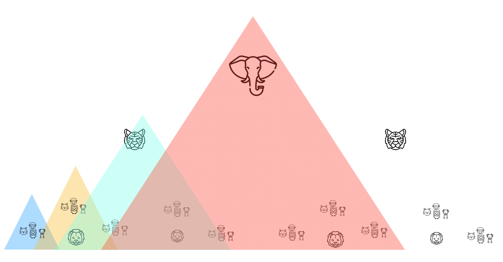

前面提到过，促使公司将应用垂直拆分的一个原因是团队工作在一个项目上，团队过大无法展开。虽然将应用拆分的原因有很多，但是因为团队过大是所有原因中最被低估的一个。互联网应用往往是因为人多才拆成几个服务，而不是因为是几个服务所以才人多的。三五个人几条枪，被大公司忽悠，一个小项目拆成了十几个服务，这种技术很”吓人“的项目往往结局也很吓人。

刚入行带我的老板是从一家大公司出来创业的，随着团队扩大，他老挂在嘴边的一句话是，”一个50人以上的团队是没办法管理的“。当时不以为然，后来工作久了，参与过数百人一起开发的电商系统，经历过一个 Java 团队就有30 人的项目。

深以为然，甚至更为悲观，认为超过 15 人的团队都是难以被管理的。如果是敏捷团队，人数过多会很麻烦。敏捷有很多实践，有站会、codereview、计划会议、回顾会议等需要全体参与的会议。10 人以上的团队都难以让站会在 15 分钟内结束，codereview、回顾会议在 30 分钟内结束。超过这个时间，还要不要写代码修 bug 啦？

对于一个大型项目来说，服务化正是为了解决这个问题。通俗一点，团队划分的问题就是谁和谁坐在一起的问题，比较合适的人坐到一起工作效率更高不是吗，对于互联网公司而言，组织架构需要和技术架构适配才能取得最好的效果。回答这个问题，我们需要先看下各种公司的组织架构形式。

## IT 行业企业组织架构类型

一些管理书籍将组织架构分为：金字塔式、扁平组织架构、矩阵制组织形式。对于互联网行业的公司来，我用更为通俗的说法，和现实中的经历，重新划分了一下：

- 大部门式的组织架构。相同职责的人被收集到一起，形成了前端、后端、测试等大部门，典型的科层制的组织结构。
- 矩阵制组织形式。大部门式的组织架构上根据项目再动态划分，行政管理和项目双线制。
- 自由市场式的组织架构。这个公司就是一个大市场，各个单位按照一定形式混编，甚至管理团队也作为一个单位为公司提供服务。
- 分形组织架构。基层由较全功能的小团队构成，多个小团队构成一个中层大部门，最后各个大部门构成整个公司。整个公司可以看做大型企业，每个大部门可以看做一个中型企业，每个基层团队可以视为一个创业公司。

## 大部门式的组织架构

有一些公司是按照工种来划分的，客户端、测试、产品经理被分到不同的部门。我曾在一个这种类型的公司任职，客串过前端部门和后端开发部门。因为业务决定了后端开发的工作量远多于客户端和移动端开发，因此部门之间极不均衡。

我们有 40 人的后端开发部门，10 人的产品经理部门，30 人的测试部门。这些人的工作部门领导分配，任务的流动方式是市场领导 -> 产品经理领导 -> 设计和交互部门领导 -> 各个开发部门(前端、后端、客户端、移动端) -> 测试部门领导 -> 运维部门领导 -> 市场部门领导。

这种工作模式本质还是一个大的单体团队 + 瀑布的工作流，其组织是一个金字塔形式，行动缓慢。这种组织架构带来了另外一个问题，团队扩张非常困难。这种困难和我们在技术上的容量瓶颈类似，技术上应用的水平扩展无法突破数据库的瓶颈，这种组织架构的瓶颈无法突破部门经理的负载。

## 矩阵式架构

大部门式的组织架构是从亚当斯密的社会化分工理论就开始了，制造业尤为明显。曾参观过富士康、自行车制造商捷安特的工厂，基本都是以大部门式的组织方式。银行、传统行业转行的 IT 公司很多也是大部门式。这种组织形式劳动密集型企业没有问题，但是对智力密集型企业缺点越来越明显。知识性工作，工作者之间需要大量的交流。相关的人，”坐到一起“ 永远是效率最快的交流方式。

随着软件工程的发展，项目管理在软件公司也像在制造业一样蓬勃发展。于是很多公司开始使用项目制，但是项目制的缺点和大部门式完全相反，项目组成员能有效沟通，但无法传达行政指令。行政管理总是不可或缺的，比如涉及绩效、涨薪等问题，项目制很难解决，几乎没有纯项目制的公司。

于是出现了项目、行政部门双轨的组织形式，这种形式能比较符合软件工程的需要。

传统的软件行业更像是来料加工的制造业，客户需要一个软件就启动一个项目，开发完成后释放掉这个项目。但是现代的互联网行业更像是一个服务业，软件开发需要源源不断的开发、修复问题和提供更新。于是矩阵式架构就留给了软件技术服务和解决方案公司了。

## 自由市场式的组织架构

互联网软件开发需要源源不断的开发、修复问题和提供更新，按照时间或者事件启动的软件项目越来越鸡肋。软件开发往平台化、服务化发展。互联网公司项目经理的话语权慢慢移交给了产品经理，软件开发变成了一个持续的行为。

相应的，互联网公司的组织架构开始调整为小型敏捷团队。响应需求和提供服务变成了其组织的目标，彻底区别于”来料加工“型的组织方式。这种组织形式需要很多灵活的小团队和一个中心来调度协调，于是变得越来越扁平。

很多公司推崇的扁平式组织架构，与其说扁平不如说是自由市场式。谁能为这个企业的内部产业链上提供服务就有机会拉起一个团队，如果能在公司外找到又好又便宜的供应商就外包出去，自由市场就是这么残酷。有人制作过一张苹果公司的组织架构图，非常有趣，围绕着 CEO 的是各个团队领导以及背后的团队。

扁平的另外一个含义就是各个单位之间相对独立，每个单位直接向核心层汇报。每个团队的独立性使之可以让核心层快速调用，当然每个团队也更容易被替代。不过需要注意的一点是，组织架构扁平的出现可不是公司为了给雇员提供一个轻松而没有压迫的环境，而是由他们业务决定的。

**因为这样比较省钱**，充分体现了市场经济的哲学原理。

披着”市场经济下“外衣的扁平架构就是完美的组织架构了吗？如果是这样，经济危机就不会出现了，扁平组织架构的公司就能万世长存。扁平意味着权利下放到基层，权利结构分散和多样。团队之间虽然可以平等对话，但是会出现互相不正常竞争、KPI 至上的问题。团队之间在每个财年争抢预算，各自为政。

这种组织架构要求一个精神领袖，或者强大的平台，否则难以约束基层的权利。当缺乏精神领袖时，这种系统并不稳定，举个不恰当的例子是周天子衰败的春秋时期，以及失去向心力的民国时期。至于民国时期的状态，可以了解下《中国近代简史》，下面是一张军阀分布图。

## 分形组织架构

当人类有组织后，大部门式的组织架构就有了，这是一种朴素的组织架构方式；那么自由市场式的组织架构是IT 行业特有的吗？拿我们近代史中的故事。二战时期的步兵往往就是大部门式的组织架构，这符合那个时期的军队特征。不过日、美军已经有全功能小队作战的思想，小范围用于山地特种作战。这个和全功能的敏捷团队有一点类似，有一点自由市场式的味道。

幸运的是我军走了另外一条路，也就是我们要聊的**分形组织架构**。当时我军在装备、人员上都和日军差距巨大，但好在产生了”三三制“这种班组突击战术，后来推广全军的组织架构上。三人构成一个战斗小组呈三角进攻队形，每名士兵分工明确，进攻-掩护-支援。三个战斗小组组成一个班，班长、副班长、二组长，各带一个战斗小组行动。一个排由三个或多个班组成，一个连由三个排组成，全军依次类推。这种组织形式的好处是，分工明确但又有向上信息传递的通道，不那么依赖中心，能在战术穿插过程中快速重新组织起来，形成战斗力。

分形是数学上的概念，它的局部总是和全局相似，自然界无处不在：雪花、树干、晶体等等。这种组织形态类似数学上的分形，我们暂且把这种形态叫做**分形组织架构。**

当然”三“也不是绝对的，可以由三人或者多人构成，现在由于兵种更加多样，现在军队也不是完全”三三制“了。不过”三三制“这种思想还广泛存在，影响了很多机构、企业的组织形式。

曾经很长一段时间里，对国内一些大型的互联网公司的组织架构感到疑惑。他们既不像大部门式的组织架构，也不像自由市场式的扁平架构。当一个公司大的可怕时，这些公司更像一个市场而不是一家公司，现在的理论仿佛不能完全描述他们。

三四个后端、一两个前端、一个 UI 设计师、两个测试外加一个产品经理，这就是一个互联网公司最基层的一个敏捷团队，负责一个大产品中的一个服务，也是很多初创团队的配置。

三四个敏捷团队大约几十人左右，就可以负责一个完整的产品，这也是一个起步成功的小公司的配置。

三四个产品构成一个事业部，能负责一个公司一条产品线，这也是一个中大型公司的配置。最后，多个事业部构成了最终的大公司，当然这些团队还有可能是市场、法务、生产等其他角色。

这种形态已经是目前大的互联网公司主流形态，金山、百度、阿里等等。这样来看的话，分形组织架构的局部就可以看做自由市场式的组织架构。

## 使用 DDD 指导团队划分

对于互联网企业而言，比较看好的是分形组织架构和自由市场式的组织架，因为我们基于 DDD 理论设计的分布式系统某种程度上也是分形结构。既然团队划分是为了服务技术架构，那我们又可以借助 DDD 的一些成果为团队划分帮一点忙了。

我们采用和《分布式授权设计》类似的套路，先把 DDD 的服务划分图做一些调整，然后再映射上团队划分图。再来解决一个一个细节问题。我拿最复杂的那张图做蓝本，并补充了分布式授权部分补充的授权服务。其实这张图还不够复杂，在真实的互联网公司往往还有支付、大数据、物流、售后服务等等。

我们从 DDDD 得到应用的分层，然后划分出服务。根据康威定律，一个公司的组织架构和技术架构需要适配，当我们采用分布式系统划分了我们的应用后，传统的开发、测试大部门就不再适用了。

因此我们使用敏捷的工作方式和团队划分方式。这也是我们正在讨论的问题，根据我们服务的划分作为底图，初步得到我们的团队划分方式：

作为敏捷团队，后端开发、客户端开发、移动端开发、前端开发、测试被打散到各个团队中。我将团队性质不同使用颜色区别了一下，以便于后面调整和阐述每种类型的团队成员组成部分。抱歉，因为这个图我还想保留 DDD 分层的信息，显得有点凌乱，我们会一步一步突出团队划分。

- 绿色， Deveops 团队，负责基础设施的开发和运维，提供开发、部署平台。负责维护测试环境、部署、日志、监控、代码质量检查、堡垒机、安全审计、数据库管理等。
- 红色，领域服务团队，负责领域服务开发、测试。可以由纯后端开发组成、QA为主。领域服务的 QA 负责 API 测试、集成测试、性能测试。
- 青色，应用团队，负责应用层和端侧实现。负责整合后端 API 实现端到端应用，团队由前端、客户端、后端开发或者全栈工程师组成。QA 负责应用端到端测试，确保最终交付质量。
- 藏青色，认证和授权团队，负责提供统一的认证和授权服务，也就是 SSO 服务。认证和授权团队一般都比较特殊和独立，因此单独一个团队。

这样一整理，我们发现每种颜色对人员的需求是不一样的，甚至需要自己独立招人。试试就是现在主流的互联网公司都是这样操作的，不仅需要独立招人，还有内部的人才市场。

那么，对于上面这个场景下的人员构成，我们再细化一下每个团队需要的具体角色。

这种系统还有一个问题没有解决，每个团队相同的角色之间没有交流。每个团队有自己的 UI ，那么整个公司就没法统一；各个团队的工程师如果没有交流，整个公司的技术架构就是一团糟；BA 各自设计，业务逻辑只考虑自己的应用和服务，必然会造成逻辑上的矛盾。为了解决这个问题，有些公司创造了一个”委员会”的概念，由分形的上一级协调拉通。

这些委员会不是一个团队，而是由每个团队挑选出能“说的了话”的人共通参与，进行需求、设计、架构、测试评审的。

- 架构委员会。由后端开发、devops、各端（前端、IOS、安卓、PC）等和技术选型、方案、架构相关的人员参与。职责为参与方案评审、技术选型、安全评估、规范制定、技术演进等。有一些公司会提供单独的架构师职位，其实更多的公司作为架构师的前提是一个优秀的一线工程师。
- UI/UX委员会。由各个团队的 UI/X 组成，负责制定 UI 规范，设计系统。
- 测试委员会。由各个团队测试组成，负责制定测试策略、测试用例编写规范。
- 业务需求委员会。由各个团队业务组成，负责拉通业务需求和产品设计，保持各个应用的业务逻辑的一致性。

当然如果是在一家大的电商公司还会有自己的支付、物流、大数据、营销、财务平台，除了 IT 部门外还有市场、销售、法务，根据我们的分形理论，他们可能存在于另外一个平行世界里。

## 总结

聊完这些，对于一个大团队是否可以被管理又没有那么悲观了。当人类开始有能力成群结队用石头击败野兽的时候，管理就出现了。推动人类社会进步的是火吗，其实更应该是建立在语言之上的社会组织能力。800年周王朝建立在封建社会对奴隶社会的优越性上，资本主义的萌芽不仅仅是因为蒸汽机，更可能是社会化大生产的新型组织形式。

一个大的公司真的应该重新审视组织和技术两个方面，组织架构的创新也许比科学技术的创新更重要，团队划分的问题实际上是一个如何解放生产力的问题。
