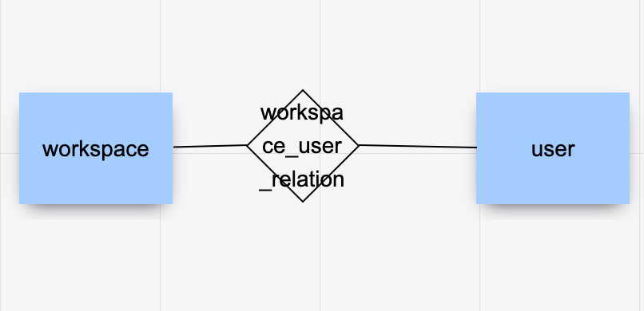
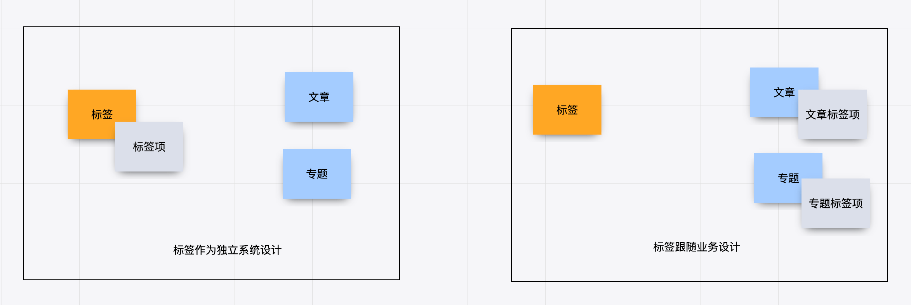

多对多关系是软件建模中比较的麻烦的场景，如果梳理不清楚对软件架构伤害很大。在不久前的一个项目中，十足的体验了一次多对多关系带来的痛苦。

我们的项目有是一种多空间模型，也就是用户可以处于不同的空间，在不同的空间中可以访问空间中的资源。一个空间可以拥有多个用户，用户可以出现在多个空间中。看起来和编程老师在数据库课程中的多对多关系没有区别。

对于数据库来说，多对多关系需要一个中间表，于是团队对数据建模“规范”的把中间表起名为 “workspace_user_relation”，得到的数据库 E-R 模型如下。

团队使用了 JPA 的 @ManyToMany 注解，导致 workspace 和 user 两个对象无时不刻在一起了。另外，通过 user 可以操作 workspace，通过 workspace 也可以获得 user。

这种设计，不仅在技术上实现困难，对业务的支持也不足。

1. 用户加入到空间中具有权限，通过这种方式比较难管理。
2. 空间管理员并没有对用户的修改权利，只有对用户加入、退出、访问空间资源的权利，这种设计诱导了业务提出不合理的需求。比如空间管理员对用户的禁用，其实只是对用户参与到空间中的行为禁用，而非对用户禁用。
3. 关系表中的创建时间的含义是用户加入空间的时间，使用中间表语义不明显。

## 换个思路

在很多编程指南和规范中，都有写明不允许使用多对多关系。在一些框架中，虽然实现了多对多关系，但是往往不推荐使用。

因为我们在开始学习编程的阶段中，接受了数据库的关系理论。数据库关系理论是 1969 被英国计算机科学家 Edgar Frank "Ted" Codd 首次提出。关系数据库理论继承了集合论的的思想，在处理数据上有独特优势，被广泛使用。关系数据库理论可以做到降低冗余，提高一致性的能力。

关系模型被用来存储数据、处理数据非常好用。但是，面向对象作为一种流行的编程模型，它是用来模拟现实业务的。面向对象构想的信息结构是树形，而关系模型是集合。

它们有一个天然的鸿沟，就是这两种结构如何转化的问题，因此出现了大量 ORM（对象关系映射） 软件来试图解决这个问题。数据库中的普通关系（一对一、一对多）可以使用面向对象中的 “组合” 来映射，但是多对多关系却极难被处理，这也是一些框架不建议使用的原因，但往往难以说明其中的道理。

其中的道理是什么呢？因为，关系模型中的多对多“关系”，映射到面向对象在本质是一个“隐藏的模型”。 

我们用认识论中的主体-客体思维来看待这个问题，主体-客体可以让认识问题变得更深入。主体是有认识能力和实践能力的人，或者，是在社会实践中认识世界、改造世界的人。客体是实践和认识活动所指向的对象，是存在于主体之外的客观事物。在业务系统中，我们可以把 Controller、Service 这类带有行为能力的对象看做拟人化的主体，而 Entity、Model 看做客体。

回到上面的例子，对于工作空间、用户而言，当把用户加入工作空间的时候。我们发生三步行为：

1. 使用了用户信息、工作空间的信息，这一步用户、工作空间都是被感知的客体。
2. 创建了一个关系“工作空间-用户”，这一步“工作空间-用户”是客体。
3. 把这个关系加入到工作空间，扩充了工作空间的信息，这一步工作空间是客体。

问题的关键是我们往往没有找到一个好的名词来描述“工作空间-用户”这个概念，一旦这个概念被明确下来，我们的模型就清晰了，多对多关系就不存在了。

举例来说，我么可以给“工作空间-用户”找到如下的名字：

1. 空间成员
2. 参与者
3. 空间用户

真真实的例子中，我们使用了空间成员来作为这个隐藏模型的名字，因此空间和用户的关系被拆解为 “空间拥有多个成员” 和 “成员可以引用用户” 两个关系。

## 更多案例

大部分的多对多关系都可以通过这种方法消除，不过，除了起名字这个难题外，还有另一个问题。

多出来的这个隐藏模型和谁走？我们使用一个例子来说明这个问题。

在很多系统中，我们都需要使用 “标签”，而标签和特定的资源都是多对多关系。明白上面说的逻辑后，我们把标签存在于某个资源中的关系叫做 “标签项”。但是，如果同时有多个资源都需要使用便签，标签项跟谁走呢？

如果所有类型的标签都跟着标签走的话，可以做出一种通用的标签系统。其结果类似于搜索系统了，通过标签系统处理所有的业务。这样设计会使聚合搜索带来便利，但是标签在具体业务中的使用变的困难。

如果标签跟随具体的业务走，那么隐藏的中间模型就是具体的业务中的一个概念，比如文章专题中的标签、文章中的标签。通过这样的处理，可以让系统解耦良好。不过，代价是聚合搜索能力需要额外的技术来实现。

这个例子充分说明了模型的建立需要为业务服务，业务人员往往需要明确其业务重心，并做出一些权衡和取舍才能设计出合适的模型。

## 参考资料

- Mapping objects to relational databases What you need to know and why https://fi.ort.edu.uy/innovaportal/file/2032/1/mappingobjectstorelationaldatabases.pdf 
- Many-to-many (data model) https://en.wikipedia.org/wiki/Many-to-many_(data_model)
- Subject–object–verb https://en.wikipedia.org/wiki/Subject%E2%80%93object%E2%80%93verb
