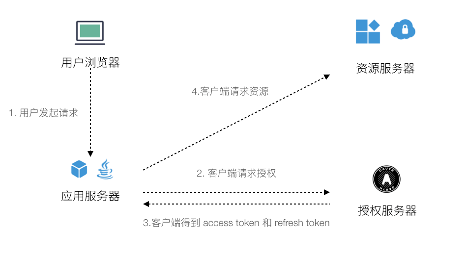

应用垂直拆分后，面临的另外一个技术问题就是分布式授权问题。实际上 OAuth2 非常成熟，互联网的分布式授权体系基本都是基于 OAuth2的，使用分布式会话机制实现的 session 共享不能算严格分布式授权。讲解 OAuth2 的文章非常多，这里简单回顾一下，细节请参考相关资料 ——  之前的博客 [细说API - 认证、授权和凭证](http://www.printf.cn/index.php/archives/api-authentication-authorization-credential.html)。


OAuth2 有四个角色：资源所有者、资源服务器、授权服务器、客户端。

- 资源所有者（Resource Owner）。通俗来说就是需要授权的用户。
- 资源服务器（Resource Server）。这个比较好理解就是提供资源或者业务能力的服务器。
- 授权服务器（Authorization Server）。提供授权、发放凭证、检查凭证的服务器。
- 客户端（Client）。发起授权请求的服务器。


OAuth 2  主要解决了两个问题：

- 在不传递用户口令情况下让用户获得权限通行证。这个是通过服务间传递一次性授权码的方式代替密码传递实现的，基本原理比较简单：用户访问应用服务，应用服务去资源服务器拿资源，被要求授权。用户被跳转到授权服务，并使用密码请求授权服务器，授权服务器生成一次性授权码，跳转回应用服务。应用服务通过一次性授权码去授权服务器换取资源服务认可的凭证。
- 让分布式系统中各个资源识别访问者是否有权限访问。资源服务器提前注册到授权服务器，通过凭证去授权服务器检查是否有效，并获取角色信息。


基本的逻辑如下：





实际上，OAuth2 有主要 4 种模式，解决不同场景下的问题

- 授权码模式（authorization code）。通过一次性授权码，在无密码传递情况下获取授权。

- 简化模式（implicit）。没有应用服务器，客户端充当应用服务的角色，授权服务器直接把权限给客户端。

- 密码模式（resource owner password credentials）。应用服务器和授权服务器彼此信任，通俗来说密码模式就是走公司自己的授权服务，授权码模式走第三方授权。用户直接在应用服务输入密码，应用服务传递密码给授权服务器。

- 客户端模式（client credentials）。和用户授权无关，解决服务之间访问的问题。也就是常说的 AK/SK 授权，识别来调用你服务的来源是否合法。


## 匹配 OAuth2 权限角色

在 OAuth2 实际应用中，有一个问题没有解决。应用垂直拆分后，那些服务分别充当 OAuth2 中的角色呢？我们回来之前的复杂问题，收银系统。当时为了简单，省略了用户服务和认证（IAM）服务，为了画下这张图，省略了一些元素，重点突出授权方面的内容。


这个图还是看不出我们应用中那些是资源服务器、那些是应用服务器、认证服务器。我把图修改为半透明，并映射相关信息。


通过 DDD 和 OAuth2 的结合，可以清晰地将 DDD 中的各种角色映射到 DDD 分层模型上。总结如下：


- DDD 各种应用服务，需要实现为 OAuth 客户端。

- DDD 各种领域服务一般设计为资源服务器。

- 授权服务器需要既要提供一个 DDD 概念上的应用层和领域层，可以部署到一起发布。

- 用户服务既要充当授权服务的资源提供者，实现用户登录。又要充当资源服务器，需要被权限管理。是一个比较特殊的互为依赖的关系，为了破解这个死循环，所以往往系统管理员都内置在数据库中。

- 系统内部一般使用密码模式简化授权流程。

- 如果需要提供一个开放的授权服务，授权服务器需要支持授权码模式。

- 服务之间的信任问题使用客户端模式，通过 AK/SK 访问，在很多公司内部叫做 ”集成账号“ 调用。

- 主流的实现上一般设计了认证服务和用户服务。用户服务负责用户、权限、部门等数据管理，认证服务负责 token 的分发，权限校验，绑定第三方登录等职责。

  

## 拦截器应该放到哪里？

除了搞明白 DDD 分层和 OAuth2 角色映射关系之外。DDD 思想还可以回答另一个问题：访问控制应该在哪里完成？用户获取到凭证后，授权服务器确实可以校验凭证，那么谁来负责访问控制（ACL）呢？接入层、领域层、还是应用层？


为了回答这个问题，我们需要将权限分为两种情况：


- 方法级别的功能权限。解决的问题是，我能做什么。
- 数据权限，角色和对象之间的权限。解决的问题是，我能对什么数据做什么。


我们发现，功能权限不正是应用层的职责吗？应用层定义某个角色能完成一个独立的业务职责，也就是 use case。像添加商品、删除商品，都是一些 use case。那么这些权限控制放到应用层非常合适，应用层可以简单地在方法前面加上注解就可以实现。

```java
@PreAuthorize("hasRole('ROLE_ADMIN')")
public void addProduct(){
}
```


数据权限则没有那么简单，有两种声音：

1. 所有的权限都应该集中控制，数据权限也不例外，不应该放到领域层，应该尽量前移。在网关中完成认证和授权，请求进入系统内部后无需再检查权限。
2. 数据权限和业务相关，应该留给领域层决定，例如删除文章，需要有业务逻辑实现删除的是谁的文章。或者满足一定规则，比如删除共享给我编辑的文章。

在趟过很多坑，以及和大量资深工程师交流后，我是第二种声音的坚定支持者。原因有几个：

1. 不是所有的数据权限都能容易的被统一拦截器拦截实现，这个想法很美好，但是很不现实。
2. 用户对象的权限，本质上是一种业务规则，应该属于领域服务中来完成，否则大一统的数据权限成本高昂。非常简单的例子：有一个协作工作系统，一篇文文章可以由一个团队的成员编辑、删除。如果放到应用层，根本无法通过一个注解完成，因为有隐藏的业务规则存在。这种规则在 DDD 中可以使用 specification 模式来描述。


## 权限设计的经验

1. 通过 HTTP 请求的方法来设计拦截器，因为很多权限不是以 HTTP 请求为粒度设计的。另外权限应该同应用层和领域层有关，接入层只起数据编解码、转换的作用，拦截器不要放到接入层。
2. 权限设计过于复杂，例如用户对一个集合部分数据有权限，部分无权限。业务往往要求 ”无权限即不可见“。但是这样做成本非常高，如果设计成上面方案 1 之后几乎没有能力扭转局面。这种场景会带来分页、过滤、统计等各种问题，建议从业务上避免。
3. 通过 HTTP  header 传递权限信息。服务之间的权限信息不要侵入业务方法，与之类似的还有语言、版本、trace id 之类的信息。
4. 用户密码错误，不要提示密码错误，应该提示”用户名或密码错误“。防止用户名被嗅探，被账户注册机等灰产盯上。


##### 分布式授权的性能问题

分布式授权往往会出现性能问题，每一次请求资源服务器都会拿到 access_token 后去认证服务器校验是否有效。在 Spring Security 中默认使用 RemoteTokenService，字面意思就是通过远程访问进行校验，通过 HTTP client 访问认证服务器。OAuth2 RFC 规范文档叫做 Introspection，定义了相关规范。

每一次远程调用意味着性能的浪费，为了消除掉这次远程调用，可以使用两种方法：

1. 直接访问 token 存储源，Spring Security 设计有 RedisTokenStore。不过这种方式违背了分布式系统的初衷，可以在内部系统酌情使用。
2. 使用自包含凭证，也就是 JWT（Json Web Token），Spring Security 设计有 JwtTokenStore。通过使用 Token 自身携带的凭证进行鉴权，可以较好的提高效率。


使用 JWT token 有两个注意事项：

1. JWT 因为自包含的特性无法做到撤回，解决的办法是通过 redis 设置一个黑名单，redis 过期时间和 token 比 token 的过期时间稍长即可。另外也需要给 access_token 设置一个合适的过期时间，一般在 5 - 10 分钟。
2. JWT 本质上是签名而非加密，Json Web Token 是 Json Web Signature 的应用。JWT 由消息体 + 签名构成，实际上就是结构化的 HMAC 签名方法。因此不能将一些敏感信息放到 JWT 消息体中，消息体只存放一些必要信息，并用于验证签名是否有效。如果需要更多用户信息，需要从用户服务获取。


总之，应用垂直拆分后解决授权问题主流的方法是 OAuth2 + OpenID（OpenID 是一种基于授权的认证机制，可以参考相关资料）。OAuth2 只提供了一个授权模型，DDD 可以指导那些服务可以设计为客户端、资源服务器、授权服务器，根据 DDD 对系统分层可以得到一个映射关系，从而梳理出合理的权限系统。最后，分布式授权也会带来性能问题，我们可以通过 JWT 来解决这个问题，JWT 只是一种凭证格式，不是授权机制，应注意避免滥用。
