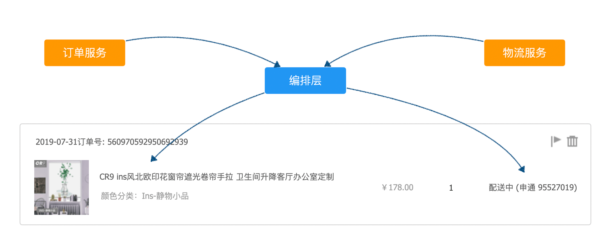
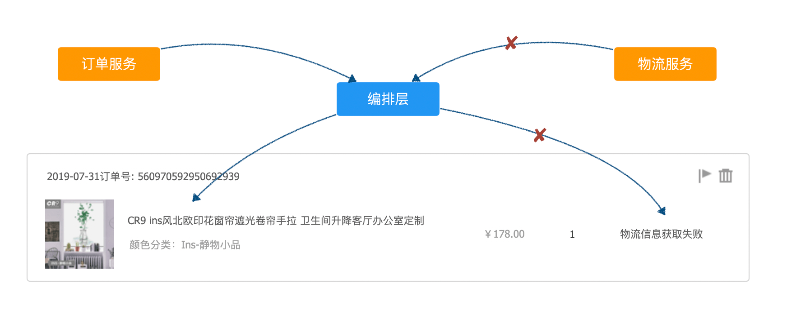
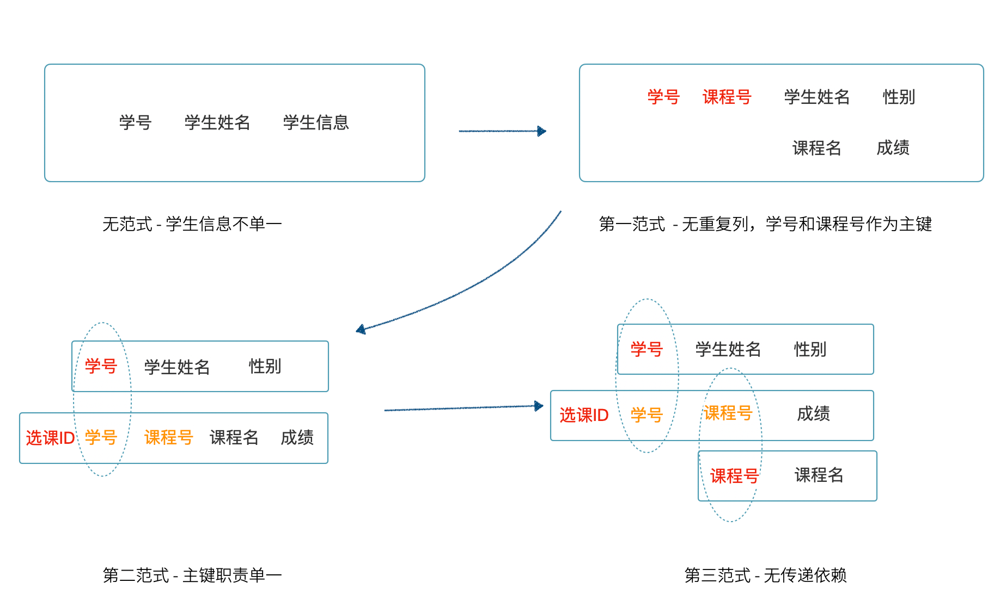
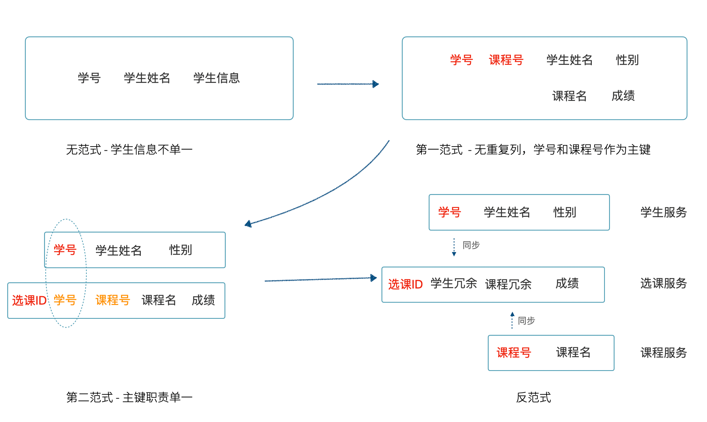
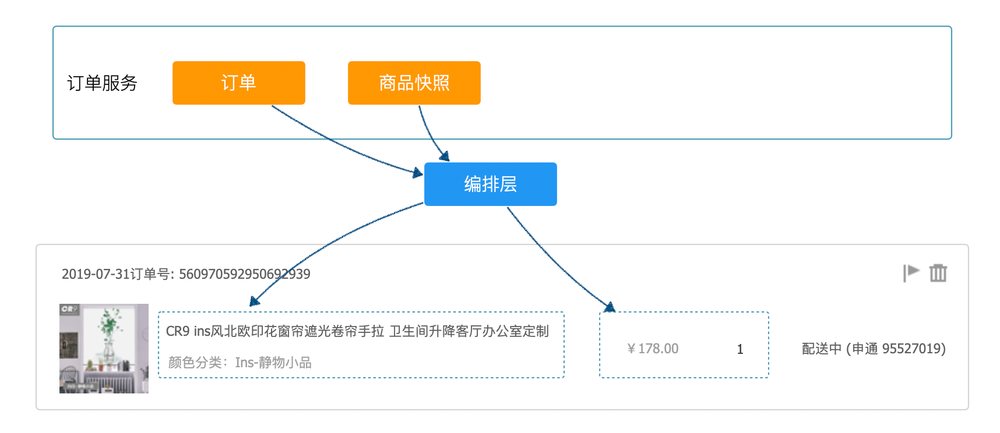
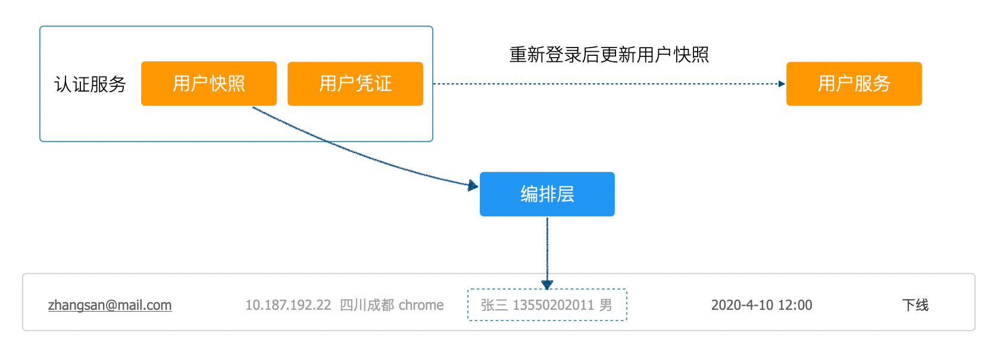
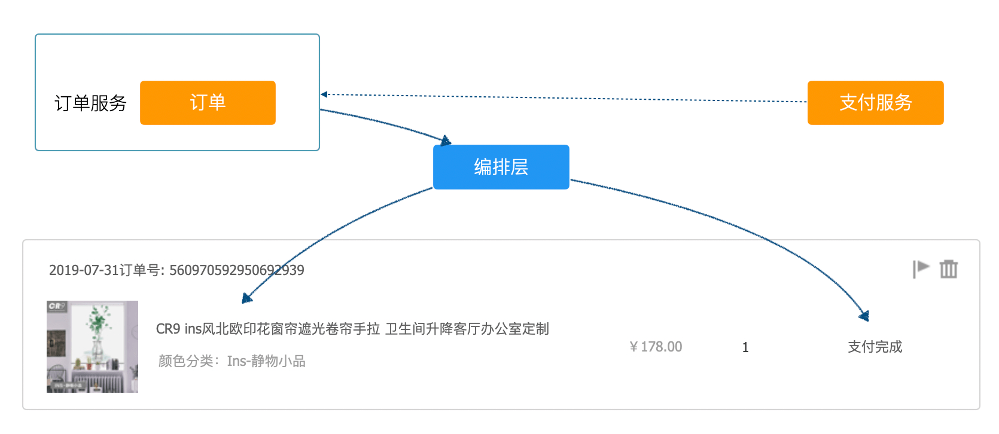
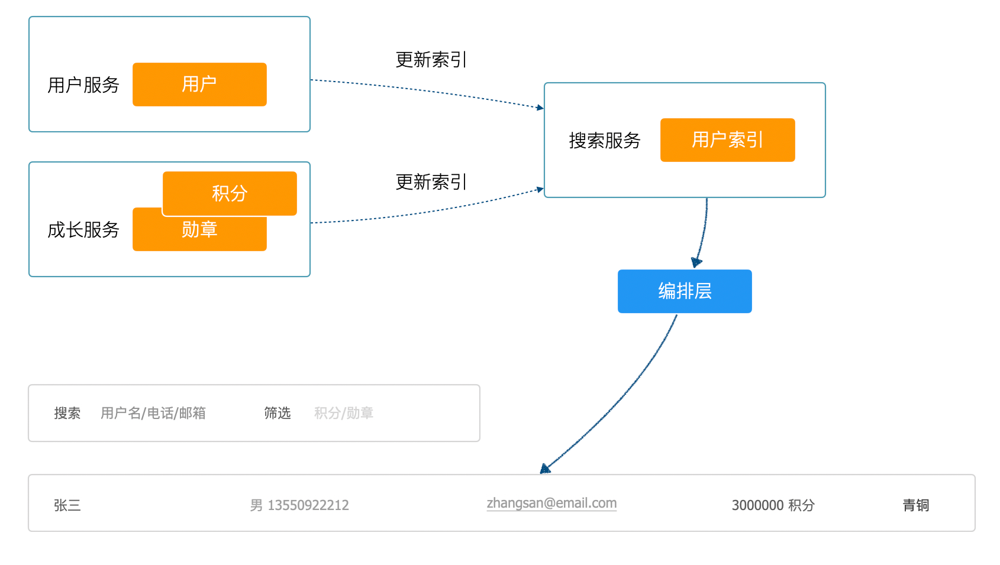

应用垂直拆分后面临的另外一个问题是实现表关联查询，例如某项业务在界面上有一个订单列表，订单列表中的一项是商品名称。按照一般的规律，商品和订单会被划分到两个服务中。

如何实现这个需求呢？

如果是单体、小项目，首选的方案就是订单表和商品表进行关联查询。不仅在分布式系统下，关联查询不可能实现，即使两张表在同一个库里，对于商品、订单这类大表联表的速度也非常慢。

## 使用实时查询

服务化后，为了解决这个问题，走进的一个误区是通过 ID 来查询一个列表。为了构造出带有商品信息的订单列表，很多开发者会在分页后通过订单上的商品 ID 构造一个请求发送到商品服务，以此获取商品数据。为了避免循环调用产生 N+1 的问题，商品服务的开发者”贴心的“提供了一个通过商品 ID 数组批量获取商品数据的接口。

当这种接口大量出现的时候，拆分出来的服务又耦合到一起了，系统性能受损，且容易造成”雪崩“。会有大量的请求打到基础服务上，用户服务、商品服务、基础配置服务等首当其冲，需要注意这是分布式应用下的一种反模式。

在不得已且场景合理的情况下可以采用这种依赖方式获取数据，例如:

> 订单列表上有实时的物流信息，物流信息由物流服务提供，并且变化频繁。业务要求用户能看到自己的订单列表，列表中有一列为物流信息，包括：物流状态、物流单号、物流公司。

这种场景下，不得不采用将订单分页后通过 ID 到物流服务中获取，然后返回给前端。

即使是使用这种方式，也需要遵守一些规则。获取两个服务的数据并编排到一起，显然这个工作应该放到应用层，并尽可能使用异步的方式获取数据并聚合到一起。正是这个原因，Nodejs 以其天然的异步特性，被大量使用在应用层和接入层。如果使用 Java 则可以考虑 RxJava 等异步库来实现。

同时，这种调用也需要进行熔断和回退。当物流服务 不可用时，应该即使中断连接，并依然将可用的数据返回给前端。界面上的表现是订单数据显示完整，仅仅是物流数据暂无法获取，对用户来说应用基本可用。

不过，大多数场景下可以通过数据副本冗余和搜索服务解决这个问题。

## 使用数据副本冗余和反范式

产生这个问题，实际上是受到数据库关系理论影响太深了，数据库关系理论可以有效解决数据一致性和冗余，但在分布式系统下不再适用。

我们来回顾下关系理论中最重要的数据库范式理论。范式理论在某种程度上代表着数据库设计冗余度，主流的范式理论有第一到第五范式，第三范式后面有一个巴斯-科德范式，可以看做 3.5 范式。随着满足范式增高，意味着数据库冗余降低，也就是表越 ”碎“，所以一般参考第三范式。

1. 第一范式（1NF）。列职责单一，即表中每一列都是不可分割的，这是数据库设计的基本条件。学生表(学生姓名，学生基本信息)，用户基本信息中还有姓名。不满足第一范式，连关系数据库都不能算。
2. 第二范式（2NF）。所有字段都需要依赖主键，表中不应该存放和主键无关的字段。选课表(学号，姓名，性别，课程名，成绩)，学号与课程名称是主键。姓名依赖学号，但是和课程没有关系。应该拆分成学生表、选课表。不满足第二范式，本质是多个模式叠加一起了，会存在冗余以及部分记录中大量空字段。
3. 第三范式（3NF）。所有的字段都应该直接依赖主键，而不是传递依赖主键。基于第二范式的选课表(选课ID，学号，课程号，课程名，成绩)，选课ID是主键，学号、课程号、成绩决定了选课记录。课程名和选课 ID 实际上没有关系，课程名存在冗余。如果要满足第三范，需要将课程名拆分出去，通过课程号外键关联。

第三范式导致了学生和课程关联到一起，如果需要将学生和课程拆分成不同的服务，选课由课程服务提供，冗余*其中一个服务的部分字段。在分布式应用系统下，可以通过反范式的思想来解决服务间的数据关联问题，单体系统我们一般将范式设计到第三或者巴斯-科德范式，分布式系统则应该考虑退化到第二范式，使用数据冗余和服务间同步。

## 关于反范式应该注意两点：

1. 反范式不是没有范式，而是将高范式退化大低范式，通过冗余换联表成本。
2. 有些场景使用了冗余和快照是业务使然，例如订单中商品快照本来就不是商品，他们之间无需同步。即使在单体系统下也应该分开。这种冗余也不是反范式。

下面几个常见类似业务场景：

> 1. 某电商系统将订单和商品拆分为不同的服务，但是业务要求订单列表中需要显示商品名称。
> 2. 某大型网站提供了用户认证 SSO 服务，且拆分了单独的用户服，在某管理后台应用中，需要显示已经登录的用户列表和用户基本信息。
> 3. 某电商系统将订单和支付拆分为不同的服务，但是业务要求订单列表中需要显示支付状态。

通过 DDD 思想来分析，业务场景 1，订单中的商品和商品服务中的商品明显不是同一个概念。关于二义性的问题，我们在之前的文章中也讨论过，在不同的上下文下会存在二义性，通过发现二义性能建立合理的模型。这里的商品应该作为订单服务中订单项上的商品快照存在，设计为数据冗余。充分分析实际的业务问题，自然就解决了冗余关联的问题。类似的场景还有收货地址、票据等，这些对象都可以使用 DDD 中的值对象来设计，利用不可变性，让代码更直观。

对于业务场景 2 属于常见需求，但是领域建模比较难的部分。很多系统都会提供认证服务，在认证这个上下文中，模型的本质是认证后的用户而非用户本身。因此往往是 token + 用户快照，不过并不是持久化到数据库中（往往是 redis ），所以在线用户列表并不需要去关联用户表，数据的一致性在用户重新登录后完成。

对于业务场景 3 不能简单套用业务场景 1、2 。订单中需要冗余支付状态信息用于在订单服务中使用，但是对于这类需要服务间更新的冗余数据来说，可以借助在《分布式事务设计》部分谈到的最终一致性完成。不需要实时的访问订单服务，而应该采用同步和推送的方式，将支付服务中的状态同步到订单服务。

在充分对业务分析的场景下，这种方式优势明显：

1. 查询性能高，不需要跨服务查询，缓存策略简单
2. 不需要熔断，没有雪崩效应
3. 便于业务统计分析，数据统计的成本低

当然，并不是所有的业务都能满足条件去实现这种设计，需要具备一些条件：

1. 业务天然具有分离性，典型的就是商品快照、收货地址、发票、单据
2. 业务上不完全分离，但能接受一定程度的延迟，对实时性要求不高，可以通过最终一致性同步过来。例如商品服务和供应链服务。

还有一些陷阱需要注意：

1. 盲目冗余，被冗余数据和当前服务完全没有关系。例如用户是否有折扣由积分阈值决定，积分可以动态增加和减少。有可能业务需要用户列表中显示有无折扣，但是折扣信息和用户完全不相关，这种情况也不要冗余。
2. 延迟要求较高，在前面的例子中物流信息变化十分频繁，并且业务上对延迟接受度低，也不要设计为冗余。

## 使用搜索引擎解决复杂查询

解决两个服务的问题，有时候可以引入第三个服务来解决。我们来看下面的场景：

> 一个社区应用，用户发帖时间达到一定可以领取荣誉勋章，该系统将用户信息和成长体系分为两个服务。现在有一个需求是管理员需要根据荣誉勋章或者用户名进行搜索，并显示到一个列表上。同时类似业务也有可能出现在用户侧。

这个场景有两个特点。第一，不满足冗余设计的条件，荣誉勋章输入成长体系的一部分，这个服务和用户服务不太搭边。第二，需要跨服务搜索，且搜索会很复杂。

这种场景下实时查询和冗余设计的都不是很方便解决这个问题，好在可以通过搜索服务来解决这个问题。

开源成熟的搜索引擎 Elastic Search 在互联网公司广泛应用，用于解决服务垂直拆分后的查询问题非常实用。通过创建多个 Elastic Search 的索引，可以满足各种不同的查询需求。

使用搜索引擎会造成项目的运维成本上升，带来好处同时也需要考虑成本。另外真实项目中，服务间数据同步失败，最终一致性丢失这种问题始终存在。搜索引擎应该只拿来做搜索，不应该获取搜索引擎中的数据直接应用于交易业务。用户从搜索引擎获取的列表，然后根据该条目操作退款等业务，即使条目中含有相关数据，也应根据关联字段实时访问服务获取最新正事数据，保证强一致性。

总之解决表关联问题还是需要转换关系型数据理论和分布式系统下的两种思维方式，灵活应用。跨库联表等技术显得非常不自然，同时在性能、业务规则上都面临挑战。

