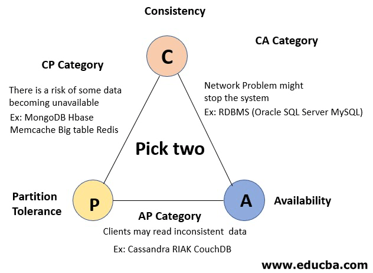
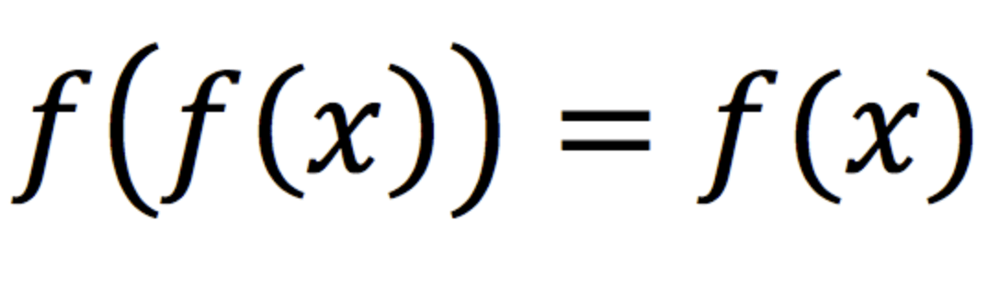

服务被垂直拆分后，如何解决事务问题是一个业界难题。很多讲架构的书都会讲两阶段提交、三阶段提交、TCC模式、Saga 长时处理，然而并没有说明什么场景下该选用什么架构。

其实我们一直都在和分布式事务打交道，银行、典型业务有一个概念叫做”冲正“。意思是对错误、或者不一致的情况出现时进行纠正，和数据库事务的回滚类似。和第三方支付系统对接时，支付系统会同步或者异步回调，回调失败后会反复重试。

和外部系统对接，本质上就是构成了一个分布式系统，其一致性问题就是分布式系统。但这种一致性问题和我们在数据库事务不能完全等同，数据事务是强一致性，满足 ACID 的特性。分布式系统事务参考 BASE 思想，保证最终可用即可。

根据 CAP 定理，分布式系统中一致性、可用性、分区容忍性是矛盾的，只能三者取二。因此分布式事务的最佳解决方法是：**服务间使用柔性事务（AP），服务内使用强一致性事务（CA）。** 解决这个问题，需要了解几个基本理论：CAP 定理、ACID 原理、BASE 思想、幂等原理。

## CAP 定理

数据库随着服务垂直拆分后，单机系统的事务规则不再满足。分布式系统的 CAP 定理包含三个元素：

- C: Consistency，一致性。系统中所有的数据备份、分区，在同一时刻具有同样的值。
- A: Availability，可用性。系统收到请求后，必须完成响应，否则就是不满足可用性。
- P: Partition tolerance，分区容忍性。每个节点可以视为一个区，可以允许分区之间通信失败。通俗的来说，由于人类通信技术条件限制，如果是分布式系统，就具备分区容忍性。

CAP 定理的本质是阐述了网络通信的不可靠传输，技术上无法突破，但是可以从业务上取舍。关系型数据库都选择 CA，保证业务可用和一致性问题，不接受分区容忍，也就是说网络断开就不再工作。

因此服务内就是一个单体，可以从容的选择强一致性事务。而服务间无法突破 CAP 定理的限制，可以通过各种手段达到最终一致性，而最终一致性的各种方案非常成熟。

## ACID

- A:Atomicity，原子性是指一个事务是一个不可分割的工作单位，其中的操作要么都做，要么都不做。
- C: Consistency，一致性是指事务执行前后，数据处于一种合法的状态，最终状态不会出现。
- I:Isolation，隔离性是指多个事务并发执行的时候，事务内部的操作与其他事务是隔离的，相互之间不受影响。
- D:Durability，持久性是指事务一旦提交，它对数据的改变就应该是永久性的，机器故障或断电都不会丢失数据。

ACID 约束了数据库具有一致性和可靠性优先，主流关系型数据都支持 ACID 特性，但是需要注意 MongoDB、Redis 等数据库是不支持的，不应该完全依赖它们存放交易数据。

## BASE 事务原理

BASE 思想相对于 ACID 可以指导分布式系统中柔性事务设计， BASE 包含三个元素：

- BA:BasicallyAvailable，基本可用。
- Soft-state，软状态/柔性事务，允许系统在一定时间之内存在不一致的情况，这种状态叫做软状态。
- Eventually Consistent，最终一致性，经过一段时间之后，更新的数据会到达系统中所有的节点，这段时间被称为最终一致性时间窗口。

BASE 思想更契合我们做服务拆分的目标，分而治之，实现弹性拓展。例如订单支付完成之后，允许一段时间后，订单状态最终被标记为被支付。**BASE 事务原理在实际开发中最难的不是技术问题，而是让业务方能充分理解，这两种事务的关系，并在交互方式上做出调整，例如在界面上增加状态、进度等。**

根据 BASE 的思想，服务之间数据更新的方法调用，最好采用异步、消息机制，保证可用性、性能，一只性留给时间。

服务内部调用性能指标使用 QPS、TPS，服务间调用的设计，有两个不同的性能指标：

- 调用成功率，尽量不启用补偿机制
- 最终一致性时间，同步时间尽量小

## 幂等

想要做到最终一致的方案有很多，例如可靠消息模式、重试等。其中一个重要概念是，支持柔性事务的方法都需要设计为幂等，建议服务间调用的方法都设计为幂等。

幂等是一个数学与计算机学概念，幂等操作的特点是其任意多次执行所产生的影响均与一次执行的影响相同。通俗来说就是一个方法多次执行不会产生副作用。数学公式表达如下：

HTTP 协议中 GET、PUT、DELETE 等方法往往都是幂等的，除了 GET 这种天然具有幂等特性的方法外，分布式系统中对数据更新的调用也需要设计为幂等，用于实现最终一致性。

解决服务间一致性问题的方法总结：

1. 业务上做出取舍，或者划分服务时考虑，强一致性事务在服务内完成

2. 服务间使用柔性事务

3. 服务间有状态的方法调用设计为幂等

4. 服务间有状态的方法调用尽量走消息队列
