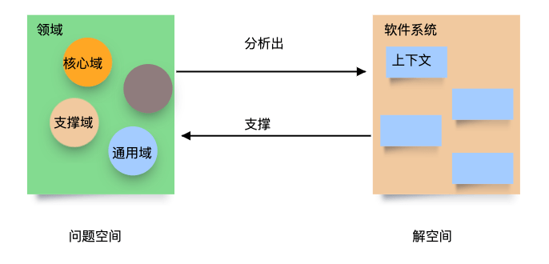
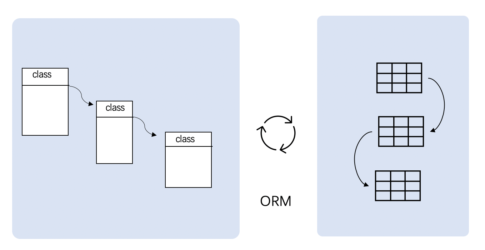
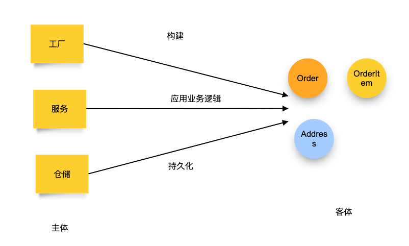
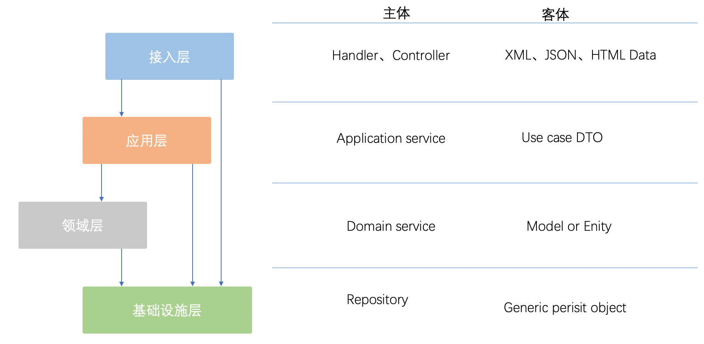
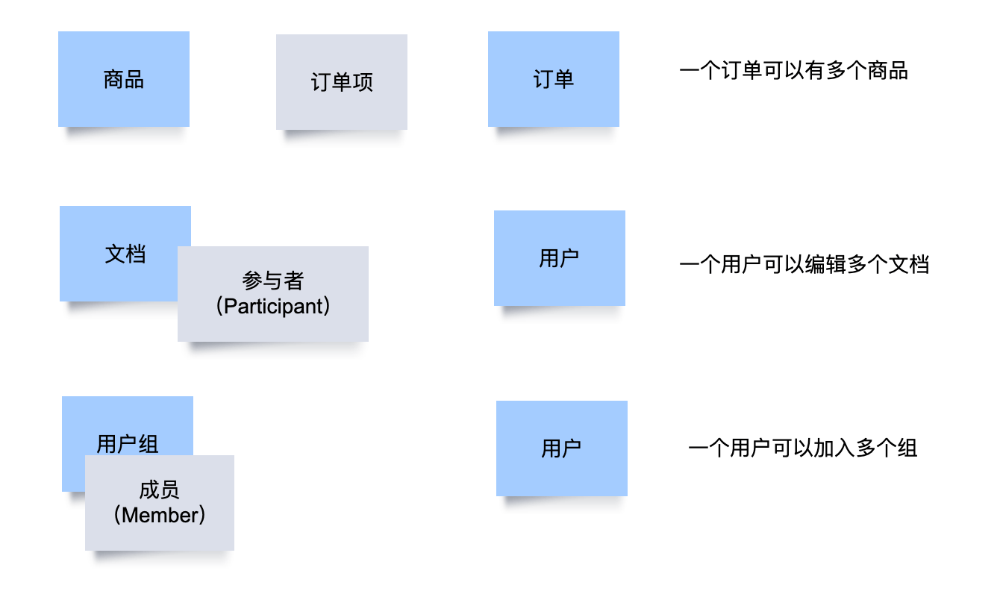

在做 DDD 的培训和工作坊时，会遇到来自客户或学员的疑问，有些问题值得我们深入思考。我整理了一些常见的问题，欢迎补充和讨论。结合 DDD 社区最近的讨论成果，这里我先给出一个简单的参考答案。

## 领域到底是什么？

对领域这个词的理解就是 DDD 入门的第一个难关。我们有时会被客户问到，领域到底是什么？首先要清晰地知道领域是什么，才能划分核心域、支撑域和通用域。换句话说，构成领域的要素是什么呢？

领域是一个非常抽象的词汇，我们需要先对其具象化。在英语的语境中，“Domain” 其实就是业务，指的是现实生活中的各种事务。处理税务、记账、售货记录等，这些都是领域。

于是，我们给领域下了一个定义：

>  领域（Domain）是业务相关知识的集合。

通俗来说，领域就是业务知识。业务有一些内在规则，存在专业性，比如财务、CRM、OA、电商等不同领域的业务规则不同。计算机只是业务规则的自动化。更加具体来说，构成领域的要素就是特定的业务场景。

通过对业务的场景划分，再对其分类，就是我们的子域。

核心域：那些对业务极其重要的场景，内容社区应用，就是提问、看帖、回复。

支撑域：那些对重要业务支持的场景，比如登录、找回密码等场景。

通用域：那些已经成为相对独立的支撑业务场景，比如实名验证、人机校验（以前是支撑，现在可以是通用）。

## 领域和上下文是什么关系?

如果领域的构成要件是场景，上下文的构成要件是模型，那么领域和上下文之间就没有包含和被包含关系。

也不存在一个领域是否对应多个上下文的关系。

他们构成：上下文支撑领域的关系，领域导出上下文的关系。

DDD 软件建模就是业务问题和解决方案之间的桥梁。领域是问题，设计出来的模型是解的一部分。因此，问题和解形如 x 和 f(x) 的关系，f = 软件建模过程。

举个例子来说，某个电商网站有多个渠道，零售、批发、企业采购等多个场景的业务，这是他们的领域。对于研发工程师来说，他们会最终设计出订单、商品等模型上下文，来支持这些领域。

## 聚合如何持久化？

聚合的持久化是一个老大难问题。

Eric DDD 给了我们描述了一种理想情景。只要把业务一致的一组模型从数据库中统一获取到，对其做业务修改，然后再持久化回去，就可以避免业务的一致性被破坏。

业务的一致性可以这样理解。我们有订单和订单项，订单的总价由订单项计算得来。如果不长眼的程序员把订单项直接修改了，而不更新订单，就会带来 bug。

但是，遗憾的是我们的内存不是无限大，而且数据会在断电后丢失。我们必须把数据从磁盘中读取出来，而磁盘的访问速度很慢。数据在磁盘中的组织形式使用了集合+关联的方式存放，这是由于我们为了减低数据冗余和方便查询而不得已为之。这就是关系模型和对象模型的差异，而不得不采用一些技术方法转换（ORM）。

聚合被赋予了两个责任：

1. 负责业务的一致性。
2. 负责数据的整体存储。

第二点，让聚合的持久化变得困难和性能低下。

一个简单的道理是，我们只需要一个橘子，却总想把橘子树搬来搬去，虽然摘橘子需要通过橘子树。

## 充血模型为什么不符合编程习惯？

充血模型已经是很多 DDD 实践者的潜在认知，简单来说就是把业务行为放到模型中。

这种做法看似满足了面向对象的实践，但是在实际工作中，它并不方便，甚至有些别扭。在培训中，有学员找我们说，学了 DDD 之后不会写代码了，甚至忘记之前的代码该如何编写。

极端一点的例子，还会有人在聚合根中调用仓储来实现聚合的存储。这时，他们发现矛盾在于 JPA 的存储需要使用实体的类型信息，这时候便束手无策了。

在辩证唯物主义认识论中，一个行为构成的要件是：主体 + 动词 + 客体。

在英语学习中，主谓宾结构的主体是主语，客体就是宾语。甚至，主系表结构也满足这个道理。主语是主体，表语是主体的属性，也是客体。

“太阳是圆的”。指的是，太阳的形状是圆的。太阳是主体，“是” 作为逻辑谓词可以认为是动词，“圆的”是太阳的外观属性。

合适的充血模型是给 “主体”充血，给客体贫血。特殊的情况是，当一个模型操作它的属性的时候，它也可以是主体。因此，给领域模型的操作能力，应该仅限于操作自己的属性。而领域模型的构建、业务处理、持久化应该交给主体来做。

一个有意思的悖论就是，不合适的充血模型就像让一张桌子让它自己把自己搬到楼上去，我们难描述这种行为。更好的做法不是去找一个搬运工去搬这个桌子么，这次行为的主体就是搬运工，客体就是这个桌子。

## 如何清晰的分层？

分层有两个原则：

1. 分层是有明确目的，没有目的的分层会带来额外的问题。
2. 分层需要考虑框架、库的实现，否则容易带了 “千层饼架构”。

分层的目的为了隔离差异，没有差异而进行的分层就是浪费。由于差异的出现，每层所对应的客体就发生了变化。

1. 接入层：处理接入协议，这个时候还不知道领域信息，客体就是数据包的不同形式。
2. 应用层：处理业务场景，比如用户注册、添加用户、导入用户等，客体就是一些用例对象。
3. 领域层：处理通用领域能力，比如创建用户，客体主要就是领域模型。
4. 技术设施层：为上层提供技术实现，并不知道领域层的信息。比如 JPA 是一种持久化实现，需要从领域层输入对象的类型信息和数据信息，客体就是泛型对象。

## 多对多关系一般怎么处理？

多对多就是客体的含混不清，迷失了中间模型。

1. 一个订单可以有多个商品，实际上是一个订单有多个订单项。
2. 一个用户可以加入多个文档协作编辑，实际上是一个用户可以成为多个文档的参与人。
3. 一个用户可以加入多个用户组，实际上是一个用户可以在多个用户组成为成员。

辨明客体，可以让代码变得清晰、简单、解耦。在现实中，一个老板可以有多个公司，一个公司也可以由多个老板投资。他们之间的多对多关系是通过 “股东” 这个客体来承载的。

在有限责任的公司中，股东身份和老板的个人身份（自然人）相互独立，并得到司法支持。

## 参考资料

- 《DDD 概念参考》https://domain-driven-design.org/zh/ddd-concept-reference.html
