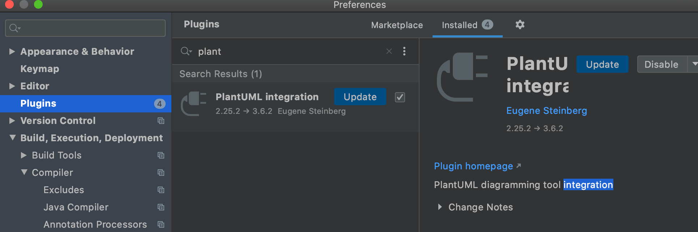
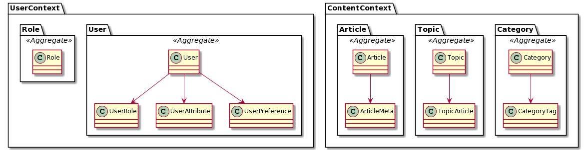
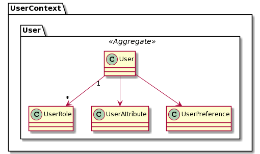

做完 DDD 的建模工作，或者事件风暴工作坊后，往往会有朋友会问，如何方便的表示模型和维护模型呢？

使用自己定义的图块，太过于随意；使用 UML 又显得繁琐，又有大量的人唱衰 UML。

我曾陷入无休无止的对工具的选择中，最终意识到克制和取舍才是问题的答案 —— 没有终极的解决方案。

模型，是用来表达和理解复杂的软件业务的，简洁明了意味着信息的丢失，追求准确和细致，必然需要面对繁复和难以维护的问题。

## 1. 如何取舍模型中的信息？

我想用 DDD 模型指导我的开发工作：数据库设计、代码分包、Restful API 设计等工作。

模型中的上下文会在单体中设计包，而聚合会和 Service 的组织有关系，于是我需要关心模型的上下文、模型的关系。

而属性不是我关心的，而且会干扰对模型的理解。

UML 是一个大的工具箱，如果我们想明白我们需要什么样信息，去 UML 找对应的工具即可。

想看清系统业务结构基本元素需要：

- 上下文。可以使用 namespace 来表达，表示相对隔离的概念空间。
- 模型。可以使用类图来表达，代表业务中可被操作的实体。
- 关系。由于模型都是被动操作对象（业务客体），业务模型可以只使用组合即可，避免使用 UML 中的 6 种关系，弄得复杂。
- 聚合。聚合代表一组强关联和具有一致生命周期的一组模型，可以使用 UML package 来表达。
- 实体值对象。实体、值对象和聚合根本质是模型的不同形态，在编写代码时需要注意，在 UML 中可以不表达出来。


有一些信息会对模型的视图干扰，不推荐表达出来：

- 属性。过于细节，不利于模型的维护，会让视图过大而看不清。
- 工作坊的中间产物。比如事件、角色等信息，如果需要表达，可以使用其他图形来表达，否则含混不清。


## 2. PlantUML 简介

代码的维护和持续演进比“完美”的初始设计更为重要。

**将模型文件放入代码仓库，随代码维护，并每个迭代演进，有非常重要的意义。**但是需要让图形能用代码表示，做到 Diagram As Code，便于版本管理。

PlantUML 是一个用代码驱动绘图的 UML 工具，就这一点就足以够让其他的 UML 工具相形见绌。

PlantUML 使用 Java 编写， 可以通过命令行、Jar 包、插件等多种途径使用，不过一般常见的使用方式有两种：

1. 使用在线绘图工具。用于临时和同事讨论问题，也可以把绘制好的内容通过链接发送给其他人。
2. 使用 IDE 插件。直接将 UML 模型在 IDE 中渲染为图形。

**使用在线绘图工具**

使用官网的在线绘图工具 http://www.plantuml.com/plantuml/uml 

编写 UML 表达式后点击 submit 即可生成 UML，并带有一个带有绘图信息的链接。

**使用 IDE 插件**

如果你使用的 IntelliJ IDEA，可以在 Preferences 菜单下的 Plugins 搜索 PlantUML integration，安装重启 IDE 即可。



在项目中添加后缀为 puml 的文本文件即可使用。


## 3. 使用示例

这里使用一个互联网内容社区应用（UCG）作为示例，做了一些简化，设计好的模型大致为：

- 用户上下文，包含用户聚合、角色聚合。
- 内容上下文，包含专题、分类、文章聚合。

可以如下表示上下文、聚合和实体的关系，得到一个非常简洁的模型图。

```uml
@startuml
namespace UserContext {
    package User <<Aggregate>> {
        User  --> UserRole
        User --> UserAttribute
        User --> UserPreference
    }
namespace UserContext {
    package Role <<Aggregate>> {
        class Role
    }

namespace ContentContext{
    package Category <<Aggregate>> {
        Category  --> CategoryTag
    }
namespace ContentContext{
    package Topic <<Aggregate>> {
        Topic  --> TopicArticle
    }
namespace ContentContext{
    package Article <<Aggregate>> {
        Article --> ArticleMeta
    }
@enduml
```

渲染好的效果如下：



可以清晰的看明白模型、聚合，以及他们所处上下文的关系，也可以在代码仓库中被很好的管理。

参考文档可以做出更多特性的图表来，比如增加模型之间的关系数量，是一对多还是多对多。

```
@startuml
namespace UserContext {
    package User <<Aggregate>> {
        User "1" --> "*" UserRole
        User --> UserAttribute
        User --> UserPreference
    }
@enduml
```


