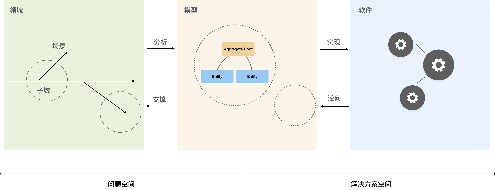

## 01. DDD 的历史

DDD 在软件工程发展过程中的历史阶段，可以被认为是后面向对象时代。

在 70 年代初，“结构化分析和设计”（SAD，Structured Analysis and Design）的理念，主导了软件开发的实践。虽然它还是以数据的流动为中心，但是结构化设计的思潮在软件开发行业已经广泛流行，原因也是当时软件越来越复杂。

在 DDD 中模型思维被不断提起，实际上在 Eric 编写 DDD 那本书之前，已经有模型驱动开发的思想。

它大概有下面几个过程：

- 对问题定义
- 确定需要哪些变化来增强或者矫正需要解决的问题
- 对方案进行枚举
- 分析出哪个是最佳解决方案
- 对选择出的解决方案进行建模——包括软件的模块化
- 实现模型
- 交付，并对实现的解决方案以及它对领域的影响进行评估

不过很可惜但人们很少实际执行开始的几步，而且业务人员和公司的上级没能看到其中的价值。这几步被看作是 “浪费时间”，而不被鼓励。实际上，我们现在面临同样的问题。1968年，人们定义了这个新专业和新学科，将软件工程变成了和业务无关的一门学科，就如同结构工程被应用于数学和物理一样，软件工程被应用于计算机科学。

类似的问题是对于对领域理解很深开发者有时候难以找到好的工作，”算法“是大厂个通行证，这里不是否定算法的价值，而是对于应用开发者来说，领域知识是一个比算法更难获得的经验。

Eric Evans 的《领域驱动设计》出版说明依然有人在关注和强调领域建模这件事情，在 Eric 的书中，领域、模型驱动开发、建模的战术和战略都做了详细的说明。

当然在这本书当中，我们不否认它的先进性，也不能忽视它的历史局限性，毕竟成书的时间比较早。Eric 在后期的一些文章当中也纠正了一些在这本书中的一些内容。最突出的问题就是在实践和落地方面还不够成熟，某些理念过于理想化而无法实现，毕竟架构本来就是取舍的艺术。

因此后来另外的人实现 DDD 过程当中发现了一些问题，进行了一些修正和扩展，代表就是 《实现领域驱动设计》这本书。当然这本书非常的厚，作者在这本书当中提出了一些在 Eric 的 DDD 当中没有的一些概念，比如包括事件、事件溯源等这些概念。这本书的理念非常超前，例如事件溯源，在一般的项目当中实际上是比较难以实现，但是其中不乏有价值的内容。

还有一个问题是，对于大多数人来说，模型的建立是一件常困难的事。因为一个人既懂编程又懂领域知识，并且对领域有深刻的理解，实在是强人所难。后面有一些咨询师和架构师，想出了一种通过头脑风暴的方式来共创领域模型，强调把事件当做一种线索，通过拉拢业务专家、技术专家，然后通过协同的方式构建出领域模型。旨在软件设计的时候，尽量贴合业务的需要，这种方法就是事件风暴。

事件风暴是一种建模的工作坊，一群人在一个屋子里开会，通过头脑风暴的方式将事件通过纸条贴在墙上，通过事件来追溯整个软件当中关键行为发生来确定系统当中状态的变化。找出体现系统状态变化的模型，或者我们可以叫实体，从而分析出我们的整个领域模型，对这些模型的划分。使其满足面向对象的内聚要求，最终得到模块或者服务的划分和映射方式。

在事件风暴后，又出现了一些各式各样的建模方法。这些方法是为了解决在微服务和云原生时代，本质上在构建一个分布式的系统的问题。对分布式的系统来说，架构的变化是灾难性的，它修改的成本和构建的成本都非常高，那么我们就不得不在一开始或者在逐步重构的过程当中，清晰的把握我们的模型。在微服务时代，问题和单体很不一样，困难程度上升了一个量级。

比如在分布式系统当中，我们必须要考虑到事务的问题、性能的问题，还有数据查询等等各种各样在单体世界里面不需要考虑的问题，因此对我们的模型创建又提出了更高的要求和挑战。这是为什么人们选择了 DDD 来 “一本正经” 的建模，而不敢再 “拍脑袋”。

## 02. 为什么 DDD 有效？

在学习 DDD 的过程中，尤其可贵的是批判性思维，比如 DDD 为什么有效呢?

因为它遵守了解决基本问题的一个一般方法，也就是定义问题，分析问题和解决问题，大多数情况下，我们往往会直接去思考解决方案，而不是问题本身。

领域是我们要解决的现实问题，可以把它放在一个问题空间，问题空间是数学当中的一个概念，指的是我们需要去解决的问题的一个集合。

领域当中会有一些场景。场景是我们用户在真正使用使用软件或者是线下和人完成整个业务的一些活动，比如我们可以去签订一个合同，购买一份保险。这是我们的投保的场景，它可以发生在软件当中，也可以发生在线下通过纸和笔去完成。

我们这里的领域就是保险的投保。签署保单的这个过程当中，只是一个场景，它是领域的一部分。另外值得思考的问题是我们在发生这些场景的时候，会有一些意外或者分支，比如说保单写错了，怎么去处理呢？要取消怎么办呢？所以场景并不是一个时间线，而是一个像鱼骨一样的分支，在这些场景当中，又可以去把它分为一个子问题，哪些是的重要场景，哪些是不重要的场景，哪些是通用的场景。对场景进行了划分，这其实就是子域。通过分而治之的方式解决问题。

对这些场景进行分析之后，可以得到我们的领域模型，无论这里的模型是什么，都可以认为它是一种解决方案，存在于软件和要解决的问题之间，它可能是一个PPT，也可以是一个表格或各种形式。

领域也可以理解为同一类业务场景的惯用模式。对于电商从业的开发者来说，无论公司经营的业务是什么，只要涉及卖东西，无论是卖二手物品、企业服务还是实体产品等，就会自然的把订单、商品等这些概念拿出来。对领域理解的更为深刻一些就会发现，**领域模型就是各种场景下被抽象出来的一般模式**，对这些模式理解深刻的人就是领域专家。

那么得到模型之后，再通过这个模型去实现软件，就好比我们在修房子的过程中需要用一些蓝图，作为建造依据。对于编写软件来说，可以是领域模型，也就是一些面向对象的类。

从领域到模型、再到软件的实现这样一个解决问题的一般方法。软件也属于解决方案空间，已经是解决这个业务的问题的高效解决方案之一，那么模型就是我们问题和解决方案空间的桥梁。

在初步分析模型的时候，依然是问题，当我们慢慢的对它进行抽象加工的时候，它就是一个解决方案的雏形了。反过来呢，我们也可以对一个现有的软件进行逆向分析，得到模型之后，我们再来看怎么通过模型实现这个软件，可能使用不同的技术手段，但是使用同样的模型。看这个模型呢，能不能解决我们当前业务的一些问题？是不是和我们的业务的问题匹配的。如果合适就能使用这个模型，如果不能就去改造修正这个模型，从而建立出自己的模型，这就是 DDD 建立软件的一个流程和一个方法基础。

## 参考资料

1. David West .加强领域驱动设计 [EB/OL].https://zhuanlan.zhihu.com/p/73821633.

