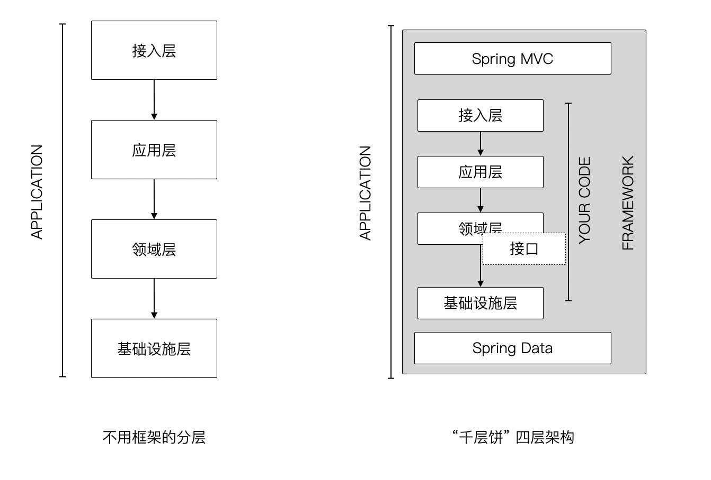
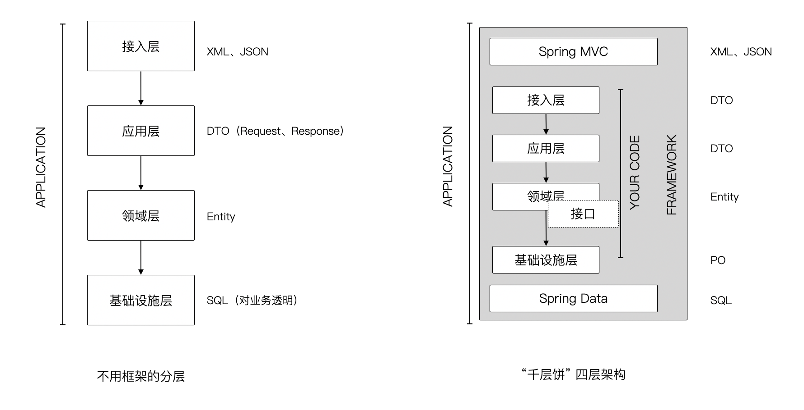
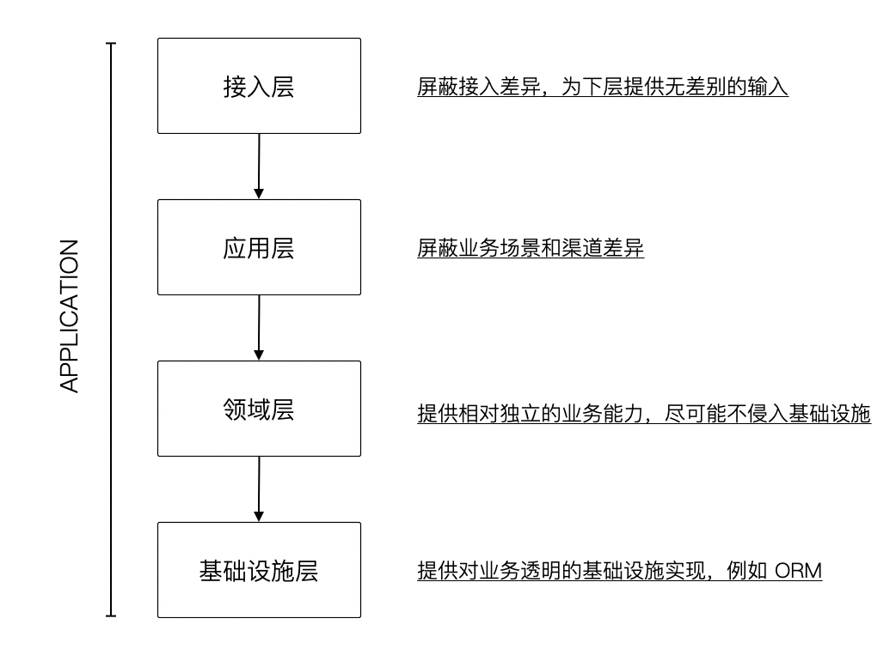
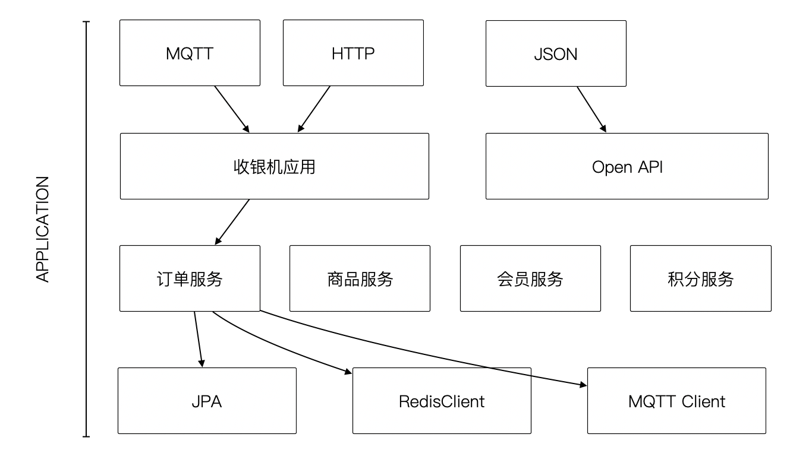
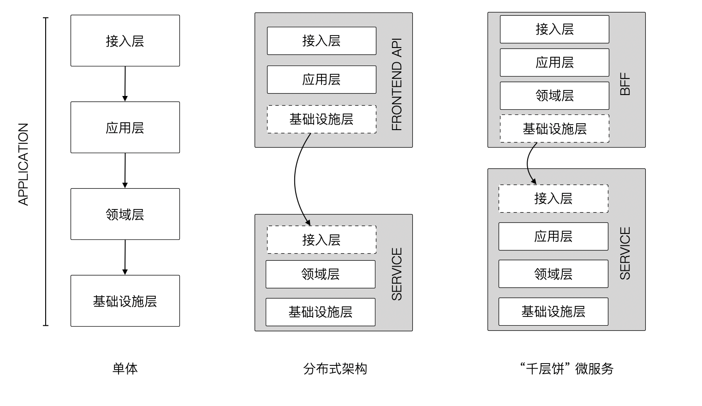
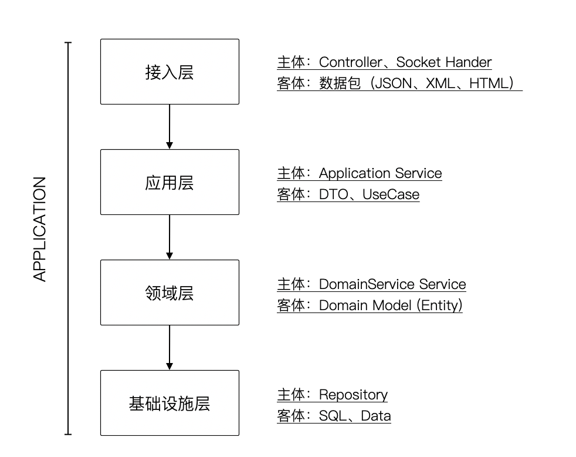

今天让我们来分析一类 DDD 实践过程当中被普遍的抱怨的问题：

>  使用 DDD 后，代码变多了。一个简单的功能需要修改很多类，需要经过很多层的转换才能实现。

这种架构，我们可以形象的称之为 “千层饼”架构。



其实这是一件非常有意思的事，在 DDD 发展的过程当中，在 Eric 那本书中分层架构也只有 4 层，仅仅是比传统的三层架构多了一层，多了一个应用层。但是，网上有很多关于洋葱、六边形架构、整洁架构的内容，这些架构方式和 DDD 扯上了关系，让人误以为 DDD 的架构就必须使用六边形、洋葱或者是整洁架构。

而另外一个原因是，我们在谈论分层架构的时候，是说的整个应用本身，它的分层包含了框架的实现，一些库的实现。

“千层饼” 架构的主要原因是架构师往往忽略了框架已经实现了部分层次结构，而在业务代码当中再一次完整的实现了所有的分层。一个非常简单的例子，当我们使用 TCP/IP 协议栈时，我们实现的也仅仅是应用层，而下面的传输层、网络层、数据连接层等结构已经由网络基础设施帮我们实现，所以做网络开发，并不需要实现完整的 TCP/IP 4层结构。



>  PS：这里只是一个示意图，并不强制禁止跨层调用，但是需要知道这样做的代价。

## 01. 过多的转换

在一些“千层饼”的架构中，在框架之内又完成了一个完整的四层架构。这是不是和你见过的有些DDD 项目非常相似？那么对于 Java 这种强类型的语言，每多一层，它的代价是非常明显的。

有一句计算机名言，“任何计算机问题都可以通过增加一层来解决”，但是这句话还有后面一句，“新加的这一层会带来额外的问题”。

同样的，当出现“千层饼”架构之后，我们明显会感受到我们的代码变多了，这种变化对于弱类型的语言还算好。对于强类型的语言，正如 Java，会带给我们大量的数据类型转换操作，如果这些数据类型有嵌套的结构，就会变成一个灾难。

体会过的朋友应该不言而喻。



## 02. 分层的意义

大多数情况下，每增加一层是为了解决特定的问题，当然我们也得清楚增加这一层给我们带来的代价，毕竟架构就是一种不断权衡的一种艺术。

为了避免 “千层饼” 架构给我们带来一些无谓的代价，我们需要理解分层的意义和它的目的是什么，无论这种分层是 DDD 倡导的还是整洁架构倡导的。



首先是接入层。它解决了什么问题呢？对于只是编写 HTTP 接口的开发者来说，接入层基本上是透明的，它完全可以由框架来自动实现。甚至有一些团队或者公司在尝试通过定义 YAML 文件来自动生成接入层。Swagger 通过 open API 规范，已经能够实现通过定义的方式生成接入层的代码。

有时候，接入层依然还是有意义的。一些应用或者系统当中，他们不仅仅需要提供 HTTP 接口，还需要提供一些 socket 的连接，这种系统在物联网系统尤为常见。我曾经给一个大型的通信厂商做过架构咨询，他们的物联网平台需要接入 mqtt、coap 等各种各样的协议，我也写过 LDAP 等非 HTTP 协议的网络应用程序。所以接入层解决的问题就是隔离接入的差异，如果没有接入的差异，我们可以尽可能的通过框架去实现。

其次就是应用层，应用层代表的是一个场景，或者一个用户完成一个操作。我经常会拿用户注册和系统管理员添加用户这两种不同的场景来说明这个话题，对于应用层来说。它们都是完成开户这个逻辑，但是对于不同的场景和角色，有一些特殊的差异，这种差异如果让领域层完成的话，会让领域变得非常复杂，且无法复用，这就需要应用层处理。

应用层还有另外一个作用，当一个用例需要组合多种能力的时候，需要应用层来进行编排。这是应用层的一个非常重要的功能。例如用户注册，系统需要发送一封邮件，通知用户注册成功。如果我们把发送邮件的内容写在了注册的领域服务当中，会导致注册的逻辑无法被复用。对于那些不需要发送邮件的场景，就必须要通过条件或者参数来控制，让代码变得非常的复杂。

然后就是领域层，领域层用一句话来概括就是提供无差别的能力和服务。它不关心是谁来，帮谁做，只关心有没有能力独立去完成一件事情。对于支付领域服务来说，它不需要知道是哪一个应用来提交支付请求，总之它可以完成支付能力，而不需要关心使用的场景。可以这样说，领域层就是应用层复用和抽象的结果。

最后就是基础设施层，在 DDD 的理念当中，我们尽可能的把基础设施的代码和领域逻辑进行拆分，这种理念驱动了 ORM 的出现。在理想情况下，我们只需要关心模型和模型的状态，持久化的工作由基础设施来完成。如果我们使用的 JPA 这样完备的基础设施框架和库，它提供了一种接口，给我们在领域层里去定义持久化的模式和数据类型，这就是 Repository 接口。对于一些 “千层饼” 架构来说，他们为了实现所谓的依赖倒置，自己实现了 Repository 层，然后再调用 JPA 的持久化能力。但这样做就不得不将模型转换为持久化用的对象（PO），然后使用 PO 进行持久化，加大了代码编写的负担。

## 03. 收银机应用案例

实际上，很多架构师在设计比较复杂和大型的系统时，即使不知道 DDD 的分层模型，也会设计出类似的结构。

这里以我熟悉的领域为例（由于脱敏的原因，总是不能拿业界真实的案例和大家分享，非常抱歉）。对于点餐系统来说，会有很多使用渠道，有一些渠道会通过不同的技术接入。

无论是单体系统，还是分布式系统从逻辑上来看都是一样的。这里通过实例将每层的实践形象化：

1. 接入层：MQTT、HTTP、JSON API、XML API、JSP Page
2. 应用层：收银机应用、开放 API、微信点餐、商家后台、移动管家
3. 领域层：订单服务、商品服务、积分服务、会员服务
4. 基础设施层：JPA、RedisClient、MQTT Client 



## 04. 分布式系统

而在分布式系统下，我们谈分层架构需要把整个系统一起来看，而不是分布式系统中每个组件，又各自实现了完整的分层结构。比如说，微服务中 BFF 模式可能就是 DDD 单体结构当中的接入层或者应用层，而不能再搞一套完整的分层架构（有一些文章，将其分为进程内架构和进程间架构）。

## 05. 使用主客体思维来理解分层

我会经常使用主体、客体的思维来描述架构问题背后的逻辑，实践发现确实非常好用（不了解这一部分的朋友可以搜索《面向对象中的主体客体思维》）。

如果对每一层的职责和定位不清晰，可以通过主体、客体来明确每层业务行为的参与要素。例如，我们往往不能很清楚地说明应用层和领域层的边界，如果我们把应用层定义为通过应用服务处理 DTO 对象为客体的一层，就很容易理解分层的思想。

## 参考资料

1. 袁惠民.主体与客体的辩证法略释.[J].现代哲学.1991.
