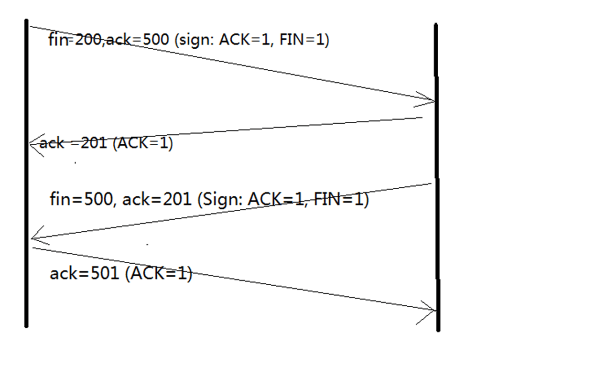
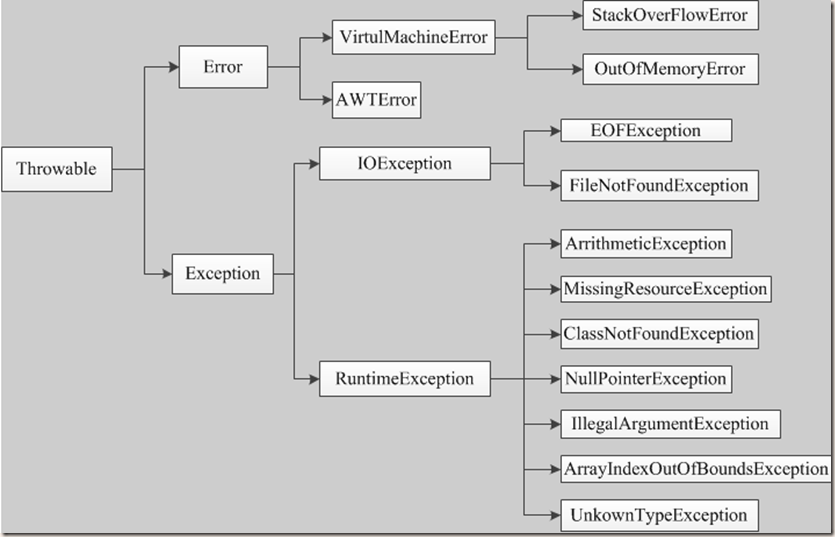
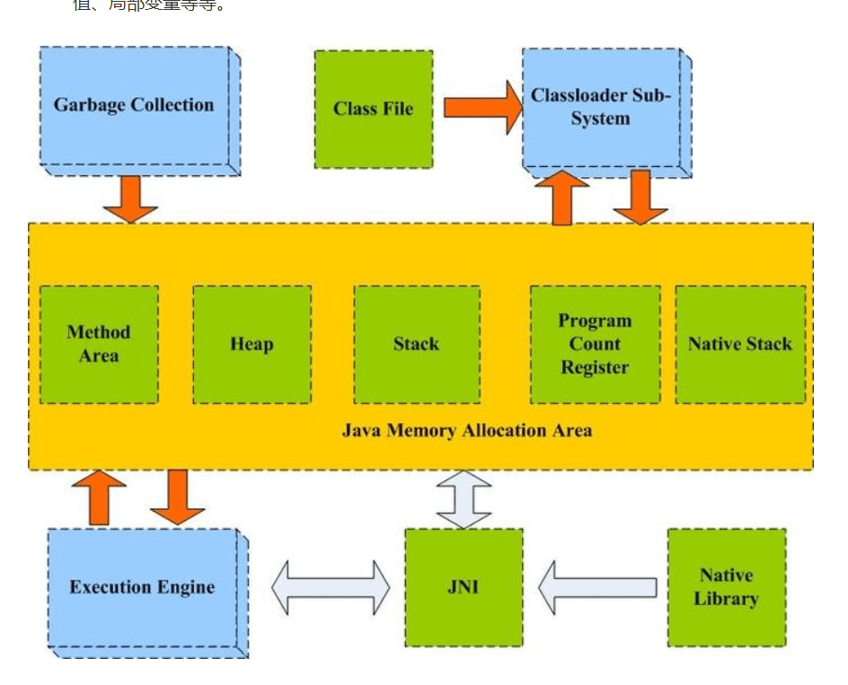
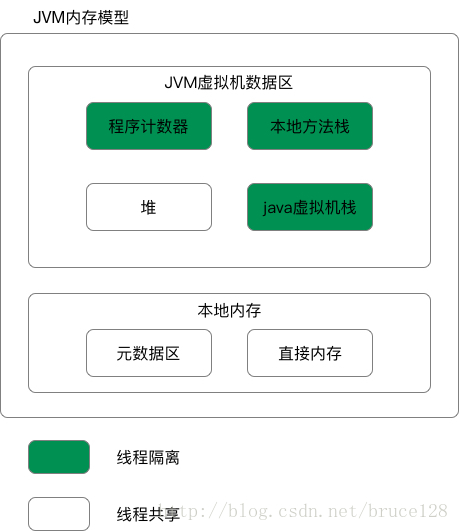
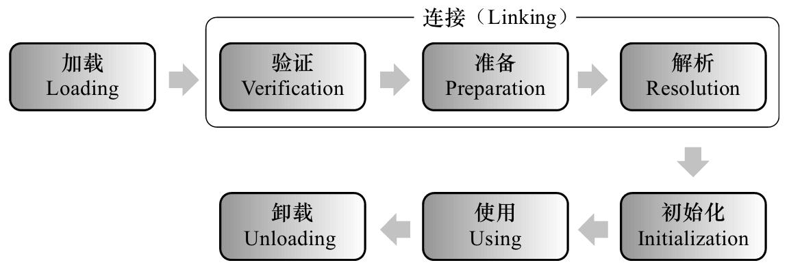
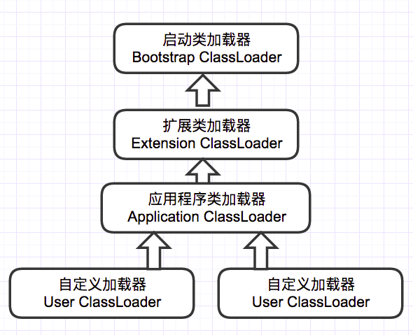
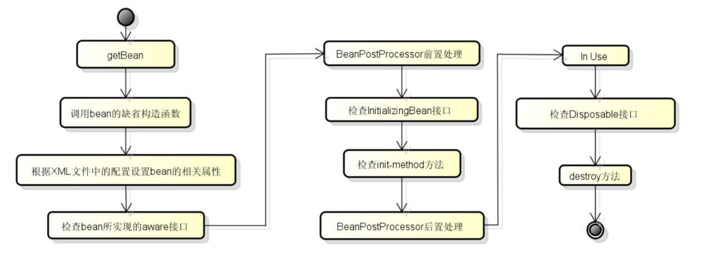
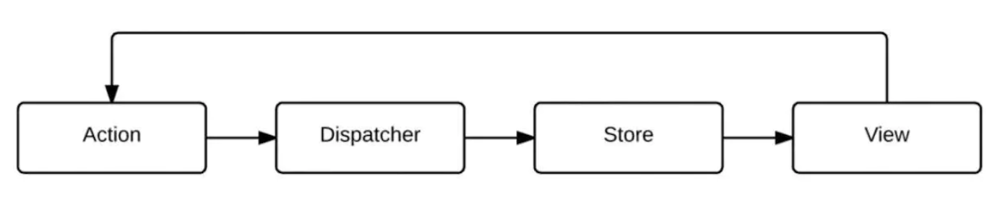

这套资料只是整理了这些考点，和简单的解释，更为深入的细节，限于篇幅不可能包含，请参考相关资料学习。

本材料可以作为：

- 学习大纲

- 面试快速梳理

- 计算机复习


## 计算机通识

### 计算机基础

#### 十进制的数在内存中是怎么存的？
补码的形式。

计算机中的有符号数有三种表示方法，即原码、反码和补码。三种表示方法均有符号位和数值位两部分，符号位都是用0表示“正”，用1表示“负”，而数值位，三种表示方法各不相同 。在计算机系统中，数值一律用补码来表示和存储。原因在于，使用补码，可以将符号位和数值域统一处理；同时，加法和减法也可以统一处理 。

补码的本质：解决了符号的表示的问题，可以将减法运算转化为补码的加法运算来实现，克服了原码加减法运算繁杂的弊端，可有效简化运算器的设计。补码表示统一了符号位和数值位，使得符号位可以和数值位一起直接参与运算，这也为后面设计乘法器除法器等运算器件提供了极大的方便。

### 计算机语言和编译原理
### 操作系统理论


#### 64位和32位的区别？

操作系统只是硬件和应用软件中间的一个平台。32位操作系统针对的32位的CPU设计。64位操作系统针对的64位的CPU设计。

64 比 32 位的寻址空间更大，也就意味着可以使用更多的内存。

#### CentOS 和 Linux的关系？

CentOS是Linux众多得发行版本之一，linux有三大发行版本（：Slackware、debian、redhat）,而Redhat有收费的商业版和免费的开源版,商业版的业内称之为RHEL系列，CentOS是来自于依照开放源代码规定而公布的源代码重新编译而成。可以用CentOS替代商业版的RHEL使用。两者的不同，CentOS不包含封闭源代码软件，是免费的。

#### 请解释一下，LINUX下的线程，GDI类


LINUX实现的就是基于核心轻量级进程的”一对一”线程模型，一个线程实体对应一个核心轻量级进程，而线程之间的管理在核外函数库中实现。


GDI类为图像设备编程接口类库。

#### 进程和线程的区别是什么？

进程是执行着的应用程序，而线程是进程内部的一个执行序列。一个进程可以有多个线程。线程又叫做轻量级进程。

#### 谈一谈，系统线程数量上限是多少？

Linux 系统中单个进程的最大线程数有其最大的限制 PTHREAD_THREADS_MAX。

这个限制可以在/usr/include/bits/local_lim.h中查看 ，对 linuxthreads 这个值一般是 1024，对于 nptl 则没有硬性的限制，仅仅受限于系统的资源。

这个系统的资源主要就是线程的 stack 所占用的内存，用 ulimit -s 可以查看默认的线程栈大小，一般情况下，这个值是8M=8192KB。

#### 讲一讲，线程与进程的区别

进程和线程的主要差别在于它们是不同的操作系统资源管理方式。进程有独立的地址空间，一个进程崩溃后，在保护模式下不会对其它进程产生影响，而线程只是一个进程中的不同执行路径。线程有自己的堆栈和局部变量，但线程之间没有单独的地址空间，一个线程死掉就等于整个进程死掉，所以多进程的程序要比多线程的程序健壮，但在进程切换时，耗费资源较大，效率要差一些。但对于一些要求同时进行并且又要共享某些变量的并发操作，只能用线程，不能用进程。

1. 简而言之,一个程序至少有一个进程,一个进程至少有一个线程.
2. 线程的划分尺度小于进程，使得多线程程序的并发性高。
3. 另外，进程在执行过程中拥有独立的内存单元，而多个线程共享内存，从而极大地提高了程序的运行效率。
4. 线程在执行过程中与进程还是有区别的。每个独立的线程有一个程序运行的入口、顺序执行序列和程序的出口。但是线程不能够独立执行，必须依存在应用程序中，由应用程序提供多个线程执行控制。
5. 从逻辑角度来看，多线程的意义在于一个应用程序中，有多个执行部分可以同时执行。但操作系统并没有将多个线程看做多个独立的应用，来实现进程的调度和管理以及资源分配。这就是进程和线程的重要区别。

#### 如何杀死一个进程？

1. kill pid；系统发送一个signal,程序收到信号后，会先释放资源，再关闭程序。
2. kill -9 pid；-9表示强制执行


#### 你怎么理解操作系统里的内存碎片，有什么解决办法？

内存碎片分为：内部碎片和外部碎片。

内部碎片就是已经被分配出去（能明确指出属于哪个进程）却不能被利用的内存空间；

内部碎片是处于区域内部或页面内部的存储块。占有这些区域或页面的进程并不使用这个存储块。而在进程占有这块存储块时，系统无法利用它。直到进程释放它，或进程结束时，系统才有可能利用这个存储块。

单道连续分配只有内部碎片。多道固定连续分配既有内部碎片，又有外部碎片。

外部碎片指的是还没有被分配出去（不属于任何进程），但由于太小了无法分配给申请内存空间的新进程的内存空闲区域。

外部碎片是出于任何已分配区域或页面外部的空闲存储块。这些存储块的总和可以满足当前申请的长度要求，但是由于它们的地址不连续或其他原因，使得系统无法满足当前申请。

使用伙伴系统算法。


#### 介绍一下，什么是页式存储？

主存被等分成大小相等的片，称为主存块，又称为实页。

当一个用户程序装入内存时，以页面为单位进行分配。页面的大小是为2n ,通常为1KB、2KB、2n KB等


#### 系统如何提高并发性？

1. 提高CPU并发计算能力 
2. 改进I/O模型

#### 追踪 CPU 过高的方法

1. 首先查看是哪些进程的CPU占用率最高（如下可以看到详细的路径）

> ps -aux --sort -pcpu | more

2. 查看JAVA进程的每个线程的CPU占用率

> ps -Lp 5798 cu | more        # 5798是查出来进程PID

3. 追踪线程，查看负载过高的原因，使用JDK下的一个工具

> jstack 5798  


jstack 查出来的线程ID是16进制，可以把输出追加到文件，导出用记事本打开，再根据系统中的线程ID去搜索查看该ID的线程运行内容，可以和开发一起排查。

### Linux

### 计算机网络

#### 说一说计算机网络的分层模型。


#### 路由器和交换机的区别？

交换机用于同一网络内部数据的快速传输转发决策通过查看二层头部完成转发不需要修改数据帧工作在 TCP/IP 协议的二层 —— 数据链路层工作简单，直接使用硬件处理路由器用于不同网络间数据的跨网络传输转发决策通过查看三层头部完成转发需要修改 TTL ，IP 头部校验和需要重新计算，数据帧需要重新封装工作在 TCP/IP 协议的三层 —— 网络层工作复杂，使用软件处理。

三层交换机也能作为路由器使用。


#### 请简单解释一下，arp协议和arp攻击。

地址解析协议。ARP攻击的第一步就是ARP欺骗。由上述“ARP协议的工作过程”我们知道，ARP协议基本没有对网络的安全性做任何思考，当时人们考虑的重点是如何保证网络通信能够正确和快速的完成——ARP协议工作的前提是默认了其所在的网络是一个善良的网络，每台主机在向网络中发送应答信号时都是使用的真实身份。不过后来，人们发现ARP应答中的IP地址和MAC地址中的信息是可以伪造的，并不一定是自己的真实IP地址和MAC地址，由此，ARP欺骗就产生了。


####  IP 层是 TCP/IP 模型下那一层？

网络层。


#### 为什么有了 MAC 地址还需要 IP 地址？

Mac 地址用于网络层以下的连接建立。IP 用于网络层连接建立，意义不同。


#### 请说一说 TCP 协议的 4 次握手

由于TCP连接是全双工的，因此每个方向都必须单独进行关闭。这个原则是当一方完成它的数据发送任务后就能发送一个FIN来终止这个方向的连接。收到一个 FIN只意味着这一方向上没有数据流动，一个TCP连接在收到一个FIN后仍能发送数据。首先进行关闭的一方将执行主动关闭，而另一方执行被动关闭。

TCP的连接的拆除需要发送四个包，因此称为四次挥手(four-way handshake)。客户端或服务器均可主动发起挥手动作，在socket编程中，任何一方执行close()操作即可产生挥手操作。


1. 客户端A发送一个FIN，用来关闭客户A到服务器B的数据传送。
2. 服务器B收到这个FIN，它发回一个ACK，确认序号为收到的序号加1。和SYN一样，一个FIN将占用一个序号
3. 服务器B关闭与客户端A的连接，发送一个FIN给客户端A。
4. 客户端A发回ACK报文确认，并将确认序号设置为收到序号加1。





#### TCP 为什么可靠一些

三次握手，超时重传，滑动窗口，拥塞控制。

#### 哪种应用场景会使用TCP协议，使用它的意义

当对网络通讯质量有要求的时候，比如：整个数据要准确无误的传递给对方，这往往用于一些要求可靠的应用，比如HTTP、HTTPS、FTP等传输文件的协议，POP、SMTP等邮件传输的协议


#### icmp协议，它的作用是什么？


它是TCP/IP协议族的一个子协议，用于在IP主机、路由器之间传递控制消息。控制消息是指网络通不通、主机是否可达、路由是否可用等网络本身的消息。这些控制消息虽然并不传输用户数据，但是对于用户数据的传递起着重要的作用。


ICMP 服务可以被主机关闭， ping 不可达，但是应用可以连接。


#### 请你讲讲http1.1和1.0的区别


主要区别主要体现在：

缓存处理，在HTTP1.0中主要使用header里的If-Modified-Since,Expires来做为缓存判断的标准，HTTP1.1则引入了更多的缓存控制策略例如Entity tag，If-Unmodified-Since, If-Match, If-None-Match等更多可供选择的缓存头来控制缓存策略。

带宽优化及网络连接的使用，HTTP1.0中，存在一些浪费带宽的现象，例如客户端只是需要某个对象的一部分，而服务器却将整个对象送过来了，并且不支持断点续传功能，HTTP1.1则在请求头引入了range头域，它允许只请求资源的某个部分，即返回码是206（Partial Content），这样就方便了开发者自由的选择以便于充分利用带宽和连接。

错误通知的管理，在HTTP1.1中新增了24个错误状态响应码，如409（Conflict）表示请求的资源与资源的当前状态发生冲突；410（Gone）表示服务器上的某个资源被永久性的删除。

Host头处理，在HTTP1.0中认为每台服务器都绑定一个唯一的IP地址，因此，请求消息中的URL并没有传递主机名（hostname）。但随着虚拟主机技术的发展，在一台物理服务器上可以存在多个虚拟主机（Multi-homed Web Servers），并且它们共享一个IP地址。HTTP1.1的请求消息和响应消息都应支持Host头域，且请求消息中如果没有Host头域会报告一个错误（400 Bad Request）。

长连接，HTTP 1.1支持长连接（PersistentConnection）和请求的流水线（Pipelining）处理，在一个TCP连接上可以传送多个HTTP请求和响应，减少了建立和关闭连接的消耗和延迟，在HTTP1.1中默认开启Connection： keep-alive，一定程度上弥补了HTTP1.0每次请求都要创建连接的缺点。


目前应用都是用 1.1 的协议。

#### 请说明一下http和https的区别


1. https协议要申请证书到ca，需要一定经济成本；
2. http是明文传输，https是加密的安全传输；
3. 连接的端口不一样，http是80，https是443；
4. http连接很简单，没有状态；https是ssl加密的传输，身份认证的网络协议，相对http传输比较安全


#### 浏览器从接收到一个URL，到最后展示出页面，经历了哪些过程。


1. DNS解析 
2. TCP连接
3. 发送HTTP请求
4. 服务器处理请求并返回HTTP报文
5. 浏览器解析渲染页面


#### http请求中的304状态码的含义


304(未修改)自从上次请求后，请求的网页未修改过。服务器返回此响应时，不会返回网页内容。如果网页自请求者上次请求后再也没有更改过，您应将服务器配置为返回此响应(称为 If-Modified-Since HTTP 标头)。服务器可以告诉 Googlebot 自从上次抓取后网页没有变更，进而节省带宽和开销。


#### 请谈一下，你知道的http请求


- OPTIONS：返回服务器针对特定资源所支持的HTTP请求方法。也可以利用向Web服务器发送'*'的请求来测试服务器的功能性。
- HEAD：向服务器索要与GET请求相一致的响应，只不过响应体将不会被返回。这一方法可以在不必传输整个响应内容的情况下，就可以获取包含在响应消息头中的元信息。
- GET：向特定的资源发出请求。
- POST：向指定资源提交数据进行处理请求（例如提交表单或者上传文件）。数据被包含在请求体中。POST请求可能会导致新的资源的创建和/或已有资源的修改。
- PUT：向指定资源位置上传其最新内容。
- DELETE：请求服务器删除Request-URI所标识的资源。
- TRACE：回显服务器收到的请求，主要用于测试或诊断。
- CONNECT：HTTP/1.1协议中预留给能够将连接改为管道方式的代理服务器。


#### 请谈一下，你知道的 HTTP 常用的状态码


| | 类别 | 原因短语 |
| -|-------| -------------|
| 1XX|	Informational| （信息性状态码）	接受的请求正在处理|
| 2XX|	Success| （成功状态码）| 	请求正常处理完毕|
| 3XX|	Redirection| （重定向状态码）| 	需要进行附加操作以完成请求|
| 4XX|	Client Error| （客户端错误状态码）	| 服务器无法处理请求|
| 5XX|	Server Error| （服务器错误状态码）| 	服务器处理请求出错|


### 数据库原理

## 数据结构和算法

### 算法通识

#### 常见的算法复杂度有哪些？

在计算机科学中，时间复杂性，又称时间复杂度，算法的时间复杂度是一个函数，它定性描述该算法的运行时间。这是一个代表算法输入值的字符串的长度的函数。时间复杂度常用大O符号表述，不包括这个函数的低阶项和首项系数。使用这种方式时，时间复杂度可被称为是渐近的，亦即考察输入值大小趋近无穷时的情况。

- O(1)  常数时间
- O(logn) 算法的T(n) =O(logn)，则称其具有对数时间。特征为运算时间的步速比输入的步速小，例如二分查找、二叉树搜索。
- O(n) 如果一个算法的时间复杂度为O(n)，则称这个算法具有线性时间，或O(n)时间。例如对于无序列表的查找算法。
- O(n^2+n) 多项式时间 大多数业务系统都是多项式时间，例如 1+ N 的数据处理问题。
- O(m(n)) 呈指数上升，输入数据的数量依线性成长，所花的时间将会以指数成长。指数时间负载度会造成系统基本不可用。


### 数组

#### 将一个二维数组顺时针旋转90度

```java
public void rotate(int[][] matrix) {
  int n = matrix.length;
  for (int i = 0; i < n / 2; i++) {
    for (int j = i; j < n - 1 - i; j++) {
      int temp = matrix[i][j];
      matrix[i][j] = matrix[n - 1 - j][i];
      matrix[n - 1 - j][i] = matrix[n - 1 - i][n - 1 - j];
      matrix[n - 1 - i][n - 1 - j] = matrix[j][n - 1 - i];
      matrix[j][n - 1 - i] = temp;
    }
  }
}
```


#### 一个数组，除一个元素外其它都是两两相等，求那个元素?

```java 
public static int find1From2(int[] a){
        int len = a.length, res = 0;
        for(int i = 0; i < len; i++){
            res= res ^ a[i];
        }
        return res;
}
```

#### 找出数组中和为S的一对组合，找出一组就行

```
public int[]
twoSum(int[] nums, int target) {
        HashMap<Integer, Integer> map =new HashMap<Integer, Integer>();
        int[] a = new int[2];
        map.put(nums[0], 0);
        for (int i = 1; i < nums.length;i++) {
            if (map.containsKey(target - nums[i])) {
                a[0] = map.get(target -nums[i]);
                a[1] = i;
                return a;
            } else {
                map.put(nums[i], i);
            }
        }
        return a;
}
```

#### 求一个数组中连续子向量的最大和

```
public int
maxSubArray(int[] nums) {
        int sum = 0;
        int maxSum = Integer.MIN_VALUE;
        if (nums == null || nums.length == 0) {
            return sum;
        }
        for(int i = 0; i < nums.length;i++) {
            sum += nums[i];
            maxSum = Math.max(maxSum, sum);
            if (sum < 0) {
                sum = 0;
            }
        }
        return maxSum;
}
```

#### 寻找一数组中前K个最大的数

```
public int findKthLargest(int[] nums, int k) {
    if (k < 1 || nums == null) {
        return 0;
    }
    return getKth(nums.length - k + 1, nums, 0, nums.length - 1);
}
public int getKth(int k, int[] nums, int start, int end) {
    int pivot = nums[end];
    int left = start;
    int right = end;
    while (true) {
        while (nums[left] < pivot && left < right) {
            left++;
        }
        while (nums[right] >= pivot && right > left) {
            right--;
        }
        if (left == right) {
            break;
        }
        swap(nums, left, right);
    }
    swap(nums, left, end);
    if (k == left + 1) {
        return pivot;
    } else if (k < left + 1) {
        return getKth(k, nums, start, left - 1);
    } else {
        return getKth(k, nums, left + 1, end);
    }
}
public void swap(int[] nums, int n1, int n2) {
    int tmp = nums[n1];
    nums[n1] = nums[n2];
    nums[n2] = tmp;
}
```


### HASH 


### 应用算法

#### LRU算法是什么？

LRU（Least recently used，最近最少使用）算法根据数据的历史访问记录来进行淘汰数据，其核心思想是“如果数据最近被访问过，那么将来被访问的几率也很高”，反过来说“如果数据最近这段时间一直都没有访问,那么将来被访问的概率也会很低”，两种理解是一样的；常用于页面置换算法，为虚拟页式存储管理服务。

LRU 算法被用于 Redis 中作为淘汰策略。


#### LFU 的原理是什么？

LRU 根据最近最少使用来作为淘汰策略，LFU 根据访问频率来作为淘汰策略。

#### HMAC 的用处是什么？

带密码的 HASH 算法，可以用来做签名。具体的实现有：

- hmac-md5
- hmac-sha1 


#### id全局唯一且自增，如何实现？

- UUID
- snowFlake


#### 什么是布隆过滤器？

布隆过滤器（Bloom Filter）是1970年由布隆提出的。它实际上是一个很长的二进制向量和一系列随机映射函数。布隆过滤器可以用于检索一个元素是否在一个集合中。它的优点是空间效率和查询时间都比一般的算法要好的多，缺点是有一定的误识别率和删除困难。

布隆过滤器可以返回元素在集合中可能存在或者一定不存在，布隆过滤器可以用于高效的判断一个元素在集合中是否存在。


## Java 基础

### Java 基础易错

#### 能用来修饰 interface 的关键字有哪些？

interface 只允许加 public 修饰符，但是为了代码整洁开发中不应该加 public 关键字。

#### 在Java中如何跳出当前的多重嵌套循环？

在最外层循环前加一个标记如A，然后用break A;可以跳出多重循环。（Java中支持带标签的break和continue语句，作用有点类似于C和C++中的goto语句，但是就像要避免使用goto一样，应该避免使用带标签的break和continue，因为它不会让你的程序变得更优雅，很多时候甚至有相反的作用，所以这种语法其实不知道更好），根本不能进行字符串的equals比较，否则会产生NullPointerException异常。

#### & 和 && 的区别？

& 运算符有两种用法：(1)按位与；(2)逻辑与。&&运算符是短路与运算。逻辑与跟短路与的差别是非常巨大的，虽然二者都要求运算符左右两端的布尔值都是true整个表达式的值才是true。&&之所以称为短路运算是因为，如果&&左边的表达式的值是false，右边的表达式会被直接短路掉，不会进行运算。很多时候我们可能都需要用&&而不是&，例如在验证用户登录时判定用户名不是null而且不是空字符串，应当写为：username != null &&!username.equals("")，二者的顺序不能交换，更不能用&运算符，因为第一个条件如果不成立，根本不能进行字符串的equals比较，否则会产生NullPointerException异常。


& 不会发生短路，&& 会发生短路。

#### int 和 Integer 有什么区别，什么时候应该使用他们？

Java是一个近乎纯洁的面向对象编程语言，但是为了编程的方便还是引入了基本数据类型，但是为了能够将这些基本数据类型当成对象操作，Java为每一个基本数据类型都引入了对应的包装类型（wrapper class），int的包装类就是Integer，从Java 5开始引入了自动装箱/拆箱机制，使得二者可以相互转换。
Java 为每个原始类型提供了包装类型：
- 原始类型: boolean，char，byte，short，int，long，float，double
- 包装类型：Boolean，Character，Byte，Short，Integer，Long，Float，Double

一般场景使用基本类型，提高效率；序列化/反序列化场景使用包装类型，避免反序列化失败。

#### 如何输出一个某种编码的字符串？


使用字节数组获取与编码无关的字节，然后转出特性字符集的字符串即可.

```
new String(str.getBytes("烫烫烫"), “GBK”);
```

#### new String()、StringBuffer、StringBuilder 构造字符串 的区别是什么？


- String 是不可变对象，每次都是创建新对象，包括字面量创建也是 例如 "hello" + "world"
- StringBuilder 会复用对象，但是线程不安全
- StringBuffer 会复用对象，线程安全

小字符串使用 new String(); 大字符串使用 StringBuilder，需要线程安全使用 StringBuffer。


#### String 是最基本的数据类型吗?

基本数据类型包括byte、int、char、long、float、double、boolean和short。 String 是一个类，本质上是字符数组和 C++ 类似。


#### String是否能能继承？

不能，char数组用final修饰的。


#### 数组(Array)和列表(ArrayList)的区别？什么时候应该使用Array而不是ArrayList？
Array和ArrayList的不同点：
Array可以包含基本类型和对象类型，ArrayList只能包含对象类型。
Array大小是固定的，ArrayList的大小是动态变化的。
ArrayList提供了更多的方法和特性，比如：addAll()，removeAll()，iterator()等等。
对于基本类型数据，集合使用自动装箱来减少编码工作量。但是，当处理固定大小的基本数据类型的时候，这种方式相对比较慢。


#### 什么是值传递和引用传递？
JAVA、JavaScript 为引用传递, PHP 为值传递，可以通过 & 修改为引用传递。

应该尽可能避免引用传递。

#### 为什么会出现4.0-3.6=0.40000001这种现象？

2进制的小数无法精确的表达10进制小数，计算机在计算10进制小数的过程中要先转换为2进制进行计算，这个过程中出现了误差。


#### Lamda表达式的优缺点？

优点：1. 简洁。2. 非常容易并行计算。3. 可能代表未来的编程趋势。

缺点：1. 若不用并行计算，很多时候计算速度没有比传统的 for 循环快。（并行计算有时需要预热才显示出效率优势）2. 不容易调试。3. 若其他程序员没有学过 lambda 表达式，代码不容易让其他语言的程序员看懂。

#### 你知道java8的新特性吗，请简单介绍一下？

- Lambda 表达式 − Lambda允许把函数作为一个方法的参数（函数作为参数传递进方法中。
- 方法引用− 方法引用提供了非常有用的语法，可以直接引用已有Java类或对象（实例）的方法或构造器。与lambda联合使用，方法引用可以使语言的构造更紧凑简洁，减少冗余代码。
- 默认方法− 默认方法就是一个在接口里面有了一个实现的方法。
- 新工具− 新的编译工具，如：Nashorn引擎 jjs、 类依赖分析器jdeps。
- Stream API −新添加的Stream API（java.util.stream） 把真正的函数式编程风格引入到Java中。
- Date Time API − 加强对日期与时间的处理。
- Optional 类 − Optional 类已经成为 Java 8 类库的一部分，用来解决空指针异常。
- Nashorn, JavaScript 引擎 − Java 8提供了一个新的Nashorn javascript引擎，它允许我们在JVM上运行特定的javascript应用。

#### 符号“==”比较的是什么？

“==”对比两个对象基于内存引用，如果两个对象的引用完全相同（指向同一个对象）时，“==”操作将返回true，否则返回false。“==”如果两边是基本类型，就是比较数值是否相等。

对于类，避免使用 == 应该使用 equals 代替。

#### Object若不重写hashCode()的话，hashCode()如何计算出来的？

Object 的 hashcode 方法是本地方法，也就是用 c 语言或 c++ 实现的，该方法直接返回对象的 内存地址。

#### 为什么重写equals还要重写hashcode？

HashMap中，如果要比较key是否相等，要同时使用这两个函数！因为自定义的类的hashcode()方法继承于Object类，其hashcode码为默认的内存地址，这样即便有相同含义的两个对象，比较也是不相等的。HashMap中的比较key是这样的，先求出key的hashcode(),比较其值是否相等，若相等再比较equals(),若相等则认为他们是相等的。若equals()不相等则认为他们不相等。如果只重写hashcode()不重写equals()方法，当比较equals()时只是看他们是否为同一对象（即进行内存地址的比较）,所以必定要两个方法一起重写。HashMap用来判断key是否相等的方法，其实是调用了HashSet判断加入元素 是否相等。重载hashCode()是为了对同一个key，能得到相同的Hash Code，这样HashMap就可以定位到我们指定的key上。重载equals()是为了向HashMap表明当前对象和key上所保存的对象是相等的，这样我们才真正地获得了这个key所对应的这个键值对。


hashCode 是为了获取 hash 的 key; equals 是为了判断是否相等。

#### map 的分类和注意事项？

- Map主要用于存储健值对，根据键得到值，因此不允许键重复(重复了覆盖了),但允许值重复。
- Hashmap 是一个最常用的Map,它根据键的HashCode值存储数据,根据键可以直接获取它的值，具有很快的访问速度，遍历时，取得数据的顺序是完全随机的。ConcurrentHashMap 是其同步版本，Hashtable 性能太差。
- LinkedHashMap 是HashMap的一个子类，保存了记录的插入顺序，在用Iterator遍历LinkedHashMap时，先得到的记录肯定是先插入的.也可以在构造时用带参数，按照应用次数排序。在遍历的时候会比HashMap慢，不过有种情况例外，当HashMap容量很大，实际数据较少时，遍历起来可能会比 LinkedHashMap慢，因为LinkedHashMap的遍历速度只和实际数据有关，和容量无关，而HashMap的遍历速度和他的容量有关。
- TreeMap实现SortMap接口，能够把它保存的记录根据键排序,默认是按键值的升序排序，也可以指定排序的比较器，当用Iterator 遍历TreeMap时，得到的记录是排过序的。

一般情况下，我们用的最多的是HashMap,在Map 中插入、删除和定位元素，HashMap 是最好的选择。但如果您要按自然顺序或自定义顺序遍历键，那么TreeMap会更好。如果需要输出的顺序和输入的相同,那么用LinkedHashMap 可以实现,它还可以按读取顺序来排列.

HashMap 的使用需要注意初始容量，否则频繁扩容会造成性能很差。

####  Java里面的final关键字是怎么用的？

用final修饰一个类时，表明这个类不能被继承。也就是说，如果一个类你永远不会让他被继承，就可以用final进行修饰。final类中的成员变量可以根据需要设为final，但是要注意final类中的所有成员方法都会被隐式地指定为final方法。

用final修饰一个方法时，原因有两个。第一个原因是把方法锁定，以防任何继承类修改它的含义；第二个原因是效率。在早期的Java实现版本中，会将final方法转为内嵌调用。但是如果方法过于庞大，可能看不到内嵌调用带来的任何性能提升。在最近的Java版本中，不需要使用final方法进行这些优化了。

用final修饰一个变量，如果是基本数据类型的变量，则其数值一旦在初始化之后便不能更改；如果是引用类型的变量，则在对其初始化之后便不能再让其指向另一个对象。

#### Synchronized 和 lock 区别？

synchronized是Java的关键字，当它用来修饰一个方法或者一个代码块的时候，能够保证在同一时刻最多只有一个线程执行该段代码。JDK1.5以后引入了自旋锁、锁粗化、轻量级锁，偏向锁来有优化关键字的性能。

Lock是一个接口，而synchronized是Java中的关键字，synchronized是内置的语言实现；synchronized在发生异常时，会自动释放线程占有的锁，因此不会导致死锁现象发生；而Lock在发生异常时，如果没有主动通过unLock()去释放锁，则很可能造成死锁现象，因此使用Lock时需要在finally块中释放锁；Lock可以让等待锁的线程响应中断，而synchronized却不行，使用synchronized时，等待的线程会一直等待下去，不能够响应中断；通过Lock可以知道有没有成功获取锁，而synchronized却无法办到。

#### 介绍一下volatile？

volatile关键字是用来保证有序性和可见性的。这跟Java内存模型有关。比如我们所写的代码，不一定是按照我们自己书写的顺序来执行的，编译器会做重排序，CPU也会做重排序的，这样的重排序是为了减少流水线的阻塞的，引起流水阻塞，比如数据相关性，提高CPU的执行效率。需要有一定的顺序和规则来保证，不然程序员自己写的代码都不知带对不对了，所以有happens-before规则，其中有条就是volatile变量规则：对一个变量的写操作先行发生于后面对这个变量的读操作；有序性实现的是通过插入内存屏障来保证的。可见性：首先Java内存模型分为，主内存，工作内存。比如线程A从主内存把变量从主内存读到了自己的工作内存中，做了加1的操作，但是此时没有将i的最新值刷新会主内存中，线程B此时读到的还是i的旧值。加了volatile关键字的代码生成的汇编代码发现，会多出一个lock前缀指令。Lock指令对Intel平台的CPU，早期是锁总线，这样代价太高了，后面提出了缓存一致性协议，MESI，来保证了多核之间数据不一致性问题。


#### Syncronized锁，如果用这个关键字修饰一个静态方法，锁住了什么？如果修饰成员方法，锁住了什么？

- synchronized修饰静态方法以及同步代码块的synchronized (类.class)用法锁的是类，线程想要执行对应同步代码，需要获得类锁。
- synchronized修饰成员方法，线程获取的是当前调用该方法的对象实例的对象锁。

#### 若对一个类不重写，它的equals()方法是如何比较的？

比较是对象的地址。

#### hashCode()和equals()方法有什么联系？


Java对象的eqauls方法和hashCode方法是这样规定的：

- 相等（相同）的对象必须具有相等的哈希码（或者散列码）。

- 如果两个对象的hashCode相同，它们并不一定相同。


#### 关键字：throws,throw,try,catch,finally分别代表什么意义？在try块中可以抛出异常吗？

Java 通过面向对象的方法进行异常处理，把各种不同的异常进行分类，并提供了良好的接口。在Java中，每个异常都是一个对象，它是Throwable类或其它子类的实例。当一个方法出现异常后便抛出一个异常对象，该对象中包含有异常信息，调用这个对象的方法可以捕获到这个异常并进行处理。Java的异常处理是通过5个关键词来实现的：try、catch、throw、throws和finally。一般情况下是用try来执行一段程序，如果出现异常，系统会抛出（throws）一个异常，这时候你可以通过它的类型来捕捉（catch）它，或最后（finally）由缺省处理器来处理。用try来指定一块预防所有”异常”的程序。紧跟在try程序后面，应包含一个catch子句来指定你想要捕捉的”异常”的类型。throw语句用来明确地抛出一个”异常”。throws用来标明一个成员函数可能抛出的各种”异常”。Finally为确保一段代码不管发生什么”异常”都被执行一段代码。可以在一个成员函数调用的外面写一个try语句，在这个成员函数内部写另一个try语句保护其他代码。每当遇到一个try语句，”异常“的框架就放到堆栈上面，直到所有的try语句都完成。如果下一级的try语句没有对某种”异常”进行处理，堆栈就会展开，直到遇到有处理这种”异常”的try语句。


#### Java的接口和C++的虚类的相同和不同处?


由于Java不支持多继承，而有可能某个类或对象要使用分别在几个类或对象里面的方法或属性，现有的单继承机制就不能满足要求。
与继承相比，接口有更高的灵活性，因为接口中没有任何实现代码。当一个类实现了接口以后，该类要实现接口里面所有的方法和属性，并且接口里面的属性在默认状态下面都是public static,所有方法默认情况下是public.一个类可以实现多个接口。

接口的本质是约定。


#### Static Nested Class 和 Inner Class的不同？

Static Nested Class是被声明为静态（static）的内部类，它可以不依赖于外部类实例被实例化。而通常的内部类需要在外部类实例化后才能实例化。Static-Nested Class 的成员, 既可以定义为静态的(static), 也可以定义为动态的(instance).Nested Class的静态成员(Method)只能对Outer Class的静态成员(static memebr)进行操作(ACCESS), 而不能Access Outer Class的动态成员(instance member).而 Nested Class的动态成员(instance method) 却可以 Access Outer Class的所有成员, 这个概念很重要, 许多人对这个概念模糊. 有一个普通的原则, 因为静态方法(static method) 总是跟 CLASS 相关联(bind CLASS), 而动态方法( (instance method) 总是跟 instance object 相关联, 所以,静态方法(static method)永远不可以Access跟 object 相关的动态成员(instance member),反过来就可以, 一个CLASS的 instance object 可以 Access 这个 Class 的任何成员, 包括静态成员(static member).


#### final, finally, finalize的区别？


- final 用于声明属性，方法和类，分别表示属性不可变，方法不可覆盖，类不可继承。
- finally是异常处理语句结构的一部分，表示总是执行。
- finalize是Object类的一个方法，在垃圾收集器执行的时候会调用被回收对象的此方法，可以覆盖此方法提供垃圾收集时的其他资源
回收，例如关闭文件等。


### Java 集合


#### 请说明List、Map、Set三个接口存取元素时，各有什么特点。

- List以特定索引来存取元素，可以有重复元素。
- Set不能存放重复元素（用对象的equals()方法来区分元素是否重复）。
- Map保存键值对（key-value pair）映射，映射关系可以是一对一或多对一。Set和Map容器都有基于哈希存储和排序树的两种实现版本，基于哈希存储的版本理论存取时间复杂度为O(1)，而基于排序树版本的实现在插入或删除元素时会按照元素或元素的键（key）构成排序树从而达到排序和去重的效果。


#### 阐述ArrayList、Vector、LinkedList的存储性能和特性。

- ArrayList 和 Vector都是使用数组方式存储数据，此数组元素数大于实际存储的数据以便增加和插入元素，它们都允许直接按序号索引元素，但是插入元素要涉及数组元素移动等内存操作，所以索引数据快而插入数据慢，Vector中的方法由于添加了synchronized修饰，因此Vector是线程安全的容器，但性能上较ArrayList差，因此已经是Java中的遗留容器。
- LinkedList使用双向链表实现存储（将内存中零散的内存单元通过附加的引用关联起来，形成一个可以按序号索引的线性结构，这种链式存储方式与数组的连续存储方式相比，内存的利用率更高），按序号索引数据需要进行前向或后向遍历，但是插入数据时只需要记录本项的前后项即可，所以插入速度较快。
- Vector属于遗留容器（Java早期的版本中提供的容器，除此之外，Hashtable、Dictionary、BitSet、Stack、Properties都是遗留容器），已经不推荐使用，但是由于ArrayList和LinkedListed都是非线程安全的，如果遇到多个线程操作同一个容器的场景，则可以通过工具类Collections中的synchronizedList方法将其转换成线程安全的容器后再使用（这是对装潢模式的应用，将已有对象传入另一个类的构造器中创建新的对象来增强实现）。


#### List、Set、Map是否继承自Collection接口？


List、Set 是，Map 不是。Map是键值对映射容器，与List和Set有明显的区别，而Set存储的零散的元素且不允许有重复元素（数学中的集合也是如此），List是线性结构的容器，适用于按数值索引访问元素的情形。

#### 常用集合类以及主要方法？
最常用的集合类是List 和 Map。
List 的具体实现包括 ArrayList 和 Vector，它们是可变大小的列表，比较适合构建、存储和操作任何类型对象的元素列表。List 适用于按数值索引访问元素的情形。
Map 提供了一个更通用的元素存储方法。 Map 集合类用于存储元素对（称作"键"和"值"），其中每个键映射到一个值。


#### Collection 和 Collections的区别。

- Collection是集合类的上级接口，继承与他的接口主要有Set 和List.
- Collections是针对集合类的一个帮助类，他提供一系列静态方法实现对各种集合的搜索、排序、线程安全化等操作。


#### ArrayList和LinkedList的区别？

- ArrayList和LinkedList都实现了List接口，他们有以下的不同点：
- ArrayList是基于索引的数据接口，它的底层是数组。它可以以O(1)时间复杂度对元素进行随机访问。与此对应，LinkedList是以元素列表的形式存储它的数据，每一个元素都和它的前一个和后一个元素链接在一起，在这种情况下，查找某个元素的时间复杂度是O(n)。
- 相对于ArrayList，LinkedList的插入，添加，删除操作速度更快，因为当元素被添加到集合任意位置的时候，不需要像数组那样重新计算大小或者是更新索引。
- LinkedList比ArrayList更占内存，因为LinkedList为每一个节点存储了两个引用，一个指向前一个元素，一个指向下一个元素。

#### HashMap和Hashtable的区别？ 


- HashMap和Hashtable都实现了Map接口，因此很多特性非常相似。但是，他们有以下不同点：
- HashMap允许键和值是null，而Hashtable不允许键或者值是null。
- Hashtable是同步的，而HashMap不是。因此，HashMap更适合于单线程环境，而Hashtable适合于多线程环境。
- HashMap提供了可供应用迭代的键的集合，因此，HashMap是快速失败的。另一方面，Hashtable提供了对键的列举(Enumeration)。
一般认为Hashtable是一个遗留的类。


#### 快速失败(fail-fast)和安全失败(fail-safe)的区别？


- Iterator的安全失败是基于对底层集合做拷贝，因此，它不受源集合上修改的影响。java.util包下面的所有的集合类都是快速失败的，而java.util.concurrent包下面的所有的类都是安全失败的。
- 快速失败的迭代器会抛出ConcurrentModificationException异常，而安全失败的迭代器永远不会抛出这样的异常。

#### 什么是迭代器？

Iterator提供了统一遍历操作集合元素的统一接口, Collection接口实现Iterable接口,
每个集合都通过实现Iterable接口中iterator()方法返回Iterator接口的实例, 然后对集合的元素进行迭代操作.
有一点需要注意的是：在迭代元素的时候不能通过集合的方法删除元素, 否则会抛出ConcurrentModificationException 异常. 但是可以通过Iterator接口中的remove()方法进行删除.


#### 集合类没有实现Cloneable和Serializable接口？

克隆(cloning)或者是序列化(serialization)的语义和含义是跟具体的实现相关的。因此，应该由集合类的具体实现来决定如何被克隆或者是序列化。
实现Serializable序列化的作用：将对象的状态保存在存储媒体中以便可以在以后重写创建出完全相同的副本；按值将对象从一个从一个应用程序域发向另一个应用程序域。
实现 Serializable接口的作用就是可以把对象存到字节流，然后可以恢复。所以你想如果你的对象没有序列化，怎么才能进行网络传输呢？要网络传输就得转为字节流，所以在分布式应用中，你就得实现序列化。如果你不需要分布式应用，那就没必要实现实现序列化。


#### Java集合类框架的基本接口有哪些？


集合类接口指定了一组叫做元素的对象。集合类接口的每一种具体的实现类都可以选择以它自己的方式对元素进行保存和排序。有的集合类允许重复的键，有些不允许。
Java集合类提供了一套设计良好的支持对一组对象进行操作的接口和类。Java集合类里面最基本的接口有：
- Collection：代表一组对象，每一个对象都是它的子元素。
- Set：不包含重复元素的Collection。
- List：有顺序的collection，并且可以包含重复元素。
- Map：可以把键(key)映射到值(value)的对象，键不能重复。


#### ConcurrentHashMap的原理？


ConcurrentHashMap 类中包含两个静态内部类 HashEntry 和 Segment。HashEntry 用来封装映射表的键 / 值对；Segment 用来充当锁的角色，每个 Segment 对象守护整个散列映射表的若干个桶。

使用分段锁来实现线程安全。

#### 请解释一下TreeMap?


TreeMap是一个有序的key-value集合，基于红黑树（Red-Black tree）的 NavigableMap实现。红黑树是一种平衡二叉树，避免退化成链表。

#### 请说明 ArrayList 是否会越界？

ArrayList是实现了基于动态数组的数据结构，而LinkedList是基于链表的数据结构2. 对于随机访问get和set，ArrayList要优于LinkedList，因为LinkedList要移动指针；ArrayList并发add()可能出现数组下标越界异常。

线程安全可以使用 

- synchronizedList 方法改造 ArrayList
-  CopyOnWriteArrayList


#### concurrenthashmap有什么优势以及1.7和1.8区别?


- 1.7是在jdk1.7中采用Segment + HashEntry的方式进行实现的，lock加在Segment上面。1.7size计算是先采用不加锁的方式，连续计算元素的个数，最多计算3次：1、如果前后两次计算结果相同，则说明计算出来的元素个数是准确的；2、如果前后两次计算结果都不同，则给每个Segment进行加锁，再计算一次元素的个数；

- 1.8中放弃了Segment臃肿的设计，取而代之的是采用Node + CAS + Synchronized来保证并发安全进行实现，1.8中使用一个volatile类型的变量baseCount记录元素的个数，当插入新数据或则删除数据时，会通过addCount()方法更新baseCount，通过累加baseCount和CounterCell数组中的数量，即可得到元素的总个数；


#### ConcurrentHashMap锁加在了哪些地方？

加在每个Segment 上面。


#### HashMap的容量为什么是2的n次幂？


负载因子默认是0.75， 2^n是为了让散列更加均匀，例如出现极端情况都散列在数组中的一个下标，那么hashmap会由O（1）复杂退化为O（n）的。

#### ArrayList和LinkedList的区别，并说明如果一直在list的尾部添加元素，用哪种方式的效率高？

ArrayList采用数组数组实现的，查找效率比LinkedList高。LinkedList采用双向链表实现的，插入和删除的效率比ArrayList要高。一直在list的尾部添加元素，LinkedList效率要高。


#### 如果hashMap的key是一个自定义的类，怎么办？

使用HashMap，如果key是自定义的类，就必须重写hashcode()和equals()。


#### hashMap具体如何实现的？


Hashmap基于数组实现的，通过对key的hashcode & 数组的长度得到在数组中位置，如当前数组有元素，则数组当前元素next指向要插入的元素，这样来解决hash冲突的，形成了拉链式的结构。put时在多线程情况下，会形成环从而导致死循环。数组长度一般是2n，从0开始编号，所以hashcode & （2n-1），（2n-1）每一位都是1，这样会让散列均匀。需要注意的是，HashMap在JDK1.8的版本中引入了红黑树结构做优化，当链表元素个数大于等于8时，链表转换成树结构；若桶中链表元素个数小于等于6时，树结构还原成链表。因为红黑树的平均查找长度是log(n)，长度为8的时候，平均查找长度为3，如果继续使用链表，平均查找长度为8/2=4，这才有转换为树的必要。链表长度如果是小于等于6，6/2=3，虽然速度也很快的，但是转化为树结构和生成树的时间并不会太短。还有选择6和8，中间有个差值7可以有效防止链表和树频繁转换。假设一下，如果设计成链表个数超过8则链表转换成树结构，链表个数小于8则树结构转换成链表，如果一个HashMap不停的插入、删除元素，链表个数在8左右徘徊，就会频繁的发生树转链表、链表转树，效率会很低。

### Java 面向对象

#### 面向对象的"六原则一法则"？


- 单一职责原则：一个类只做它该做的事情。
- 依赖倒转原则：面向接口编程。
- 接口隔离原则：接口要小而专，绝不能大而全。
- 里氏替换原则：任何时候都可以用子类型替换掉父类型。
- 合成聚合复用原则：优先使用聚合或合成关系复用代码。
- 迪米特法则：迪米特法则又叫最少知识原则，一个对象应当对其他对象有尽可能少的了解。


#### 面向对象的特征有哪些方面？

- 抽象：抽象就是忽略一个主题中与当前目标无关的那些方面，以便更充分地注意与当前目标有关的方面。抽象并不打算了解全部问题，而只
是选择其中的一部分，暂时不用部分细节。抽象包括两个方面，一是过程抽象，二是数据抽象。
- 继承：继承是一种联结类的层次模型，并且允许和鼓励类的重用，它提供了一种明确表述共性的方法。对象的一个新类可以从现有的类中派
生，这个过程称为类继承。新类继承了原始类的特性，新类称为原始类的派生类（子类），而原始类称为新类的基类（父类）。派生
类可以从它的基类那里继承方法和实例变量，并且类可以修改或增加新的方法使之更适合特殊的需要。
- 封装：封装是把过程和数据包围起来，对数据的访问只能通过已定义的界面。面向对象计算始于这个基本概念，即现实世界可以被描绘成一
系列完全自治、封装的对象，这些对象通过一个受保护的接口访问其他对象。
- 多态性：多态性是指允许不同类的对象对同一消息作出响应。多态性包括参数化多态性和包含多态性。多态性语言具有灵活、抽象、行为共享


#### Java是否支持多继承？

Java中类不支持多继承，只支持单继承（即一个类只有一个父类）。 但是java中的接口支持多继承，，即一个子接口可以有多个父接口。（接口的作用是用来扩展对象的功能，一个子接口继承多个父接口，说明子接口扩展了多个功能，当类实现接口时，类就扩展了相应的功能）。

#### 什么是构造函数？什么是构造函数重载？什么是复制构造函数？


- 当新对象被创建的时候，构造函数会被调用。每一个类都有构造函数。在程序员没有给类提供构造函数的情况下，Java编译器会为这个类创建一个默认的构造函数。
- Java中构造函数重载和方法重载很相似。可以为一个类创建多个构造函数。每一个构造函数必须有它自己唯一的参数列表。
- Java不支持像C++中那样的复制构造函数，这个不同点是因为如果你不自己写构造函数的情况下，
- Java不会创建默认的复制构造函数。


#### 方法覆盖(Overriding)和方法重载(Overloading)是什么意思？如何使用。

Java中的方法重载发生在同一个类里面两个或者是多个方法的方法名相同但是参数不同的情况。与此相对，方法覆盖是说子类重新定义了父类的方法。方法覆盖必须有相同的方法名，参数列表和返回类型。覆盖者可能不会限制它所覆盖的方法的访问。

如果是想要覆盖，一定要加上 @Override 注解，编译器会帮忙检查是否覆盖成功。


#### 请你讲讲abstract class和interface有什么区别?

声明方法的存在而不去实现它的类被叫做抽象类（abstract class），它用于要创建一个体现某些基本行为的类，并为该类声明方法，但不能在该类中实现该类的情况。不能创建abstract 类的实例。然而可以创建一个变量，其类型是一个抽象类，并让它指向具体子类的一个实例。不能有抽象构造函数或抽象静态方法。Abstract 类的子类为它们父类中的所有抽象方法提供实现，否则它们也是抽象类为。取而代之，在子类中实现该方法。知道其行为的其它类可以在类中实现这些方法。
接口（interface）是抽象类的变体。在接口中，所有方法都是抽象的。多继承性可通过实现这样的接口而获得。接口中的所有方法都是抽象的，没有一个有程序体。接口只可以定义static final成员变量。接口的实现与子类相似，除了该实现类不能从接口定义中继承行为。当类实现特殊接口时，它定义（即将程序体给予）所有这种接口的方法。然后，它可以在实现了该接口的类的任何对象上调用接口的方法。由于有抽象类，它允许使用接口名作为引用变量的类型。通常的动态联编将生效。引用可以转换到接口类型或从接口类型转换，instanceof 运算符可以用来决定某对象的类是否实现了接口。


#### 两个对象值相同(x.equals(y) == true)，但却可有不同的hash code，该说法是否正确，为什么？

可以实现，但不应该这样做，如果两个对象x和y满足x.equals(y) == true，它们的哈希码（hash code）应当相同。Java对于eqauls方法和hashCode方法是这样规定的：(1)如果两个对象相同（equals方法返回true），那么它们的hashCode值一定要相同；(2)如果两个对象的hashCode相同，它们并不一定相同。当然，你未必要按照要求去做，但是如果你违背了上述原则就会发现在使用容器时，相同的对象可以出现在Set集合中，同时增加新元素的效率会大大下降（对于使用哈希存储的系统，如果哈希码频繁的冲突将会造成存取性能急剧下降）。


#### 列举 Object 类的方法并简要说明。

- Object()默认构造方法。
- clone() 创建并返回此对象的一个副本。
- equals(Object obj) 指示某个其他对象是否与此对象“相等”。finalize()当垃圾回收器确定不存在对该对象的更多引用时，由对象的垃圾回收器调用此方法。
- getClass() 返回一个对象的运行时类。
- hashCode()返回该对象的哈希码值。 
- notify()唤醒在此对象监视器上等待的单个线程。 
- notifyAll()唤醒在此对象监视器上等待的所有线程。
- toString()返回该对象的字符串表示。
- wait()导致当前的线程等待，直到其他线程调用此对象的 
- notify() 方法或 
- notifyAll() 方法。
- wait(long timeout)导致当前的线程等待，直到其他线程调用此对象的 notify() 方法或 notifyAll() 方法，或者超过指定的时间量。
- wait(long timeout, int nanos) 导致当前的线程等待，直到其他线程调用此对象的 notify() 方法或 - notifyAll() 方法，或者其他某个线程中断当前线程，或者已超过某个实际时间量。

#### 请说明类和对象的区别。

- 类是对某一类事物的描述，是抽象的；而对象是一个实实在在的个体，是类的一个实例。
比如：“人”是一个类，而“教师”则是“人”的一个实例。
- 对象是函数、变量的集合体；而类是一组函数和变量的集合体，即类是一组具有相同属性的对象集合体。

#### String为什么不可变？

不可变对象是指一个对象的状态在对象被创建之后就不再变化。不可改变的意思就是说：不能改变对象内的成员变量，包括基本数据类型的值不能改变，引用类型的变量不能指向其他的对象，引用类型指向的对象的状态也不能改变。

String 不可变是因为在 JDK 中 String 类被声明为一个 final 类，且类内部的 value 字节数组也是 final 的，只有当字符串是不可变时字符串池才有可能实现，字符串池的实现可以在运行时节约很多 heap 空间，因为不同的字符串变量都指向池中的同一个字符串；如果字符串是可变的则会引起很严重的安全问题，譬如数据库的用户名密码都是以字符串的形式传入来获得数据库的连接，或者在 socket 编程中主机名和端口都是以字符串的形式传入，因为字符串是不可变的，所以它的值是不可改变的，否则黑客们可以钻到空子改变字符串指向的对象的值造成安全漏洞；因为字符串是不可变的，所以是多线程安全的，同一个字符串实例可以被多个线程共享，这样便不用因为线程安全问题而使用同步，字符串自己便是线程安全的；因为字符串是不可变的所以在它创建的时候 hashcode 就被缓存了，不变性也保证了 hash 码的唯一性，不需要重新计算，这就使得字符串很适合作为 Map 的键，字符串的处理速度要快过其它的键对象，这就是 HashMap 中的键往往都使用字符串的原因。

线程安全、快速比较需要不变性。


#### 内部类可以引用他包含类的成员吗，如果可以，有没有什么限制吗？


一个内部类对象可以访问创建它的外部类对象的内容，内部类如果不是static的，那么它可以访问创建它的外部类对象的所有属性内部类如果是sattic的，即为nested class，那么它只可以访问创建它的外部类对象的所有static属性一般普通类只有public或package的访问修饰，而内部类可以实现static，protected，private等访问修饰。当从外部类继承的时候，内部类是不会被覆盖的，它们是完全独立的实体，每个都在自己的命名空间内，如果从内部类中明确地继承，就可以覆盖原来内部类的方法。


#### extends 和super 泛型限定符

- 上界`<? extend Fruit>` 传入的对象不是是制定对象的子类。
- 下界 `<? super Apple>` 传入的对象比如是制定对象的超类。

```

import java.util.ArrayList;
import java.util.List;
  
class Fruit {}
class Apple extends Fruit {}
class Jonathan extends Apple {}
class Orange extends Fruit {}
  
public class CovariantArrays {
  public static void main(String[] args) {
    //上界
    List<? extends Fruit> flistTop = new ArrayList<Apple>();
    flistTop.add(null);
    //add Fruit对象会报错
    //flist.add(new Fruit());
    Fruit fruit1 = flistTop.get(0);
  
    //下界
    List<? super Apple> flistBottem = new ArrayList<Apple>();
    flistBottem.add(new Apple());
    flistBottem.add(new Jonathan());
    //get Apple对象会报错
    //Apple apple = flistBottem.get(0);
  }
}

```

编译器可以支持向上转型，但不支持向下转型。具体来讲，我可以把Apple对象赋值给Fruit的引用，但是如果把Fruit对象赋值给Apple的引用就必须得用cast。


#### 什么是泛型？


泛型，即“参数化类型”。一提到参数，最熟悉的就是定义方法时有形参，然后调用此方法时传递实参。那么参数化类型怎么理解呢？顾名思义，就是将类型由原来的具体的类型参数化，类似于方法中的变量参数，此时类型也定义成参数形式（可以称之为类型形参），然后在使用/调用时传入具体的类型（类型实参）。


```
public class GenericTest {
  
      public static void main(String[] args) {
          /*
          List list = new ArrayList();
          list.add("qqyumidi");
          list.add("corn");
          list.add(100);
          */
  
         List<String> list = new ArrayList<String>();
         list.add("qqyumidi");
         list.add("corn");
         //list.add(100);   // 1  提示编译错误
  
         for (int i = 0; i < list.size(); i++) {
             String name = list.get(i); // 2
             System.out.println("name:" + name);
         }
     }
 }
 
```


### Java 反射


#### 如何通过反射获取和设置对象私有字段的值？


以通过类对象的getDeclaredField()方法字段（Field）对象，然后再通过字段对象的setAccessible(true)将其设置为可以访问，接下来就可以通过get/set方法来获取/设置字段的值了。

```
import java.lang.reflect.Method;
class MethodInvokeTest {
    public static void main(String[] args) throws Exception {
        String str = "hello";
    Method m = str.getClass().getMethod("toUpperCase");
        System.out.println(m.invoke(str));  // HELLO
    }
}

```

可以使用 ReflectionUtil 类简化反射方法。


### Java 多线程


#### 如何保证线程安全？

通过合理的时间调度，避开共享资源的存取冲突。另外，在并行任务设计上可以通过适当的策略，保证任务与任务之间不存在共享资源，设计一个规则来保证一个客户的计算工作和数据访问只会被一个线程或一台工作机完成，而不是把一个客户的计算工作分配给多个线程去完成。

多数业务场景，避免使用全局对象，在方法内完成，可以避免线程安全问题。

#### 线程的基本状态以及状态之间的关系？

- Running表示运行状态
- Runnable表示就绪状态（万事俱备，只欠CPU）
- Blocked表示阻塞状态，阻塞状态又有多种情况，可能是因为调用wait()方法进入等待池，也可能是执行同步方法或同步代码块进入等锁池，或者是调用了sleep()方法或join()方法等待休眠或其他线程结束，或是因为发生了I/O中断。


#### 什么是线程池（thread pool）？

在面向对象编程中，创建和销毁对象是很费时间的，因为创建一个对象要获取内存资源或者其它更多资源。在Java中更是如此，虚拟机将试图跟踪每一个对象，以便能够在对象销毁后进行垃圾回收。所以提高服务程序效率的一个手段就是尽可能减少创建和销毁对象的次数，特别是一些很耗资源的对象创建和销毁，这就是”池化资源”技术产生的原因。线程池顾名思义就是事先创建若干个可执行的线程放入一个池（容器）中，需要的时候从池中获取线程不用自行创建，使用完毕不需要销毁线程而是放回池中，从而减少创建和销毁线程对象的开销。
Java 5+中的Executor接口定义一个执行线程的工具。它的子类型即线程池接口是ExecutorService。要配置一个线程池是比较复杂的，尤其是对于线程池的原理不是很清楚的情况下，因此在工具类Executors面提供了一些静态工厂方法，生成一些常用的线程池，如下所示：

- newSingleThreadExecutor：创建一个单线程的线程池。这个线程池只有一个线程在工作，也就是相当于单线程串行执行所有任务。如果这个唯一的线程因为异常结束，那么会有一个新的线程来替代它。此线程池保证所有任务的执行顺序按照任务的提交顺序执行。
- newFixedThreadPool：创建固定大小的线程池。每次提交一个任务就创建一个线程，直到线程达到线程池的最大大小。线程池的大小一旦达到最大值就会保持不变，如果某个线程因为执行异常而结束，那么线程池会补充一个新线程。
- newCachedThreadPool：创建一个可缓存的线程池。如果线程池的大小超过了处理任务所需要的线程，那么就会回收部分空闲（60秒不执行任务）的线程，当任务数增加时，此线程池又可以智能的添加新线程来处理任务。此线程池不会对线程池大小做限制，线程池大小完全依赖于操作系统（或者说JVM）能够创建的最大线程大小。
- newScheduledThreadPool：创建一个大小无限的线程池。此线程池支持定时以及周期性执行任务的需求。
- newSingleThreadExecutor：创建一个单线程的线程池。此线程池支持定时以及周期性执行任务的需求。

#### 什么是同步和异步？

- 如果系统中存在临界资源（资源数量少于竞争资源的线程数量的资源），例如正在写的数据以后可能被另一个线程读到，或者正在读的数据可能已经被另一个线程写过了，那么这些数据就必须进行同步存取（数据库操作中的排他锁就是最好的例子）。
- 当应用程序在对象上调用了一个需要花费很长时间来执行的方法，并且不希望让程序等待方法的返回时，就应该使用异步编程，在很多情况下采用异步途径往往更有效率。事实上，所谓的同步就是指阻塞式操作，而异步就是非阻塞式操作。

#### 线程同步和线程调度的相关方法。


- wait()：使一个线程处于等待（阻塞）状态，并且释放所持有的对象的锁；
- sleep()：使一个正在运行的线程处于睡眠状态，是一个静态方法，调用此方法要处理InterruptedException异常；
- notify()：唤醒一个处于等待状态的线程，当然在调用此方法的时候，并不能确切的唤醒某一个等待状态的线程，而是由JVM确定唤醒哪个线程，而且与优先级无关；
- notityAll()：唤醒所有处于等待状态的线程，该方法并不是将对象的锁给所有线程，而是让它们竞争，只有获得锁的线程才能进入就绪状态；
通过Lock接口提供了显式的锁机制（explicit lock），增强了灵活性以及对线程的协调。Lock接口中定义了加锁（lock()）和解锁（unlock()）的方法，同时还提供了newCondition()方法来产生用于线程之间通信的Condition对象；此外，Java 5还提供了信号量机制（semaphore），信号量可以用来限制对某个共享资源进行访问的线程的数量。在对资源进行访问之前，线程必须得到信号量的许可（调用Semaphore对象的acquire()方法）；在完成对资源的访问后，线程必须向信号量归还许可（调用Semaphore对象的release()方法）。


#### 当一个线程进入一个对象的synchronized方法A之后，其它线程是否可进入此对象的synchronized方法B？

不能。其它线程只能访问该对象的非同步方法，同步方法则不能进入。因为非静态方法上的synchronized修饰符要求执行方法时要获得对象的锁，如果已经进入A方法说明对象锁已经被取走，那么试图进入B方法的线程就只能在等锁池（注意不是等待池哦）中等待对象的锁。


#### 线程的sleep()方法和yield()方法有什么区别？


- sleep()方法给其他线程运行机会时不考虑线程的优先级，因此会给低优先级的线程以运行的机会；yield()方法只会给相同优先级或更高优先级的线程以运行的机会；
- 线程执行sleep()方法后转入阻塞（blocked）状态，而执行yield()方法后转入就绪（ready）状态；
- sleep()方法声明抛出InterruptedException，而yield()方法没有声明任何异常；
- sleep()方法比yield()方法（跟操作系统CPU调度相关）具有更好的可移植性。

#### Java中有几种方法可以实现一个线程？ 

有两种实现方法，分别是继承Thread类与实现Runnable接口用

#### 用什么关键字修饰同步方法?  

synchronized关键字修饰同步方法。


#### stop()和suspend()方法为何不推荐使用，请说明原因？

反对使用stop()，是因为它不安全。它会解除由线程获取的所有锁定，而且如果对象处于一种不连贯状态，那么其他线程能在那种状态下检查和修改它们。结果很难检查出真正的问题所在。suspend()方法容易发生死锁。调用suspend()的时候，目标线程会停下来，但却仍然持有在这之前获得的锁定。此时，其他任何线程都不能访问锁定的资源，除非被”挂起”的线程恢复运行。对任何线程来说，如果它们想恢复目标线程，同时又试图使用任何一个锁定的资源，就会造成死锁。所以不应该使用suspend()，而应在自己的Thread类中置入一个标志，指出线程应该活动还是挂起。若标志指出线程应该挂起，便用 wait()命其进入等待状态。若标志指出线程应当恢复，则用一个notify()重新启动线程。

#### 启动一个线程是用run()还是start()?

启动一个线程是调用start()方法，使线程所代表的虚拟处理机处于可运行状态，这意味着它可以由JVM调度并执行。这并不意味着线程就会立即运行。run()方法可以产生必须退出的标志来停止一个线程。


#### 线程中的同步和异步有何异同？并且请举例说明在什么情况下会使用到同步和异步？

- 如果数据将在线程间共享。例如正在写的数据以后可能被另一个线程读到，或者正在读的数据可能已经被另一个线程写过了，那么这些数据就是共享数据，必须进行同步存取。
- 当应用程序在对象上调用了一个需要花费很长时间来执行的方法，并且不希望让程序等待方法的返回时，就应该使用异步编程，在很多情况下采用异步途径往往更有效率。


#### 创建线程有几种不同的方式？你喜欢哪一种？为什么？


有三种方式可以用来创建线程：
- 继承Thread类
- 实现Runnable接口
- 应用程序可以使用Executor框架来创建线程池
实
现Runnable接口这种方式更受欢迎，因为这不需要继承Thread类。在应用设计中已经继承了别的对象的情况下，这需要多继承（而Java不支持多继承），只能实现接口。同时，线程池也是非常高效的，很容易实现和使用。


####  JAVA中cyclicbarrier和countdownlatch的区别分别是什么？

CountDownLatch和CyclicBarrier都能够实现线程之间的等待，只不过它们侧重点不同：

- CountDownLatch 一般用于某个线程A等待若干个其他线程执行完任务之后，它才执行；

- 而 CyclicBarrier 一般用于一组线程互相等待至某个状态，然后这一组线程再同时执行；

另外，CountDownLatch是不能够重用的，而CyclicBarrier是可以重用的。

#### 线程池有什么优势？


- 降低资源消耗。通过重复利用已创建的线程降低线程创建和销毁造成的消耗。

- 提高响应速度。当任务到达时，任务可以不需要等到线程创建就能执行。

- 提高线程的可管理性，线程是稀缺资源，如果无限制地创建，不仅会消耗系统资源，还会降低系统的稳定性，使用线程池可以进行统一分配、调优和监控。


#### 你对AQS的理解。
AQS其实就是一个可以给我们实现锁的框架
内部实现的关键是：

- 先进先出的队列、state状态
- 定义了内部类ConditionObject
- 拥有两种线程模式独占模式和共享模式。
- 在LOCK包中的相关锁(常用的有ReentrantLock、 ReadWriteLock)都是基于AQS来构建，一般我们叫AQS为同步器。


#### 线程池的运行流程，使用参数以及方法策略等


线程池主要就是指定线程池核心线程数大小，最大线程数，存储的队列，拒绝策略，空闲线程存活时长。当需要任务大于核心线程数时候，就开始把任务往存储任务的队列里，当存储队列满了的话，就开始增加线程池创建的线程数量，如果当线程数量也达到了最大，就开始执行拒绝策略，比如说记录日志，直接丢弃，或者丢弃最老的任务。

#### 如何在线程安全的情况下实现一个计数器？

可以使用加锁，比如synchronized或者lock。也可以使用Concurrent包下的原子类。

推荐使用原子类。

#### 多线程中的i++线程安全吗？请简述一下原因？


不安全。i++不是原子性操作。i++分为读取i值，对i值加一，再赋值给i++，执行期中任何一步都是有可能被其他线程抢占的。

#### 什么是死锁(deadlock)?


两个线程或两个以上线程都在等待对方执行完毕才能继续往下执行的时候就发生了死锁。结果就是这些线程都陷入了无限的等待中。

例如，如果线程1锁住了A，然后尝试对B进行加锁，同时线程2已经锁住了B，接着尝试对A进行加锁，这时死锁就发生了。线程1永远得不到B，线程2也永远得不到A，并且它们永远也不会知道发生了这样的事情。为了得到彼此的对象（A和B），它们将永远阻塞下去。这种情况就是一个死锁。

死锁的四个必要条件：

- 互斥条件：一个资源每次只能被一个进程使用，即在一段时间内某 资源仅为一个进程所占有。此时若有其他进程请求该资源，则请求进程只能等待。
- 请求与保持条件：进程已经保持了至少一个资源，但又提出了新的资源请求，而该资源 已被其他进程占有，此时请求进程被阻塞，但对自己已获得的资源保持不放。
- 不可剥夺条件:进程所获得的资源在未使用完毕之前，不能被其他进程强行夺走，即只能 由获得该资源的进程自己来释放（只能是主动释放)。
- 循环等待条件: 若干进程间形成首尾相接循环等待资源的关系

这四个条件是死锁的必要条件，只要系统发生死锁，这些条件必然成立，而只要上述条件之一不满足，就不会发生死锁。

#### synchronized 可重入吗？怎么实现的？

可重入。每个锁关联一个线程持有者和一个计数器。当计数器为0时表示该锁没有被任何线程持有，那么任何线程都都可能获得该锁而调用相应方法。当一个线程请求成功后，JVM会记下持有锁的线程，并将计数器计为1。此时其他线程请求该锁，则必须等待。而该持有锁的线程如果再次请求这个锁，就可以再次拿到这个锁，同时计数器会递增。当线程退出一个synchronized方法/块时，计数器会递减，如果计数器为0则释放该锁。

#### 非公平锁和公平锁在 reetrantlock 里的实现过程是怎样的。

如果一个锁是公平的，那么锁的获取顺序就应该符合请求的绝对时间顺序，FIFO。对于非公平锁，只要CAS设置同步状态成功，则表示当前线程获取了锁，而公平锁还需要判断当前节点是否有前驱节点，如果有，则表示有线程比当前线程更早请求获取锁，因此需要等待前驱线程获取并释放锁之后才能继续获取锁。

### 异常处理


#### Java 中异常的种类有哪些？




#### 运行时异常与受检异常有什么区别？

异常表示程序运行过程中可能出现的非正常状态，运行时异常表示虚拟机的通常操作中可能遇到的异常，是一种常见运行错误，只要程序设计得没有问题通常就不会发生。受检异常跟程序运行的上下文环境有关，即使程序设计无误，仍然可能因使用的问题而引发。Java编译器要求方法必须声明抛出可能发生的受检异常，但是并不要求必须声明抛出未被捕获的运行时异常。异常和继承一样，是面向对象程序设计中经常被滥用的东西，在Effective Java中对异常的使用给出了以下指导原则：
- 不要将异常处理用于正常的控制流（设计良好的API不应该强迫它的调用者为了正常的控制流而使用异常）
- 对可以恢复的情况使用受检异常，对编程错误使用运行时异常
- 避免不必要的使用受检异常（可以通过一些状态检测手段来避免异常的发生）
- 优先使用标准的异常
- 每个方法抛出的异常都要有文档
- 保持异常的原子性
- 不要在catch中忽略掉捕获到的异常

#### 请说明一下Java中的异常处理机制的原理以及如何应用。

当JAVA 程序违反了JAVA的语义规则时，JAVA虚拟机就会将发生的错误表示为一个异常。违反语义规则包括2种情况。一种是JAVA类库内置的语义检查。例如数组下标越界,会引发IndexOutOfBoundsException;访问null的对象时会引发NullPointerException。另一种情况就是JAVA允许程序员扩展这种语义检查，程序员可以创建自己的异常，并自由选择在何时用throw关键字引发异常。所有的异常都是 java.lang.Thowable的子类。

#### 请问你平时最常见到的runtime exception是什么？

- IndexOutOfBoundsException,
- MissingResourceException,
- NegativeArraySizeException,
- NoSuchElementException,
- NullPointerException,


#### error和exception有什么区别?

- error 表示恢复不是不可能但很困难的情况下的一种严重问题。比如说内存溢出。不可能指望程序能处理这样的情况。
- exception 表示一种设计或实现问题。也就是说，它表示如果程序运行正常，从不会发生的情况。

#### 运行时的异常与一般情况下出现的异常有什么相同点和不同点？

异常表示程序运行过程中可能出现的非正常状态，运行时异常表示虚拟机的通常操作中可能遇到的异常，是一种常见运行错误。java编译器要求方法必须声明抛出可能发生的非运行时异常，但是并不要求必须声明抛出未被捕获的运行时异常。


### IO 模型


#### IO 模型参考资料


https://zhuanlan.zhihu.com/p/103493558


#### BIO、 NIO、AIO 的区别是什么？

- BIO Blocking IO（同步阻塞 IO）可以用 Socket socket = serverSocket.accept(); 
- Non-Blocking IO（同步非阻塞 IO）可以使用 NIO 相关的类，并开启 serverSocketChannel.configureBlocking(false) 代码会变得复杂，使用的是操作系统 epoll 技术。netty 使用的是 NIO
- Async Non-Blocking IO（异步非阻塞 IO）Java 1.7 时代推出了异步非阻塞的 IO 模型


#### 使用 BIO 编写服务器的方法是什么？


```java
try (ServerSocket serverSocket = new ServerSocket(8888)) {
  while (true) {
    Socket socket = serverSocket.accept();
    // 提交到线程池处理后续的任务
    executorService.submit(new ProcessRequest(socket));
  }
} catch (Exception e) {
  e.printStackTrace();
}
```


#### 使用 NIO 编写服务器方法是什么？


```java
try {
  ServerSocketChannel serverSocketChannel = ServerSocketChannel.open();
  serverSocketChannel.bind(new InetSocketAddress("127.0.0.1", 8888));
  while (true) {
    SocketChannel socketChannel = serverSocketChannel.accept();
    executorService.execute(new ProcessChannel(socketChannel));
  }
} catch (Exception e) {
  e.printStackTrace();
}
```


#### 使用 AIO 编写服务器的方法是什么？


```java
AsynchronousServerSocketChannel serverChannel = AsynchronousServerSocketChannel
                .open()
                .bind(new InetSocketAddress(8888));

serverChannel.accept(serverChannel, new CompletionHandler<AsynchronousSocketChannel, AsynchronousServerSocketChannel>() {
  @Override
  public void completed(AsynchronousSocketChannel result, AsynchronousServerSocketChannel attachment) {
    serverChannel.accept(serverChannel, this);
    ByteBuffer buffer = ByteBuffer.allocate(1024);
    /**连接客户端成功后注册 read 事件**/
    result.read(buffer, buffer, new CompletionHandler<Integer, ByteBuffer>() {
      @Override
      public void completed(Integer result, ByteBuffer attachment) {
        /**IO 可读事件出现的时候，读取客户端发送过来的内容**/
        attachment.flip();
        System.out.println(Charset.forName("utf-8").decode(attachment));
      }
            /**省略无关紧要的方法**/
    });
  }
  /**省略无关紧要的方法**/
});
```


#### Netty 是基于那种 IO 模型？

Netty 基于 NIO 但是一个异步非阻塞的 IO 模型。


### JDK

JVM 内存可以看相关材料：

https://blog.csdn.net/l1394049664/article/details/81486470


#### JDK和JRE的区别是什么？

Java运行时环境(JRE)是将要执行Java程序的Java虚拟机。它同时也包含了执行applet需要的浏览器插件。Java开发工具包(JDK)是完整的Java软件开发包，包含了JRE，编译器和其他的工具(比如：JavaDoc，Java调试器)，可以让开发者开发、编译、执行Java应用程序。


#### LongAdder和 AtomicLong 有什么区别？


JDK1.8引入了LongAdder类。CAS机制就是，在一个死循环内，不断尝试修改目标值，直到修改成功。如果竞争不激烈，那么修改成功的概率就很高，否则，修改失败的的概率就很高，在大量修改失败时，这些原子操作就会进行多次循环尝试，因此性能就会受到影响。 结合ConcurrentHashMap的实现思想，应该可以想到对一种传统AtomicInteger等原子类的改进思路。虽然CAS操作没有锁，但是像减少粒度这种分离热点的思想依然可以使用。将AtomicInteger的内部核心数据value分离成一个数组，每个线程访问时，通过哈希等算法映射到其中一个数字进行计数，而最终的计数结果，则为这个数组的求和累加。热点数据value被分离成多个单元cell，每个cell独自维护内部的值，当前对象的实际值由所有的cell累计合成，这样热点就进行了有效的分离，提高了并行度。

LongAdder 是通过 CAS 实现的，AtomicLong 通过锁实现的。

#### AVA中反射的实现过程和作用分别是什么？

JAVA语言编译之后会生成一个.class文件，反射就是通过字节码文件找到某一个类、类中的方法以及属性等。反射的实现主要借助以下四个类：Class：类的对象，Constructor：类的构造方法，Field：类中的属性对象，Method：类中的方法对象。

作用：反射机制指的是程序在运行时能够获取自身的信息。在JAVA中，只要给定类的名字，那么就可以通过反射机制来获取类的所有信息。


#### JVM加载class文件的原理是什么?

JVM中类的装载是由ClassLoader和它的子类来实现的,Java ClassLoader 是一个重要的Java运行时系统组件。它负责在运行时查找和装入类文件的类。

Java中的所有类，都需要由类加载器装载到JVM中才能运行。类加载器本身也是一个类，而它的工作就是把class文件从硬盘读取到内存中。在写程序的时候，我们几乎不需要关心类的加载，因为这些都是隐式装载的，除非我们有特殊的用法，像是反射，就需要显式的加载所需要的类。

类装载方式，有两种

1. 隐式装载，程序在运行过程中当碰到通过new 等方式生成对象时，隐式调用类装载器加载对应的类到jvm中，
2. 显式装载，通过class.forname()等方法，显式加载需要的类 ,隐式加载与显式加载的区别：两者本质是一样的。

Java类的加载是动态的，它并不会一次性将所有类全部加载后再运行，而是保证程序运行的基础类(像是基类)完全加载到jvm中，至于其他类，则在需要的时候才加载。这当然就是为了节省内存开销。

#### jvm最大内存限制多少？

1. 堆内存分配

JVM初始分配的内存由-Xms指定，默认是物理内存的1/64；JVM最大分配的内存由-Xmx指定，默认是物理内存的1/4。默认空余堆内存小 于40%时，JVM就会增大堆直到-Xmx的最大限制；空余堆内存大于70%时，JVM会减少堆直到-Xms的最小限制。因此服务器一般设置-Xms、 -Xmx相等以避免在每次GC后调整堆的大小。

2. 非堆内存分配

JVM使用-XX:PermSize设置非堆内存初始值，默认是物理内存的1/64；由XX:MaxPermSize设置最大非堆内存的大小，默认是物理内存的1/4。

3. VM最大内存

首先JVM内存限制于实际的最大物理内存，假设物理内存无限大的话，JVM内存的最大值跟操作系统有很大的关系。简单的说就32位处理器虽 然可控内存空间有4GB,但是具体的操作系统会给一个限制，这个限制一般是2GB-3GB（一般来说Windows系统下为1.5G-2G，Linux系 统下为2G-3G），而64bit以上的处理器就不会有限制了。

####  jvm是如何实现线程的？

线程是比进程更轻量级的调度执行单位。线程可以把一个进程的资源分配和执行调度分开。一个进程里可以启动多条线程，各个线程可共享该进程的资源(内存地址，文件IO等)，又可以独立调度。线程是 CPU 调度的基本单位。

主流 OS 都提供线程实现。Java语言提供对线程操作的同一API，每个已经执行start()，且还未结束的 java.lang.Thread 类的实例，代表了一个线程。

Thread 类的关键方法，都声明为 Native。这意味着这个方法无法或没有使用平台无关的手段来实现，也可能是为了执行效率。

实现线程的方式

1. 使用内核线程实现内核线程(Kernel-Level Thread, KLT)就是直接由操作系统内核支持的线程。内核通过调度器Scheduler调度线程，并将线程的任务映射到各个CPU上程序使用内核线程的高级接口，轻量级进程(Light Weight Process,LWP)。1.2 版本后使用操作系统层面的线程实现。
2. 使用用户线程实现，系统内核不能感知线程存在的实现，用户线程的建立、同步、销毁和调度完全在用户态中完成，所有线程操作需要用户程序自己处理，复杂度高
3. 用户线程加轻量级进程混合实现，轻量级进程作为用户线程和内核线程之间的桥梁


#### 在JAVA虚拟机中，哪些对象可作为ROOT对象？

- 虚拟机栈中的引用对象
- 方法区中类静态属性引用的对象
- 方法区中常量引用对象
- 本地方法栈中JNI引用对象

#### GC中如何判断对象是否需要被回收？

即使在可达性分析算法中不可达的对象,也并非是“非回收不可”的,这时候它们暂时处于“等待”阶段,要真正宣告一个对象回收,至少要经历两次标记过程:如果对象在进行可达性分析后发现没有与GC Roots相连接的引用链,那它将会被第一次标记并且进行一次筛选,筛选的条件是此对象是否有必要执行finalize()方法。当对象没有覆盖finalize()方法,或者finalize()方法已经被虚拟机调用过,虚拟机将这两种情况都视为“没有必要执行”。(即意味着直接回收)

如果这个对象被判定为有必要执行finalize()方法,那么这个对象将会放置在一个叫做F-Queue的队列之中,并在稍后由一个由虚拟机自动建立的、低优先级的Finalizer线程去执行它。这里所谓的“执行”是指虚拟机会触发这个方法,但并不承诺会等待它运行结束,这样做的原因是,如果一个对象在finalize()方法中执行缓慢,或者发生了死循环(更极端的情况),将很可能会导致F-Queue队列中其他对象永久处于等待,甚至导致整个内存回收系统崩溃。

finalize()方法是对象逃脱回收的最后一次机会,稍后GC将对F-Queue中的对象进行第二次小规模的标记,如果对象要在finalize()中跳出回收——只要重新与引用链上的任何一个对象建立关联即可,譬如把自己(this关键字)赋值给某个类变量或者对象的成员变量,那在第二次标记时它将被移除出“即将回收”的集合;如果对象这时候还没有逃脱,那基本上它就真的被回收了。

#### eden区和survial区的含义以及工作原理？

目前主流的虚拟机实现都采用了分代收集的思想，把整个堆区划分为新生代和老年代；新生代又被划分成Eden 空间、 From Survivor 和 To Survivor 三块区域。

我们把Eden : From Survivor : To Survivor 空间大小设成 8 : 1 : 1 ，对象总是在 Eden 区出生， From Survivor 保存当前的幸存对象， To Survivor 为空。一次 gc 发生后： 1）Eden 区活着的对象 ＋ From Survivor 存储的对象被复制到 To Survivor ；
2) 清空 Eden 和 From Survivor ； 3) 颠倒 From Survivor 和 To Survivor 的逻辑关系： From 变 To ， To 变 From 。可以看出，只有在 Eden 空间快满的时候才会触发 Minor GC 。而 Eden 空间占新生代的绝大部分，所以 Minor GC 的频率得以降低。当然，使用两个 Survivor 这种方式我们也付出了一定的代价，如 10% 的空间浪费、复制对象的开销等。

#### JVM分区都有哪些？

1.8 之前




java 内存通常被划分为5个区域：

- 程序计数器（Program Count Register）用于实现指令周期循环
- 本地方法栈（Native Stack）
- 方法区（Methon Area）
- 栈（Stack）
- 堆（Heap）

1.8同1.7比，最大的差别就是：**元数据区取代了永久代**。元空间的本质和永久代类似，都是对JVM规范中方法区的实现。不过元空间与永久代之间最大的区别在于：**元数据空间并不在虚拟机中，而是使用本地内存**。




java 内存结构概念的区分：

- Java 内存模型（Java Memory Model（JMM）），用于多线程编程，例如 ThreadLocal 和 全局变量的区别。
- JVM 内存结构（JVM内存分区）Java虚拟机的运行时区域有关，用于内存调优。
- Java 对象结构，用于日常编码的优化。


#### 类的加载过程有哪些？




JVM类加载机制分为五个部分：


1. 加载，加载是类加载过程中的一个阶段，这个阶段会在内存中生成一个代表这个类的java.lang.Class对象，作为方法区这个类的各种数据的入口。注意这里不一定非得要从一个Class文件获取，这里既可以从ZIP包中读取（比如从jar包和war包中读取），也可以在运行时计算生成（动态代理），也可以由其它文件生成（比如将JSP文件转换成对应的Class类）。
2. 验证，这一阶段的主要目的是为了确保Class文件的字节流中包含的信息是否符合当前虚拟机的要求，并且不会危害虚拟机自身的安全。
3. 准备，准备阶段是正式为类变量分配内存并设置类变量的初始值阶段，即在方法区中分配这些变量所使用的内存空间。注意这里所说的初始值概念，比如一个类变量定义为：
4. 解析，解析阶段是指虚拟机将常量池中的符号引用替换为直接引用的过程。
5. 初始化。初始化阶段是类加载最后一个阶段，前面的类加载阶段之后，除了在加载阶段可以自定义类加载器以外，其它操作都由JVM主导。到了初始阶段，才开始真正执行类中定义的Java程序代码。


JVM通过双亲委派模型进行类的加载，当然我们也可以通过继承java.lang.ClassLoader实现自定义的类加载器。





当一个类加载器收到类加载任务，会先交给其父类加载器去完成，因此最终加载任务都会传递到顶层的启动类加载器，只有当父类加载器无法完成加载任务时，才会尝试执行加载任务。采用双亲委派的一个好处是比如加载位于rt.jar包中的类java.lang.Object，不管是哪个加载器加载这个类，最终都是委托给顶层的启动类加载器进行加载，这样就保证了使用不同的类加载器最终得到的都是同样一个Object对象。


例如 Spring boot项目加载过程：

- JVM 类加载器
- Spring boot 类加载器
- 用户自定义的类加载器


#### 垃圾回收器的基本原理是什么？还有垃圾回收器可以马上回收内存吗？并且有什么办法可以主动通知虚拟机进行垃圾回收呢？

对于GC来说，当程序员创建对象时，GC就开始监控这个对象的地址、大小以及使用情况。通常，GC采用有向图的方式记录和管理堆(heap)中的所有对象。通过这种方式确定哪些对象是”可达的”，哪些对象是”不可达的”。当GC确定一些对象为”不可达”时，GC就有责任回收这些内存空间。可以。程序员可以手动执行System.gc()，通知GC运行，但是Java语言规范并不保证GC一定会执行。

#### 在java中会存在内存泄漏吗？请简单描述一下。


有两类主要的Java内存泄漏:

- 不再需要的对象引用
  - 在向数组添加对象以后遗漏了对于他们的处理
  - 直到你再次使用对象的时候都不释放引用. 比如一个菜单指令可以插件一个对象实例引用并且不释放便于以后再次调用的时候使用, 但是也许永远不会发生.
  - 在其他引用依然需要旧有状态的时候贸然修改对象状态. 比如当你为了在一个文本文件里面保存一些属性而使用一个数组, 诸如”字符个数”等字段在不再需要的时候依然保留在内存当中.
  - 允许一个长久执行的线程所引用的对象. 设置引用为NULL也无济于事, 在线程退出和空闲之前, 对象不会被收集释放
  - 循环引用
- 未释放的系统资源
	- Java方法可以定位Java实例意外的堆内存, 诸如针对视窗和位图的内存资源. Java常常通过JNI(Java Native Interface)调用C/C++子程序定位这些资源.
	- 打开的各种流

#### 什么原因会导致minor gc运行频繁？同样的，什么原因又会导致minor gc运行很慢？


可能是堆内存太小，以及大对象的产生，大对象未及时进入老年代。

可以调整相关策略：
1. 调高堆内存
2. 调低大对象进入老年代的阈值

#### 静态变量存在内存什么位置?

方法区

#### 类加载机制，双亲委派模型，好处是什么？

某个特定的类加载器在接到加载类的请求时，首先将加载任务委托给父类加载器，依次递归，如果父类加载器可以完成类加载任务，就成功返回；只有父类加载器无法完成此加载任务时，才自己去加载。

使用双亲委派模型的好处在于Java类随着它的类加载器一起具备了一种带有优先级的层次关系。例如类java.lang.Object，它存在在rt.jar中，无论哪一个类加载器要加载这个类，最终都是委派给处于模型最顶端的Bootstrap ClassLoader进行加载，因此Object类在程序的各种类加载器环境中都是同一个类。相反，如果没有双亲委派模型而是由各个类加载器自行加载的话，如果用户编写了一个java.lang.Object的同名类并放在ClassPath中，那系统中将会出现多个不同的Object类，程序将混乱。因此，如果开发者尝试编写一个与rt.jar类库中重名的Java类，可以正常编译，但是永远无法被加载运行。


## Java Web 相关问题


### Spring


#### Spring中自动装配的方式有哪些？

- no：不进行自动装配，手动设置Bean的依赖关系。
- byName：根据Bean的名字进行自动装配。
- byType：根据Bean的类型进行自动装配。
- constructor：类似于byType，不过是应用于构造器的参数，如果正好有一个Bean与构造器的参数类型相同则可以自动装配，否则会导致错误。
- autodetect：如果有默认的构造器，则通过constructor的方式进行自动装配，否则使用byType的方式进行自动装配。


#### Spring中Bean的作用域有哪些？


在Spring的早期版本中，仅有两个作用域：singleton和prototype，前者表示Bean以单例的方式存在；后者表示每次从容器中调用Bean时，都会返回一个新的实例，prototype通常翻译为原型。

设计模式中的创建型模式中也有一个原型模式，原型模式也是一个常用的模式，例如做一个室内设计软件，所有的素材都在工具箱中，而每次从工具箱中取出的都是素材对象的一个原型，可以通过对象克隆来实现原型模式。Spring 2.x中针对WebApplicationContext新增了3个作用域，分别是：request（每次HTTP请求都会创建一个新的Bean）、session（同一个HttpSession共享同一个Bean，不同的HttpSession使用不同的Bean）和globalSession（同一个全局Session共享一个Bean）。

单例模式和原型模式都是重要的设计模式。一般情况下，无状态或状态不可变的类适合使用单例模式。在传统开发中，由于DAO持有Connection这个非线程安全对象因而没有使用单例模式；但在Spring环境下，所有DAO类对可以采用单例模式，因为Spring利用AOP和Java API中的ThreadLocal对非线程安全的对象进行了特殊处理。


#### 什么是IoC和DI？并且简要说明一下DI是如何实现的？

IoC叫控制反转，是Inversion of Control的缩写，DI（Dependency Injection）叫依赖注入，是对IoC更简单的诠释。控制反转是把传统上由程序代码直接操控的对象的调用权交给容器，通过容器来实现对象组件的装配和管理。所谓的"控制反转"就是对组件对象控制权的转移，从程序代码本身转移到了外部容器，由容器来创建对象并管理对象之间的依赖关系。IoC体现了好莱坞原则 - "Don’t call me, we will call you"。依赖注入的基本原则是应用组件不应该负责查找资源或者其他依赖的协作对象。配置对象的工作应该由容器负责，查找资源的逻辑应该从应用组件的代码中抽取出来，交给容器来完成。DI是对IoC更准确的描述，即组件之间的依赖关系由容器在运行期决定，形象的来说，即由容器动态的将某种依赖关系注入到组件之中。

一个类A需要用到接口B中的方法，那么就需要为类A和接口B建立关联或依赖关系，最原始的方法是在类A中创建一个接口B的实现类C的实例，但这种方法需要开发人员自行维护二者的依赖关系，也就是说当依赖关系发生变动的时候需要修改代码并重新构建整个系统。如果通过一个容器来管理这些对象以及对象的依赖关系，则只需要在类A中定义好用于关联接口B的方法（构造器或setter方法），将类A和接口B的实现类C放入容器中，通过对容器的配置来实现二者的关联。
依赖注入可以通过setter方法注入（设值注入）、构造器注入和接口注入三种方式来实现，Spring支持setter注入和构造器注入，通常使用构造器注入来注入必须的依赖关系，对于可选的依赖关系，则setter注入是更好的选择，setter注入需要类提供无参构造器或者无参的静态工厂方法来创建对象。


#### Spring中BeanFactory和ApplicationContext的区别是什么？


BeanFactory是spring中比较原始，比较古老的Factory。因为比较古老，所以BeanFactory无法支持spring插件，例如：AOP、Web应用等功能。

ApplicationContext是BeanFactory的子类，因为古老的BeanFactory无法满足不断更新的spring的需求，于是ApplicationContext就基本上代替了BeanFactory的工作，以一种更面向框架的工作方式以及对上下文进行分层和实现继承，并在这个基础上对功能进行扩展：
1. MessageSource, 提供国际化的消息访问
2. 资源访问（如URL和文件）
3. 事件传递
4. Bean的自动装配
5. 各种不同应用层的Context实现


#### springIOC原理是什么？


IoC的一个重点是在系统运行中，动态的向某个对象提供它所需要的其他对象。这一点是通过DI（Dependency Injection，依赖注入）来实现的。

#### 如果你要实现IOC需要怎么做？请简单描述一下实现步骤？


定义用来描述bean的配置的Java类

解析bean的配置，將bean的配置信息转换为上面的BeanDefinition对象保存在内存中，spring中采用HashMap进行对象存储，其中会用到一些xml解析技术

遍历存放BeanDefinition的HashMap对象，逐条取出BeanDefinition对象，获取bean的配置信息，利用Java的反射机制实例化对象，將实例化后的对象保存在另外一个Map中即可。

#### 依赖注入的方式有哪几种？

1. Set注入 
2. 构造器注入 
3. 接口注入

#### @Controller和@RestController的区别是什么？

@RestController注解相当于@ResponseBody ＋ @Controller合在一起的作用


#### autowired 和resource区别是什么？

@Autowired

@Autowired为Spring提供的注解，需要导入包org.springframework.beans.factory.annotation.Autowired;只按照byType注入。

@Autowired注解是按照类型（byType）装配依赖对象，默认情况下它要求依赖对象必须存在，如果允许null值，可以设置它的required属性为false。如果我们想使用按照名称（byName）来装配，可以结合@Qualifier注解一起使用。


@Resource默认按照ByName自动注入，由J2EE提供，需要导入包javax.annotation.Resource。@Resource有两个重要的属性：name和type，而Spring将@Resource注解的name属性解析为bean的名字，而type属性则解析为bean的类型。所以，如果使用name属性，则使用byName的自动注入策略，而使用type属性时则使用byType自动注入策略。如果既不制定name也不制定type属性，这时将通过反射机制使用byName自动注入策略。

#### 请介绍一下bean的生命周期




#### Spring支持的事务管理类型有哪些？

Spring支持编程式事务管理和声明式事务管理。许多Spring框架的用户选择声明式事务管理，因为这种方式和应用程序的关联较少，因此更加符合轻量级容器的概念。声明式事务管理要优于编程式事务管理，尽管在灵活性方面它弱于编程式事务管理，因为编程式事务允许你通过代码控制业务。

事务分为全局事务和局部事务。全局事务由应用服务器管理，需要底层服务器JTA支持（如WebLogic、WildFly等）。局部事务和底层采用的持久化方案有关，例如使用JDBC进行持久化时，需要使用Connetion对象来操作事务；而采用Hibernate进行持久化时，需要使用Session对象来操作事务。

这些事务的父接口都是PlatformTransactionManager。Spring的事务管理机制是一种典型的策略模式，PlatformTransactionManager代表事务管理接口，该接口定义了三个方法，该接口并不知道底层如何管理事务，但是它的实现类必须提供getTransaction()方法（开启事务）、commit()方法（提交事务）、rollback()方法（回滚事务）的多态实现，这样就可以用不同的实现类代表不同的事务管理策略。使用JTA全局事务策略时，需要底层应用服务器支持，而不同的应用服务器所提供的JTA全局事务可能存在细节上的差异，因此实际配置全局事务管理器是可能需要使用JtaTransactionManager的子类，如：WebLogicJtaTransactionManager（Oracle的WebLogic服务器提供）、UowJtaTransactionManager（IBM的WebSphere服务器提供）等。


#### AOP中的连接点（Joinpoint）、切点（Pointcut）、增强（Advice）、引介（Introduction）、织入（Weaving）、切面（Aspect）这些概念？

1. 连接点（Joinpoint）：程序执行的某个特定位置（如：某个方法调用前、调用后，方法抛出异常后）。一个类或一段程序代码拥有一些具有边界性质的特定点，这些代码中的特定点就是连接点。Spring仅支持方法的连接点。
2. 切点（Pointcut）：如果连接点相当于数据中的记录，那么切点相当于查询条件，一个切点可以匹配多个连接点。Spring AOP的规则解析引擎负责解析切点所设定的查询条件，找到对应的连接点。
3. 增强（Advice）：增强是织入到目标类连接点上的一段程序代码。Spring提供的增强接口都是带方位名的，如：BeforeAdvice、AfterReturningAdvice、ThrowsAdvice等。

4. 引介（Introduction）：引介是一种特殊的增强，它为类添加一些属性和方法。这样，即使一个业务类原本没有实现某个接口，通过引介功能，可以动态的未该业务类添加接口的实现逻辑，让业务类成为这个接口的实现类。
5. 织入（Weaving）：织入是将增强添加到目标类具体连接点上的过程，AOP有三种织入方式：①编译期织入：需要特殊的Java编译期（例如AspectJ的ajc）；②装载期织入：要求使用特殊的类加载器，在装载类的时候对类进行增强；③运行时织入：在运行时为目标类生成代理实现增强。Spring采用了动态代理的方式实现了运行时织入，而AspectJ采用了编译期织入和装载期织入的方式。
6. 切面（Aspect）：切面是由切点和增强（引介）组成的，它包括了对横切关注功能的定义，也包括了对连接点的定义。


#### 持久层设计要考虑的问题有哪些？请谈一下你用过的持久层框架都有哪些？


- Hibernate
- MyBatis
- jOOQ
- Spring data JDBC


### Hibernate

#### 实体对象的三种状态是什么？以及对应的转换关系是什么？

最新的Hibernate文档中为Hibernate对象定义了四种状态（原来是三种状态，面试的时候基本上问的也是三种状态），分别是：瞬时态（new, or transient）、持久态（managed, or persistent）、游状态（detached）和移除态（removed，以前Hibernate文档中定义的三种状态中没有移除态），如下图所示，就以前的Hibernate文档中移除态被视为是瞬时态。

1. 瞬时态：当new一个实体对象后，这个对象处于瞬时态，即这个对象只是一个保存临时数据的内存区域，如果没有变量引用这个对象，则会被JVM的垃圾回收机制回收。这个对象所保存的数据与数据库没有任何关系，除非通过Session的save()、saveOrUpdate()、persist()、merge()方法把瞬时态对象与数据库关联，并把数据插入或者更新到数据库，这个对象才转换为持久态对象。
2. 持久态：持久态对象的实例在数据库中有对应的记录，并拥有一个持久化标识（ID）。对持久态对象进行delete操作后，数据库中对应的记录将被删除，那么持久态对象与数据库记录不再存在对应关系，持久态对象变成移除态（可以视为瞬时态）。持久态对象被修改变更后，不会马上同步到数据库，直到数据库事务提交。
3. 游离态：当Session进行了close()、clear()、evict()或flush()后，实体对象从持久态变成游离态，对象虽然拥有持久和与数据库对应记录一致的标识值，但是因为对象已经从会话中清除掉，对象不在持久化管理之内，所以处于游离态（也叫脱管态）。游离态的对象与临时状态对象是十分相似的，只是它还含有持久化标识。


#### Hibernate的悲观锁和乐观锁机制是什么？


Hibernate支持悲观锁和乐观锁两种锁机制。悲观锁，顾名思义悲观的认为在数据处理过程中极有可能存在修改数据的并发事务（包括本系统的其他事务或来自外部系统的事务），于是将处理的数据设置为锁定状态。悲观锁必须依赖数据库本身的锁机制才能真正保证数据访问的排他性，乐观锁，顾名思义，对并发事务持乐观态度（认为对数据的并发操作不会经常性的发生），通过更加宽松的锁机制来解决由于悲观锁排他性的数据访问对系统性能造成的严重影响。最常见的乐观锁是通过数据版本标识来实现的，读取数据时获得数据的版本号，更新数据时将此版本号加1，然后和数据库表对应记录的当前版本号进行比较，如果提交的数据版本号大于数据库中此记录的当前版本号则更新数据，否则认为是过期数据无法更新。Hibernate中通过Session的get()和load()方法从数据库中加载对象时可以通过参数指定使用悲观锁；而乐观锁可以通过给实体类加整型的版本字段再通过XML或@Version注解进行配置。

使用乐观锁会增加了一个版本字段，很明显这需要额外的空间来存储这个版本字段，浪费了空间，但是乐观锁会让系统具有更好的并发性，这是对时间的节省。因此乐观锁也是典型的空间换时间的策略。


#### Hibernate常见优化策略。

1. 制定合理的缓存策略（二级缓存、查询缓存）。
2. 采用合理的Session管理机制。
3. 尽量使用延迟加载特性。
4. 设定合理的批处理参数。
5. 如果可以，选用UUID作为主键生成器。
6. 如果可以，选用基于版本号的乐观锁替代悲观锁。
7. 在开发过程中, 开启hibernate.show_sql选项查看生成的SQL，从而了解底层的状况；开发完成后关闭此选项。
8. 考虑数据库本身的优化，合理的索引、恰当的数据分区策略等都会对持久层的性能带来可观的提升，但这些需要专业的DBA（数据库管理员）提供支持。


### Mybatis

#### MyBatis中的动态SQL是什么意思？


对于一些复杂的查询，我们可能会指定多个查询条件，但是这些条件可能存在也可能不存在，需要根据用户指定的条件动态生成SQL语句。如果不使用持久层框架我们可能需要自己拼装SQL语句，还好MyBatis提供了动态SQL的功能来解决这个问题。MyBatis中用于实现动态SQL的元素主要有：


- if
- choose / when / otherwise
- trim
- where
- set
- foreach

#### MyBatis中命名空间（namespace）的作用是什么？

在大型项目中，可能存在大量的SQL语句，这时候为每个SQL语句起一个唯一的标识（ID）就变得并不容易了。为了解决这个问题，在MyBatis中，可以为每个映射文件起一个唯一的命名空间，这样定义在这个映射文件中的每个SQL语句就成了定义在这个命名空间中的一个ID。只要我们能够保证每个命名空间中这个ID是唯一的，即使在不同映射文件中的语句ID相同，也不会再产生冲突了。

#### #{}和${}的区别是什么？


#{}是预编译处理，${}是字符串替换。

Mybatis在处理#{}时，会将sql中的#{}替换为?号，调用PreparedStatement的set方法来赋值；

Mybatis在处理${}时，就是把${}替换成变量的值。

使用#{}可以有效的防止SQL注入，提高系统安全性。


#### 模糊查询like语句该怎么写?


定义一个变量

```
<select id="selectBlogsLike" resultType="Blog">
  <bind name="pattern" value="'%' + _parameter.getTitle() + '%'" />
  SELECT * FROM BLOG
  WHERE title LIKE #{pattern}
</select>
```

#### MyBatis 实现一对一有几种方式?具体怎么操作的？

```
有联合查询和嵌套查询,联合查询是几个表联合查询,只查询一次,通过在 resultMap 里面
配置 association 节点配置一对一的类就可以完成;嵌套查询是先查一个表,根据这个表里面
的结果的外键 id,去再另外一个表里面查询数据,也是通过 association 配置,但另外一个表的
查询通过 select 属性配置。

```


### Spring MVC

#### Spring MVC的工作原理是怎样的？ 

- 客户端的所有请求都交给前端控制器DispatcherServlet来处理，它会负责调用系统的其他模块来真正处理用户的请求。
- DispatcherServlet收到请求后，将根据请求的信息（包括URL、HTTP协议方法、请求头、请求参数、Cookie等）以及HandlerMapping的配置找到处理该请求的Handler（任何一个对象都可以作为请求的Handler）。
- 在这个地方Spring会通过HandlerAdapter对该处理器进行封装。
- HandlerAdapter是一个适配器，它用统一的接口对各种Handler中的方法进行调用。
- Handler完成对用户请求的处理后，会返回一个ModelAndView对象给DispatcherServlet，ModelAndView顾名思义，包含了数据模型以及相应的视图的信息。
- ModelAndView的视图是逻辑视图，DispatcherServlet还要借助ViewResolver完成从逻辑视图到真实视图对象的解析工作。
- 当得到真正的视图对象后，DispatcherServlet会利用视图对象对模型数据进行渲染。
- 客户端得到响应，可能是一个普通的HTML页面，也可以是XML或JSON字符串，还可以是一张图片或者一个PDF文件。

#### SpringMVC 的运行机制？以及运行机制的流程是什么？

1. 用户发送请求时会先从DispathcherServler的doService方法开始，在该方法中会将ApplicationContext、localeResolver、themeResolver等对象添加到request中，紧接着就是调用doDispatch方法。

2. 进入该方法后首先会检查该请求是否是文件上传的请求(校验的规则是是否是post并且contenttType是否为multipart/为前缀)即调用的是checkMultipart方法；如果是的将request包装成MultipartHttpServletRequest。

3. 然后调用getHandler方法来匹配每个HandlerMapping对象，如果匹配成功会返回这个Handle的处理链HandlerExecutionChain对象，在获取该对象的内部其实也获取我们自定定义的拦截器，并执行了其中的方法。

4. 执行拦截器的preHandle方法，如果返回false执行afterCompletion方法并理解返回

5. 通过上述获取到了HandlerExecutionChain对象，通过该对象的getHandler()方法获得一个object通过HandlerAdapter进行封装得到HandlerAdapter对象。

6. 该对象调用handle方法来执行Controller中的方法，该对象如果返回一个ModelAndView给DispatcherServlet。

7. DispatcherServlet借助ViewResolver完成逻辑试图名到真实视图对象的解析，得到View后DispatcherServlet使用这个View对ModelAndView中的模型数据进行视图渲染。


### WEB 通用编程

#### 怎么实现一个节流算法？

1. 计数器
2. 滑动窗口
3. 漏桶法
4. 令牌桶

一般都不会在应用层面做这个事情，一般在网关完成。

#### 使用Servlet如何获取用户配置的初始化参数以及服务器上下文参数？

可以通过重写Servlet接口的init(ServletConfig)方法并通过ServletConfig对象的getInitParameter()方法来获取Servlet的初始化参数。可以通过ServletConfig对象的getServletContext()方法获取ServletContext对象，并通过该对象的getInitParameter()方法来获取服务器上下文参数。当然，ServletContext对象也在处理用户请求的方法（如doGet()方法）中通过请求对象的getServletContext()方法来获得。


#### 请问使用Servlet如何获取用户提交的查询参数以及表单数据？


可以通过请求对象（HttpServletRequest）的getParameter()方法通过参数名获得参数值。如果有包含多个值的参数（例如复选框），可以通过请求对象的getParameterValues()方法获得。当然也可以通过请求对象的getParameterMap()获得一个参数名和参数值的映射（Map）。


#### 如何在基于Java的Web项目中实现文件上传和下载？


在Sevlet 3 以前，Servlet API中没有支持上传功能的API，因此要实现上传功能需要引入第三方工具从POST请求中获得上传的附件或者通过自行处理输入流来获得上传的文件，我们推荐使用Apache的commons-fileupload。


#### Servlet接口中有哪些方法？


Servlet接口定义了5个方法，其中前三个方法与Servlet生命周期相关：
- void init(ServletConfig config) throws ServletException
- void service(ServletRequest req, ServletResponse resp) throws ServletException, java.io.IOException
- void destory()
- java.lang.String getServletInfo()
- ServletConfig getServletConfig()

Web容器加载Servlet并将其实例化后，Servlet生命周期开始，容器运行其init()方法进行Servlet的初始化；请求到达时调用Servlet的service()方法，service()方法会根据需要调用与请求对应的doGet或doPost等方法；当服务器关闭或项目被卸载时服务

器会将Servlet实例销毁，此时会调用Servlet的destroy()方法。


#### Servlet和CGI的区别?

Servlet与CGI的区别在于Servlet处于服务器进程中，它通过多线程方式运行其service()方法，一个实例可以服务于多个请求，并且其实例一般不会销毁，而CGI对每个请求都产生新的进程，服务完成后就销毁，所以效率上低于Servlet。


#### servlet的生命周期是什么。servlet是否为单例以及原因是什么？


Servlet 生命周期可被定义为从创建直到毁灭的整个过程。以下是 Servlet 遵循的过程：

1. Servlet 通过调用 init () 方法进行初始化。

2. Servlet 调用 service() 方法来处理客户端的请求。

3. Servlet 通过调用 destroy() 方法终止（结束）。

4. 最后，Servlet 是由 JVM 的垃圾回收器进行垃圾回收的。

Servlet单实例，减少了产生servlet的开销；


#### 请你说说，cookie 和 session 的区别？


1. cookie数据存放在客户的浏览器上，session数据放在服务器上。
2. cookie不是很安全，别人可以分析存放在本地的COOKIE并进行COOKIE欺骗

考虑到安全应当使用session。

3. session会在一定时间内保存在服务器上。当访问增多，会比较占用你服务器的性能，考虑到减轻服务器性能方面，应当使用COOKIE。
4. 单个cookie保存的数据不能超过4K，很多浏览器都限制一个站点最多保存20个cookie。

## 数据库相关问题


#### 连接池

#### 请你讲解一下数据连接池的工作机制?


J2EE 服务器启动时会建立一定数量的池连接，并一直维持不少于此数目的池连接。客户端程序需要连接时，池驱动程序会返回一个未使用的池连接并将其表记为忙。如果当前没有空闲连接，池驱动程序就新建一定数量的连接，新建连接的数量由配置参数决定。当使用的池连接调用完成后，池驱动程序将此连接表记为空闲，其他调用就可以使用这个连接。


#### 有哪些常用的连接池？


- c3p0
- dbcp 是一个依赖commons-pool对象池机制的数据库连接池.
- druid 阿里出品，淘宝和支付宝专用数据库连接池，但它不仅仅是一个数据库连接池，它还包含一个ProxyDriver，一系列内置的JDBC组件库，可以用来分析慢 SQL
- Hikari Spring boot 默认的连接池


#### Hikari连接池配多大合适

通常，MySQL数据库的默认最大连接数是100。Hikari 的默认值是 10 最好配置到 20。连接过多不利于性能的优化，这个也和数据库的 CPU 有关系，MySQL 的连接数一般配置为 CPU 核心数的两倍。


### 数据库常见问题

#### 数据库常见优化方法

1. 合理设计数据库表结构

MySQL可以很好的支持大数据量的存取，但是一般说来，数据库中的表越小，在它上面执行的查询也就会越快。因此，在创建表的时候，为了获得更好的性能，我们可以将表中字段的宽度设得尽可能小。

例如，在定义邮政编码这个字段时，如果将其设置为CHAR(255),显然给数据库增加了不必要的空间，甚至使用VARCHAR这种类型也是多余的，因为CHAR(6)就可以很好的完成任务了。同样的，如果可以的话，我们应该使用MEDIUMINT而不是BIGIN来定义整型字段。

另外一个提高效率的方法是在可能的情况下，应该尽量把字段设置为NOTNULL，这样在将来执行查询的时候，数据库不用去比较NULL值。
对于某些文本字段，例如“省份”或者“性别”，我们可以将它们定义为ENUM类型。因为在MySQL中，ENUM类型被当作数值型数据来处理，而数值型数据被处理起来的速度要比文本类型快得多。这样，我们又可以提高数据库的性能。

2. 使用连接（JOIN）来代替子查询(Sub-Queries)

MySQL从4.1开始支持SQL的子查询。这个技术可以使用SELECT语句来创建一个单列的查询结果，然后把这个结果作为过滤条件用在另一个查询中。例如，我们要将客户基本信息表中没有任何订单的客户删除掉，就可以利用子查询先从销售信息表中将所有发出订单的客户ID取出来，然后将结果传递给主查询

3. 使用联合(UNION)来代替手动创建的临时表

MySQL从4.0的版本开始支持union查询，它可以把需要使用临时表的两条或更多的select查询合并的一个查询中。在客户端的查询会话结束的时候，临时表会被自动删除，从而保证数据库整齐、高效。使用union来创建查询的时候，我们只需要用UNION作为关键字把多个select语句连接起来就可以了，要注意的是所有select语句中的字段数目要想同。下面的例子就演示了一个使用UNION的查询。


4. 合理创建索引

在频繁查询的字段上才需要创建索引，反之不需要。

5. 避免使用大事务

尽管我们可以使用子查询（Sub-Queries）、连接（JOIN）和联合（UNION）来创建各种各样的查询，但不是所有的数据库操作都可以只用一条或少数几条SQL语句就可以完成的。更多的时候是需要用到一系列的语句来完成某种工作。但是在这种情况下，当这个语句块中的某一条语句运行出错的时候，整个语句块的操作就会变得不确定起来。设想一下，要把某个数据同时插入两个相关联的表中，可能会出现这样的情况：第一个表中成功更新后，数据库突然出现意外状况，造成第二个表中的操作没有完成，这样，就会造成数据的不完整，甚至会破坏数据库中的数据。要避免这种情况，就应该使用事务，它的作用是：要么语句块中每条语句都操作成功，要么都失败。换句话说，就是可以保持数据库中数据的一致性和完整性。事物以BEGIN关键字开始，COMMIT关键字结束。在这之间的一条SQL操作失败，那么，ROLLBACK命令就可以把数据库恢复到BEGIN开始之前的状态。


#### 介绍一下 mysql的主从复制？

MySQL主从复制是其最重要的功能之一。主从复制是指一台服务器充当主数据库服务器，另一台或多台服务器充当从数据库服务器，主服务器中的数据自动复制到从服务器之中。对于多级复制，数据库服务器即可充当主机，也可充当从机。MySQL主从复制的基础是主服务器对数据库修改记录二进制日志，从服务器通过主服务器的二进制日志自动执行更新。

MySQL主从复制的两种情况：同步复制和异步复制，实际复制架构中大部分为异步复制。

复制的基本过程如下：

Slave上面的IO进程连接上Master，并请求从指定日志文件的指定位置（或者从最开始的日志）之后的日志内容。

Master接收到来自Slave的IO进程的请求后，负责复制的IO进程会根据请求信息读取日志指定位置之后的日志信息，返回给Slave的IO进程。返回信息中除了日志所包含的信息之外，还包括本次返回的信息已经到Master端的bin-log文件的名称以及bin-log的位置。

Slave的IO进程接收到信息后，将接收到的日志内容依次添加到Slave端的relay-log文件的最末端，并将读取到的Master端的 bin-log的文件名和位置记录到master-info文件中，以便在下一次读取的时候能够清楚的告诉Master“我需要从某个bin-log的哪个位置开始往后的日志内容，请发给我”。

Slave的Sql进程检测到relay-log中新增加了内容后，会马上解析relay-log的内容成为在Master端真实执行时候的那些可执行的内容，并在自身执行。

#### 介绍一下 数据库的三个范式？

1. 第一范式（1NF）强调的是列的原子性，即列不能够再分成其他几列。
2. 第二范式（2NF）首先是 1NF，另外包含两部分内容，一是表必须有一个主键；二是没有包含在主键中的列必须完全依赖于主键，而不能只依赖于主键的一部分。
在1NF基础上，任何非主属性不依赖于其它非主属性[在2NF基础上消除传递依赖]。
3. 第三范式（3NF）第三范式（3NF）是第二范式（2NF）的一个子集，即满足第三范式（3NF）必须满足第二范式（2NF）。首先是 2NF，另外非主键列必须直接依赖于主键，不能存在传递依赖。即不能存在：非主键列 A 依赖于非主键列 B，非主键列 B 依赖于主键的情况。


#### 介绍一下，数据库乐观锁和悲观锁

1. 悲观锁，锁定某行或者表，其他人无法操作，适用于冲突不频繁的情况
2. 乐观锁，假设不会发生并发冲突，只在提交操作时检查是否违反数据完整性。

乐观锁有两种常见实现：

1. 使用数据版本（Version）记录机制实现，这是乐观锁最常用的一种实现方式。何谓数据版本？即为数据增加一个版本标识，一般是通过为数据库表增加一个数字类型的 “version” 字段来实现。当读取数据时，将version字段的值一同读出，数据每更新一次，对此version值加一。当我们提交更新的时候，判断数据库表对应记录的当前版本信息与第一次取出来的version值进行比对，如果数据库表当前版本号与第一次取出来的version值相等，则予以更新，否则认为是过期数据。
2. 使用时间戳（timestamp）。乐观锁定的第二种实现方式和第一种差不多，同样是在需要乐观锁控制的table中增加一个字段，名称无所谓，字段类型使用时间戳（timestamp）, 和上面的version类似，也是在更新提交的时候检查当前数据库中数据的时间戳和自己更新前取到的时间戳进行对比，如果一致则OK，否则就是版本冲突。

#### 介绍一下数据库的隔离级别 


| 隔离级别                     | 脏读（Dirty Read） | 不可重复读（NonRepeatable Read） | 幻读（Phantom Read） |
| ---------------------------- | ------------------ | -------------------------------- | -------------------- |
| 未提交读（Read uncommitted） | 可能               | 可能                             | 可能                 |
| 已提交读（Read committed）   | 不可能             | 可能                             | 可能                 |
| 可重复读（Repeatable read）  | 不可能             | 不可能                           | 可能                 |
| 可串行化（Serializable ）    | 不可能             | 不可能                           | 不可能               |

未提交读(Read Uncommitted)：允许脏读，也就是可能读取到其他会话中未提交事务修改的数据。

提交读(Read Committed)：只能读取到已经提交的数据。Oracle等多数数据库默认都是该级别 (不重复读)。

可重复读(Repeated Read)：可重复读。在同一个事务内的查询都是事务开始时刻一致的，InnoDB默认级别。在SQL标准中，该隔离级别消除了不可重复读，但是还存在幻象读。

串行读(Serializable)：完全串行化的读，每次读都需要获得表级共享锁，读写相互都会阻塞，一般会使用分布式锁代替串行化。


不可重复读的和幻读很容易混淆，不可重复读侧重于**修改**，幻读侧重于**新增或删除**。解决不可重复读的问题只**需锁住满足条件的行**，**解决幻读需要锁表** 锁表就是串行化了。重复读指的是对某条记录而言，幻读是指对整个表而言。


#### 介绍下 B 树索引和 B+ 树索引的区别 

B+树是为磁盘或其他直接存取辅助设备而设计的一种平衡查找树，在B+树中，所有记录节点都是按键值的大小顺序存放在同一层的叶节点中，各叶节点指针进行连接。

B+树的特征：
1. 有k个子树的中间节点包含有k个元素（B树中是k-1个元素），每个元素不保存数据，只用来索引，所有数据都保存在叶子节点。

2. 所有的叶子结点中包含了全部元素的信息，及指向含这些元素记录的指针，且叶子结点本身依关键字的大小自小而大顺序链接。（链表）
3. 所有的中间节点元素都同时存在于子节点，在子节点元素中是最大（或最小）元素。
4. B+树查找时是从上到下查找；B-树则是从下往上查找（中序遍历）

B+树的优势：
1. 单一节点存储更多的元素（这样该节点下分支变多了，树变矮胖了），使得查询的IO次数更少。
2. 所有查询都要查找到叶子节点，查询性能稳定。
3. 所有叶子节点形成有序链表，便于范围查询。


B+树的核心点：

1. 非叶子节点不存放数据
2. 叶子数据有全量数据
3. 叶子节点构成链表，用于范围查询


#### mysql数据库的两种引擎区别

InnoDB 是聚集索引，支持事务，支持行级锁；
MyISAM是非聚集索引，不支持事务，只支持表级锁。

基本都用 InnoDB。


#### 什么时候用Innodb什么时候用MyISAM?

索引是对数据库表中一列或多列的值进行排序的一种结构，使用索引可快速访问数据库表中的特定信息。如果想按特定职员的姓来查找他或她，则与在表中搜索所有的行相比，索引有助于更快地获取信息。索引的一个主要目的就是加快检索表中数据的方法，亦即能协助信息搜索者尽快的找到符合限制条件的记录ID的辅助数据结构。InnoDB主要面向在线事务处理（OLTP）的应用。MyISAM主要面向一些OLAP的应用。


#### JDBC中如何进行事务处理？

Connection提供了事务处理的方法，通过调用setAutoCommit(false)可以设置手动提交事务；当事务完成后用commit()显式提交事务；如果在事务处理过程中发生异常则通过rollback()进行事务回滚。除此之外，从JDBC 3.0中还引入了Savepoint（保存点）的概念，允许通过代码设置保存点并让事务回滚到指定的保存点。


#### Statement 和 PreparedStatement 的区别？哪个性能更好？

与Statement相比，①PreparedStatement接口代表预编译的语句，它主要的优势在于可以减少SQL的编译错误并增加SQL的安全性（减少SQL注射攻击的可能性）；②PreparedStatement中的SQL语句是可以带参数的，避免了用字符串连接拼接SQL语句的麻烦和不安全；③当批量处理SQL或频繁执行相同的查询时，PreparedStatement有明显的性能上的优势，由于数据库可以将编译优化后的SQL语句缓存起来，下次执行相同结构的语句时就会很快（不用再次编译和生成执行计划）。

为了提供对存储过程的调用，JDBC API中还提供了CallableStatement接口。存储过程（Stored Procedure）是数据库中一组为了完成特定功能的SQL语句的集合，经编译后存储在数据库中，用户通过指定存储过程的名字并给出参数（如果该存储过程带有参数）来执行它。虽然调用存储过程会在网络开销、安全性、性能上获得很多好处，但是存在如果底层数据库发生迁移时就会有很多麻烦，因为每种数据库的存储过程在书写上存在不少的差别。


#### 请你谈谈JDBC的反射，以及它的作用？

通过反射com.mysql.jdbc.Driver类，实例化该类的时候会执行该类内部的静态代码块，该代码块会在Java实现的DriverManager类中注册自己,DriverManager管理所有已经注册的驱动类，当调用DriverManager.geConnection方法时会遍历这些驱动类，并尝试去连接数据库，只要有一个能连接成功，就返回Connection对象，否则则报异常。

## 架构设计


### 设计模式


#### 有哪些常见的设计模式？


1. 单例模式

整个生命周期只需要一个实例，可以设计为单例节省系统资源。

2. 工厂模式

使用工厂可以屏蔽构造出来的类的差异，适配不同的实现。

Spring boot 源码中启动 webserver 就是通过工厂构建出：Tomcat、Undertow、Jetty 等

RedisTemplate 连接的Redis 实例也是通过工厂构建的

3. 策略模式

定义了算法族，分别封装起来，让它们之间可以互相替换。此模式让算法的变化独立于使用算法的客户。

例如 AES 加密算法可以有不同种策略。

系统的操作都要有日志记录，通常会把日志记录在数据库里面，方便后续的管理，但是在记录日志到数据库的时候，可能会发生错误，比如暂时连不上数据库了，那就先记录在文件里面。日志写到数据库与文件中是两种算法，但调用方不关心，只负责写就是。

4. 观察者模式，发布/订阅模式

应用场景如下：

1. 对一个对象状态的更新，需要其他对象同步更新，而且其他对象的数量动态可变。
2. 对象仅需要将自己的更新通知给其他对象而不需要知道其他对象的细节。


后端用的不多，前端天生就是观察者模式

5. 迭代器模式

迭代器模式提供一种方法顺序访问一个聚合对象中各个元素，而又不暴露该对象的内部表示。

应用场景如下：

当你需要访问一个聚集对象，而且不管这些对象是什么都需要遍 历的时候，就应该考虑用迭代器模式。其实stl容器就是很好的迭代器模式的例子。


List 相关实现，Map 相关实现，以及 JDBC 的结果集。

6. 构造者模式 Builder

构造者模式，可以简化对象的赋值。

```
public class Purchase {
private final String shipNo;
private final String menuId;
private final String menuName;
private final Double price;

public static class Builder {
    private final String shipNo;
    private String menuId;
    private String menuName;
    private final Double price = 0.0;

    public Builder(String shipNo) {
        this.shipNo = shipNo;
    }

    public Builder menuId(String val) {
        menuId = val;
        return this;
    }

    public Builder menuName(String val){
        menuName=val;
        return this;
    }

    public Purchase build() {
        return new Purchase(this);
    }
}

private Purchase(Builder builder) {
    shipNo = builder.shipNo;
    menuId = builder.menuId;
    menuName = builder.menuName;
    price = builder.price;
}
}
```

7. Prototype 原型模式

JS 就是基于原型链的实现模式，用原型创建目标对象的方法，不常用。

8. Facade 门面模式

9. 适配器模式


适配器模式（Adapter Pattern）是作为两个不兼容的接口之间的桥梁。这种类型的设计模式属于结构型模式，它结合了两个独立接口的功能。

这种模式涉及到一个单一的类，该类负责加入独立的或不兼容的接口功能。举个真实的例子，读卡器是作为内存卡和笔记本之间的适配器。您将内存卡插入读卡器，再将读卡器插入笔记本，这样就可以通过笔记本来读取内存卡。

10. 过滤器模式

过滤器模式（Filter Pattern）或标准模式（Criteria Pattern）是一种设计模式，这种模式允许开发人员使用不同的标准来过滤一组对象，通过逻辑运算以解耦的方式把它们连接起来。这种类型的设计模式属于结构型模式，它结合多个标准来获得单一标准。

过滤器模式在 Spring MVC 中非常常见。

11. 装饰器模式

装饰器模式（Decorator Pattern）允许向一个现有的对象添加新的功能，同时又不改变其结构。这种类型的设计模式属于结构型模式，它是作为现有的类的一个包装。

这种模式创建了一个装饰类，用来包装原有的类，并在保持类方法签名完整性的前提下，提供了额外的功能，例如增加日志等功能。

12. 享元模式

享元模式（Flyweight Pattern）主要用于减少创建对象的数量，以减少内存占用和提高性能。这种类型的设计模式属于结构型模式，它提供了减少对象数量从而改善应用所需的对象结构的方式。

享元模式可以提高性能。

13. 责任链模式

顾名思义，责任链模式（Chain of Responsibility Pattern）为请求创建了一个接收者对象的链。这种模式给予请求的类型，对请求的发送者和接收者进行解耦。这种类型的设计模式属于行为型模式。

在这种模式中，通常每个接收者都包含对另一个接收者的引用。如果一个对象不能处理该请求，那么它会把相同的请求传给下一个接收者，依此类推。


14. 命令模式

命令模式（Command Pattern）是一种数据驱动的设计模式，它属于行为型模式。请求以命令的形式包裹在对象中，并传给调用对象。调用对象寻找可以处理该命令的合适的对象，并把该命令传给相应的对象，该对象执行命令。


15. MVC 模式

MVC 模式代表 Model-View-Controller（模型-视图-控制器） 模式。这种模式用于应用程序的分层开发。

实际上大部分情况下是 MVCS（Model-View-Controller-Service） 模式。

16. 前端控制器模式

前端控制器模式（Front Controller Pattern）是用来提供一个集中的请求处理机制，所有的请求都将由一个单一的处理程序处理。该处理程序可以做认证/授权/记录日志，或者跟踪请求，然后把请求传给相应的处理程序。以下是这种设计模式的实体。

- 前端控制器（Front Controller） - 处理应用程序所有类型请求的单个处理程序，应用程序可以是基于 web 的应用程序，也可以是基于桌面的应用程序。
- 调度器（Dispatcher） - 前端控制器可能使用一个调度器对象来调度请求到相应的具体处理程序。
- 视图（View） - 视图是为请求而创建的对象。

例如 Spring MVC 中的前端控制器。


17. MVVM 模式

MVVM是Model-View-ViewModel的简写。它本质上就是MVC 的改进版。MVVM 就是将其中的View 的状态和行为抽象化，让我们将视图 UI 和业务逻辑分开。


18. Flux 模式

Flux的核心思想就是数据和逻辑永远单向流动，保持整个应用的数据一致性。




### UML


#### 常见的 UML 图例有哪些？

- 用例图（use case diagram）

- 类图（class diagram）
- 时序图（sequence diagram）
- 协作图（collaboration diagram）
- 状态图（statechart diagram）
- 活动图（activity diagram）
- 构件图（component diagram）
- 部署图（deployment diagram）


#### 类图中元素有哪些关系？

类图中元素的关系主要有:


1. 继承，对类而言


2. 实现，对接口而言


3. 聚合，A 中拥有一个 B，但 B 脱离于 A 仍然可以独立存活。


4. 组合，A 中拥有一个 B，B 脱离 A 后在系统中没有任何存活的意义。


5. 依赖，B 的变化会影响 A，则 A 依赖于 B。


### 性能设计

#### MySQL 单机并发多高？

#### Nginx 单机并发多高？

#### Spring boot的项目单机并发多高？

#### Nodejs 单机并发多高？

#### Redis 单机并发多高？

#### 如何计算系统容量？


### 并发问题


#### 1.如何防止锁超时？

#### 2.如何防止锁超时误删他人锁？
#### 3.如何实现锁嵌套？
#### 4.如何实现有序锁？
#### 5.如果 redis 节点挂了，如何防止锁丢失？
####  6.采用同步写>半数节点的场景，网络分区导致锁丢失怎么办？


### 场景问题

#### 现在有十万个单词，请你找出重复次数最多的十个。

可以通过 hash 进行分流到不同的机器槽位上，然后分布式并行运算。

#### 这里有10万个数，请你按照从小到大的顺序，将他们输出

先划分成多个小文件，送进内存排序，然后再采用多路归并排序。

#### 处理海量数据 的问题，怎样在10亿个数中，找出最大的10个数，谈谈思路

建立一个大小为10的小根堆。

#### 请你设计一种方案，给每个组分配不同的IP段，并且可以快速得知某个IP是哪个组的?

1. 通过子网掩码
2. 创建一个二叉查找树


#### 这里有1000个任务，分给10个人做，你会怎样分配，先在纸上写个最简单的版本，然后优化。

1. 全局队列，把1000任务放在一个队列里面，然后每个人都是取，完成任务。
2. 分为10个队列，每个人分别到自己对应的队列中去取务。
3. 通过取模分片计算

