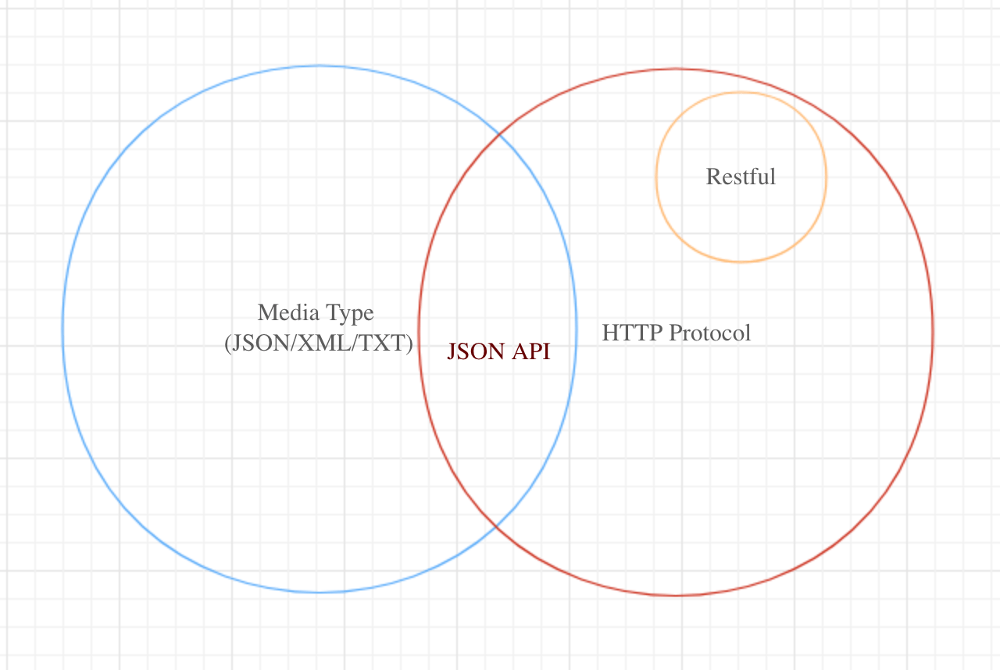
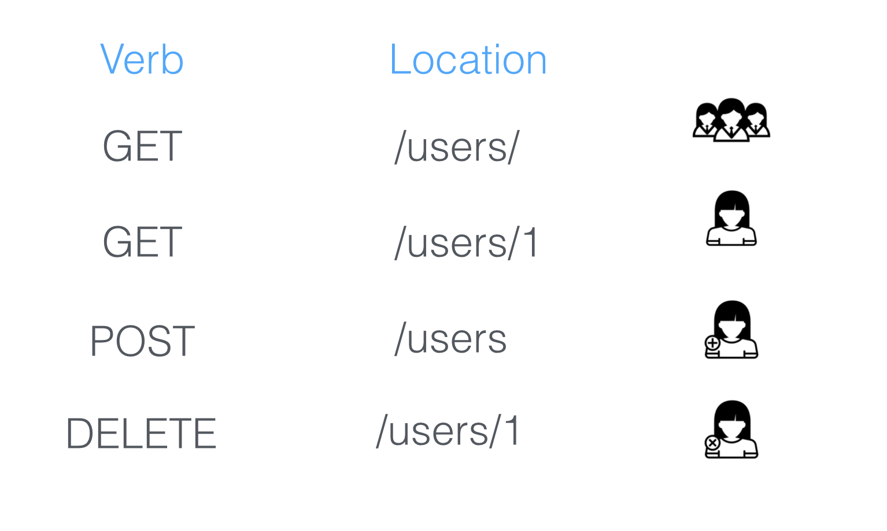
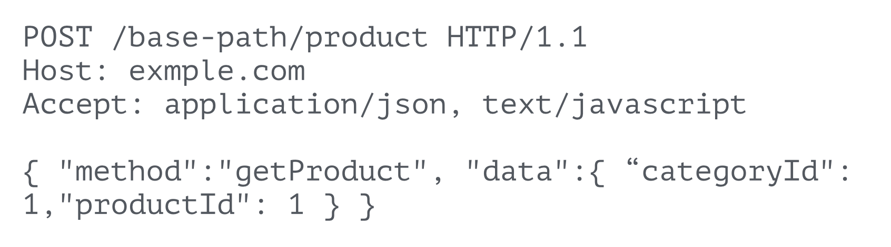
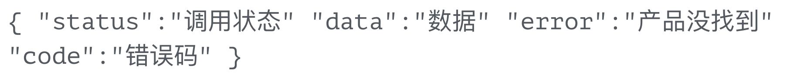
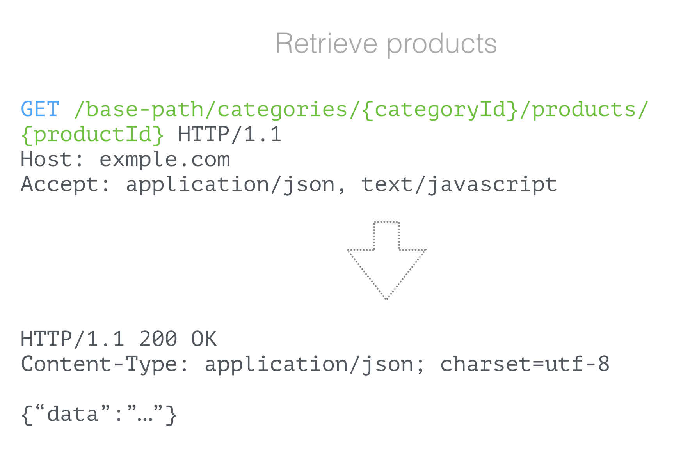
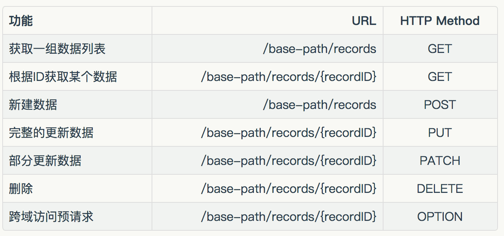
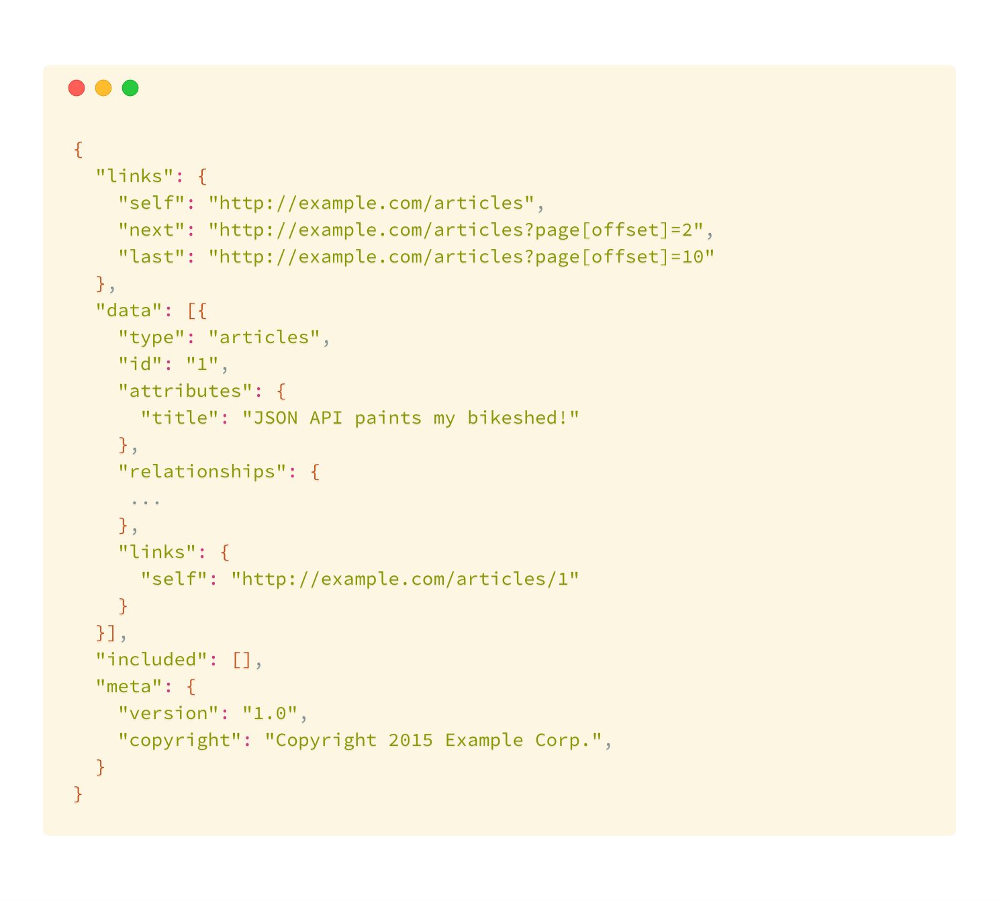
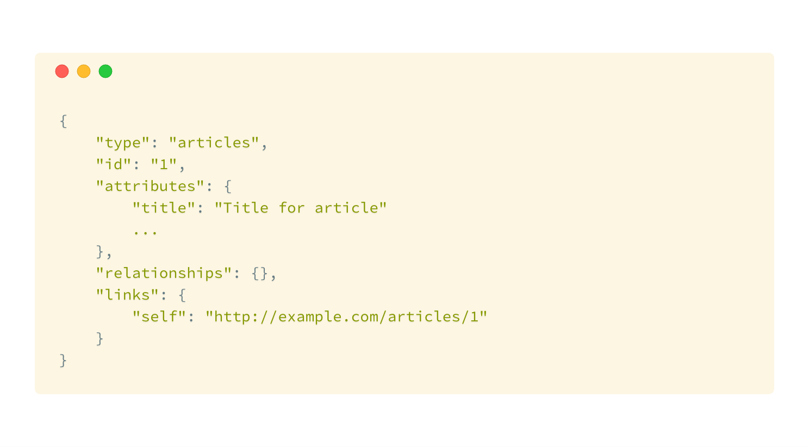
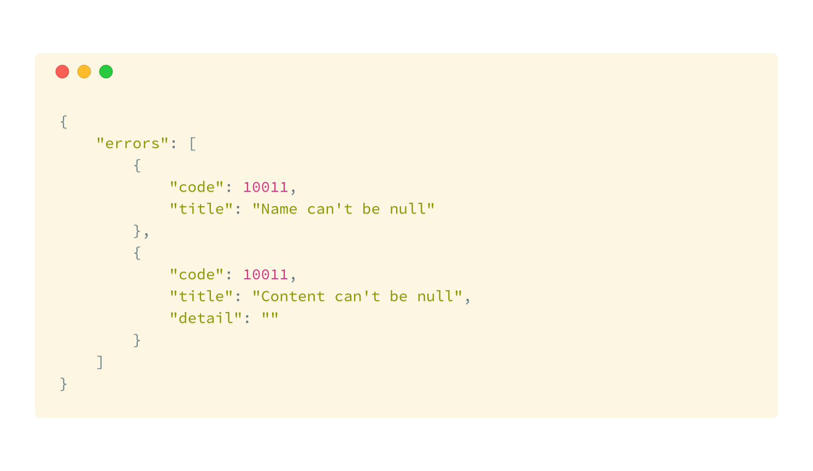
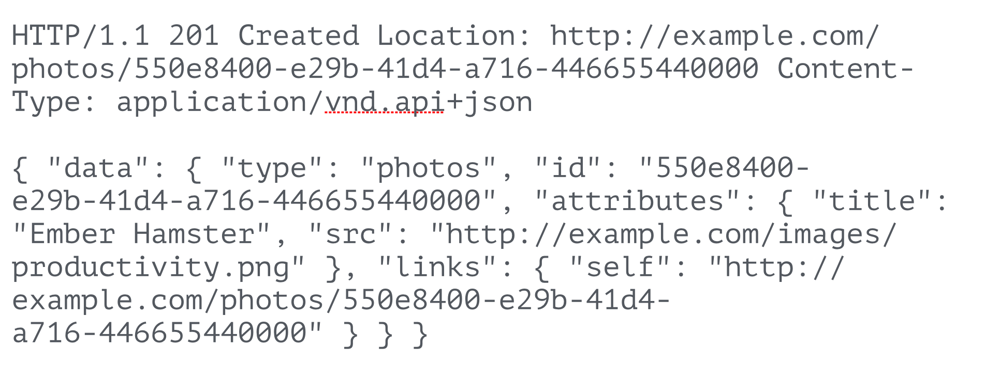

如果你是一个客户端、前端开发者，你可能会在某个时间吐槽过后端工程师的API设计，原因可能是文档不完善、返回数据丢字段、错误码不清晰等。如果你是一个后端API开发者，你一定在某些时候感到困惑，怎么让接口URL设计的合理，数据格式怎么定，错误码怎么处理，然后怎么才能合适的描述我的API，API怎么认证用户的请求。

在前后端分离和微服务成为现代软件开发的大趋势下，API设计也应该变得越来越规范和高效。本篇希望把API相关的概念最朴素的方式梳理，对API设计有一个更全面和细致的认识，构建出更规范、设计清晰和文档完善的API。
重新认识API

广义的API（Application Programming Interface）是指应用程序编程接口，包括在操作系统中的动态链接库文件例如dllso，或者基于TCP层的socket连接，用来提供预定义的方法和函数，调用者无需访问源码和理解内部原理便可实现相应功能。而当前通常指通过HTTP协议传输的web service技术。

API在概念上和语言无关，理论上具有网络操作能力的所有编程语言都可以提供API服务。Java、PHP、Node甚至C都可以实现web API，都是通过响应HTTP请求并构造HTTP包来完成的，但是内部实现原理不同。例如QQ邮箱就是通过使用了C构建CGI服务器实现的。

API在概念上和JSON和XML等媒体类型无关，JSON和XML只是一种传输或媒体格式，便于计算机解析和读取数据，因此都有一个共同特点就是具有几个基本数据类型，同时提供了嵌套和列表的数据表达方式。JSON因为更加轻量、容易解析、和JavaScript天生集成，因此成为现在主流传输格式。在特殊的场景下可以构造自己的传输格式，例如JSONP传输的实际上是一段JavaScript代码来实现跨域。

基于以上，API设计的目的是为了让程序可读，应当遵从简单、易用、无状态等特性，这也是为什么Restful风格流行的原因。

## RESTful

REST（英文：Representational State Transfer，简称REST），RESTful是一种对基于HTTP的应用设计风格，只是提供了一组设计原则和约束条件，而不是一种标准。网络上有大量对RESTful风格的解读，简单来说Restful定义URI和HTTP状态码，让你的API设计变得更简洁、清晰和富有层次，对缓存等实现更有帮助。RESTful不是灵丹妙药，也不是银弹。

RESTful第一次被提出是在2000Roy Fielding的博士论文中，他也是HTTP协议标准制定者之一。从本质上理解RESTful，它其实是尽可能复用HTTP特性来规范软件设计，甚至提高传输效率。HTTP包处于网络应用层，因此HTTP包为平台无关的字符串表示，如果尽可能的使用HTTP的包特征而不是大量在body定义自己的规则，可以用更简洁、清晰、高效的方式实现同样的需求。

用我几年前一个真实的例子，我们为了提供一个订单信息API，为了更方便传递信息全部使用了POST请求，使用了定义了method表明调用方法：

返回定义了自己的状态：

大家现在来看例子会觉得设计上很糟糕，但是在当时大量的API是这样设计的。操作资源的动作全部在数据体里面重新定义了一遍，URL上不能体现出任何有价值的信息，为缓存机制带来麻烦。对前端来说，在组装请求的时候显得麻烦不说，另外返回到数据的时候需要检查HTTP的状态是不是200，还需要检查status字段。
那么使用RESTful的例子是什么样呢：

例子中使用路径参数构建URL和HTTP动词来区分我们需要对服务所做出的操作，而不是使用URL上的接口名称，例如 getProducts等；使用HTTP状态码，而不是在body中自定义一个状态码字段；URL需要有层次的设计，例如/catetory/{category_id}/products 便于获取path参数，在以后例如负载均衡和缓存的路由非常有好处。

RESTful的本质是基于HTTP协议对资源的增删改查操作做出定义。理解HTTP协议非常简单，HTTP是通过网络socket发送一段字符串，这个字符串由键值对组成的header部分和纯文本的body部分组成。Url、Cookie、Method都在header中。

几个典型的RESTful API场景：

虽然HTTP协议定义了其他的Method，但是就普通场景来说，用好上面的几项已经足够了
RESTful的几个注意点：

- URL只是表达被操作的资源位置，因此不应该使用动词，且注意单复数区分
- 除了POST和DELETE之外，其他的操作需要冥等的，例如对数据多次更新应该返回同样的内容
- 设计风格没有对错之分，RESTful一种设计风格，与此对应的还有RPC甚至自定义的风格
- RESTful和语言、传输格式无关
- 无状态，HTTP设计本来就是没有状态的，之所以看起来有状态因为我们浏览器使用了Cookies，每次请求都会把Session ID（可以看做身份标识）传递到headers中。关于RESTful风格下怎么做用户身份认证我们会在后面讲到。
- RESTful没有定义body中内容传输的格式，有另外的规范来描述怎么设计body的数据结构，网络上有些文章对RESTful的范围理解有差异

## JSON API

因为RESTful风格仅仅规定了URL和HTTP Method的使用，并没有定义body中数据格式的。我们怎么定义请求或者返回对象的结构，以及该如何针对不同的情况返回不同的HTTP 状态码？
同样的，这个世界上已经有人注意到这个问题，有一份叫做JSON API开源规范文档描述了如何传递数据的格式，JSON API最早来源于Ember Data（Ember是一个JavaScript前端框架，在框架中定义了一个通用的数据格式，后来被广泛认可）。

JSON已经是最主流的网络传输格式，因此本文默认JSON作为传输格式来讨论后面的话题。JSONAPI尝试去提供一个非常通用的描述数据资源的格式，关于记录的创建、更新和删除，因此要求在前后端均容易实现，并包含了基本的关系类型。个人理解，它的设计非常接近数据库ORM输出的数据类型，和一些Nosql（例如MongoDB）的数据结构也很像，从而对前端开发者来说拥有操作数据库或数据集合的体验。另外一个使用这个规范的好处是，已经有大量的库和框架做了相关实现，例如，backbone-jsonapi ，json-patch。
没有必要把JSON API文档全部搬过来，这里重点介绍常用部分内容。

### MIME 类型

JSON API数据格式已经被IANA机构接受了注册，因此必须使用application/vnd.api+json类型。客户端请求头中Content-Type应该为application/vnd.api+json，并且在Accept中也必须包含application/vnd.api+json。如果指定错误服务器应该返回415或406状态码。

### JSON文档结构

在顶级节点使用data、errors、meta，来描述数据、错误信息、元信息，注意data和errors应该互斥，不能再一个文档中同时存在，meta在项目实际上用的很少，只有特别情况才需要用到，比如返回服务器的一些信息。

### data属性

一个典型的data的对象格式，我们的有效信息一般都放在attributes中。

- id显而易见为唯一标识，可以为数字也可以为hash字符串，取决于后端实现
- type 描述数据的类型，可以对应为数据模型的类名
- attributes 代表资源的具体数据
- relationships、links为可选属性，用来放置关联数据和资源地址等数据

### errors属性

这里的errors和data有一点不同，一般来说返回值中errors作为列表存在，因为针对每个资源可能出现多个错误信息。最典型的例子为，我们请求的对象中某些字段不符合验证要求，这里需要返回验证信息，但是HTTP状态码会使用一个通用的401，然后把具体的验证信息在errors给出来。

在title字段中给出错误信息，如果我们在本地或者开发环境想打出更多的调试堆栈信息，我们可以增加一个detail字段让调试更加方便。需要注意的一点是，我们应该在生产环境屏蔽部分敏感信息，detail字段最好在生产环境不可见。

### 常用的返回码

返回码这部分是我开始设计API最感到迷惑的地方，如果你去查看HTTP协议文档，文档上有几十个状态码让你无从下手。实际上我们能在真实环境中用到的并不多，这里会介绍几个典型的场景。

#### 200 OK

200 是一个最常用的状态码用来表示请求成功，例如GET请求到某一个资源，或者更新、删除某资源。 需要注意的是使用POST创建资源应该返回201表示数据被创建。

#### 201 Created

如果客户端发起一个POST请求，在RESTful部分我们提到，POST为创建资源，如果服务器处理成功应该返回一个创建成功的标志，在HTTP协议中，201为新建成功的状态。文档规定，服务器必须在data中返回id和type。 下面是一个HTTP的返回例子：

在HTTP协议中，2XX的状态码都表示成功，还有202、204等用的较少，就不做过多介绍了，4XX返回客户端错误，会重点介绍。

#### 401 Unauthorized

如果服务器在检查用户输入的时候，需要传入的参数不能满足条件，服务器可以给出401错误，标记客户端错误，需要客户端自查。

#### 415 Unsupported Media Type

当服务器媒体类型Content-Type和Accept指定错误的时候，应该返回415。

#### 403 Forbidden

当客户端访问未授权的资源时，服务器应该返回403要求用户授权信息。

#### 404 Not Found

这个太常见了，当指定资源找不到时服务器应当返回404。

#### 500 Internal Server Error

当服务器发生任何内部错误时，应当返回500，并给出errors字段，必要的时候需要返回错误的code，便于查错。一般来说，500错误是为了区分4XX错误，包括任何服务器内部技术或者业务异常都应该返回500。

## HATEOAS

这个时候有些了解过HATEOAS同学会觉得上面的links和HATEOAS思想很像，那么HATEOAS是个什么呢，为什么又有一个陌生的名词要学。 实际上HATEOAS算作被JSON API定义了的一部分，HATEOAS思想是既然Restful是利用HTTP协议来进行增删改查，那我们怎么在没有文档的情况下找到这些资源的地址呢，一种可行的办法就是在API的返回体里面加入导航信息，也就是links。这样就像HTML中的A标签实现了超文本文档一样，实现了超链接JSON文档。

超链接JSON文档是我造的一个词，它的真是名字是Hypermedia As The Engine Of Application State，中文叫做超媒体应用程序状态的引擎，网上很多讲它。但是它并不是一个很高大上的概念，在RESTful和JSONAPI部分我们都贯穿了HATEOAS思想。下面给出一个典型的例子进一步说明：
如果在某个系统中产品和订单是一对多的关系，那我们给产品的返回值可以定义为：

从返回中我们能得到links中product的的资源地址，同时也能得到orders的地址，这样我们不需要客户端自己拼装地址，就能够得到请求orders的地址。如果我们严格按照HATEOAS开发，客户端只需要在配置文件中定义一个入口地址就能够完成所有操作，在资源地址发生变化的时候也能自动适配。
当然，在实际项目中要使用HATEOAS也要付出额外的工作量(包括开发和前后端联调)，HATEOAS只是一种思想，怎么在项目中使用也需要灵活应对了。

## 参考链接

在文档中还定义了分页、过滤、包含等更多内容，请移步文档：

- 英文版：http://jsonapi.org/format/
- 中文版：http://jsonapi.org.cn/format/ （PS：中文版更新不及时，请以英文文档为准）
